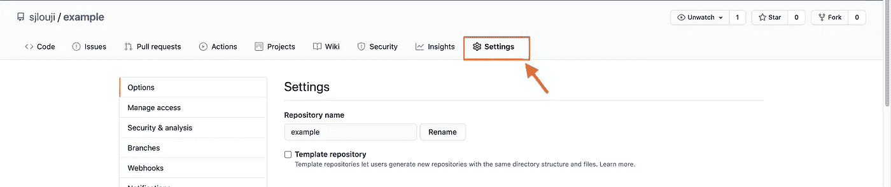
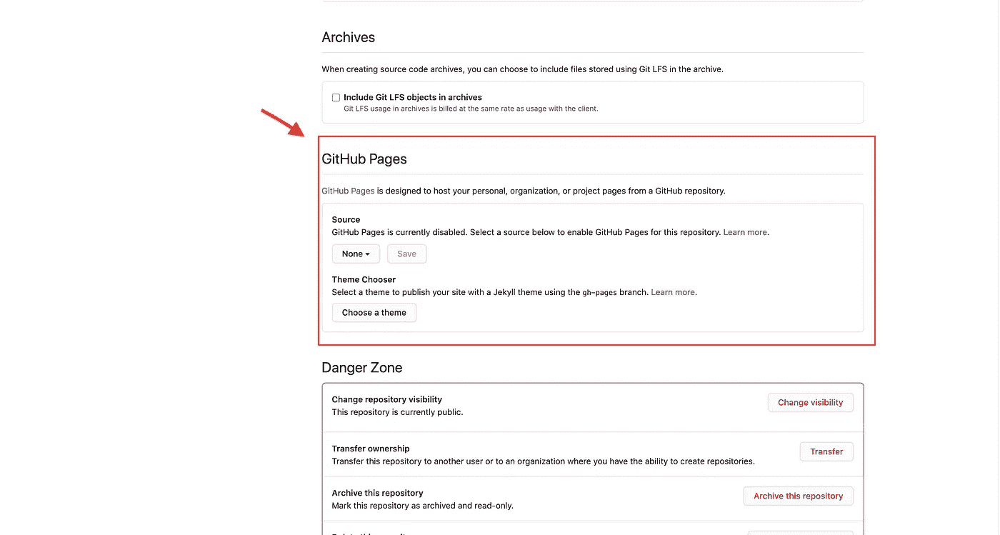
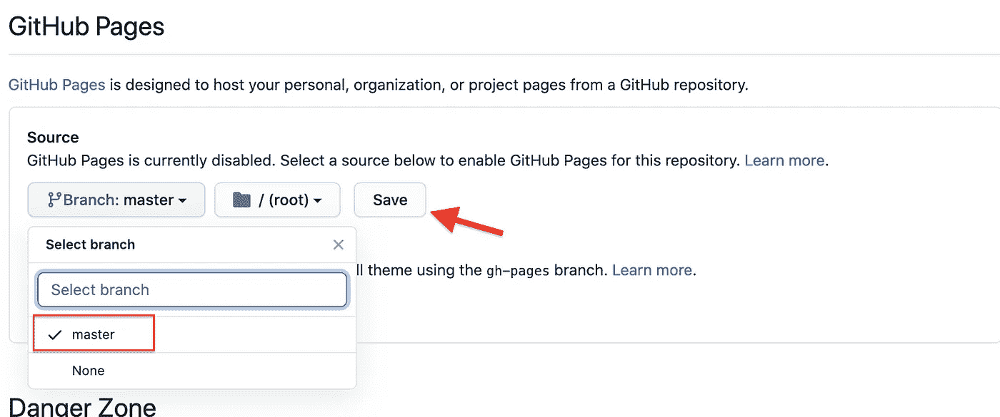
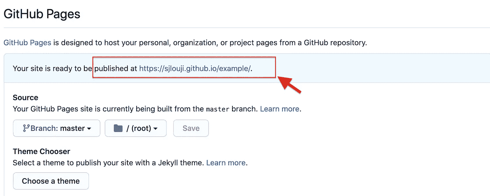

# 只需简单点击几下，即可部署您的静态网站

> 原文：<https://javascript.plainenglish.io/deploy-your-static-website-on-a-click-21fff025d813?source=collection_archive---------8----------------------->

## 使用 GitHub 页面进行简单的网站部署


Cover Image

## **什么是 Github 页面？**

Github Pages 是 Github 为静态网站提供的免费虚拟主机服务。GitHub 页面自带的免费域名是`github.io`。我们还可以向 Github 页面添加自定义域。

Github 页面提供三种类型的服务。

a.项目的 Github 页面

b.Github 用户页面

c.组织的 Github 页面

如果你在 Github 库中上传了你的网站，你只需点击一下就可以发布你的网站，这就是 GitHub 页面的酷之处。这个博客解释了如何将你的网站上传到 GitHub 并发布。

## 目录

1.  [初始设置](#baa0)
2.  [上传到 GitHub](#1bf4)
3.  [使用 Github 页面发布](#4deb)

## **1。初始设置**

最初，对于这个演示，我创建了一个简单的引导 HTML 页面，带有一个导航条和一个旋转木马。在这个博客中，我们将在 Github 页面上发布这个文件。

`index.html`

```
<html>
  <head>
    <title>Github Page</title>
    <link rel="stylesheet" href="https://stackpath.bootstrapcdn.com/bootstrap/4.5.2/css/bootstrap.min.css" integrity="sha384-JcKb8q3iqJ61gNV9KGb8thSsNjpSL0n8PARn9HuZOnIxN0hoP+VmmDGMN5t9UJ0Z" crossorigin="anonymous"/>
  </head> <body>
    <div>
      <nav class="navbar navbar-light bg-light">
        <a class="navbar-brand">Navbar</a>
        <form class="form-inline">
          <input class="form-control mr-sm-2" type="search"  placeholder="Search" aria-label="Search">
          <button class="btn btn-outline-success my-2 my-sm-0" type="submit">Search</button>
        </form>
      </nav>
    </div> <div>
      <div id="carouselExampleSlidesOnly" class="carousel slide" data-ride="carousel">
        <div class="carousel-inner">
          <div class="carousel-item active">
            
          </div>
          <div class="carousel-item">
            
          </div>
          <div class="carousel-item">
            
          </div>
        </div>
      </div>
    </div> <script src="https://code.jquery.com/jquery-3.5.1.slim.min.js" integrity="sha384-DfXdz2htPH0lsSSs5nCTpuj/zy4C+OGpamoFVy38MVBnE+IbbVYUew+OrCXaRkfj" crossorigin="anonymous"></script> <script src="https://cdn.jsdelivr.net/npm/popper.js@1.16.1/dist/umd/popper.min.js" integrity="sha384-9/reFTGAW83EW2RDu2S0VKaIzap3H66lZH81PoYlFhbGU+6BZp6G7niu735Sk7lN" crossorigin="anonymous"></script> <script src="https://stackpath.bootstrapcdn.com/bootstrap/4.5.2/js/bootstrap.min.js" integrity="sha384-B4gt1jrGC7Jh4AgTPSdUtOBvfO8shuf57BaghqFfPlYxofvL8/KUEfYiJOMMV+rV" crossorigin="anonymous"></script> </body>
</html>
```

## 2.**上传到 GitHub**

要在 Github Pages 中发布任何静态网站，您应该已经将您的网站上传到 Github。为此，您应该在 GitHub 中有一个存储库。下面的链接将您带到可以创建新存储库的页面。

我已经创建了一个名为`example`的新存储库。

[](https://github.com/new) [## 一起打造更好的软件

### 此时您不能执行该操作。您已使用另一个标签页或窗口登录。您已在另一个选项卡中注销，或者…

github.com](https://github.com/new) 

创建存储库后，使用下面的命令将您的文件上传到 Github。

*注意:在我的例子中，存储库 URL 是[https://github.com/sjlouji/example.git](https://github.com/sjlouji/example.git)。您的存储库 URL 将会不同。所以不要忘记在下面的命令中用你的 URL 替换它。

```
cd deploytogithubpages
git init git add . git commit -m "initial Setup" git remote add origin [https://github.com/sjlouji/example.git](https://github.com/sjlouji/example.git) git push origin master
```

## 3.**使用 Github 页面发布**

将您的网站上传到 GitHub 后，只需导航到设置选项卡。



Settings tab

在“设置”选项卡中，向下滚动到“Github 页面”部分。



Github Pages Section

然后将默认分支更改为`master`，点击保存。



Deployment

现在你的网站会被发布在 https://username.github.io/respoName 的网址上



View the Published page via the Link

如有任何疑问，请随时联系我。

电子邮件:sjlouji10@gmail.com。领英:[https://www.linkedin.com/in/sjlouji/](https://www.linkedin.com/in/sjlouji/)

Github:

[](https://github.com/sjlouji) [## sjlouji -概述

### 跟随你的心，倾听你内心的声音，不要在意别人的想法。取消注册您自己的…

github.com](https://github.com/sjlouji) 

编码快乐！