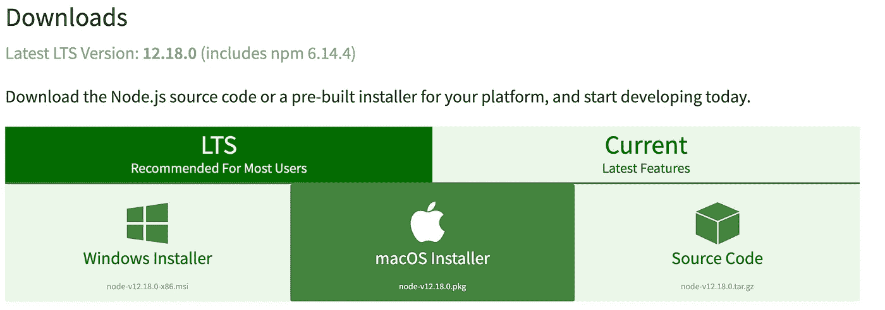
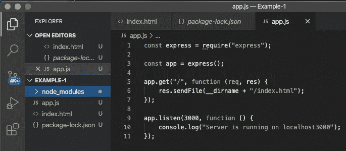
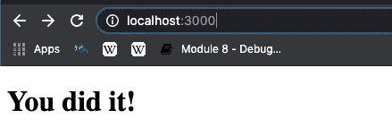

# 使用 Node.js 和 Express.js 部署本地主机服务器

> 原文：<https://javascript.plainenglish.io/deploying-a-localhost-server-with-node-js-and-express-js-58775f098407?source=collection_archive---------0----------------------->


Dennis (pictured above) mentally preparing to launch his first localhost server. Can you feel his excitement?

# 目标

目标很简单。使用 Node.js 和 Express.js 部署本地主机服务器。

但是首先，你可能想知道 Node.js 和 Express.js 是什么？

[**Node . js**](https://nodejs.org/en/about/)**(Node)是基于谷歌 Chrome 的 V8 JavaScript 引擎打造的开源服务器端平台。由于 Node 能够在各种平台上运行并具有可伸缩性，它已经成为开发 web 应用程序的首选。**

**[**Express . js**](https://expressjs.com/)**(Express)是一个流行的模块框架，运行在 Node 上。它使开发人员能够轻松快速地构建静态和动态 web 应用程序和 API。****

****更简单地说，Node 允许您在浏览器之外运行 JavaScript，Express 允许您响应单个客户端请求并快速构建 API。****

****说够了。我们开始吧！****

## ******第一步:下载节点******

****[**下载 Node.js**](https://nodejs.org/en/download/) 按照引导提示进行操作，直到安装完成。****

********

****If you are working from a Mac, simply select “macOS Installer” highlighted in green.****

****您可以通过导航到命令行并输入以下命令来验证节点是否已成功安装。****

```
**node --version**
```

****如果安装正确，您将看到返回的节点版本。比如我目前运行的是 V12.18.0。****

## ******第二步:创建一个新的工作目录******

****在安装 Express 之前，您需要创建一个新的工作目录。****

```
**mkdir Example-1**
```

****接下来，添加下面的两个文件。****

*   ****index.html****
*   ****app.js****

```
**touch index.html app.js**
```

## ****第三步:安装快递****

****一旦这两个文件被添加到您的项目中，您就可以安装 Express 了。首先，确保您位于刚刚创建的工作目录中。对于我的例子，我会在“例-1”。您可以通过在命令行输入“pwd”来查看您当前所在的目录。确认您位于正确的目录后，通过运行以下命令安装 Express。****

```
**npm install express**
```

****等等……什么是 npm？****

****很棒的问题！ [Npm](https://www.w3schools.com/whatis/whatis_npm.asp) (节点程序包管理器)是免费托管数千个程序包的节点的默认程序包管理器。不用担心；当您在步骤 1 中下载节点时，npm 会自动安装！****

## ****第四步:设置你的 HTML****

****打开您在代码编辑器中创建的工作目录。目前，我在 VS (Visual Studio)上运行，但这只是我的偏好。你可以用最适合你的！对于这个例子，在主体中插入一个****

# ****头来显示浏览器如何与服务器交互。****

****将下面的代码输入到“index.html”文件中。****

```
**<!DOCTYPE html>
<html lang="en" dir="ltr">
 <head>
  <meta charset="UTF-8" />
  <meta name="viewport" content="width=device-width, initial-scale=1.0" />
  <title>Example-1</title>
 </head>
 <body>
  <h1>You did it!</h1>
 </body>
</html>**
```

****您可能已经注意到，您的项目现在保存了两个新文件。这些文件是在您安装 Express 时添加到您的项目中的，并提供对预构建模块和软件包的访问。还记得我提到过 Express 是一个框架，它允许开发人员轻松快速地构建 web 应用程序吗？****

*   ******node_modules:** 可以在您的项目中使用的预构建包****
*   ******package-lock.json:** 存储依赖树****

********

## ******第五步:设置本地主机服务器******

****现在，您已经准备好启动本地主机服务器了！****

****将以下代码输入到“app.js”文件中。****

```
**const express = require("express");const app = express();app.get("/", function (req, res) {
    res.sendFile(__dirname + "/index.html");
});app.listen(3000, function () {
    console.log("Server is running on localhost3000");
});**
```

## ******第六步:启动你的服务器******

****你就快到了！转到命令行并输入以下内容以启动服务器:****

```
**node app.js**
```

****如果您的终端返回写入“app.js”文件的“Server is running on localhost3000”消息，您将知道您的服务器运行正常。****

```
**console.log("Server is running on localhost3000");**
```

## ******第七步:检查一下！******

****最后，进入 Chrome，在浏览器中输入“localhost:3000”。您现在应该看到您在“index.html”文件中编写的****

# ****头。****

****如果您收到错误消息，请返回并查看步骤 1–7 中的差异。很容易漏掉一个括号或者分号！****

********

# ****概述****

****恭喜你！现在，您已经对如何使用 Node 和 Express 在本地主机服务器上构建和测试 web 应用程序有了很好的理解。****

****我希望这篇文章对你有所帮助！****