# 使用 Gitlab CI 在 Elastic Beanstalk 上部署节点应用程序

> 原文：<https://javascript.plainenglish.io/deploying-a-node-app-on-elastic-beanstalk-with-gitlab-ci-81210efbfec8?source=collection_archive---------3----------------------->

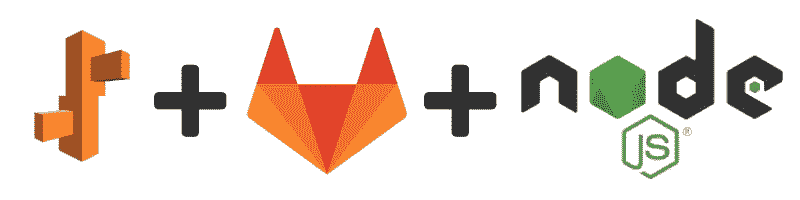

当我们在谈论一个新项目和启动并运行它的需要时听到“部署”，我们开始考虑它可能带来的所有可能的头痛。当然，没有没有障碍的部署过程，但是有减少障碍的方法。减少它们的一种可能是通过部分或全部自动化部署过程，正是在这种情况下，Elastic Beanstalk 和 Gitlab 开始发挥作用。

AWS Elastic Beanstalk 是一个易于使用的服务，用于部署和扩展用 Java 开发的 web 应用程序和服务。NET、PHP、Node.js、Python、Ruby、Go、Docker 在 Apache、Nginx、Passenger、IIS 等熟悉的服务器上。

*GitLab 是一个完整的 DevOps 平台，作为单一应用交付。*

这两者共同为我们提供了在私有云中以自动化方式托管和维护应用的可能性。为了展示一种可能的方法，本文将演示如何在一个弹性 Beanstalk 环境中创建和运行一个 **Node + Express** 应用程序。为了使整个过程更容易理解和再现，它将被分为两个步骤:第一步展示如何创建一个弹性 Beanstalk 环境，第二步展示如何使用其 CI 工具直接从 Gitlab 更新环境。

# 弹性豆茎

在 Elastic Beanstalk 上创建环境可以通过使用 CloudFormation 等其他 AWS 服务以编程方式完成，也可以在 AWS 控制台中手动完成。这里，我们将使用已经创建的 VPC 和子网配置，在 AWS 控制台中直接创建一个。

首先，我们点击“**创建新环境**按钮，选择“ **Web 服务器环境**”，然后，设置“**应用程序名称**”。

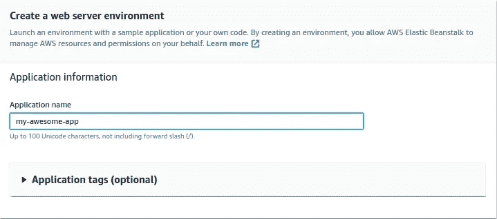

Application name must be unique among account’s EB application names

接下来，我们为它定义了“**环境名**和“**域**”。

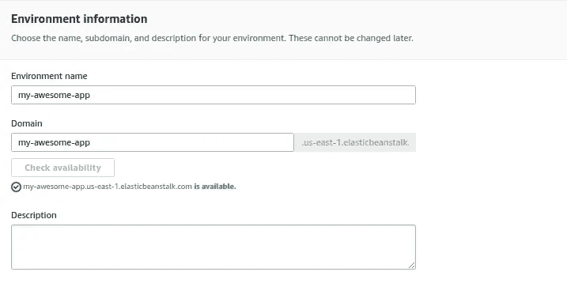

Setting environment name and domain. Click “Check availability” to check if desired domain can be used

之后，我们定义将使用什么平台。我们选择了“**托管平台**，因为我们想要将 **Docker** 与 **Amazon Linux 2** 一起使用，以尝试使实例的基础设施尽可能地轻量级和最新。

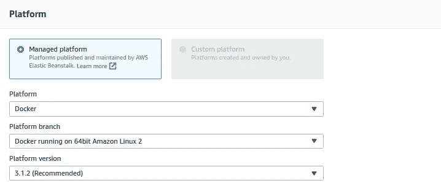

Setting Docker with Amazon Linux 2 platform

下一步是设置要部署到环境中的应用程序代码。给出了三个选项:“示例应用程序”、“版本标签”或“上传您的代码”。我们知道 Elastic Beanstalk 使用 S3 来存储未来的应用程序版本，因此我们选择创建一个 S3 存储桶，并向它上传一个初始版本，然后共享它的“**公共 S3 URL** ”。有一点需要注意:这个“应用程序代码”是一个“**源代码包**，这意味着它必须是一个 ZIP 或 WAR 文件，在我们的例子中，需要有**源代码**和**Docker 文件**来运行 Docker。

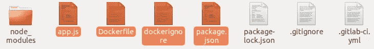

Files to build Source Bundle

文件的内容有:

app.js

```
const express = require('express')
const app = express()
const APP_PORT = process.env.APP_PORT || 3000;app.get('/', (req, res) => {
  res.send('Hello World!')
})app.listen(APP_PORT, () => {
  console.log(`Running app at port:${APP_PORT}`)
})
```

Dockerfile 文件

```
FROM node:10
WORKDIR /usr/src/app
COPY package*.json ./
RUN npm install
COPY . .
ENV APP_PORT 8080
EXPOSE 8080
CMD [ "node", "app.js" ]
```

dockerignore

```
node_modules
npm-debug.log
```

package.json

```
{
  "name": "my-awesome-app",
  "version": "1.0.0",
  "description": "Hello World in Node with Express",
  "main": "app.js",
  "scripts": {
    "start": "node app.js"
  },
  "author": "",
  "license": "ISC",
  "dependencies": {
    "express": "^4.17.1"
  }
}
```

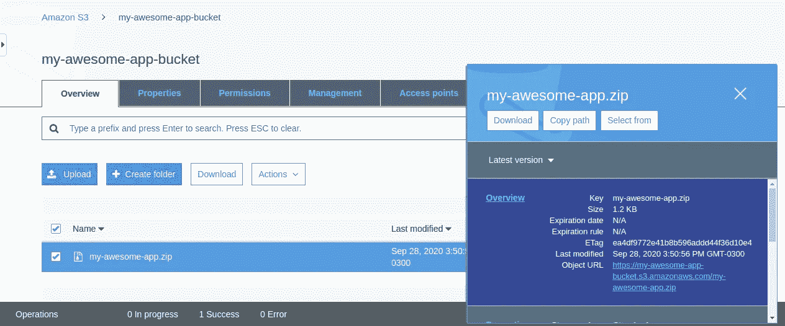

Select the ZIP file and copy the “Object URL” to be used as “Public S3 URL”

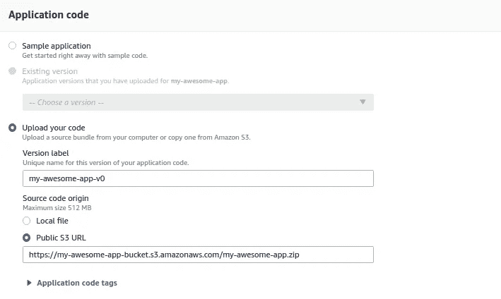

Defining “Public S3 URL”

考虑到我们将使用自定义 VPC 和子网配置，我们必须在完成创建过程之前，通过转至“**配置更多选项**”来定义要使用的配置。

为此，请转到“**网络**卡并进行编辑。

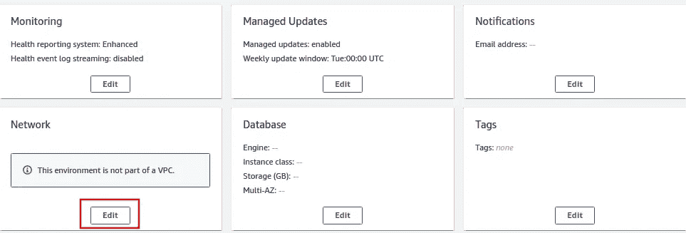

Edit Network card

选择所需的 **VPC** 和**子网**。

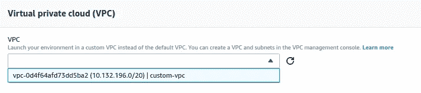

Selecting VPC

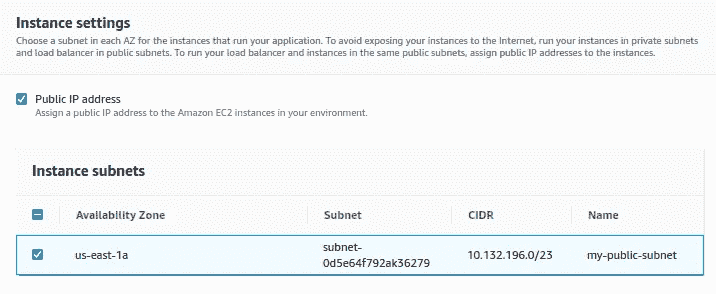

Selecting subnet

然后，我们需要为我们的 **EC2** 实例设置一个**安全组**。转到编辑“**实例**”卡并选择一个 EC2 安全组。

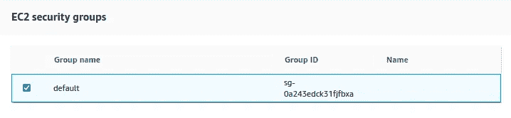

Selecting security group

现在点击**创建环境**...

...就是这样！终于！

在等待 AWS 构建过程之后，您应该会看到这样的环境:

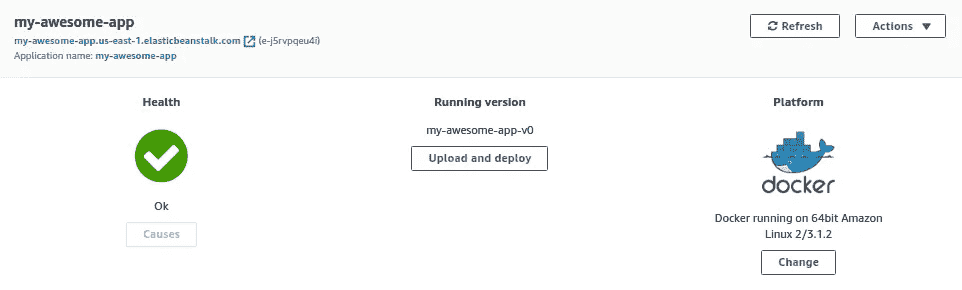

Environment preview

创建了弹性 Beanstalk 环境后，下一步是使用 Gitlab CI 更新它。

# Gitlab CI

要运行 Gitlab CI 管道将我们的应用程序部署到 Elastic Beanstalk，首先我们需要安装一个 **Runner** ，然后放置下面的"**。gitlab-ci.yml** "在我们的存储库根目录下:

为此部署创建的管道由两个步骤/作业组成。首先，我们用我们的文件创建一个 AWS 应用程序版本，也就是说，我们创建一个**源包，**将它上传到我们的 **S3 桶**，然后，创建一个**应用程序版本**。然后，我们将创建的应用程序版本部署到我们的 **Elastic Beanstalk** 环境中。

补充说明:为了在配置项上下文中创建 zip 文件，我们使用一个简单的 python 脚本来帮助我们生成它，如下所示:

zip.py (Python 3.x)

```
import sys, shutil
shutil.make_archive(sys.argv[1], 'zip', '.')
```

通过使用这个 CI 文件，您可以直接在文件中定义“变量”值，或者在“**设置**”>”**CI/CD**”>**变量**菜单下定义为 Gitlab 环境变量。详述变量值:

**APP_NAME** :从存储库中获取名称。它必须与为保存我们创建的环境的弹性 Beanstalk 应用程序定义的名称相同。
**APP_VERSION** :定义我们应用的当前版本。它用于帮助管理 S3 和环境预览屏幕上的应用程序版本。
**S3 _ 桶**:存储应用版本的桶的名称。
**AWS_ID** :托管弹性 Beanstalk 环境的 AWS 帐户的 ID
**AWS _ ACCESS _ KEY _ ID**:表示您的 AWS 帐户的“登录”或“用户名”。
**AWS _ SECRET _ ACCESS _ KEY**:代表您的 AWS 账户的密码。
**AWS_REGION** :创建弹性 Beanstalk 应用程序的区域。在我们的例子中，us-east-1
**AWS _ PLATFORM**:选择运行应用程序的平台。

通过设置这些值并将文件推送到存储库，管道将被执行，当两个作业都成功完成时，您应该会看到以下内容:

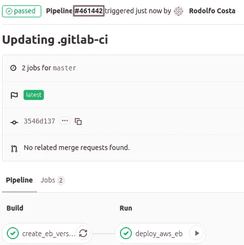

Successful pipeline execution

现在去你的弹性豆茎环境。它应该用管道生成的应用程序版本进行更新。

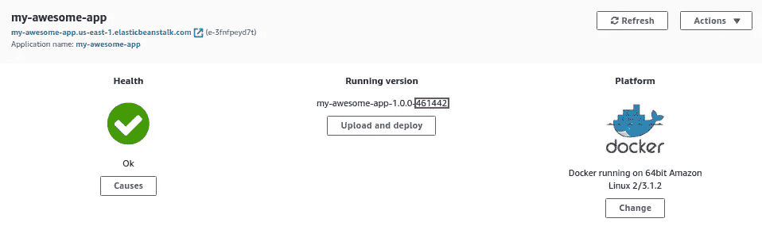

Updated app

在上图中，在“**运行版本**下，你可以看到我们的应用被更新了。选择用来命名"**源包**的模式是:{应用程序名称}-{应用程序版本}-{CI 管道编号}。这样，通过检查管道号和触发它的相应提交，跟踪版本及其部署变得更加容易。

令人兴奋的部分是:要看到应用程序工作，复制为 Elastic Beanstalk 环境定义的 URL，并将其粘贴到您的浏览器或应用程序以调用您的端点。

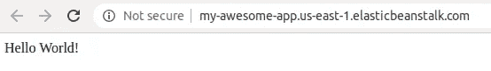

如上所示，你应该看到一个超级大的“Hello World”响应(好吧，反正它是一个节点应用😜)

# 结论

多亏了 Elastic Beanstalk 和 Gitlab，我们可以有一个简单的自动化结构来托管和维护我们的应用程序(在这种情况下，是一个节点应用程序，但也可以是其他语言)。这确实有助于减少部署过程中的痛苦和恐惧，并让开发人员有更多的时间关注应用程序本身。

因此，我们让我们的应用程序在一个安全、可控和可扩展的环境中运行，该环境可以根据项目特征进行更新，同时，它也是一个极具成本效益的解决方案。

**参考文献:**

[](https://aws.amazon.com/elasticbeanstalk/) [## AWS 弹性 Beanstalk -部署 Web 应用程序

### 易于开始，不可能超越 AWS 弹性 Beanstalk 是一个易于使用的服务，用于部署和扩展 web…

aws.amazon.com](https://aws.amazon.com/elasticbeanstalk/) [](https://about.gitlab.com/) [## 整个 DevOps 生命周期的第一个单一应用——git lab

### “从项目规划和源代码管理到 CI/CD 和监控，GitLab 是一个完整的 DevOps 平台…

about.gitlab.com](https://about.gitlab.com/)  [## 弹性豆茎支撑平台

### AWS Elastic Beanstalk 提供托管平台，支持运行为特定应用程序开发的 web 应用程序…

docs.aws.amazon.com](https://docs.aws.amazon.com/elasticbeanstalk/latest/platforms/platforms-supported.html#platforms-supported.docker)  [## 安装 GitLab 转轮

### GitLab Runner 可以在 GNU/Linux、macOS、FreeBSD 和 Windows 上安装和使用。有三种安装方式…

docs.gitlab.com](https://docs.gitlab.com/runner/install/) [](https://nodejs.org/en/docs/guides/nodejs-docker-webapp/) [## 将 Node.js web 应用程序| Node.js 归档

### 这个例子的目的是向你展示如何将 Node.js 应用程序放入 Docker 容器。的…

nodejs.org](https://nodejs.org/en/docs/guides/nodejs-docker-webapp/)  [## 获取您的证书

### 创建 AWS 帐户时，会向您的帐户提供根凭据。这些凭证由两个访问权限组成…

docs.aws.amazon.com](https://docs.aws.amazon.com/sdk-for-javascript/v2/developer-guide/getting-your-credentials.html)