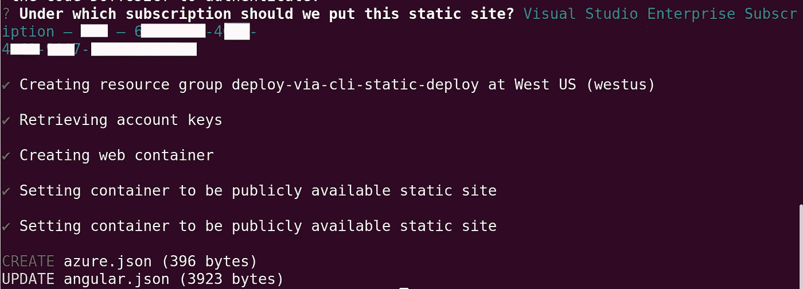
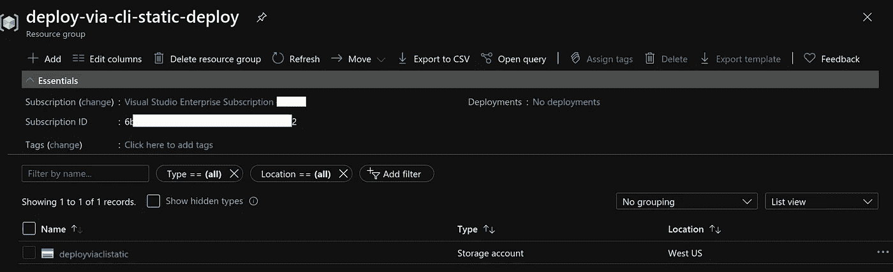
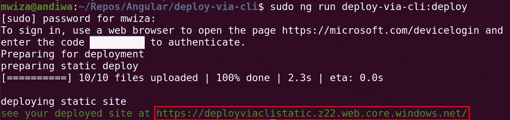

# 通过 Angular CLI 部署角度应用程序

> 原文：<https://javascript.plainenglish.io/deploying-an-angular-application-via-the-angular-cli-31d27f107823?source=collection_archive---------11----------------------->

## 使用 CLI 将 Angular 应用程序部署到 Azure


Photo by [Christina Morillo](https://www.pexels.com/@divinetechygirl?utm_content=attributionCopyText&utm_medium=referral&utm_source=pexels) from [pexels](https://www.pexels.com/photo/woman-standing-while-carrying-laptop-1181354/?utm_content=attributionCopyText&utm_medium=referral&utm_source=pexels)

# 介绍

在本文中，我将向您展示如何通过 Angular CLI 轻松地将 Angular 应用程序部署到云中。

从版本 8.3.0 开始，Angular 增加了对通过 CLI 使用`ng deploy`命令将 Angular 应用程序部署到各种云提供商的支持。

在这个例子中，我将使用 Azure 作为托管提供商，但 Angular CLI 部署支持其他云提供商，如 AWS、Netlify、Firebase 和 GitHub pages 等。

# 创建角度应用程序

我们将首先使用下面的 CLI 命令创建一个具有基本设置的 Angular 应用程序。我将我的应用程序命名为 deploy-via-cli。

```
ng new deploy-via-cli --defaults
```

# 供应应用程序基础架构

下一步是为您选择的云提供商安装一个 npm 包。

对于 azure，可以使用以下命令轻松安装 npm 包:

```
npm i @azure/ng-deploy
```

一旦安装了这个包，你就可以使用下面的命令来配置 azure 资源。

```
ng add @azure/ng-deploy
```

**注意**:如果软件包不存在，`ng add @azure/ng-deploy`命令也会安装软件包。

运行该命令后，您将获得一个登录代码和一个在浏览器中打开的链接，用于登录，如下所示。


继续在浏览器中打开链接，并输入提供的代码。然后提供您的登录凭据。通过身份验证后，您可以返回到命令行，您会发现您已经登录。

如果您有几个 Azure 订阅，系统会提示您选择您想要的订阅。然后，Azure 将为您创建所有必要的资源，主要包括:

*   资源组
*   存储容器
*   和安全密钥

该条款的输出应该与此类似。



## 提供的资源

如您所见，Azure 为您完成了大部分繁重的工作。除了提供资源，Azure 还在本地项目工作区的 ***angular.json*** 和 ***azure.json*** 文件中添加了应用程序部署的元数据。

如果您登录到您的 Azure 门户，提供的资源如下所示。



如你所见，Azure 为位于美国西部的应用程序创建了一个静态容器，位于资源组名称下:**deploy-via-CLI-static-deploy**。

# 部署应用程序

在部署应用程序之前，请确保首先使用以下命令构建它:

```
ng build --prod 
```

一旦构建了应用程序，就可以使用以下命令轻松部署它

```
ng run deploy-via-cli:deploy
```

**注意**:其中***deploy-via-CLI***是我的应用的名称。

当您运行上面的命令时，您将进一步看到另一个登录代码和登录 Azure 的链接。一旦您通过了身份验证，应用程序将被部署，您将得到类似如下的输出。



输出中用红色突出显示的最后一行提供了到新部署的应用程序的链接。

## 结论

如果您对项目进行了更改，并且想要部署新的应用程序，请确保使用`ng build --prod`命令来构建它。最后，用命令部署它。

```
ng deploy
```

用几个简单的命令自动部署应用程序，对于开发人员的工作流程来说非常重要。此外，尽早部署您的应用程序通常可以让您有足够的时间进行测试，并从关键利益相关者那里获得早期反馈。

喜欢这篇文章吗？如果有，通过 [**订阅获取更多类似内容解码，我们的 YouTube 频道**](https://www.youtube.com/channel/UCtipWUghju290NWcn8jhyAw) **！**