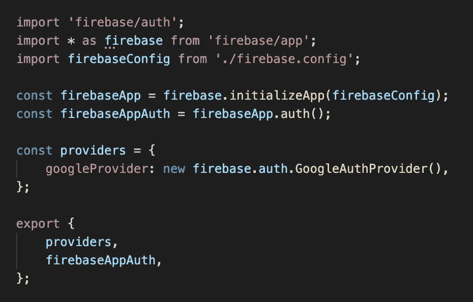
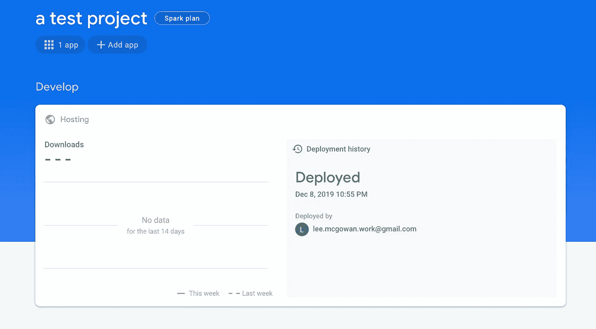
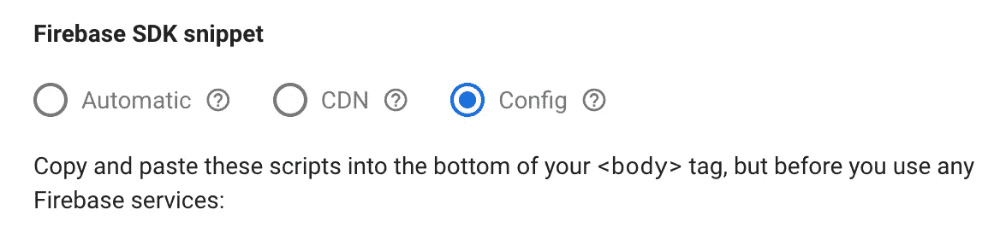
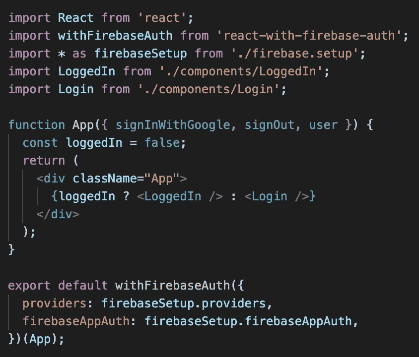
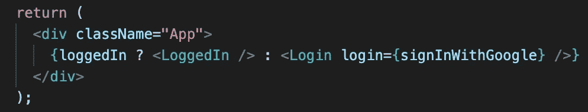
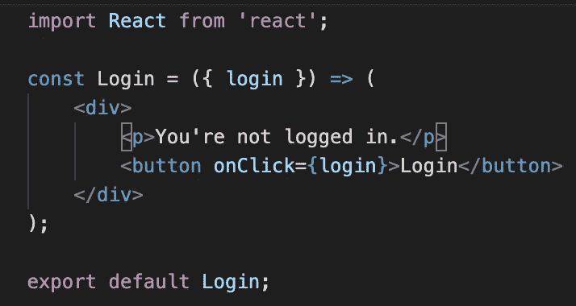
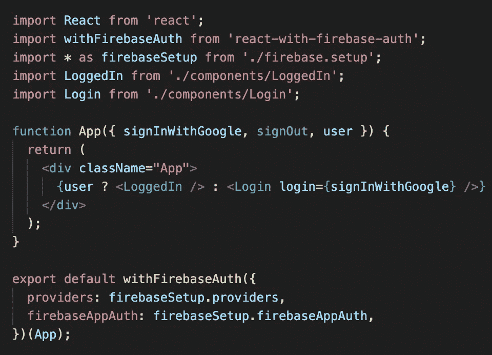
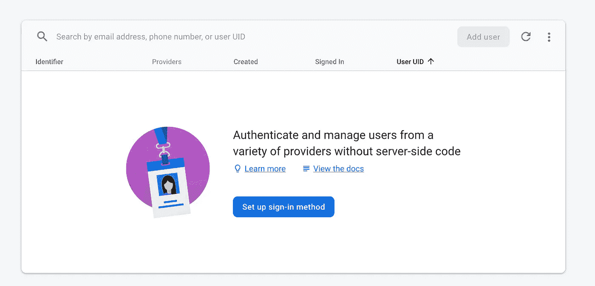
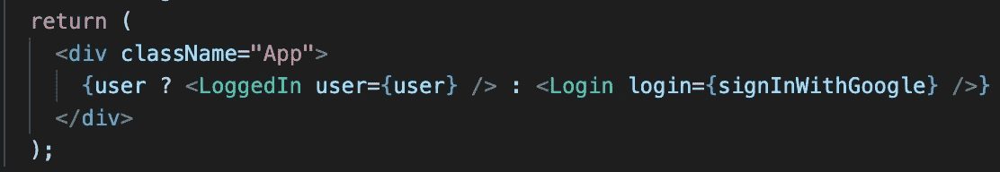
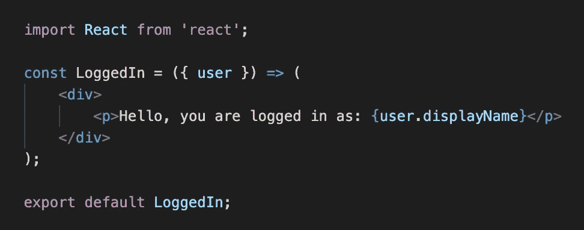

# 使用 Google 的 Firebase 部署和验证 React 应用程序

> 原文：<https://javascript.plainenglish.io/deploying-and-authenticating-a-react-app-with-googles-firebase-541f7fa7be6a?source=collection_archive---------4----------------------->

随着 AWS 等服务面向所有人，让你的应用程序上网变得前所未有的容易。AWS *是*不可思议的，特别是对于那些有资源利用它给你的那种权力的大规模公司。

但是如果你是小企业呢？还是单个开发商？AWS 适合你吗？也许吧。但是有一次我欠了 300 美元的账单，因为我忘了关掉单 EC2 盒子。杰夫·贝索斯是一个…有争议的人物。

对于那些想要不同的东西的人，有谷歌的 Firebase。

**什么是 Firebase？**

Firebase 是一个提供一套服务的平台，比如认证、托管、数据库等等。您还可以将您的应用程序与谷歌的分析服务相集成。免费层非常广泛，足以满足大多数小型用例。我从来没有欠过他们的账。

**Firebase with React**

Firebase 最大的优点之一是它可以轻松地与 React 项目集成。甚至还有一个`react-with-firebase-auth` npm 包，让设置认证*变得超级简单。*

那么，有什么计划？

在这篇文章中，我将带您完成将 firebase 安装到 react 项目中，将其部署到 web &设置 Google 身份验证。我已经在 Github 上创建了一个包含一些代码的资源库，这样我们就可以跳过最初的 React 内容，但是这里的步骤将同样适用于您自己的项目。

你可以在这里找到。(我拼错了名字。告我吧。)

**创建 Firebase 项目**

第一步是通过 Firebase 控制台创建一个项目。点击[此处](https://console.firebase.google.com/)并登录您的谷歌账户。您应该会看到这样一个按钮:

开始吧。

遵循屏幕上的说明。它们很容易理解。你不必启用谷歌分析，但即使启用也没关系，所以放轻松点，牛仔。

谷歌将创建你的项目，这需要一段时间，因为谷歌只是一个小公司，因此缺乏处理能力来快速完成。

完成后，喝一杯。你应得的。

**在项目中安装 Firebase**

下一步是用 Firebase 初始化你的项目。简单的游戏。只需运行`npm i -g firebase-tools`。然后是`firebase login`。这将打开一个浏览器窗口，您可以在其中登录您的 google 帐户。

一旦完成，在项目根目录下运行`firebase init`。将出现一个列表；仅选择托管。在下一个菜单中，选择`Use an existing project`，然后选择您刚刚创建的项目。接下来，将您的公共目录设置为`build/`，因为这里是`create-react-app`存放构建文件的地方。回答“是”将所有 URL 重写到`/index.html`(这是单页应用程序所需要的)。对覆盖`index.html`回答不。

**部署应用**

既然项目已经初始化，就可以部署到 web 上了。在项目的根目录下运行`firebase deploy`。如果一切顺利，它应该上传一些文件，然后吐出一个 URL，你可以点击它来查看你的应用程序的运行。你甚至可以获得一个免费的 SSL 证书。太棒了。

**初始化代码**中的火焰基

在`src/`文件夹中创建一个`firebase.setup.js`文件。添加以下内容。

该文件负责设置 Firebase 服务。因为我们只使用 auth，所以我们在这里只输入了 auth。

`firebase.config`是我们尚未创建的文件。它将包含 Firebase 为我们创建的自动生成的配置。我会解释下一步去哪里买。

`firebaseApp`是我们用`firebase.initializeApp()`初始化 Firebase 应用程序时返回的对象。

`firebaseAppAuth`是我们调用`firebaseApp.auth()`时返回的对象，它为我们的应用程序初始化认证服务。

`providers`包含了我们希望在这个项目中使用的所有授权提供者。目前，只有谷歌。

我们导出`providers`和`firebaseAppAuth`是因为我们需要在以后建立登录应用程序的方法时使用它们。

**获取自动生成的 Firebase 配置**

在 Firebase 控制台中导航到您的项目。您应该会看到这样一个页面:

在左手边是一个工具栏，在它的右上角，靠近`Project Overview`的是一个齿轮图标。点击它并进入项目设置。

向下滚动直到看到类似这样的内容，然后选择`Config`按钮:

将`firebaseConfig` JSON 对象复制到`src/firebase.config.js`中。确保你也在文件底部写上`export default firebaseConfig;`。

配置可能不应该存储在像 Github 这样的公共地方。出于学习的目的，这很好，但是将来要考虑更秘密的地方。

**导入 FirebaseSetup 并运行 App**

一旦你完成了这个，你可以在你的`App.js`文件中`import * as firebaseSetup from ‘./firebase.setup’;`，然后用`npm run start`运行这个项目。在浏览器中加载它，并检查控制台中没有错误。

**使用谷歌认证**

最后一步是安装`react-with-firebase-auth`包并使用它来设置 Google 认证。

运行`npm i react-with-firebase-auth`。然后，更新您的`App.js`文件，如下所示:

这里，我们导入了由`react-with-firebase-auth`提供的高阶组件(HOC ),并用它包装了组件导出。我们将从`firebase.setup.js`导出的`providers`和`firebaseAppAuth`对象传递给它。然后，我们向`App`组件添加了三个道具，它们都是从`withFirebaseAuth` HOC 传递给它的。

`signInWithGoogle`是一项功能，允许用户使用其 google 帐户登录。

`signOut`注销用户。

`user`是我们登录的用户。

检查我，明显的队长😎。

**登录用户**

`<Login />`组件已经呈现了一个用于登录的按钮，所以只需将`signInWithGoogle`函数作为道具传递给该组件。

然后在`<Login />`组件中使用。

**向用户显示他们已登录**

当`signInWithGoogle`函数被调用并且用户通过身份验证时，`withFirebaseAuth` HOC 被重新渲染。然后，它向我们的`App`组件传递一个`user` prop，其中包含刚刚登录的人的信息。我们可以用它来检查是否有人登录了我们的应用程序。

在`App.js`中，删除`const loggedIn = false;`并将我们条件中的`loggedIn`属性替换为`user`:

在我们看到这个工作之前，我们需要在 Firebase 控制台中添加`Google`作为`AuthProvider`。为此，请返回到您的项目页面，并从左侧边栏中选择`Authentication`。您应该会看到类似这样的内容:

现在，点击`Set up sign-in method`。在列表中找到`Google`，选择铅笔图标进行编辑，然后将其作为提供者启用。您还需要输入支持电子邮件地址。完成后保存。

完成所有这些后，重启你的应用程序，在浏览器中加载，然后点击登录按钮，看看神奇的事情发生了。谷歌应该会将你重定向到他们自己的认证页面，一旦你提供了你的详细信息或选择了一个帐户，它会将你送回我们的应用程序，你应该会看到`Hello, you are logged in as:` 。

恭喜`blank`，你做到了。您的应用程序正式通过了 Google 认证。荣耀是。

尽管如此，称呼你的用户为`blank`还是有点不尊重，好像他们什么都不是。老实说，你应该为自己感到羞耻。你奶奶会怎么说？

要修复它，我们可以将`user`支撑向下传递给我们的`<LoggedIn />`组件。

然后在`<LoggedIn />`中渲染`user.displayName`。

如果你现在检查浏览器，它应该会显示你的名字。更重要的是，它会显示你的用户名。

干得好。

奶奶不再哭了。

**接下来的步骤**

虽然我们有一个工作应用程序，对于一些人来说，这种身份验证和部署方法肯定足够了，但我们真的只是触及了表面。从这里你可以走几条路。

*   目前，我们的用户永远被困在我们的应用程序中。无处可逃。如果你没有试图创建某种数字监狱，(如果你是，没有判断🚓)然后你可能要加一个`logout`按钮。
*   您还可以通过`react-with-firebase-auth`和其他几个提供商做更多的事情来探索。你可以在这里阅读包文档[，或者在你的项目控制台的`Authentication`部分查看其他授权提供者。](https://www.npmjs.com/package/react-with-firebase-auth)
*   最后，Firebase 提供了大量的其他东西，比如数据存储。您可以创建一个表单组件，用户可以在其中提交称赞，然后将它们全部存储在 Firebase 的实时数据库中，以供将来阅读。赞美甚至可以是关于我的。那不是很好吗？找个朋友。

**结束**

我喜欢写东西，知道其他人正在阅读它给我带来了巨大的快乐，即使他们同时在所有形式的社交媒体上阻止我，因为我令人讨厌的个性和倾向于漫谈与任何事情完全无关的话题， 我父亲曾说这是我的一个严重问题——通常是当其他家人在旁边支持他时，因为我想他认为这会让评论更深入人心——但说实话，我并没有真正看到这一点，尽管可能是因为我们都不擅长检查界定我们的缺点。

如果你想读更多这种彻头彻尾的狗屎，看看我的个人资料。说真的，做吧。这对考验你的脾气很有好处。

再见。