# 使用 CircleCI 将 Angular 8 通用应用程序部署到 Firebase

> 原文：<https://javascript.plainenglish.io/deploying-angular-8-universal-app-to-firebase-with-circleci-56b6d83749d1?source=collection_archive---------6----------------------->

这篇文章将带你通过 CircleCI 部署一个 Angular 8 通用应用程序到 Firebase 的步骤。我的很多朋友都打算换成 Angular。所以我尽量让它不要太花哨。

## 开始之前

这些是先决条件。

1.  一个编辑器( [VS 代码](https://code.visualstudio.com/)推荐)。
2.  下载并安装[节点](https://nodejs.org/en/)。
3.  全局安装 Angular CLI。
4.  在 [Github](https://github.com/) 上注册。
5.  安装并配置 Github 客户端来运行 git 命令。
6.  在 [CircleCI](http://circleci.com) 上报名。

要安装 Angular CLI，请运行以下命令

> npm i -g @angular/cli

npm 是 NodeJS 自带的节点包管理器。 *i* 用作 *install* 的简写， *-g* 用于告诉 npm 全局安装它

现在我们开始吧

## 步骤 1:创建一个新的角度应用程序

打开命令提示符，运行以下命令创建新的角度项目。它将询问您是否要启用路由。选择“是”(即使您选择了“否”，我们也可以稍后再做)。同时选取您想要在项目中使用的样式格式。

> ng 新 SampleApp -跳过-安装

这里， *SampleApp* 是我们正在创建的应用的名称。您可以看到下面的输出。我们正在设置标志 *—跳过安装*，因为我们使用 CircleCI 来构建和部署我们的应用程序。所以我们不需要在本地安装 node_modules。

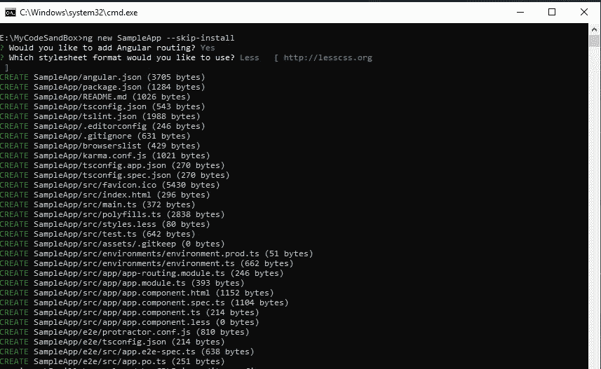

Creating new Angular App using Angular CLI

现在导航到 App 文件夹，打开该文件夹中的 VS 代码。为此，请键入

> cd SampleApp & & code。

它看起来会像

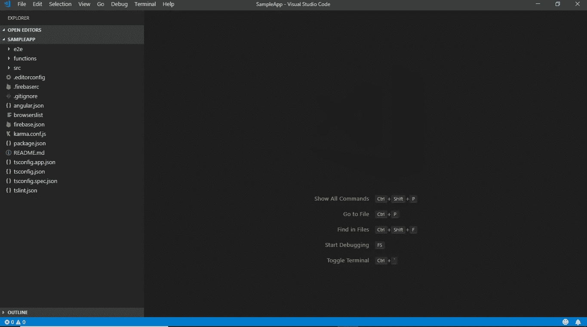

New Angular Project in VS Code

## 步骤 2:在 Github 上创建一个存储库

现在转到 Github 并创建一个新的存储库

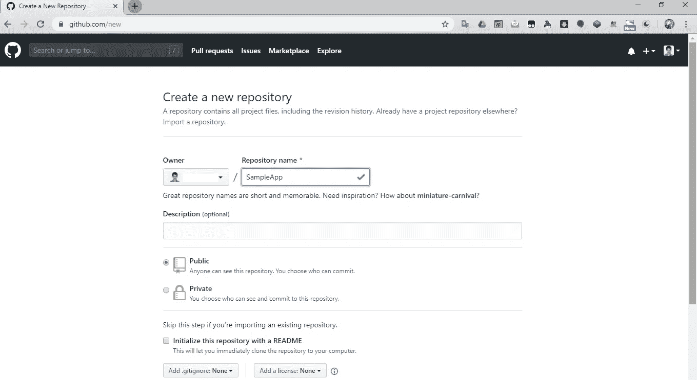

Creating new Repository in Github

创建完成后，就该将存储库与我们的本地工作目录链接起来了。在 CMD 中键入以下命令

> git init
> git remote add origin[https://github.com/{username}/SampleApp.git](https://github.com/{username}/SampleApp.git)

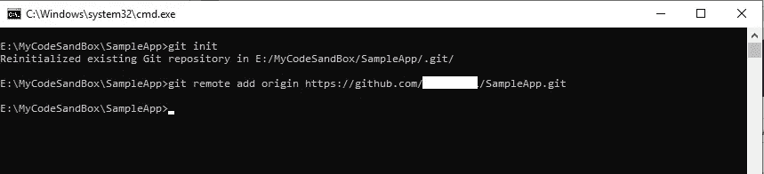

Initialising and setting remote on working directory

这将初始化 github 并将我们的 Github 库设置为远程工作目录。您可以为遥控器指定任何名称，而不是*原点*。

## 步骤 3:在 Firebase 中创建一个项目

是时候添加 Firebase 了

Firebase 是谷歌的平台，有很多内置功能。

去 console.firebase.google.com，你会看到一个这样的仪表板。

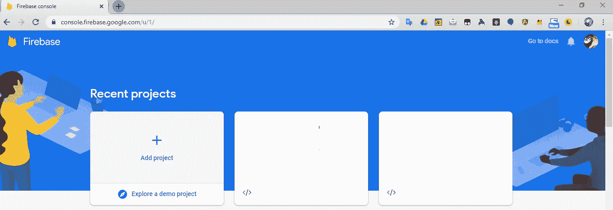

Firebase Home Screen

点击添加项目，你可以看到下面的屏幕。

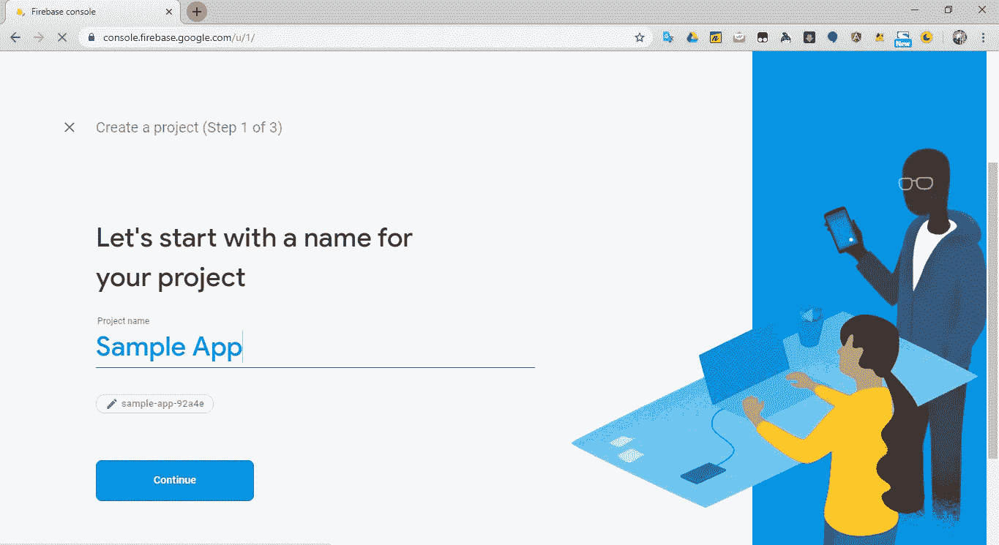

Firebase Add Project wizard

它要求您命名新的 Firebase 应用程序和名称空间。稍后将使用该名称空间来访问应用程序(您可以将其编辑为易于记忆的名称)。

一旦你设置好了，点击继续，你可以看到另一个屏幕。

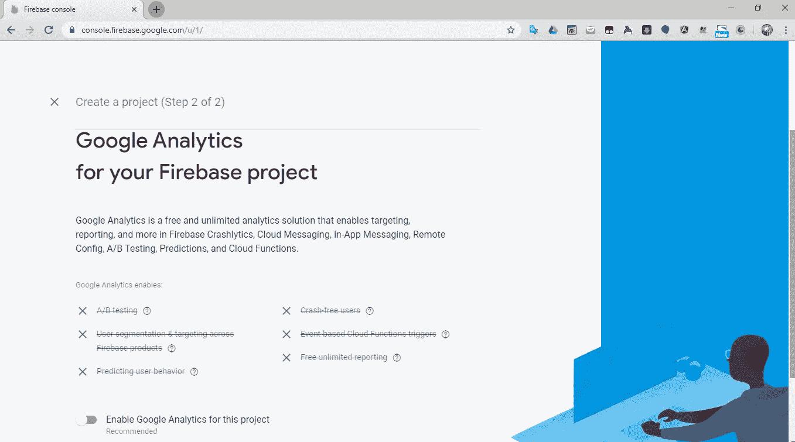

Firebase Google Analytics Screen

这个屏幕询问你是否想在你的项目中使用谷歌分析。我们选择否。

然后点击继续，我们的应用程序将在几秒钟内创建。完成后，您可以看到这样的屏幕。

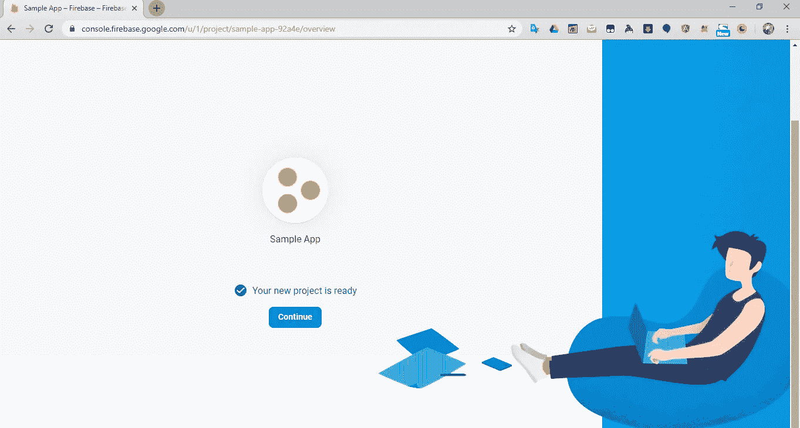

Firebase successfully created new App

## 步骤 4:将 Firebase 添加到项目中

是时候给我们的项目添加燃料了。为此，首先在全球范围内安装 [firebase-tools](https://www.npmjs.com/package/firebase-tools) 。运行以下命令

> NPM I-g firebase-工具

现在关闭并重新打开 CMD，运行以下命令登录 Firebase。

> firebase 登录

这个命令将在浏览器中打开一个窗口，你必须使用谷歌认证。一旦完成，您就可以开始使用其他 firebase 命令了。

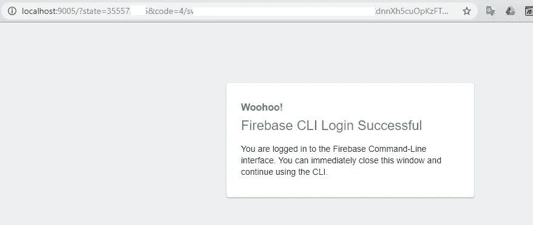

Firebase login successful

现在导航到我们的项目文件夹，运行下面的命令来初始化 firebase。

> 火灾基地初始化

这将启动 Firebase 的初始化过程，我们必须遵循几个步骤。

1.  当系统提示您是否要继续时，选择是。
2.  下一步将询问您希望在项目中使用哪些 firebase 特性。我们正在使用主机和功能(按空格键选择。完成后，点击输入)。
3.  下一步，它会询问您是想要创建一个新的 Firebase 项目还是使用一个现有的项目。选择现有的一个。
4.  下一步，从列表中选择我们在步骤 3 中创建的应用程序。使用箭头键导航，回车选择。
5.  接下来的步骤是配置功能。使用类型脚本作为语言函数。
6.  然后在下一步中，当它询问您是否要使用 TSLint 时，选择 yes(ts lint 是一个工具，它可以找出类型脚本代码中可能的错误)。
7.  然后它会问你是否要安装依赖项。键入 No，因为我们使用 CI 进行部署。
8.  接下来的步骤是主机配置。它会问你托管目录，默认值是公共的。将其更改为 *dist/SampleApp。*这是 Angular 开发应用的地方。
9.  在下一步询问您是否要将其配置为单页应用程序时，选择是。

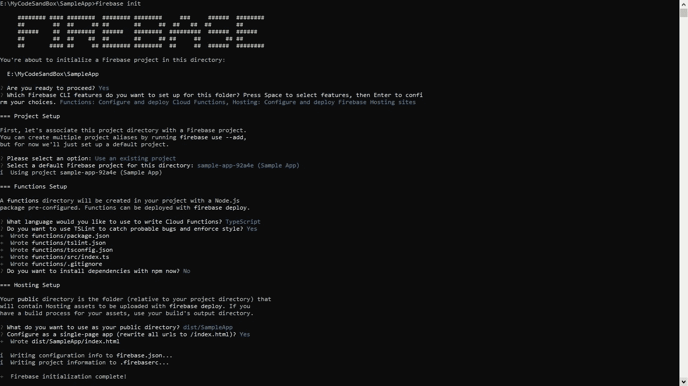

Adding Firebase in Project Repository

现在我们已经成功地在我们的项目中添加了 firebase。

## 第五步:在 CircleCI 上注册

是时候在 CircleCI 上报名了。

1.  去 circleci.com/dashboard
2.  单击 SampleApp 上的设置项目。
3.  现在选择 Linux 作为操作系统，Node 作为语言。
4.  然后点击开始建造

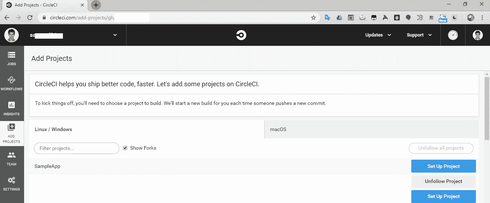

CircleCI Dashboard

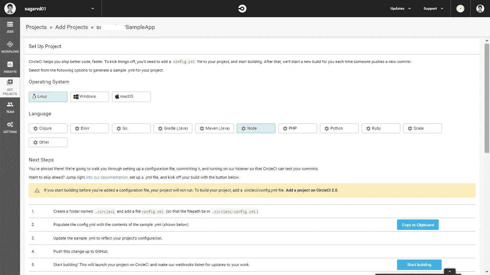

Project Setup in CircleCI

## 步骤 6:向 CircleCI 添加 Firebase 令牌

因为我们希望从 CI/CD 部署到 Firebase，所以我们需要一个 Firebase 令牌，CircleCI 将使用该令牌对 Firebase 进行身份验证。

在我们的项目文件夹中打开 CMD 并键入以下命令

> firebase 登录:ci

这将打开浏览器，您必须再次授权 Firebase CLI。

授权 Firebase CLI 后，您将在 CMD 中看到一个令牌。复制令牌。

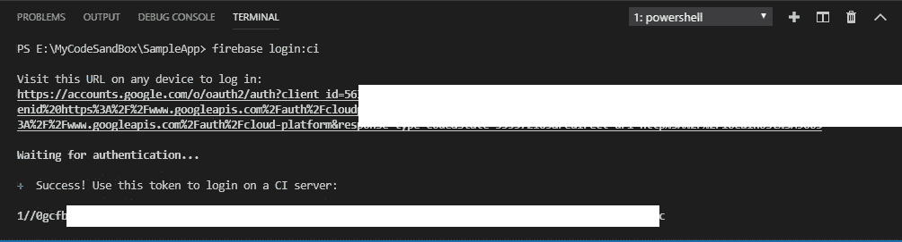

Firebase login CI

1.  前往 circleci.com/dashboard，点击 SampleApp 中的齿轮图标
2.  导航到环境变量选项卡，然后单击添加变量
3.  给出名称 FirebaseToken(可以是任何名称),并将令牌放在值字段中。

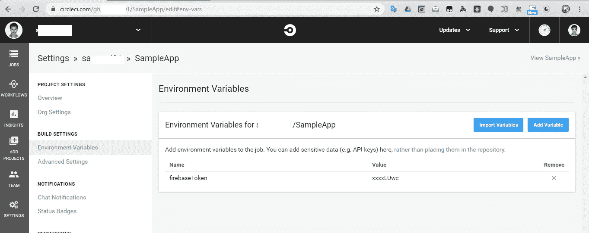

Environment Variable configuration in CircleCI

## 步骤 7:在项目中配置 CircleCI

在应用程序中添加 CircleCI 配置。

1.  在 VS 代码(或任何编辑器)中打开我们的项目。
2.  创建一个名为*的文件夹。circleci*
3.  在其中创建一个名为 *config.yml* 的文件
4.  将以下内容添加到文件中

现在我们需要修改 *package.json* 中的构建脚本来让 AOT 构建

把它改成

> ng 构建-产品- aot

## 步骤 8:构建应用程序

现在让我们将代码推送到 Github，然后 CircleCI 将开始构建我们的应用程序。

在 CMD 中键入以下内容

> git 添加。
> git 提交-m "初始提交"
> git 推送原始主机

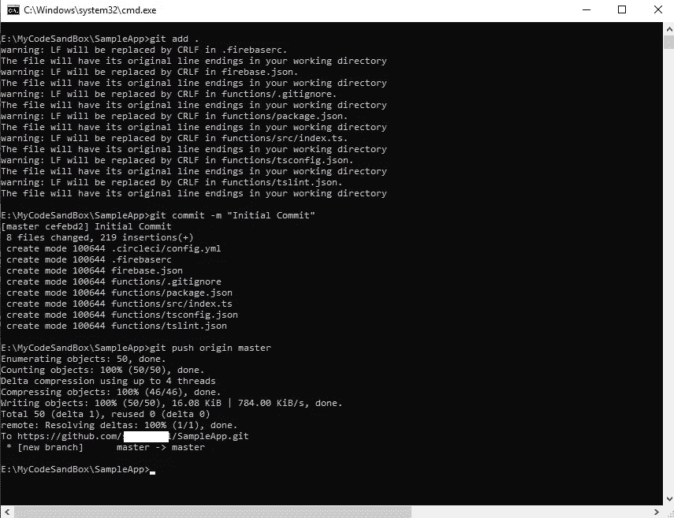

Committing and pushing to Github

现在导航到 Circleci.com/dashboard，我们可以看到作业正在那里运行。

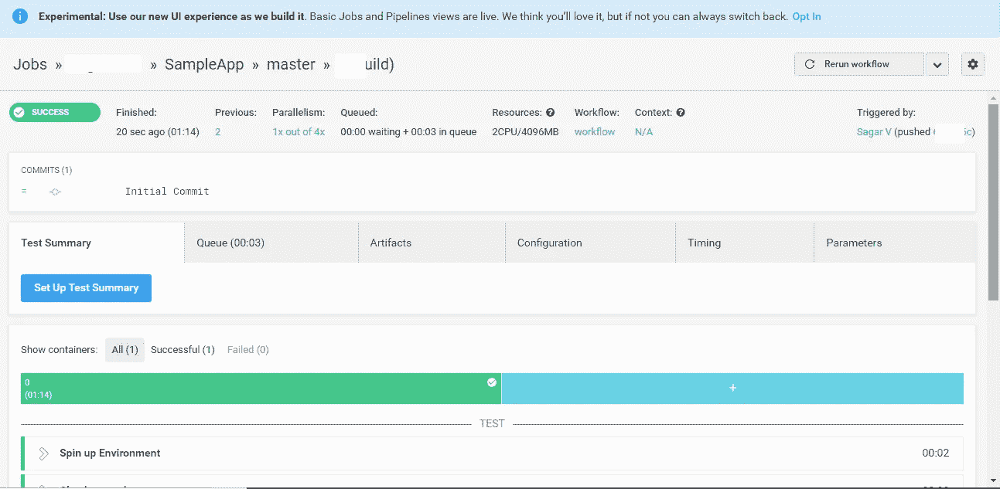

CircleCI job completed

现在，我们可以导航到我们在 Firebase 上部署的应用程序。访问*<namespace>. firebase App . com*可以看到我们的应用在那里运行。

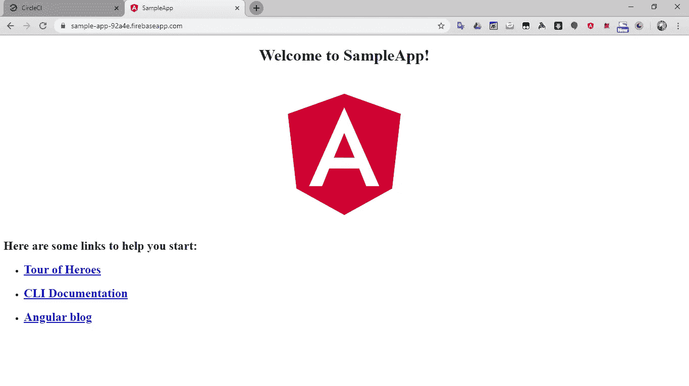

App running on Firebase

我们已经成功地在 Angular 上创建了一个生产版本，并将其托管在 Firebase 上。现在有什么问题？

通过客户端渲染角度渲染其所有组件。一旦客户端收到文档，JavaScript 代码将在客户端的浏览器中执行，HTML 元素将被呈现。SEO 在这里是个问题。虽然 Google bot 可以执行 JavaScript，但没有其他爬虫会执行它。于是，脸书，必应，推特等等。会将其视为一个单独的 html 页面，而不考虑路由。

为了克服这一问题，引入了 Universal。Angular Universal，也称为 SSR(服务器端呈现)是一种实现 SEO 的技术，它将在服务器中呈现所有本机 Angular 代码，并为每个路线提供单独的页面。这样爬虫就可以理解页面并解析它的标题和元标签。

## 步骤 9:将角度通用添加到项目

在我们的项目中添加 Universal 之前，我们必须安装所有的依赖项，否则我们会得到一个错误。要安装所有依赖项，请运行以下命令

> 国家预防机制一

这将把所有需要的包安装到 *node_modules* ，这是在本地编译这个项目所需要的。

然后运行以下命令，在我们的应用程序中添加 Angular Universal。

> ng add @ nguniversal/express-engine-client project sample app

这将创建几个文件，并编辑一些现有的文件。

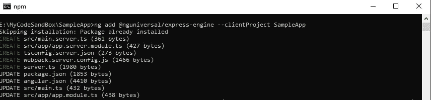

Adding Angular Universal to Project

现在我们来看看 CSR 和 SSR 的区别。要编译和查看，请运行以下命令

> npm 运行构建:ssr && npm 运行服务:ssr

这将首先构建 SSR 应用程序，然后服务于它。

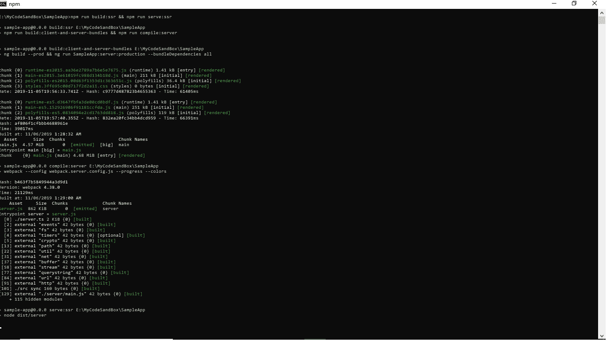

Build and Serve SSR

*npm 运行构建:ssr* 将在 */dist* 中创建 2 个文件夹。浏览器和服务器。当从浏览器访问时，将提供来自 */dist/browser* 的内容，当爬虫或非浏览器应用(例如:curl)访问时，将提供来自 */dist/server* 的内容。

一旦它执行完毕，在浏览器中访问[*http://localhost:4000*](http://localhost:4000)，你就可以在其中看到我们的应用。

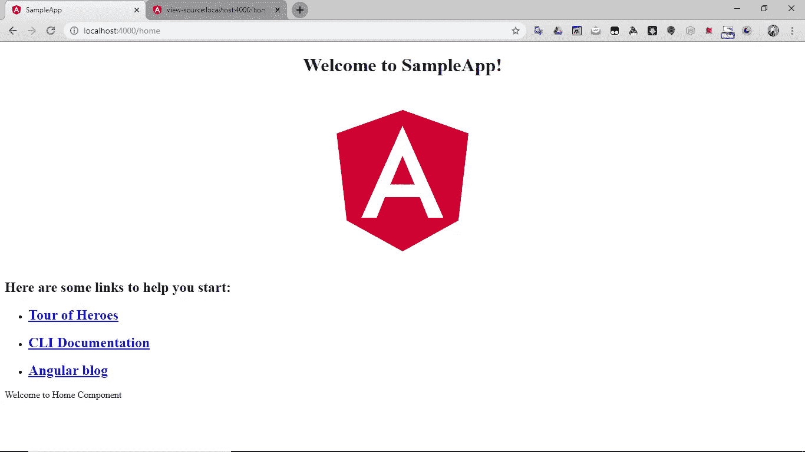

SSR App

为了验证它在服务器端的渲染，查看应用程序的源代码，我们可以看到所有的 HTML 元素和文本内容。

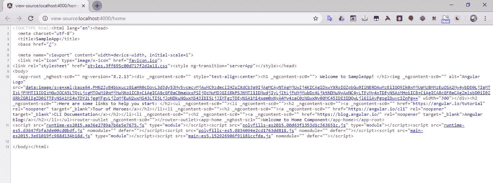

Source Code of SSR App

## 步骤 10:为 Firebase 部署准备代码

为了将它部署到 firebase，我们必须做一些更改。

在 server.ts 中，编辑下面一行

> const app = express()；

到

> 导出常量 app = express()；

因为我们必须从这里导出 express 并在 Firebase Cloud 函数中使用它。

现在在 *firebase.json* 中做如下修改

> " hosting ":{
> " public ":" dist/sample app "

到

> "托管":{
> "公共":"分发/浏览器"

和

> "重写":[{
> "源":" ** "，
> "目的地":" index.html"
> }

到

> "重写":[{
> "source": "** "，
> "function": "ssr"
> }

然后在 *webpack.config.js* 中进行以下更改

编辑

> 外部:{
> '。/dist/server/main ':'要求("。/server/main")'
> }，

到

> 外部:[{
> '。/dist/server/main ':'。/server/main'
> }，
> /^firebase/

然后将以下几行添加到*输出*

> 库:' app '，
> 库目标:' umd '，

因此输出部分将变成

> 输出:{
> path: path.join(__dirname，' dist ')，
> library : 'app '，
> libraryTarget : 'umd '，
> filename: '[name]。js'
> }，

## 步骤 11:处理 SSR 的 Firebase Cloud 函数

我们需要写一个云函数在服务器端渲染它。转到 *functions/src/index.ts* 并添加以下代码

> const functions = require(' firebase-functions ')；
> const universal = require(` $ { process . CWD()}/dist/server . js `)。app
> exports . SSR = functions . https . on request(universal)

这里，我们正在导入从 *server.ts* 导出的 *app* ，并将其用作 Firebase Function 的 *https.onRequest* 事件中的监听器。

## 步骤 12:编译代码

因为我们做了一些更改，所以在部署到 firebase 之前，我们必须再次编译代码。运行以下命令

> npm 运行构建:ssr

这将编译新代码。

现在将 */dist* 复制到 */functions/dist* ( **复制**，不移动)。

## 步骤 13:部署到 Firebase

现在是时候把它部署到 firebase 了。运行以下命令来部署我们的代码。

> 消防基地部署

它会将我们的应用程序部署到 Firebase

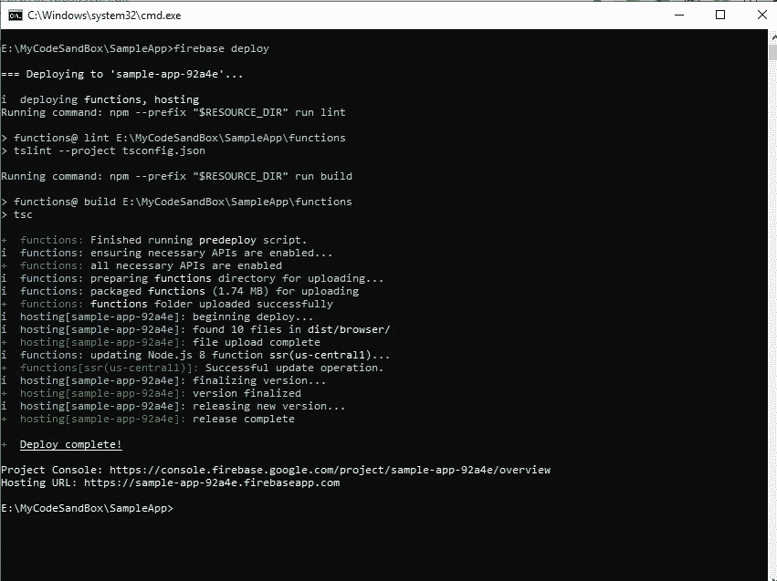

Firebase deploy

然后访问*https://<project-id>. firebase app . com*查看我们的 app。要确认 SSR，查看它的源代码。

## 步骤 14:使用 CircleCI

是时候改变 CircleCI 配置来构建和部署 Angular SSR 了。更换*。circleci/config.yml* 到以下

现在推给 github

> git 添加。
> git commit -m "添加通用"
> git 推送原始主机

如果我们访问 circleci.com/dashboard，一切顺利，我们可以看到构建和部署是成功的。

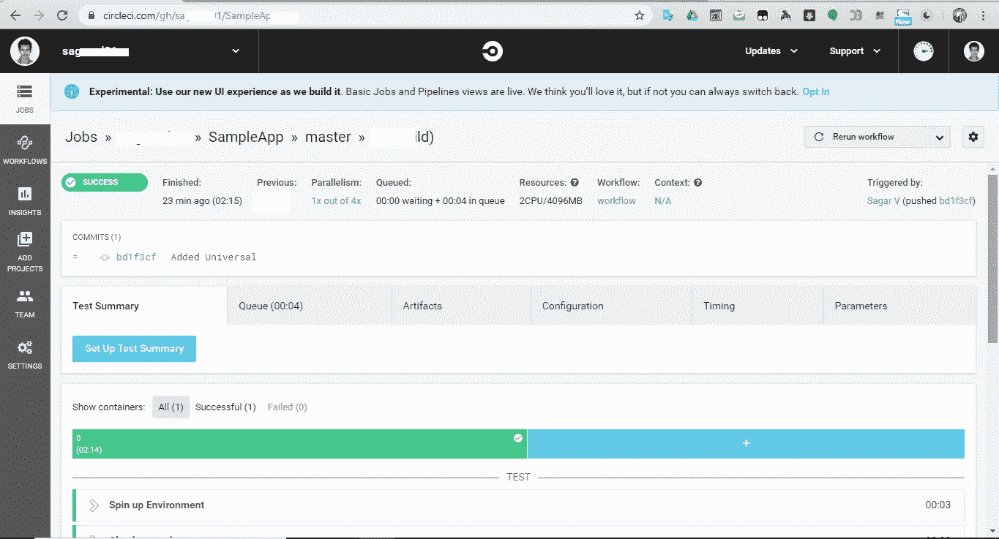

CircleCI dashboard

现在访问*https://<project-id>. firebase app . com*查看我们的 App。要验证服务器端呈现，请使用浏览器中的查看源代码。

> [我的官网](https://www.sagarvd.me)是用 Angular SSR 搭建的，用 CircleCI 托管在 Firebase 上。