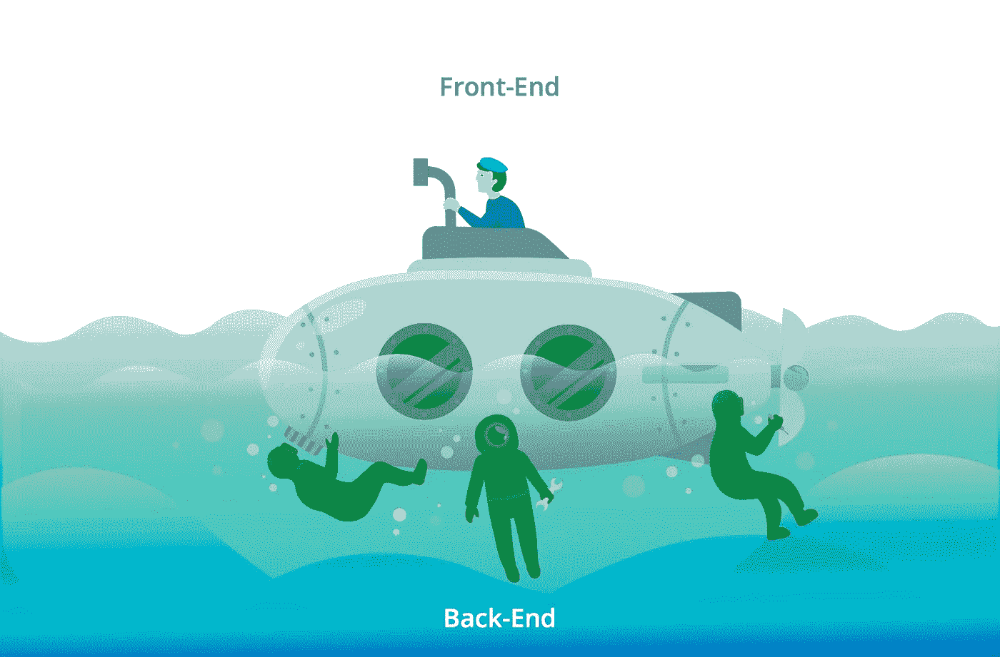

# 使用 Tanzu 应用服务部署多环境 React 应用

> 原文：<https://javascript.plainenglish.io/deploying-multi-environment-react-apps-with-tanzu-application-service-7e332416165?source=collection_archive---------14----------------------->

许多 [SPA](https://reactjs.org/docs/glossary.html#single-page-application) React 应用程序都是使用 NPM [Create React App](https://github.com/facebook/create-react-app) (CRA)包创建的。它创建的应用不需要构建配置，这对于许多用例来说已经足够了。简单的谷歌搜索会让你很好地了解这种方法的利弊。一些有趣的文章:[一](https://medium.com/@JamesDinnes/why-you-should-stop-using-creat-react-app-18410ce94e64)、[二](https://codeburst.io/is-create-react-app-a-dead-end-5baae1568f89)和[三](https://www.reddit.com/r/reactjs/comments/81gfl6/do_people_use_create_react_app_in_production/)。

CRA 的主要优势之一是它允许你以静态/缩小文件的形式轻松构建应用程序。一旦你有了一组静态文件，你就可以使用任何 HTTP 服务器为应用服务，例如 apache，nginx，S3。

我刚刚在上面评论的听起来很棒。然而，因为一切都是静态的，给应用程序添加动态可能是一个挑战。该模型假设任何动力都来自外部，通常是 API。这在大多数情况下都能很好地工作，但是对于配置文件来说，听起来有点矫枉过正。

面临的一个常见挑战是，您需要根据环境指定不同的后端基础 URI。例如: *BACKEND1_BASE_URL* 可能是[https://my back end-dev/API/v1](https://mybackend-dev/api/v1)或[https://my back end/API/v1](https://mybackend-dev/api/v1)

你可以使用[自定义环境变量](https://create-react-app.dev/docs/adding-custom-environment-variables/)克服上述挑战，并使用[静态构建包](https://docs.cloudfoundry.org/buildpacks/staticfile/index.html)将应用部署到 [Tanzu 应用服务](https://tanzu.vmware.com/application-service) (TAS)，超级简单！看看下面的 [bash 片段](https://github.com/camposer/react-app-to-tas/blob/master/static-build-and-deploy-example.sh)。

然而，注释方法的一个重要缺点是每次构建都需要维护/存储工件。您最终将面临每个环境不同版本的噩梦，这会显著增加您的库存管理复杂性。试想一下: *myapp-dev-v1.0.zip* ， *myapp-sit-v1.0.zip* ， *myapp-uat-v1.0.zip* 和 *myapp-prod-v1.0.zip* ！

您还可以使用其他方法来避免版本管理的麻烦。有些与自定义主机名解析或代理中介(例如反向代理)有关。在这篇文章中，我想重点介绍一种代理中介方法，它依赖于每个环境的不同文件。

为了更好地解释这种方法，我决定编写一个简单的 React 应用程序，并将其部署到 TAS。为什么是 TAS？因为我真的相信没有更简单的方法来部署/维护您的应用程序！您拥有所有的 [Cloud Foundry](https://www.cloudfoundry.org/why-cloud-foundry/) goodies 以及 Pivotal 和 VMware 积累的应用程序开发知识。

# 方法

你可以在这里找到 app live [，在这里](http://react-app-to-tas.cfapps.io/)找到源代码[。原谅 CSS 和 UI 品味差！我只想演示如何通过环境变量来改变配置文件。如果您在本地运行该应用程序，您会看到:*欢迎使用，Dev！如果你在 TAS 上运行它:*欢迎，Prod！*。*](https://github.com/camposer/react-app-to-tas)

在详细解释了上述 React 应用程序中引入的所有更改后，最初使用[*npx create-React-App*](https://reactjs.org/docs/create-a-new-react-app.html)创建

# 配置环境文件

在你的 index.html 中声明一个[新的配置文件:](https://github.com/camposer/react-app-to-tas/blob/master/public/index.html#L19)

然后添加用于在本地运行应用程序的配置文件( [*config.js*](https://github.com/camposer/react-app-to-tas/blob/master/public/config.js) )和用于不同环境的配置文件(例如 [*prod.js*](https://github.com/camposer/react-app-to-tas/blob/master/public/prod.js) )。当您在本地运行应用程序( *npm start* )时，它只使用 *config.js* 文件。

# 配置 NGINX

我使用的是 [NGINX 构建包](https://docs.cloudfoundry.org/buildpacks/nginx/index.html)而不是[静态构建包](https://docs.cloudfoundry.org/buildpacks/staticfile/index.html)，因为这种方法需要修改 *nginx.conf* 文件。

你可以在这里找到完整的*nginx . conf*，下面几行对这个解释特别重要:

NGINX 将根据环境变量 *CONFIG_FILE* 的值提供配置文件，例如: *prod.js* 。参见 [*manifest.yml*](https://github.com/camposer/react-app-to-tas/blob/master/manifest.yml)

为了部署这个应用程序，最简单的部分，如果你使用 TAS，你可以运行: *cf push -f manifest.yml*

# 最后的话

希望这个帖子有帮助！至少，我希望它能引发一些思考:-)

一些好处:

*   消除每个环境中的多个工件。降低运营复杂性
*   尊重[关注点分离](https://en.wikipedia.org/wiki/Separation_of_concerns)原则。前端配置保持在前端。
*   消除获取应用配置的端点。

一些挑战:

*   您需要 HTTP 服务器配置！如果你只是想使用 S3 或类似的，那么这是不可行的。
*   本地配置的名为 config 的文件可能会造成混乱。

对于“要走的路”，我还是没有定论。我想这要看情况。在任何情况下，这种方法肯定可以在处理多种环境时保持应用程序的简单，特别是如果您需要创建版本并且不想在每个环境中生成多个文件。