# 将自然 JS 推理模型部署到 AWS Lambda

> 原文：<https://javascript.plainenglish.io/deploying-natural-js-inference-model-to-aws-lambda-ff2f9719b5d0?source=collection_archive---------5----------------------->

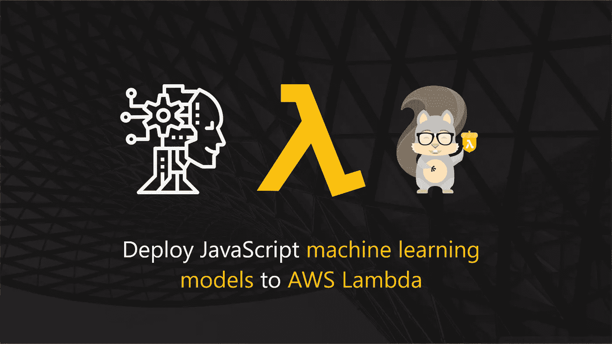

A comprehensive guide on embedding pre-trained inference models inside serverless APIs

本文是一个全面的指南，解释了如何使用 AWS Lambda & API 网关将使用 Natural JS 训练的推理模型部署到受密钥保护的 API。在本文结束时，您应该能够:

*   *理解什么是推理模型。*
*   *对 ML 管道及其与推理模型的关系有基本的了解。*
*   *在无服务器 API 中部署推理模型的优势。*
*   *用嵌入式推理模型构建无服务器 API*
*   *部署受 API 网关、使用计划、速率限制和 API 密钥保护的 Lambda 功能。*
*   *实现与 Lambda 功能开发相关的常见任务的自动化。*

## 第 1 部分:好奇如何构建纯 JS 模型？

如果您想知道本文中使用的模型是如何训练的，我建议您在继续阅读本页之前先阅读下面的文章！

 [## JavaScript 开发者的机器学习将在 10 分钟内完成

### 本文旨在向 JavaScript 开发人员介绍并教授不到 10 分钟的机器学习:

medium.com](https://medium.com/javascript-in-plain-english/ml-for-js-devs-in-10-minutes-46794782762e) 

## 机器学习管道&推理模型

A typical machine learning pipeline that produces inferences model(s).

推理模型是机器学习管道的最终产品。典型的 ML 管道由几个旨在产生推理模型的步骤组成。最后，这些管道可能因具体情况而异，并可能在流程结束时产生一个或多个模型。

我个人喜欢在我的项目中使用的 ML 管道由以下步骤组成:

*   **数据收集** —机器学习工程师和数据科学家从不同来源收集和整理数据，以便将其用于模型培训的步骤。
*   **数据预处理** —对采集的数据进行清理和转换的步骤。这一步是完全可选的，但通常可以提高推理模型产生的结果的质量和准确性。
*   **算法选择** —机器学习工程师选择一个或多个在解决问题陈述中表现良好的算法的步骤。
*   **验证** —“表现良好”通过验证技术确定，例如 K-fold & 80/20 技术。我将写另一篇文章，展示这一具体步骤，以提高我们推理模型的当前准确性(71%)。
*   **最终培训** —培训将嵌入到生产 API 中的模型的步骤。

在这些管道的末端，推理模型被用在商业应用中，用于预测来自给定输入的结果。在我们的解决方案的上下文中，我们的推理模型被构建为在以下标签之间对一段文本进行分类:

*   仇恨言论
*   攻击性言论
*   也不

## 在应用编程接口中部署推理模型

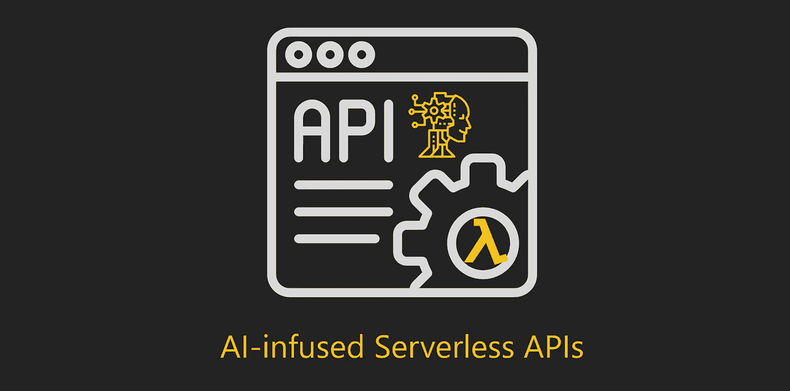

在 API 中嵌入机器学习模型是服务于其功能的最常见方式。使用 API 公开它比将其嵌入到客户端应用程序中更理想，因为:

*   模型权重通常很大，不适合通过网络传输，这会降低前端应用程序的加载速度
*   它允许你在客户端保护你的模型免受[体重中毒攻击](https://towardsdatascience.com/beware-of-weight-poisoning-in-transfer-learning-4c09b63f8353)
*   它允许你保护你的模型不被抄袭。
*   它允许您对机器学习模型应用安全措施(速率限制、使用配额和 API 密钥)
*   它允许你为不同的消费者提供服务

## 为什么选择 AWS Lambda？

个人和组织会希望将机器学习模型部署到 AWS Lambda，因为它允许他们利用以下优势:

*   无需前期成本的快速原型制作
*   如果实验失败，易于退役
*   一旦原型成功，易于扩展
*   不需要您支付闲置的计算时间
*   不需要 IT 和安全人员的大量关注和管理
*   借助 AWS API 网关，实现 API 密钥保护机制更容易
*   本地[金丝雀部署](https://aws.amazon.com/blogs/compute/implementing-canary-deployments-of-aws-lambda-functions-with-alias-traffic-shifting/)，借助 SAM 模板进行模型性能比较

你可以从这个[链接](https://itnext.io/serverless-ninja-part-01-serverless-efficiency-64cf77915838)找到更多关于使用无服务器架构优势的信息。

## 注入人工智能的 API 解决方案

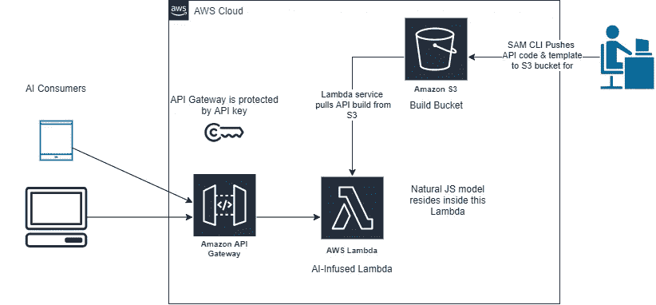

A high-level overview of this project’s architecture

既然我们已经讨论了为什么 ML 模型在 API 中更好地服务，我们可以继续解释 ML 驱动的 API 设计的高级概述。

在上图中:

*   开发人员构建注入人工智能的 API 包，并将其上传到 S3 桶
*   Lambda 服务从 S3 桶中检索部署工件和云形成模板
*   该模型嵌入在基于 Lambda 的 API 中
*   基于 Lambda 的 API 受到 AWS API 网关的保护
*   API 网关受 API 密钥保护
*   消费者调用 API 网关上的端点

## 克隆源代码

为了运行和测试推理端点，请从 Github 中我的书的代码库的这个[文件夹](https://github.com/allanchua101/serverless-ninja/tree/master/006-ai-apis/002-apis/natural-js-simple)中克隆您机器上的整个实现。

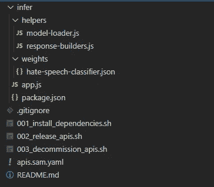

The scaffold of our AI-powered serverless API

克隆过程完成后，您将在机器上看到以下文件夹结构(Scaffold)。

## 安装 API 依赖项

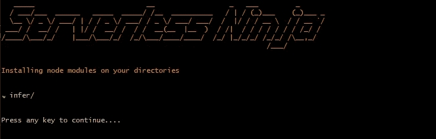

CLI output of dependency installers

要安装我们的 API 的依赖项(自然 JS 的节点模块)，您可以在您的终端中运行名为**001 _ install _ dependencies . sh**的脚本。

这个脚本的作用是查找项目根目录下的所有文件夹，如果开发机器上没有节点模块，就安装节点模块。

我以这种方式自动化了依赖项安装，因为现实生活中的无服务器项目将包含不止一个基于 Lambda 的 API，如果手动安装，跨所有这些端点安装节点模块会花费您大量的时间。

## 检查 API 代码

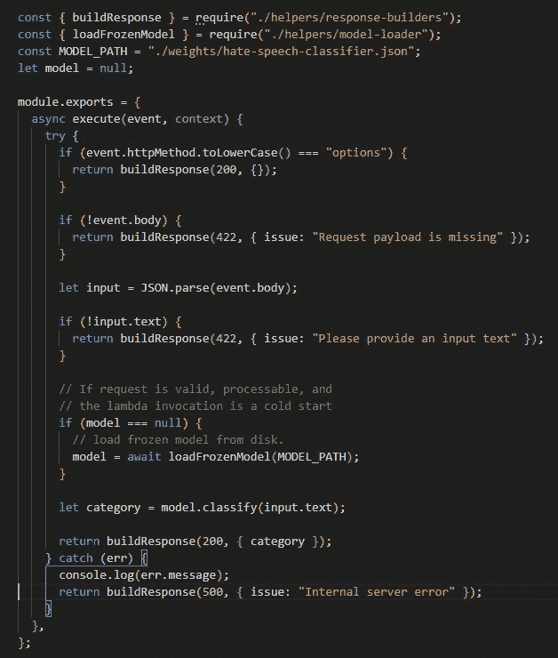

An ML-powered API designed for classifying hate speech. The code is also viewable in a [gist](https://gist.github.com/allanchua101/64c1ab5134e183bd0564497a1b686f36).

为了让代码更具可读性，我删除了一些你可能会在 [Github](https://github.com/allanchua101/serverless-ninja/tree/master/006-ai-apis/002-apis/natural-js-simple) 的源代码中找到的注释。

下面是这段代码的逻辑分解:

*   该模块首先从实用程序文件导入到[build response](https://github.com/allanchua101/serverless-ninja/blob/master/006-ai-apis/002-apis/natural-js-simple/infer/helpers/response-builders.js)&[loadFrozenModel](https://github.com/allanchua101/serverless-ninja/blob/master/006-ai-apis/002-apis/natural-js-simple/infer/helpers/model-loader.js)函数。
*   我们为模型的权重路径定义了一个常量变量。
*   我们定义了一个名为 model 的变量，并给它赋值 null。其目的是*防止**热启动**时不必要的从磁盘重新加载*推理模型的权重。
*   当使用**选项**动词调用函数时，我们用 HTTP 200 进行响应。
*   当没有提供要分类的正文或文本时，我们用 HTTP 422(不可处理的实体)进行响应。
*   如果请求是**冷启动**，我们将加载推理模型。
*   如果所有参数和条件都有效，我们使用推理模型运行分类。
*   然后，我们用带有文本分类标签的 HTTP 200 进行响应。

## 使用 SAM 定义 API 网关

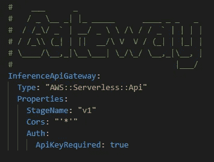

Nothing special about our API gateway’s SAM template here

从消费者的角度来看，为了将 lambda 函数聚合在一个单一的联系点下，我们将使用一个 [API 网关](https://www.pogsdotnet.com/2018/08/api-gateway-in-nutshell.html)。上面的模板定义了我们的 API 网关。

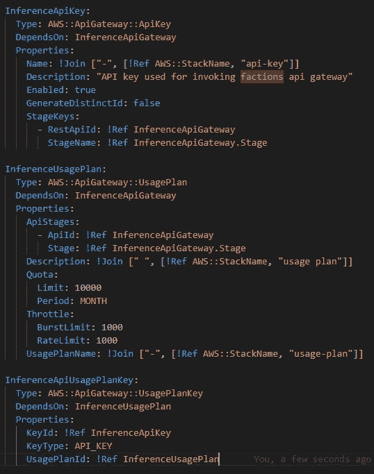

Defining an API key, API usage plan, and associating both to API Gateway

然后，我们定义一个 API 密钥，消费方需要这个密钥来验证传入的 HTTP 请求。我们还定义了一个实施以下内容的使用计划:

*   将传入请求限制在每月 10，000 次的配额
*   每秒 1，000 次呼叫的节流设置为稳态速率限制
*   [阻止 API 网关过载的节流脉冲限制](https://docs.aws.amazon.com/apigateway/latest/developerguide/api-gateway-request-throttling.html)(设置为 1000)

## λ函数定义

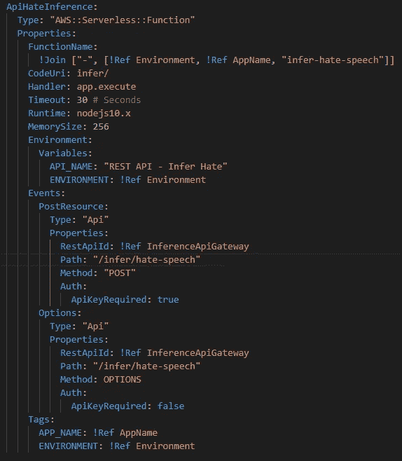

SAM template definition for the API

*   我们正在定义一个动态函数名，它附加了环境代码、应用程序名和我们的 lambda 函数名( **infer-hate-speech** )。
*   指定端点的代码 URI(推断目录)
*   指定 Lambda 函数执行入口点(app.execute)
*   以秒(30)为单位指定最大请求超时
*   指定函数运行时(nodejs10.x)
*   指定内存大小(256mb)
*   指定环境变量，以便在后面的教程中进行调试
*   将 API 网关的 **POST & OPTIONS** 动词事件作为触发器
*   将其标记为[资源组管理](https://docs.aws.amazon.com/ARG/latest/userguide/welcome.html)

## 代码发布

我创建了一个很棒的 bash 脚本，让你们可以运行引导部署，可以在这里找到。如果您有兴趣使用自己的 bash 脚本集来发布它，您可以在项目根目录上运行以下命令:

如果您已经向我们的 awesome guided CLI 提供了有效值，您应该会得到类似于下图的云形成堆栈:

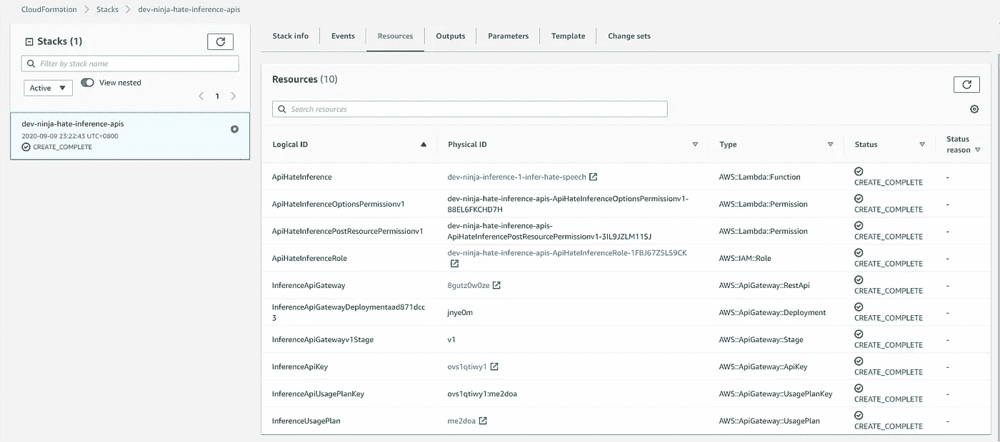

Cloud Formation stack sample

## 测试我们的 API

为了测试我们的模型与 API Gateway & Lambda 函数的集成:

*   在 AWS 控制台中打开 API 网关。
*   选择名为**dev-ninja-hate-inference-API 的 API 网关。**
*   提供所需的文本，以下列有效负载格式进行分类

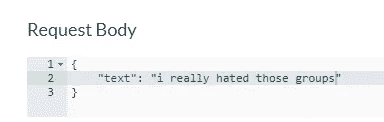

Sample text classification payload

*   单击 test 按钮，您应该会看到以下结果

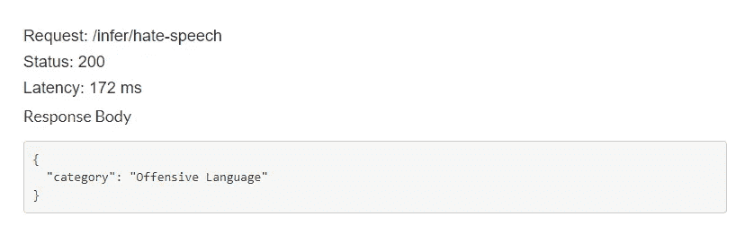

Sample result for the provided input

## 使退役

在您完成摆弄和测试解决方案之后。如果您想保持 AWS 环境的整洁，我强烈建议停用云形成堆栈。

如果您希望在您的生态系统上保留 CloudFormation 堆栈以供将来测试或演示之用，这也是很好的。保持堆栈不需要花钱，除非你开始达到每月 100 万个请求。

如果您决定退役 API 栈示例，您可以利用我从这个[链接](https://github.com/allanchua101/serverless-ninja/blob/master/006-ai-apis/002-apis/natural-js-simple/003_decommission_apis.sh)构建的退役 bash 脚本。

让云形成堆栈在我们的 AWS 生态系统中运行的能力展示了无服务器的成本效率，这是基于 Docker 的推理模型无法轻松实现的，因为它需要您支付 K8s 控制平面(每月 75 美元)和工作节点(取决于是否使用 AWS Fargate 或 EC2 机器)。

## 结论

在本文中，我们了解到:

*   推理模型是训练机器学习模型的最终产品
*   推理模型可以嵌入客户端应用程序或 API 中
*   我们已经了解了将推理模型封装在无服务器 API 中的好处
*   我们已经看到了由 API 网关和 API 密钥保护的人工智能 API 的实际实现
*   我们比较了在无服务器和基于 Docker 的 API 中嵌入 ML 模型的实验成本

## 下一步是什么？

在前一篇文章中，我们已经在开发机器中训练了我们的推理模型。然而，我们可以通过在 lambda 函数中运行我们的模型训练来将这带到下一个级别，lambda 函数可以通过在 S3 桶上放置新的数据集来触发。

## 简单英语的 JavaScript

喜欢这篇文章吗？如果是这样，通过 [**订阅解码获得更多类似内容，我们的 YouTube 频道**](https://www.youtube.com/channel/UCtipWUghju290NWcn8jhyAw) **！**