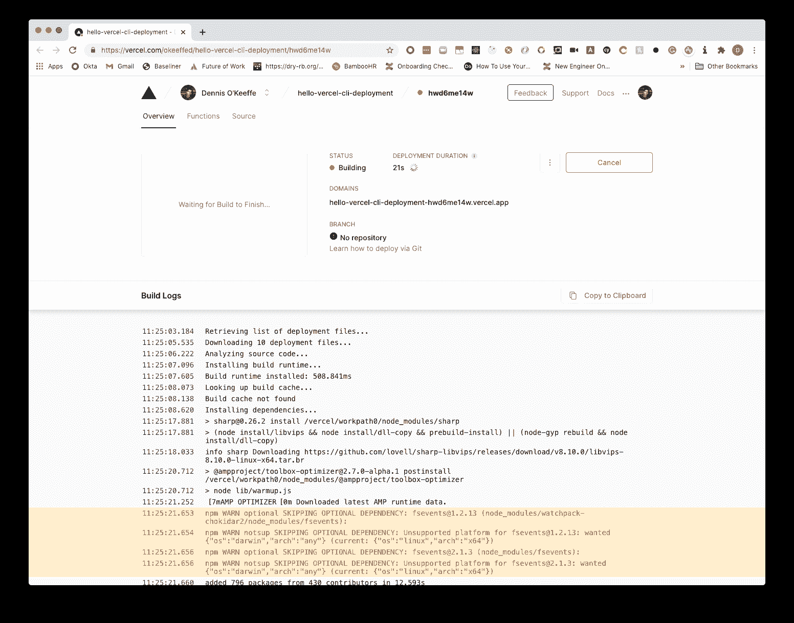
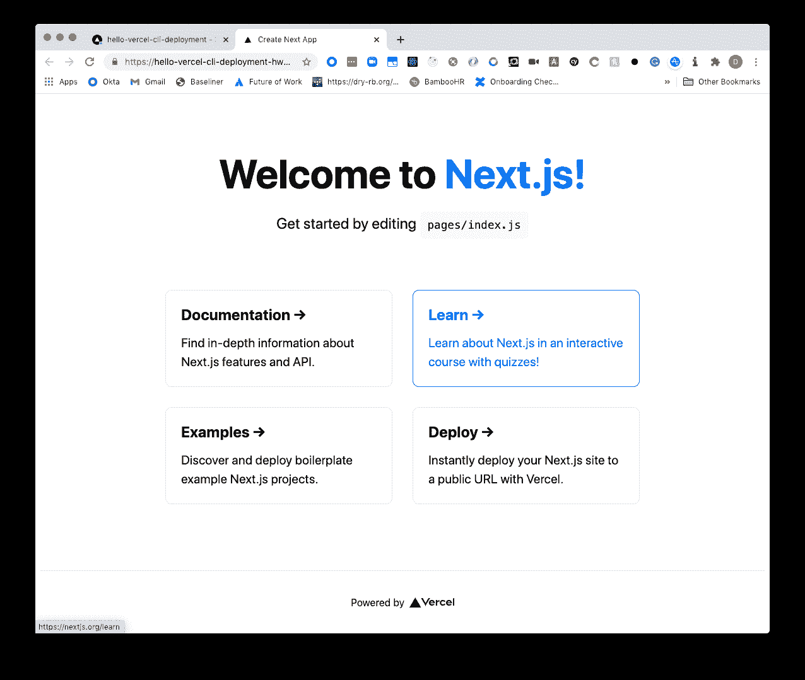
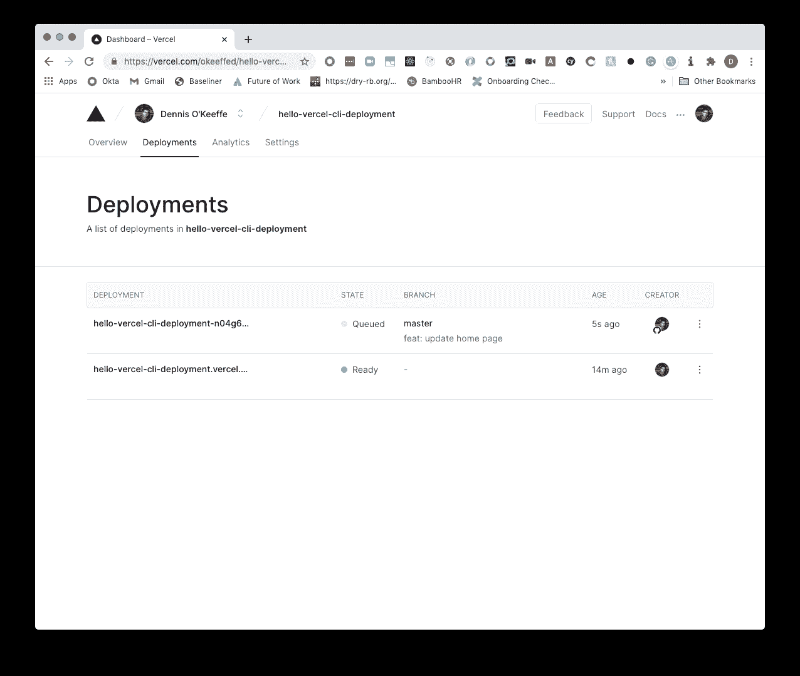
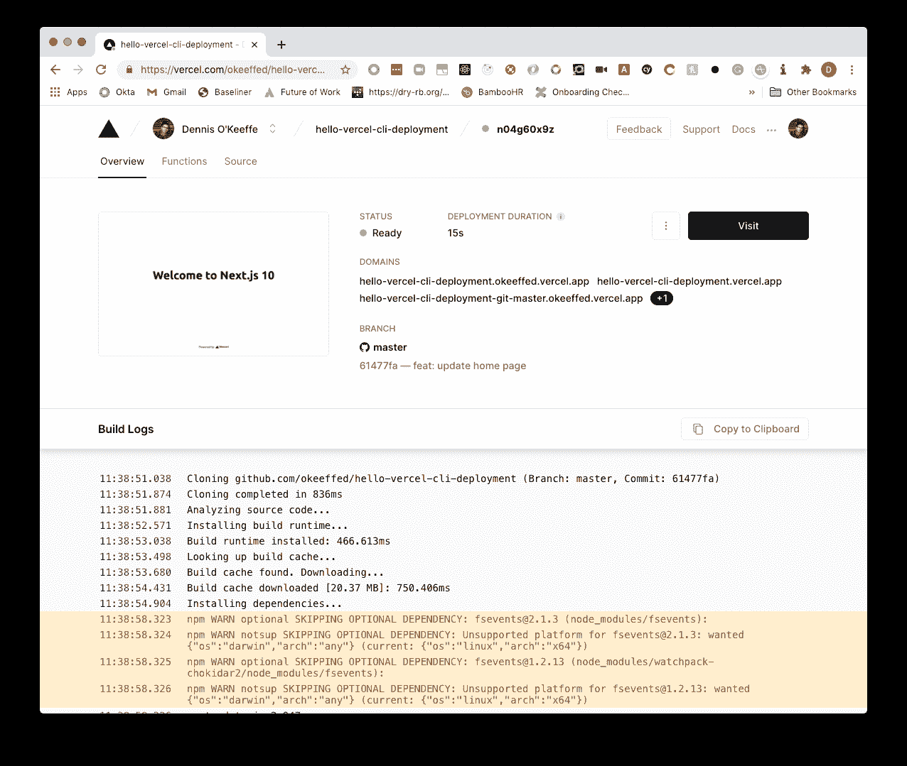
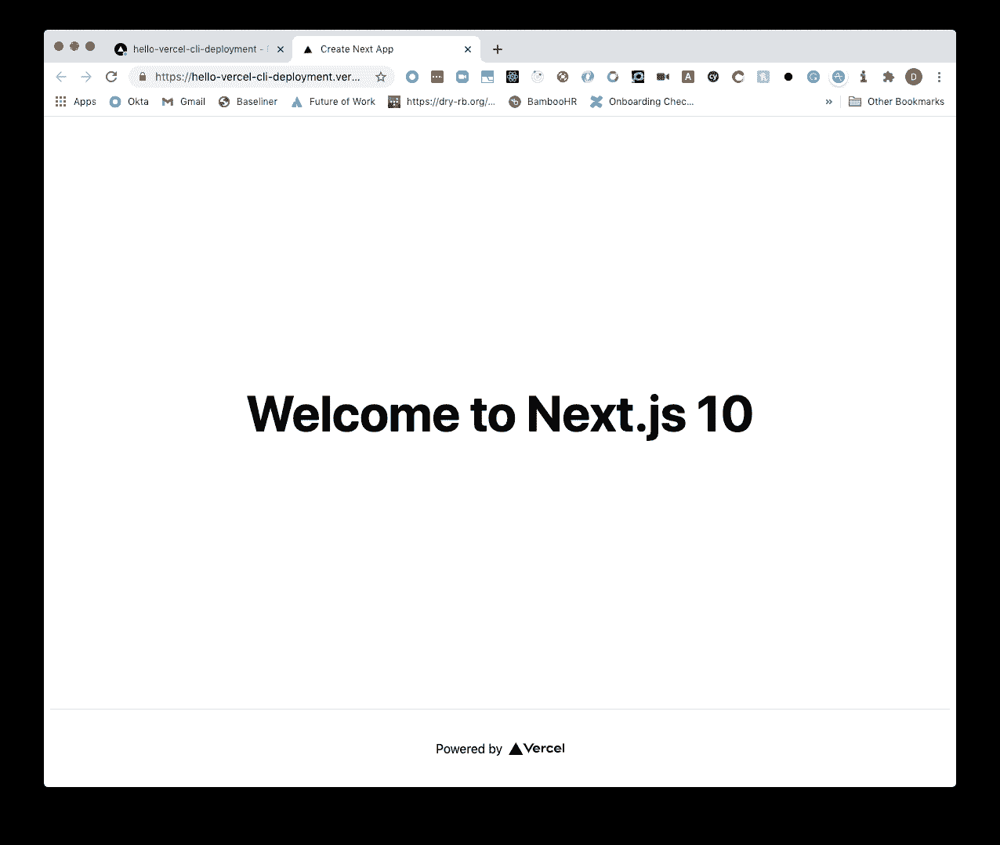

# 使用 Vercel CLI 和 Vercel GitHub 集成部署 Next.js 10

> 原文：<https://javascript.plainenglish.io/deploying-next-js-10-with-vercel-cli-and-the-vercel-github-integration-10df5bca50c0?source=collection_archive---------11----------------------->

回到 Vercel 还是 Zeit，Vercel CLI 还是简单的`now`的时候，我被它的简单性所震撼。在那个时候，你可以部署 contains，我在 2018 年的黄金比特币阶段进行了计算(是的，这是一种倒退)。

在最近的 [Next.js 大会](https://nextjs.org/conf/stage/n)和 [Next.js 10](https://nextjs.org/blog/next-10) 发布之后，我非常想对我部署应用的方式做一些改变。

我仍然在努力解决它，但就目前的情况来看，**我不喜欢违背初衷让 Lambda 函数与 Next.js 9+** 一起工作(是的，有一个无服务器插件，但它不适合我想要的工作流)。

所以，我决定回到 Vercel，看看有什么新鲜的东西，并把一些注意力放在 Next.js 上。

今天的帖子将简单回顾一下使用 Vercel 进行部署的过程。

要求是你有一个 Vercel 和 GitHub 的账号。

## 使用 Vercel CLI 部署 Next.js 10 应用程序

我们需要做一些基础工作。从项目基础开始，让我们使用 **create-next-app** 来创建一个 Next.js 10 应用程序，我们将使用将要安装的 Vercel CLI 来部署它。

一旦我们安装并创建了基本的 scaffold，我们将需要使用`vercel login`登录到我们的 Vercel 帐户。

这将提示您输入电子邮件地址。一旦输入完毕，请查看您的电子邮件以验证代码。

这将使您从 CLI 登录，您就可以开始了！

现在，魔术来了…只要跑`vercel`。

按照提示选择您乐意部署的范围和项目。

提示会给你一个 URL 来检查，这样你就可以看到部署的进度。

一旦项目完成，它将为您提供一个特定项目的链接。对我来说，那个链接就是[https://hello-vercel-CLI-deployment . vercel . app](https://hello-vercel-cli-deployment.vercel.app)。

如果您前往该链接，您将看到基本的 Next.js 10 登录页面！

哇，还是和两年前一样简单。

## 使用 GitHub 部署

如果我们现在转到您的 [Vercel 仪表板](https://vercel.com/dashboard)，您将看到项目带有一个连接 Git 存储库的选项。

为了连接这个，你需要确保你的新回购已经在 GitHub 上了。

如果您使用的是 [GitHub CLI](https://github.com/cli/cli) ，您可以运行类似下面的命令来创建一个 repo(在这里是 public)并推送存储库。

回到仪表板，我们可以选择**连接到 Git 存储库**，并按照提示添加我们新创建的**hello-vercel-CLI-deployment**存储库。

> 值得注意的是，默认情况下，Vercel 将在`main`分支上进行部署。

在这个阶段，我将返回回购，对主页`pages/index.js`做一些小的调整，保存，提交到 Git，然后推送到 remote。

一旦推送，连接的 Git repo 会自动触发新的部署！

你可以跟随仪表板，但一旦完成，你会看到一个新的网站预览和最终网站。

恭喜，加快项目和部署的第一步已经完成！

## 包扎

太棒了，所以我们设法使用 Vercel CLI 部署了 Next.js 10 应用程序的基础，并连接 GitHub 来自动触发对分支的更改。

在这篇博客之后，我将发布一些关于 Next.js 10 新特性的帖子，对它们进行更深入的研究，并将所有示例部署到 Vercel 网站上。

## 资源

1.  [GitHub CLI](https://github.com/cli/cli)
2.  [Vercel 仪表盘](https://vercel.com/dashboard)
3.  [Next.js 发布会](https://nextjs.org/conf/stage/n)
4.  [Next.js 10](https://nextjs.org/blog/next-10)
5.  [现场部署](https://hello-vercel-cli-deployment.vercel.app)
6.  [最终代码— GitHub](https://github.com/okeeffed/hello-vercel-cli-deployment)

*图像来源:* [*德鲁·比默*](https://unsplash.com/@drew_beamer)

*原贴于我的* [*博客*](https://blog.dennisokeeffe.com/blog/2020-11-05-deploying-with-vercel-cli/) *。*