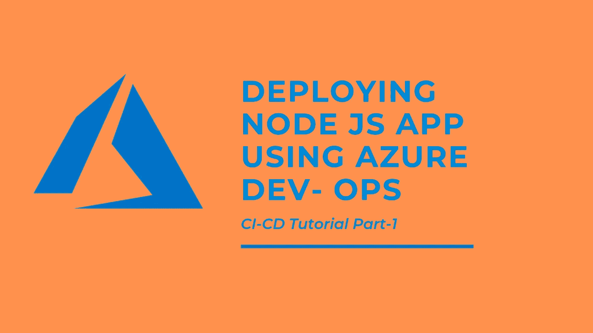
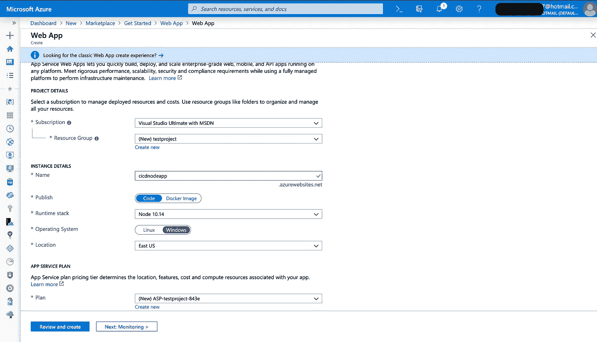
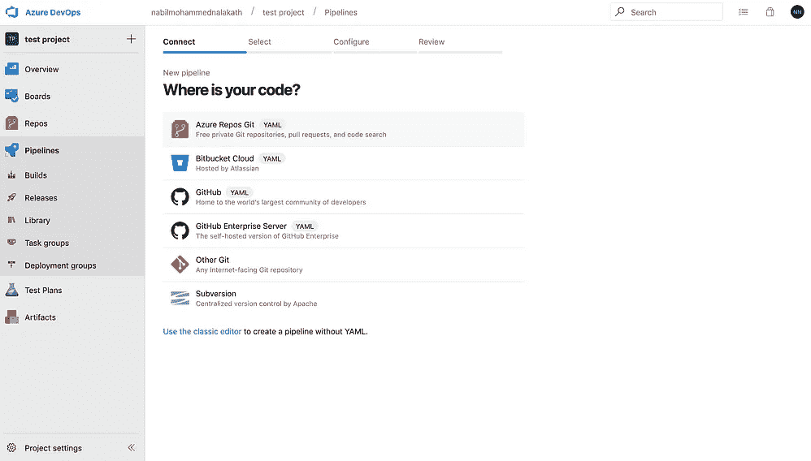
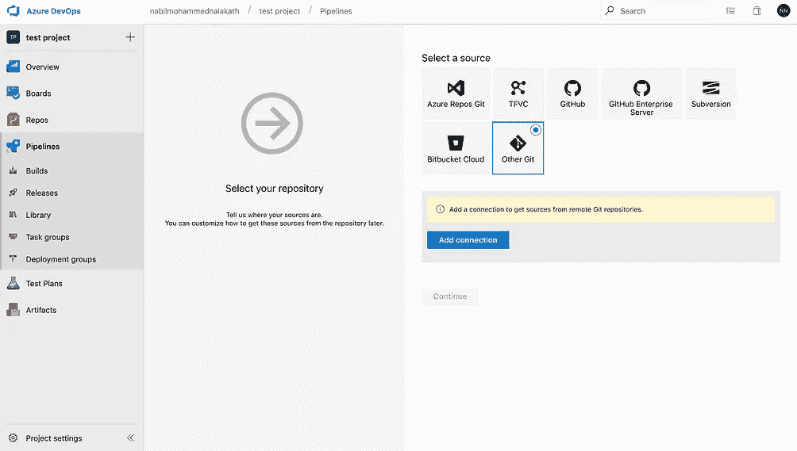
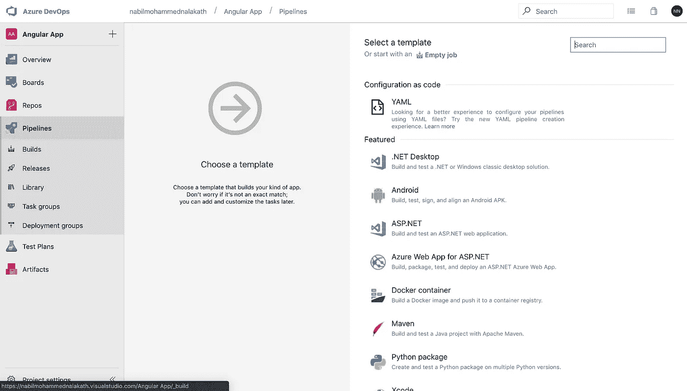
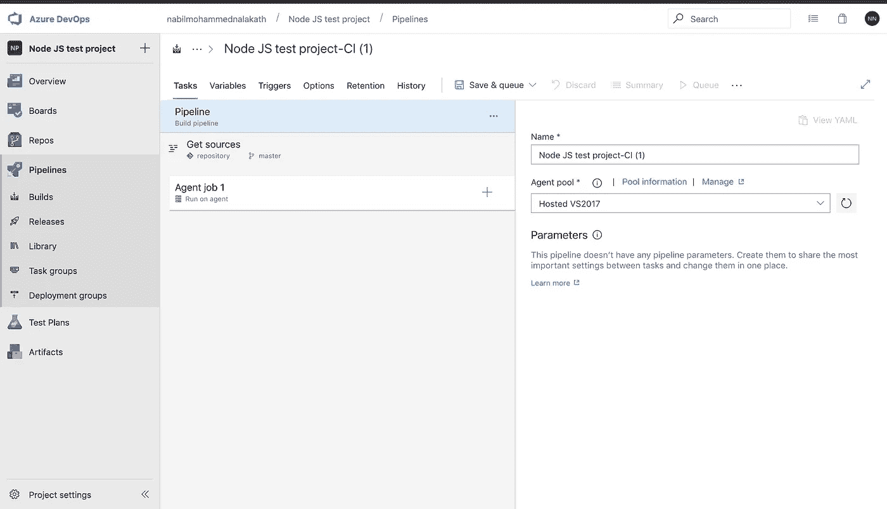
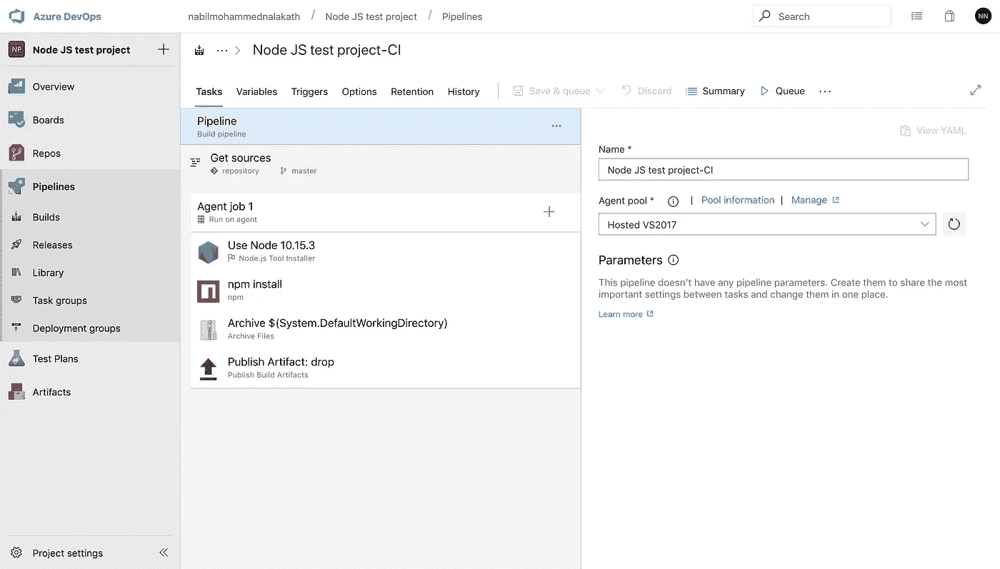
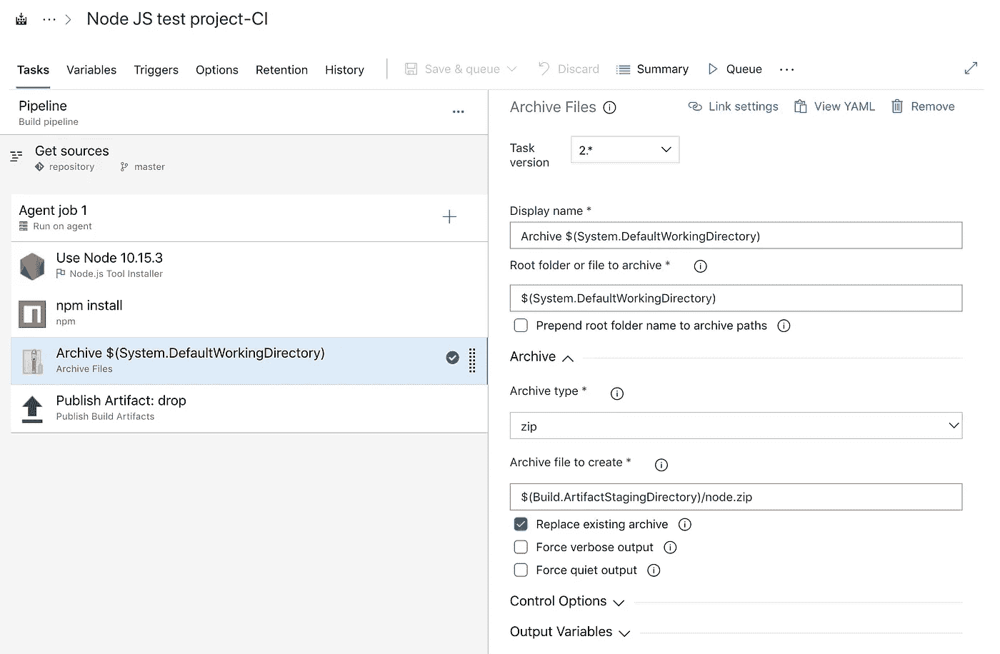
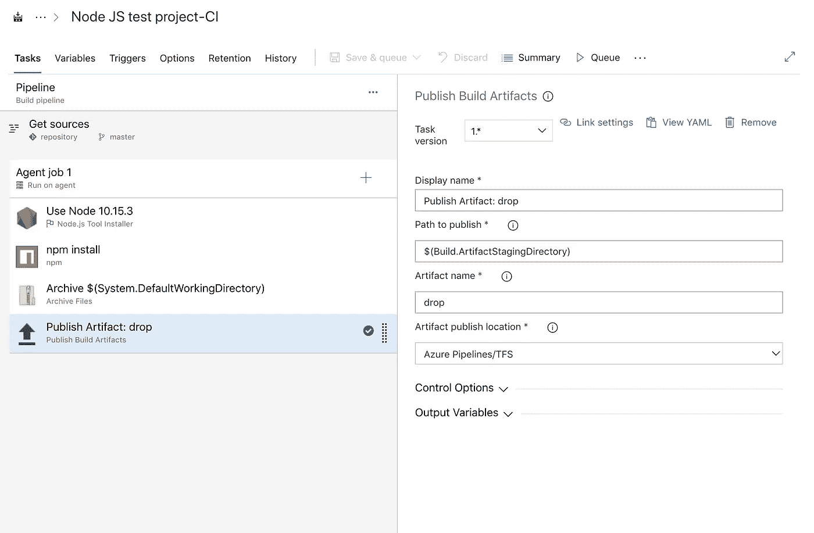
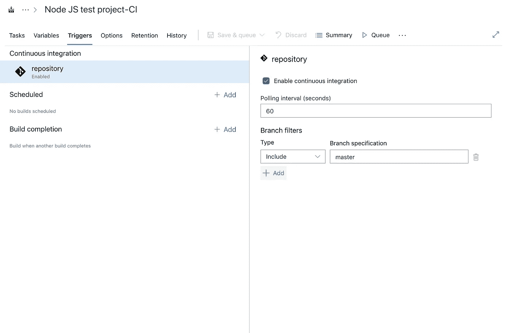

# 使用 Azure 开发运营将节点 JS 应用程序部署到 Azure 应用程序服务(第 1 部分)

> 原文：<https://javascript.plainenglish.io/deploying-node-js-app-using-azure-devops-part1-74cb13a6bd02?source=collection_archive---------0----------------------->

## 在 Azure DevOps 门户中创建 azure web 应用程序并为 Node JS 应用程序配置构建管道。

CI-CD for Node JS App using Azure Dev-Ops

在本由两部分组成的教程中，我将讨论如何使用 Azure dev-ops CI-CD 以非常简单的术语将 *Node JS 应用程序部署到 Azure web 应用程序中，以便即使是没有多少 DevOps 经验的开发人员也可以在几分钟内部署代码。*

> *此页上的说明假定您熟悉 Azure 门户和 azure devops 仪表板。如果您不知道如何在 Azure Portal 或 Azure DevOps 中添加项目，请在此处* ***查看* [**的教程。**](https://docs.microsoft.com/en-us/azure/app-service/environment/app-service-web-how-to-create-a-web-app-in-an-ase)**

## 第一步。创建 Azure Web 应用程序服务。

第一步是使用以下配置在 Azure 门户上创建 Azure web 应用程序服务。

Creating a new Web App Resource in the Azure portal with the above configurations.

部署 web 应用程序后，请登录到 Azure 开发运营门户。从仪表板添加新项目，然后转到“管道”。现在，让我们开始添加我们的管道任务，从 git 中提取节点 js 项目，并构建和部署它。

## 第 2 步:创建构建管道

单击生成管道以添加新管道。现在为 Node JS 应用程序连接 git 存储库。Github 有一个内置的集成，一旦你选择了它，它就会出现在一个新的标签上，这要感谢微软的 75 亿美元的交易，但是如果你的代码是在像 Gitlab 这样的外部或私有回购上，选择 ***其他 Git。*** 点击【增加连接】，输入回购的 HTTP URL、用户名、令牌密钥或密码。

Connecting an external git repository to the pipeline.

一旦连接了 git 存储库，下一步就是将任务分配给构建作业。Azure 为构建几乎所有类型的应用程序提供了一组模板。但在这里我们将选择一个空的工作来了解任务。

Select the start with an Empty job.

接下来，在“代理池”中，您可以选择是否要在 Windows 或 Linux 计算机上运行生成任务。在这里，我为 windows 机器选择了 VS1017。

Agent Pool for build tasks

现在是这个过程中最重要的部分。按一下「代理程式工作」标题旁边的加号按钮，将下列工作新增至代理程式，并按指定编辑栏位。

Tasks under build agent.

*   **使用节点 JS**
    输入要使用的节点 JS 版本。
    使用节点 10.15.3
*   **Npm 安装**
    指定`npm install`命令安装节点模块。
*   **存档** *(参考截图 2.6)*
    这个任务会将应用程序文件夹压缩。添加此任务并编辑以下字段:-
    根文件夹- `$(System.DefaultWorkingDirectory)`
    要创建的归档文件- `$(Build.ArtifactStagingDirectory)/node.zip` *注意-确保选中替换现有归档复选框*

Screenshot 2.6

*   **发布神器** *(截图 2.7)* 该任务会将压缩后的项目文件夹推送到 Azure Pipelines /TFS。
    发布路径— `$(Build.ArtifactStagingDirectory)`

Screenshot 2.7

## 第四步:触发器

您可以在这里定义希望 azure dev-ops 检查 Gitlab(或任何外部 git)存储库变更的频率。这不是一个很好的实践，但不幸的是，这是唯一的方法，除非你知道如何通过 webhook 建立触发器(以后会发布一篇关于这个的文章)。

Polling Interval for Git

> 这都是在建设管道。我们将在第二部分 [**中经历完成发布管道的步骤，这里**](https://medium.com/@ispeakcode/deploying-node-js-app-using-azure-devops-part2-4567e4cf783b) **。**