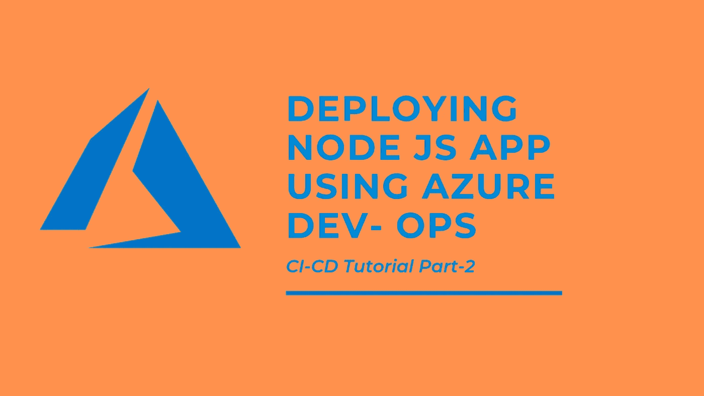
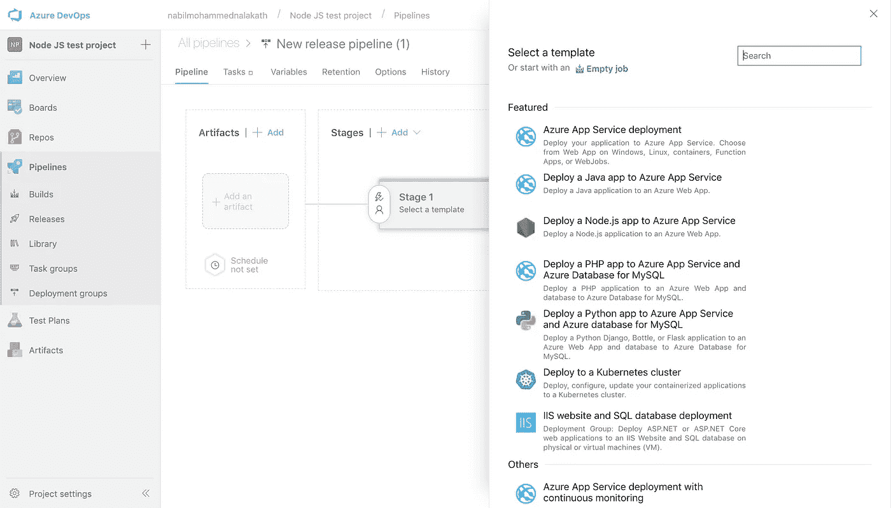
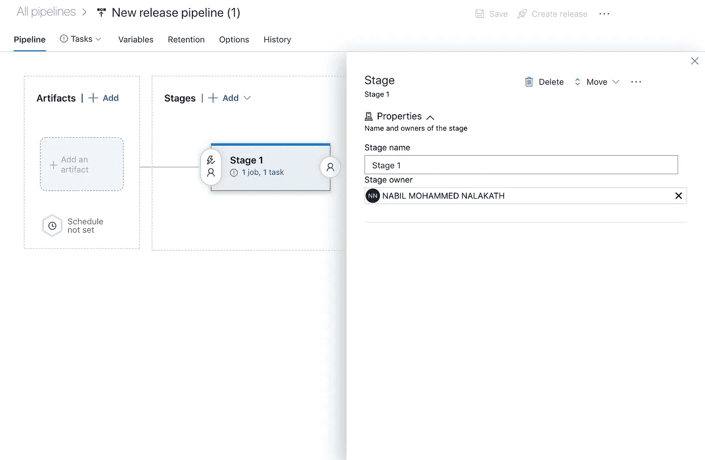
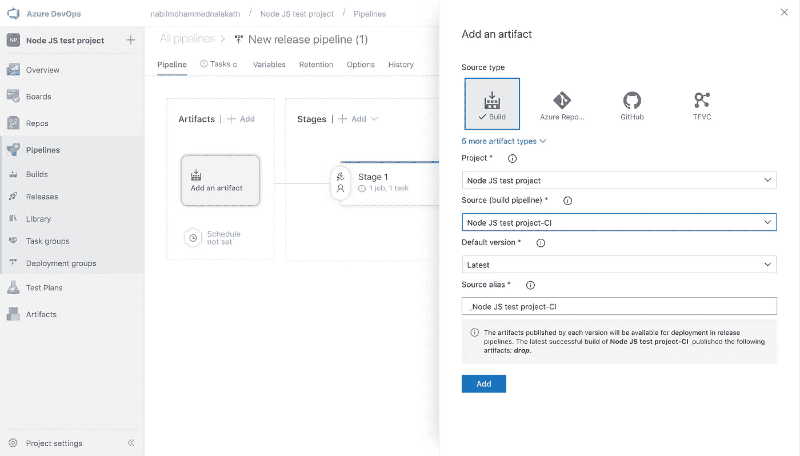
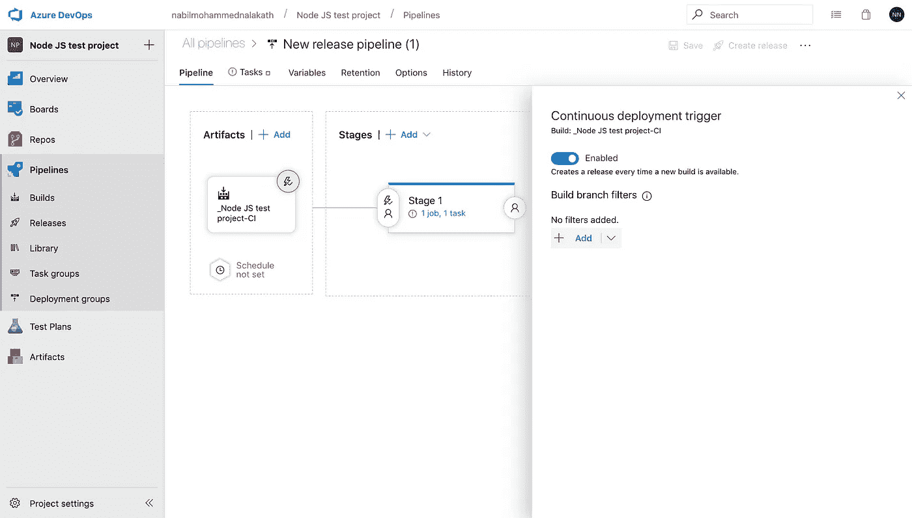
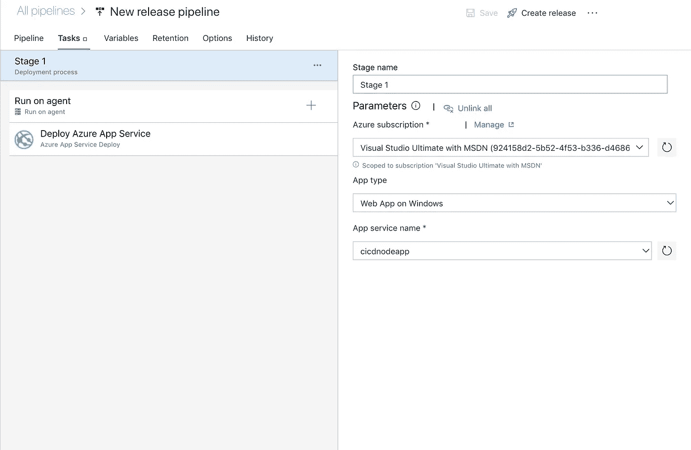
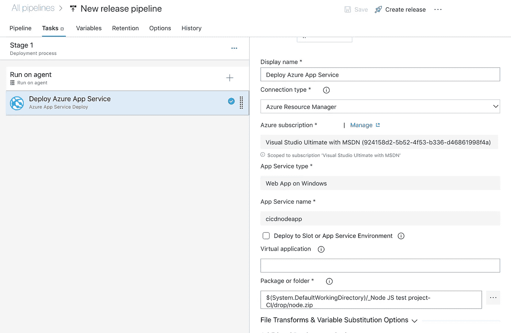

# 使用 Azure Dev-ops 将节点 JS 应用部署到 Azure 应用服务(第 2 部分)

> 原文：<https://javascript.plainenglish.io/deploying-node-js-app-using-azure-devops-part2-4567e4cf783b?source=collection_archive---------1----------------------->

## 在 azure DevOps 发布管道中为节点 JS 应用程序创建和配置发布管道

> 这是两部分教程的第二篇，如果你还没有阅读第一部分，你可以在这里找到**。**

*Azure Dev-Ops pipeline 中的**发布管道**帮助您的团队**以更快的速度和更低的风险向您的客户持续交付**软件。您可以集成自动化测试场景和交付模块。如果您有不同的构建，如 dev、staging 和 prod，并且您想要将它们发布到三个不同的 env，那么您可以为多个构建管道拥有多个 releaspipelines。在这个例子中，我们将不会经历测试场景，而仅仅是一个简单的发布管道，用于在构建完成后部署您的最新代码。*

## *步骤 5:创建发布管道*

*创建发布管道的第一步是打开“发布”选项卡，然后单击“新建管道”选项，这时系统会提示您发布类型的模板选择菜单。选择`Deploy a Node.js app to Azure App Service.`*

**

*Creating a release pipeline.*

**

*Adding a new stage.*

## *步骤 6:添加工件*

*点击 add an artifact 并选择默认的源类型(build)。将自动选择您当前的项目。为此管道选择源版本(管道)。在这里，您将看到您之前创建的所有构建管道。一旦您选择了构建，就添加工件。*

**

*Adding an artifact.*

## *步骤 5:启用 CD*

*添加神器后，点击卡片上的闪电图标，启动持续部署触发。这将在每次新版本完成时创建一个新版本。您还可以为构建分支设置过滤器，但是如果您不需要它，就让它保持原样。*

**

*Adding an artifact and set up continuous deployment*

## *步骤 7:发布任务*

*现在点击 tasks 标签来编辑你的发布任务。在此选择您的 azure 订阅(如果尚未选择)。现在选择您在 Azure portal(第 1 部分)中创建的相同应用类型，您的应用服务名称将自动填充到最后一个下拉列表中。确保您选择了要部署您的版本的同一应用程序服务。*

**

*Selecting the app service resource.*

## *步骤 8:发布设置*

*在此步骤中，您必须提及发布文件夹的路径，该文件夹必须被推送到您的应用服务、节点版本和节点命令，以便在服务器部署后启动服务器。
首先点击代理下的部署 azure app 服务任务，编辑 ***包或文件夹字段*** 。默认路径是`$(System.DefaultWorkingDirectory)/<*build pipiline name*>/drop/<*zip folder name*>.`*

**

*Release tasks*

> *当您打开“生成管道”部分时，生成管道名称将是您在左侧看到的管道名称，前面带有下划线。*
> 
> *zip 文件夹名称将与您在存档任务中输入的存档文件名相同。**参考第 1 部分**中的截图 2.6。*

*现在在 ***文件转换&变量替换选项*** 字段中你必须确保启动你的节点 JS 服务器的命令是正确的。由于我们的应用服务类型是 **windows，在本例中是****，**，我们将使用 IIS 命令`-Handler iisnode -NodeStartFile index.js -appType node.`*

> *这里 index.js 是您的 Node JS 应用程序的入口点，如果不同，请用您的入口点文件名替换它。*

**

*Editing server start commands and application settings,*

*最后一步是确保默认节点版本与您在创建 azure app 服务时指定的节点版本相匹配。这可以在 ***应用和配置设置*** 下查看。*

*就是这样，测试您的 CI-CD 流程，只需将一些内容推送到您的 git repo 中，然后等待一分钟，直到您的更改部署完毕。*