# 使用 CI/CD 和 AWS 部署 Node.js 应用程序

> 原文：<https://javascript.plainenglish.io/deploying-nodejs-application-using-ci-cd-process-in-aws-86a3c2c4a4ad?source=collection_archive---------1----------------------->

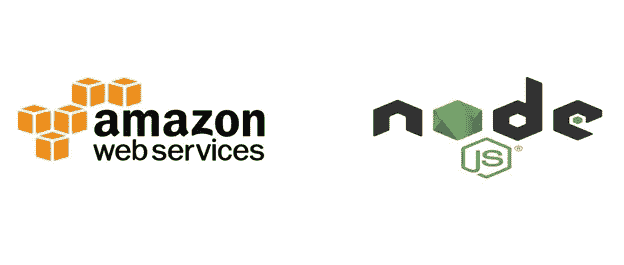

Photo from ITNEXT

我知道手动构建和部署您的应用程序有多困难。部署真的是开发者的噩梦。在本教程中，我将向您展示如何用一个命令部署 NodeJS 应用程序。所有的过程都将由 AWS CodePipeline 和 AWS Elastic Beanstalk 来处理。在深入应用程序之前，您需要具备以下条件:

AWS 帐户

NPM 安装

GitHub 帐户

首先，让我们创建一个简单的 NodeJS 应用程序，它将返回简单的 JSON 数据。打开 VS 代码终端，键入以下命令:

```
$ npm init
```

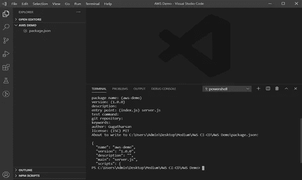

npm init

输入该命令后，它会要求填写上面的字段。成功填充这些值后，将在该文件夹中创建 package.json。然后我们需要为这个应用程序安装 express 和 cors 依赖项。要安装这些依赖项，请使用以下命令:

```
$ npm i express cors
```

Express 是 NodeJS 的后端 web 应用程序框架。这是 NodeJS 的标准服务器框架。当你提供一个公共 API，想要控制对某些资源的访问以及人们如何使用它们时，CORS 真的很有用。此外，如果你想在不同的网页上使用自己的 API 或文件，你可以简单地配置 CORS 允许，同时仍然阻止其他人。

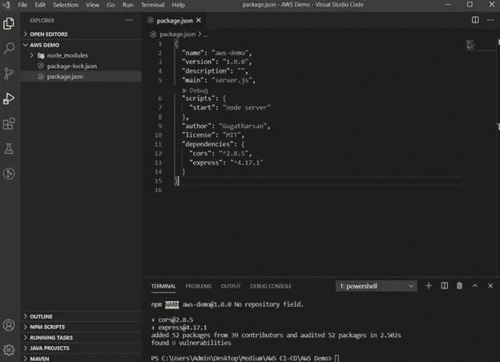

package.json

安装完这些包后，您可以在 package.json 中检查它们是否安装正确。在“脚本”中添加“start”:“节点服务器”来初始化节点服务器。然后在这个文件夹中创建一个名为 server.js 的文件来编写服务器配置。在 server.js 中添加以下代码段

在上面的代码段中，我已经导入了 express framework 和 cors。在这里，我将“API Running”JSON 消息发送到基本 URL，即 http://localhost:5000 。在代码下面，segment 定义了端口，app.listen 将使用该端口初始化服务器。现在，使用以下命令启动服务器:

```
$ npm start server
```

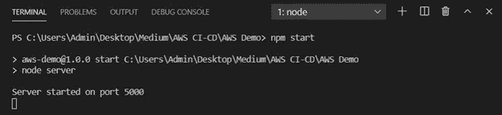

server running

现在，该应用程序将在端口 5000 上运行，如果您访问该 URL，您可以看到 JSON 消息。目前，一切都在本地运行，因为只有你可以访问这个网址。如果您希望每个人都能访问这个 URL，您需要部署这个应用程序。

要部署这个应用程序，您需要将代码推送到 GitHub 存储库。在将代码推送到存储库之前，不要忘记使用“.”忽略 node_modules。gitignore”。

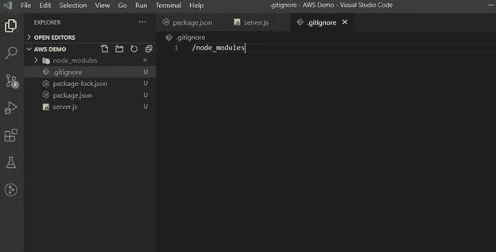

.gitignore file

是时候将代码推送到您的存储库了。在 GitHub 中创建一个空的存储库。

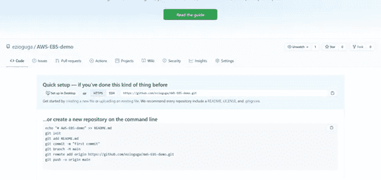

Sample GitHub Repo

然后在 VS Code terminal 中使用以下命令，将您的代码部署到您已经创建的存储库中。

```
$ git init -> to initialize your git repository$ git add . -> adds a change in the working directory to the staging area$ git commit –m “your message” -> used to save your changes to the local repository$ git branch –m main -> rename local branch$ git remote add origin "Your_Repo_URL"-> to add remote repository$ git push -u origin main -> Push changes to remote repository.
```

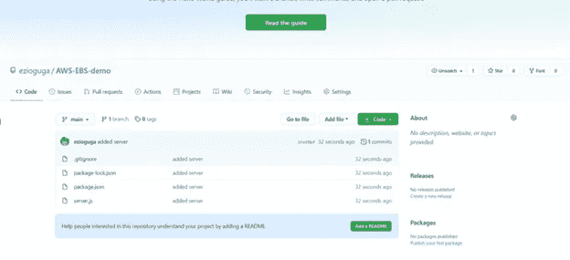

after pushing your code

现在你可以检查你的回购内，一切都在那里。成功地将代码推送到 GitHub 之后，就该配置 AWS Elastic Beanstalk 来创建节点环境以部署应用程序了。通过 AWS 管理控制台转到 EBS 服务。

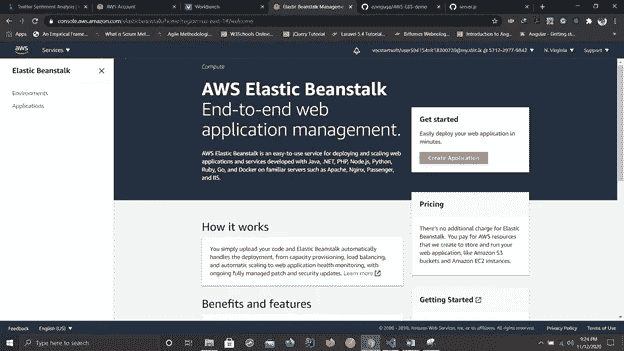

AWS Elastic Beanstalk

单击创建应用程序。

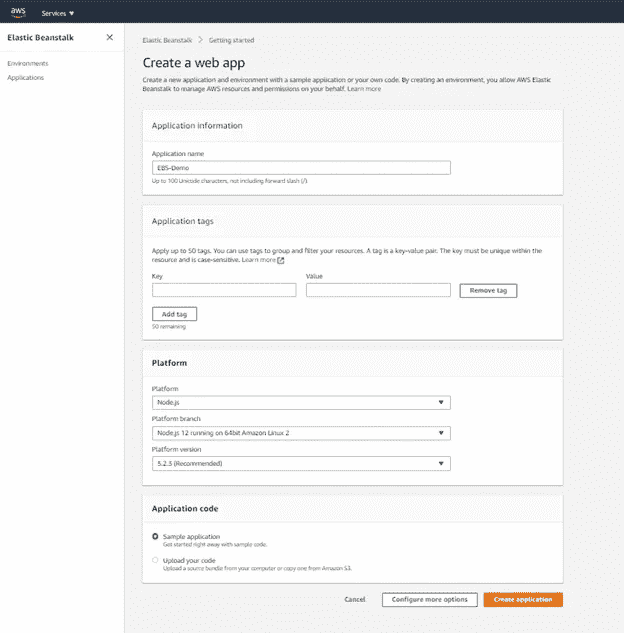

EBS Environment creation

首先，给你的应用程序一个名字。因为我们正在部署 NodeJS 应用程序，所以将平台设置为 Node.js，并根据您的节点应用程序版本更改其他设置。在这里，我将所有内容都保留为默认值，并用 AWS 示例代码创建了一个应用程序。创建环境需要一些时间，在此之前，让我们转到 CodePipeline service 为该应用程序创建一个管道。

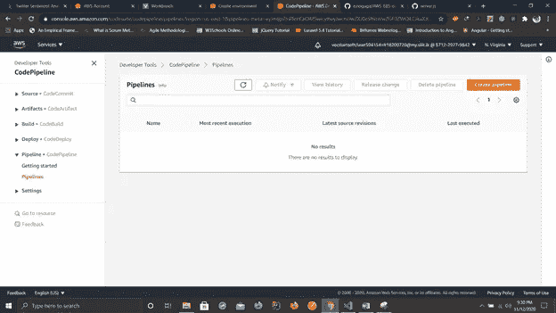

CodePipeline

单击创建管道以创建新管道。

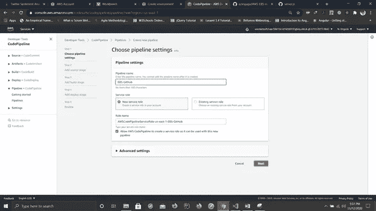

pipeline settings

为您的管道命名，然后单击 next。

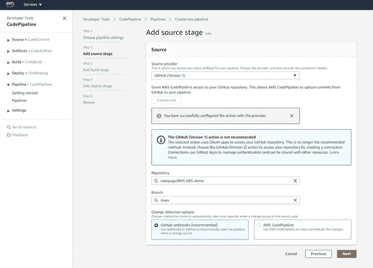

Add source stage

从 source provider 中选择 GitHub，并将其连接到这个控制台。然后选择您想要部署的存储库及其分支。配置完成后，单击“下一步”按钮。然后它会要求添加构建阶段。由于我们不使用任何构建，我们可以通过单击 skip build stage 跳过这一步。

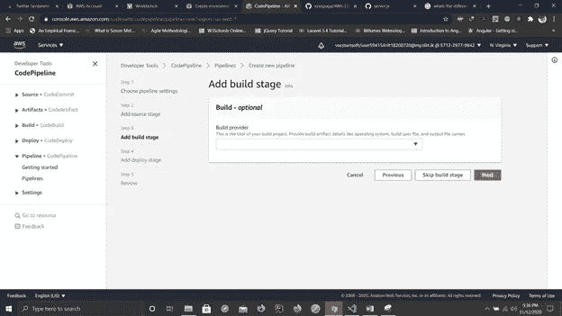

Add build stage

现在您需要添加您将在哪里部署这些代码。在此之前，您需要确认您的 EBS 环境已经准备好部署您的应用程序。

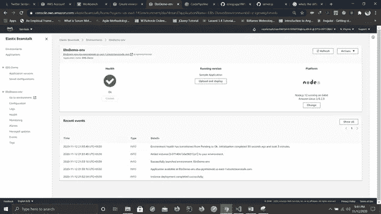

Your EBS Environment

如果它成功地创建了您的环境，您可以在绿色勾号中看到健康状况。如果您单击右上角的 URL，它将重定向到 AWSsample nodejs 应用程序。现在转到代码管道控制台部署应用程序。

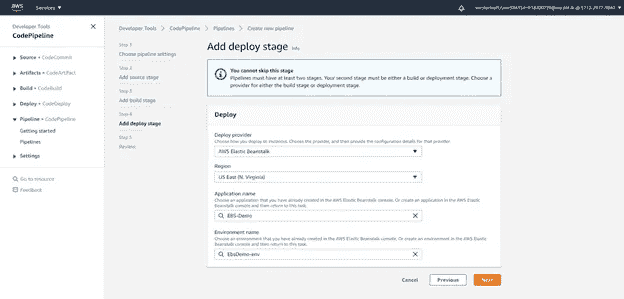

Add deploy stage

**注意——记住您在哪个地区创建应用程序。**

填写完这些字段后，选择“下一步”按钮。

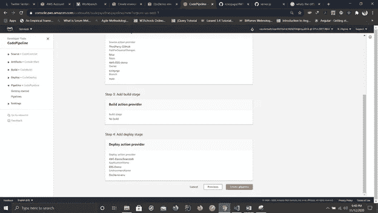

Review Page

现在，它将重定向到审查页面，在这里您可以看到您的所有配置。现在点击创建管道按钮。将您的应用程序部署到 EBS 中需要一些时间。

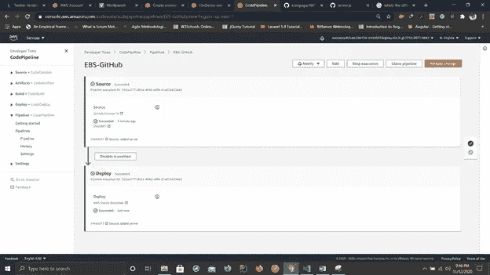

Your CodePipeline

现在，您的应用程序已经成功部署到您的 EBS 中。

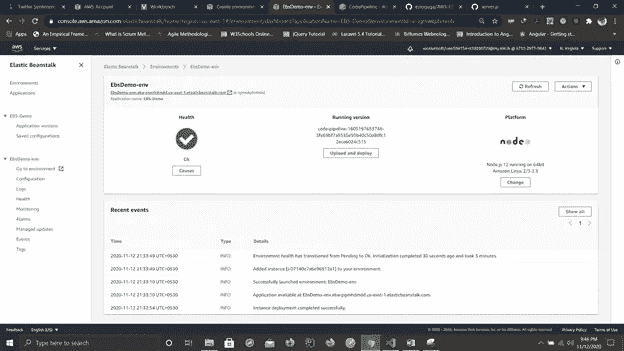

Your EBS Environment with Your Application

你可以点击上面的链接或者使用 postman 来测试这个应用程序。

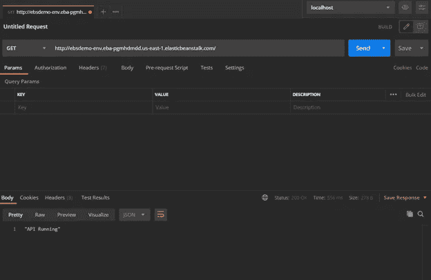

Postman Test

## 结论

看看我们如何轻松地在 AWS 中部署我们的应用程序。现在，您不需要担心应用程序的部署。每当您对代码进行更改并将其推送到您的存储库时，这个管道会自动检测到更改并再次部署您的应用程序。我希望大家喜欢这篇文章。希望能再看到大家有另一个好话题。

谢谢你。

*我在这个演示中使用的代码库:*

[](https://github.com/ezioguga/AWS-EBS-demo) [## ezioguga/AWS-EBS-demo

### 此时您不能执行该操作。您已使用另一个标签页或窗口登录。您已在另一个选项卡中注销，或者…

github.com](https://github.com/ezioguga/AWS-EBS-demo)