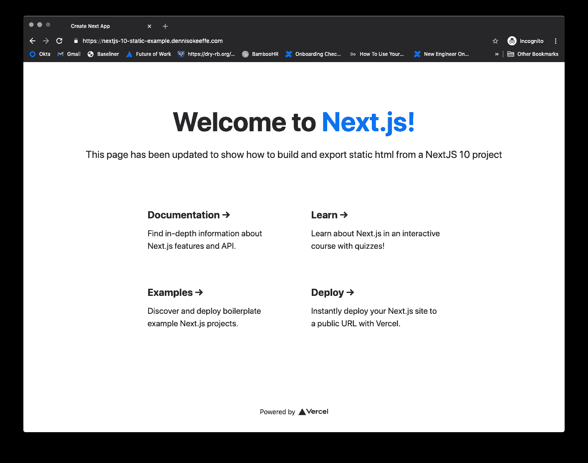

# 使用类型脚本 AWS CDK 将静态网站部署到 AWS S3 + CloudFront + Route53

> 原文：<https://javascript.plainenglish.io/deploying-static-websites-to-aws-s3-cloudfront-route53-using-the-typescript-aws-cdk-8ae66774d1b?source=collection_archive---------14----------------------->

在今天的帖子中，我们将一步一步地将一个静态网站部署到一个 S3 桶，该桶将 CloudFront 设置为全球 CDN。

这篇文章是用 CDK AWS 打字稿写的。

> 这个例子被用作一个 NextJS 10 网站的静态导出的部署。在这里可以找到关于如何做的博文[。也就是说，这篇文章旨在推动任何 HTML 到 S3 使用静态网站。我只是使用 NextJS 内容来演示最终产品和完成它所需的步骤变化。](https://blog.dennisokeeffe.com/blog/2020-11-04-exporting-static-nextjs-10-websites/)

## 入门指南

我们需要建立一个新的 npm 项目并安装先决条件。我们还将创建一个`stacks`目录来存放我们的 S3 堆栈，并对其进行更新以进行一些定制。

## 更新 cdk.json

添加下面的这个`cdk.json`文件:

## 设置上下文

添加下面这个`cdk.json`文件:

获取帐户 ID 的指南可在 [AWS 网站](https://docs.aws.amazon.com/IAM/latest/UserGuide/console_account-alias.html)上找到，但是如果您熟悉 AWS CLI，那么您可以使用以下内容。

确保将`account`设置为返回数字的字符串。

有关上下文的更多信息，请参见 [AWS 文档](https://docs.aws.amazon.com/cdk/latest/guide/context.html)。

## 更新 TypeScript 配置文件

在`tsconfig.json`中，添加以下内容:

这是 CDK 将类型脚本配置编译为 JavaScript 的基本类型脚本配置。

## 处理静态站点堆栈

打开`stacks/s3-static-site-with-cloudfront/index.ts`并添加以下内容:

以上内容是从 [AWS CDK 示例](https://github.com/aws-samples/aws-cdk-examples/blob/master/typescript/static-site/static-site.ts)调整而来的，目的是将内容转换为以堆栈形式运行，而不是以构造形式运行。

为了解释这里发生的事情:

1.  我们有一个接口 **StaticSiteProps** ，它允许 up 传递一个参数对象`domainName`和`siteSubDomain`，这将允许我们演示一个例子。如果我将【dennisokeeffe.com】作为**推送`domainName`作为**并将`siteSubDomain`作为**S3-CDK-deployment-example**推送，那么你会期望该网站在**s3-cdk-deployment-example.dennisokeeffe.com**可用。这在类中被指定为变量`siteDomain`。
2.  创建 ARN 证书`certificateArn`是为了让我们能够使用`https`。
3.  一个新的 CloudFront 发行版被创建并分配给`distribution`。`certificateArn`用于配置 ACM 证书引用，此处使用`siteDomain`作为名称。
4.  为我们的`siteDomain`值创建了一个新的别名记录，并将目标设置为新的 CloudFront 发行版。
5.  最后，我们从一个源`./site-contents`部署资产，该源期望您将代码源放在相对于 stacks 文件夹的那个文件夹中。在我们的例子中，这将**不是我们想要的**，并且该值将被改变。部署还会使 CDN 上的对象失效。这可能是也可能不是您想要的，取决于您的缓存破坏机制是如何工作的。如果您已经为您的`index.html`文件准备了散列资产和`no-cache`或`max-age=0`(您应该这样做)，那么您可以关闭它。失效要花钱。

在我的例子中，我将调整上面的代码来导入`path`，并将`s3deploy.Source.asset('./site-contents')`的值改为`s3deploy.Source.asset(path.resolve(__dirname, '../../../next-10-static-export/out'))`(它指向我的带有静态 HTML 构建资产的输出目录)。这和我对应的博文[直接导出 NextJS 10 静态网站](https://blog.dennisokeeffe.com/blog/2020-11-04-exporting-static-nextjs-10-websites/)有关。请注意，您需要在顶部添加`import path = require('path')`并安装`@types/node`。

## 使用 StaticSite 堆栈

回到`index.ts`中的根目录，让我们导入堆栈并投入使用。

在上面的例子中，我们简单地导入堆栈，用`cdk` API 创建一个新的应用程序，然后将该应用程序传递给`StaticSite`的新实例。

如果您还记得，`StaticSite`的构造函数读为`constructor(parent: Construct, name: string, props: StaticSiteProps)`，因此它需要三个参数。

1.  CDK 应用程序。
2.  堆栈的“名称”或标识符。
3.  坚持我们的`StaticSiteProps`的道具，所以在我们的例子中，一个对象通过了`domainName`和`siteSubDomain`。

## 更新 package.json

在部署之前，让我们为一些脚本调整`package.json`来帮助部署。

现在我们准备好了。

## 部署我们的站点

> 注意:您**必须**准备好另一个项目中的静态文件夹，这样才能工作。如果你想了解我在这里做的事情，请参考我在 NextJS 10 的静态站点导出上的帖子。

要部署我们的站点，我们需要将类型脚本转换成 JavaScript，然后运行 CDK synth 并部署命令。

> 注意:您需要确保您的 AWS 凭证被配置为能够工作。我个人用的是 [aws-vault](https://github.com/99designs/aws-vault) 。

在部署开始之前，您需要接受生成的新资源模板。

在我的例子中，我使用了我在[导出静态 NextJS 10 网站](https://blog.dennisokeeffe.com/blog/2020-11-04-exporting-static-nextjs-10-websites/)的文章中给出的 NextJS 静态站点示例

你可以在 https://nextjs-10-static-example.dennisokeeffe.com 看到最终的现场部署。

## 资源

1.  [AWS CDK 静态站点示例— GitHub](https://github.com/aws-samples/aws-cdk-examples/blob/master/typescript/static-site/static-site.ts)
2.  [导出静态 NextJS 10 网站](https://blog.dennisokeeffe.com/blog/2020-11-04-exporting-static-nextjs-10-websites/)
3.  [AWS Vault — GitHub](https://github.com/99designs/aws-vault)
4.  [AWS 运行时上下文](https://docs.aws.amazon.com/cdk/latest/guide/context.html)
5.  [获取您的帐户 ID](https://docs.aws.amazon.com/IAM/latest/UserGuide/console_account-alias.html)
6.  [决赛，现场网站部署](https://nextjs-10-static-example.dennisokeeffe.com)
7.  [最终代码](https://github.com/okeeffed/nextjs-10-static-deployment-with-typescript-aws-cdk)

*图片来源:* [*伊格纳特·库山列夫*](https://unsplash.com/@ignatkushanrev)

*原贴于我的* [*博客*](https://blog.dennisokeeffe.com/blog/2020-11-04-deploying-websites-to-aws-s3-with-the-cdk/) *。*