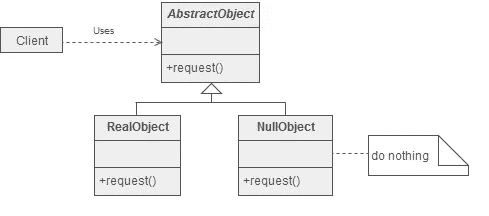
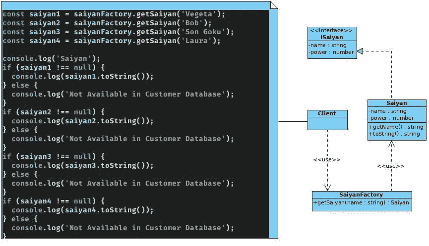
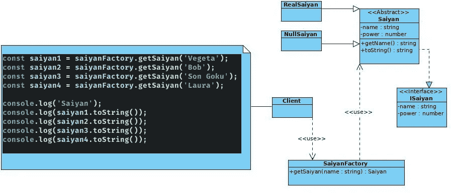

# 设计模式:空对象

> 原文：<https://javascript.plainenglish.io/design-patterns-null-object-768041613026?source=collection_archive---------10----------------------->

## 使用这种模式避免条件复杂性


Photo by [Thor Alvis](https://unsplash.com/@terminath0r?utm_source=unsplash&utm_medium=referral&utm_content=creditCopyText) on [Unsplash](https://unsplash.com/s/photos/object?utm_source=unsplash&utm_medium=referral&utm_content=creditCopyText)

有 23 个经典的设计模式，在原著`Design Patterns: Elements of Reusable Object-Oriented Software`中有描述。这些模式为软件开发中经常重复出现的特定问题提供解决方案。

在本文中，我将描述什么是**空对象模式**；以及如何和何时应用它。这个模式**没有包含在经典模式书中的**中，但是它首先发表在程序 的 ***模式语言中，并且它被广泛使用以避免复杂性。***

# 空对象模式:基本思想

*在面向对象编程中，* ***空对象*** *是一个没有引用值或者定义了中性(“空”)行为的对象。空对象设计模式描述了这些对象的用途和它们的行为(或缺乏行为)。—维基百科*

这种模式的主要特点是可以避免代码的复杂性。在大多数语言中，如 Java、C#或 JavaScript，引用可能为空。根据我们的业务逻辑，在调用任何方法之前，可能需要检查代码以确保它们不为空，因为方法通常不能在空引用上调用。

总而言之，空对象模式允许我们通过使用对象而不是原始类型来避免条件复杂性。这个模式的 UML 图如下所示:



`AbstractObject`类是一个抽象类，它定义了必须在`RealObject`和“空”或“默认”对象(`NullObject`)中实现的不同操作。`RealObject`将对每个真实对象进行操作，而`NullObject`什么也不做，或者可能你想对这个对象进行默认操作。

# 空对象模式:何时使用

1.  您需要动态地、透明地向单个对象添加职责，也就是说，不影响其他对象。
2.  你需要加上随时可以收回的责任。

# 空对象模式:优势

空对象模式有几个优点，总结如下:

*   它定义了由真实对象和空对象组成的类层次结构。
*   当预期对象不做任何事情时，可以使用空对象来代替真实对象。
*   客户端代码更加简单，因为避免了条件复杂性。客户统一使用真实的和无效的合作者。

# 空对象模式—示例 1:赛亚人的世界(问题)

我现在将向您展示如何使用 JavaScript/TypeScript 实现这种模式。在应用该模式之前，意识到您试图解决的问题是很有趣的。接下来，我们将给出例子的上下文。假设我们有一个名为 Saiyan 的类，它将允许我们对我们亲爱的 **Saiyan** 的属性和方法进行建模。这个类实现了一个 ISaiyan 接口，该接口清楚地确定了每个对象为了成为真正的 **Saiyan** 而必须满足的特征。名为`SaiyanFactory`的工厂用于创建**赛亚人**对象。这个类将我们从赛亚人的来源中抽象出来，可以从内存、数据库中的查询或制造新对象的复杂算法中生成。

作为开发人员，我们的问题出现在充当客户端并使用我们工厂的类中。在下面的客户端代码中，我们调用了`getSaiyan`方法来获取几个**赛亚人**，具体来说我们创建了*贝吉塔*、*鲍勃*、*小悟空*和*劳拉*。我明白，读者们知道，上一份名单中仅有的赛亚人是*贝吉塔*和*儿子悟空*；因此*鲍勃*和*劳拉*都不能被制造成赛亚人类型的物品。

我们总是必须检查工厂返回的对象不是空对象，因为我们不确定工厂是否总是返回 Saiyan 类型的对象。

最终的代码有不必要的条件复杂性，因为在找到的每个对象上都有重复的代码片段`if-else`。我知道这个代码片段可以用一个函数抽象出来，但是它仍然在代码中。

因此，我们得到了下面的 UML 图。



在下一节中，我们将通过使用空对象模式来解决这个问题。

关联的`ISayian`和`Saiyan`代码如下:

```
export **interface** **ISaiyan** {
  name: **string**;
  power: number;
}
/****/import { ISaiyan } **from** './saiyan.interface';export **class** **Saiyan** {
  **protected** name: **string**;
  **protected** power: number;constructor({ name, power }: ISaiyan) {
    **this**.name = name;
    **this**.power = power;
  }
  getName(): **string** {
    **return** **this**.name;
  }**public** **toString**(): **string** {
    **return** `${**this**.name} - ${**this**.power}`;
  }
}
```

与作为数据库查找模拟的工厂相关联的代码如下:

```
import { Saiyan } **from** './saiyan.class';export **class** **SaiyanFactory** {
  **public** saiyans = [
    { name: 'Son Goku', power: 1000 },
    { name: 'Son Gohan', power: 800 },
    { name: 'Vegeta', power: 950 },
  ];**public** **getSaiyan**(name: **string**): Saiyan | null {
    // Mock Database find
    **for** (**const** saiyan of **this**.saiyans) {
      **if** (saiyan.name === name) {
        **return** **new** Saiyan(saiyan);
      }
    }
    **return** null;
  }
}
```

最后，与客户端相关联的代码，其中由于来自工厂的空对象，条件复杂度是指数级的。

```
**import** { SaiyanFactory } **from** './saiyan-factory.class';**const** saiyanFactory = **new** SaiyanFactory();
**const** saiyan1 = saiyanFactory.getSaiyan('Vegeta');
**const** saiyan2 = saiyanFactory.getSaiyan('Bob');
**const** saiyan3 = saiyanFactory.getSaiyan('Son Goku');
**const** saiyan4 = saiyanFactory.getSaiyan('Laura');**console**.log('Saiyan');
**if** (saiyan1 !== null) {
  **console**.log(saiyan1.toString());
} **else** {
  **console**.log('Not Available in Customer Database');
}
**if** (saiyan2 !== null) {
  **console**.log(saiyan2.toString());
} **else** {
  **console**.log('Not Available in Customer Database');
}
**if** (saiyan3 !== null) {
  **console**.log(saiyan3.toString());
} **else** {
  **console**.log('Not Available in Customer Database');
}
**if** (saiyan4 !== null) {
  **console**.log(saiyan4.toString());
} **else** {
  **console**.log('Not Available in Customer Database');
}
```

# 空对象模式—示例 1:赛亚人的世界(解决方案)

解决方案是使用 null-ojbect 模式。使用这种模式的新 UML 图如下所示:



让我们从应用模式后我们感兴趣的结果开始。如果您遵守客户端代码，我们的赛亚人的四个请求所来自的工厂被保留。它们存储在变量中，因此这有助于我们避免在对每个 Saiyan 执行之前验证对象是否为空。在我们的例子中，我们使用`toString`方法只是为了说明一个返回字符串的方法将要被排列。

因此，我们消除了客户端的复杂性，这要归功于我们内部类结构的一个小变化。该工厂不是只使用一个生成新赛亚人的赛亚人类，而是从这个赛亚人类创建一个简单的继承(刚性组合)，产生两个新类 **RealSaiyan** 和 **NullSaiyan** ，将赛亚人类转换成一个抽象类。

Saiyan 类现在定义了所有派生的 Saiyan 类必须实现的方法，在知识库中找到的 Saiyan 的逻辑将在 **RealSaiyan** 类中实现，而没有找到的对象的逻辑(空)或者即使我们希望默认行为在 **NullSaiyan** 类中实现。

这样，总会有一种行为，即使他们没有把客户从不适用的复杂性中解放出来。

我们现在来看看实现这种模式所生成的代码:

```
**import** { SaiyanFactory } **from** './saiyan-factory.class';**const** saiyanFactory = **new** SaiyanFactory();
**const** saiyan1 = saiyanFactory.getSaiyan('Vegeta');
**const** saiyan2 = saiyanFactory.getSaiyan('Bob');
**const** saiyan3 = saiyanFactory.getSaiyan('Son Goku');
**const** saiyan4 = saiyanFactory.getSaiyan('Laura');**console**.log('Saiyan');
**console**.log(saiyan1.toString());
**console**.log(saiyan2.toString());
**console**.log(saiyan3.toString());
**console**.log(saiyan4.toString());
```

与工厂相关的代码返回两种对象，如下所示:

```
**import** { AbstractSaiyan } **from** './saiyan.class';
**import** { NullSaiyan } **from** './null-saiyan.class';
**import** { RealSaiyan } **from** './real-saiyan.class';**export** **class** **SaiyanFactory** {
  public saiyans = [
    { name: 'Son Goku', power: 1000 },
    { name: 'Son Gohan', power: 800 },
    { name: 'Vegeta', power: 950 },
  ];public getSaiyan(name: string): AbstractSaiyan {
    **for** (**const** saiyan **of** **this**.saiyans) {
      **if** (saiyan.name === name) {
        **return** **new** RealSaiyan(saiyan);
      }
    }
    **return** **new** NullSaiyan();
  }
}
```

与`AbstractSaiyan`相关的代码如下:

```
export **abstract** **class** **AbstractSaiyan** {
  **protected** name: **string**;
  **protected** power: number;
  **public** **abstract** **getName**(): **string**;
  **public** **abstract** **toString**(): **string**;
}
```

最后，与每个具体类相关的代码如下:

```
**import** { AbstractSaiyan } **from** './saiyan.class';
**import** { Saiyan } **from** './saiyan.interface';**export** **class** **RealSaiyan** **extends** **AbstractSaiyan** {
  **constructor**({ name, power }: Saiyan) {
    **super**();
    **this**.name = name;
    **this**.power = power;
  }getName(): string {
    **return** **this**.name;
  }
  toString(): string {
    **return** `${**this**.name} - ${**this**.power}`;
  }
}import { AbstractSaiyan } **from** './saiyan.class';export **class** **NullSaiyan** **extends** **AbstractSaiyan** {
  **public** **getName**(): **string** {
    **return** 'Not Available in Saiyan Database';
  }
  toString(): **string** {
    **return** 'Not Available in Saiyan Database';
  }
}
```

我创建了几个 npm 脚本，在应用了 null-ojbect 模式后，这些脚本运行这里显示的代码示例。

`npm run example1-problem`T12`npm run example1-solution-1`

# 结论

空对象模式可以避免项目中的条件复杂性。
这种模式允许您在没有对象的情况下配置默认行为，从而不必坚持检查对象是否为空。

这种模式使用简单的继承来解决出现的问题。然而，这种模式被归类为本博客所研究的另一种模式的特例: [**策略模式**](https://medium.com/better-programming/design-patterns-using-the-strategy-pattern-in-javascript-3c12af58fd8a) 。

因此，可以说这种模式使用刚性组合(继承)来解决一个问题，这个问题可以用组合来解决，但是会导致比它所解决的问题更复杂的问题。这是一个很好的例子，说明我们作为开发人员的每一个“工具”都必须在正确的时间使用，而在我们的行业中最重要的事情是了解所有的工具以及我们应该何时使用它们。

最重要的事情不是实现我所展示的模式，而是能够识别这个特定模式可以解决的问题，以及何时可以或不可以实现所述模式。这一点至关重要，因为实现会因您使用的编程语言而异。

## 更多阅读

*   设计模式:可重用的面向对象软件的元素
*   【Sourcemaking.com 号
*   [空对象模式——维基百科](https://en.wikipedia.org/wiki/Null_object_pattern)。
*   [https://www.geeksforgeeks.org/null-object-design-pattern/](https://www.geeksforgeeks.org/null-object-design-pattern/)