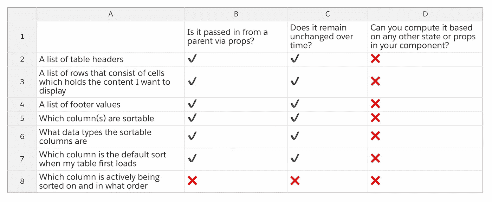

# 设计 React 组件:循序渐进的初学者指南

> 原文：<https://javascript.plainenglish.io/designing-a-react-component-a-step-by-step-beginner-guide-d6d732e367aa?source=collection_archive---------15----------------------->


我知道马上开始写代码很诱人。有时我对我要构建的组件有一个粗略的想法，我只是随波逐流。如果那是你的风格，那没什么不好。对我来说，当我这样做的时候，最终发生的事情是，我发现自己不得不或者想要多次重构我的代码

如果你刚刚开始学习 React，恭喜你！你会在网上找到很多资源，教你语法，基本概念，以及一般来说，如何让事情发生在屏幕上。我注意到的是，对设计似乎没有足够的重视，而设计是现实世界中极其重要的一步。在您开始编写一行代码之前，您需要首先概述您的设计。

你的组件的游戏计划是什么？你会有什么状态和道具？会如何消耗？这些都是很重要的问题，你不仅应该在编写代码之前在头脑中有一个明确的答案，更好的是，从与你一起工作的工程师那里获得反馈，这样你就可以在花太多时间做错误的事情之前修复有问题的设计。

我将以一个可排序的表格组件为例，向您介绍设计新组件的步骤。请注意，我从 React 官方文档中的章节[思考 React](https://reactjs.org/docs/thinking-in-react.html) 中获得了灵感。

# 步骤 1:命名你的组件，并阐明你的用户可以用它做什么

我想有一个名为 ***数据表*** 的表格组件，允许用户做以下事情:

*   查看表格数据
*   对于任何列，在降序和升序之间切换排序顺序

# 步骤 2:定义 React 组件层次结构

表格 HTML 看起来像这样:

```
<table>
    <thead>
        <tr>
            <th>Items</th>
            <th>Expenditure</th>
        </tr>
    </thead>
    <tbody>
        <tr>
            <th>Donuts</th>
            <td>3,000</td>
        </tr>
        <tr>
            <th>Stationery</th>
            <td>18,000</td>
        </tr>
    </tbody>
    <tfoot>
        <tr>
            <th>Totals</th>
            <td>21,000</td>
        </tr>
    </tfoot>
</table>
```

在我的例子中，这将转化为如下所示的 React 组件:

```
<DataTable>
     <TableHeader />
     <TableContent />
     <TableFooter />
</DataTable>
```

# 步骤 3:列出组件需要的所有数据

为了显示表格数据，我的组件需要:

*   表格标题列表
*   由包含我要显示的内容的单元格组成的行列表
*   页脚值列表

要启用排序，我的组件需要:

*   哪些列是可排序的
*   可排序的列是什么数据类型(例如，因为日期排序机制不同于字符串排序)
*   当我的表第一次加载时，哪一列是默认排序
*   正在对哪一列进行排序，排序顺序是什么(降序还是升序)

# 第四步:找出哪些数据应该陈述，哪些应该支持

我使用 React 官方文档中的以下三个问题来确定数据应该作为状态还是道具传入:

1.  是通过道具从父母那里传过来的吗？
2.  是否随时间保持不变？
3.  你能根据组件中的任何其他状态或属性来计算它吗？

如果你对以上任何一个问题的回答是肯定的，那么这段数据应该作为道具而不是状态传入。

对于我的可排序表格组件，我制作了一个网格，如下所示:



这是我正在寻找的答案。网格中只有最后一行应该是状态，而不是道具。我还想指出，一般来说，组件中的状态越少越好。无状态组件实际上是首选，因为它们简单，代码更容易理解。

# 第五步:确定国家应该生活在哪里。

这一步完全照搬了 React 官方文档中的【T2 思考】一章。如果你刚刚开始使用 React，我强烈推荐你阅读整个章节。它会帮助你理解设计哲学。这是它所说的关于确定国家应该生活在哪里:

> 识别基于该状态呈现某些内容的每个组件。
> 
> 找到一个公共所有者组件(层次结构中所有需要状态的组件之上的一个组件)。
> 
> 公共所有者或层次结构中更高的另一个组件应该拥有该状态。
> 
> 如果您找不到拥有状态有意义的组件，那么创建一个新的组件专门用于保存状态，并将其添加到公共所有者组件之上的层次结构中的某个位置。

我们从第 4 步中了解到，这两个数据应该是状态:

*   ***活动排序列* :** 当前正在对哪一列进行排序
*   ***正在排序* :** 排序顺序

让我们来完成这些步骤:

1.  识别基于该状态呈现某些内容的每个组件。

*   <tablecontent>根据排序列和顺序呈现内容</tablecontent>
*   <tableheader>在标题上呈现某种视觉效果(可能是一个图标),以指示哪个正在被排序以及排序的顺序</tableheader>

2.找到一个公共所有者组件(层次结构中所有需要状态的组件之上的一个组件)。

*   这是美国人将要生活的地方！

# 第六步:组装好所有东西！

最后一步！你差不多完成了。既然你已经回答了大问题，你需要做的就是把它记录在某个地方:

父组件:

*   <datatable></datatable>

子组件:

*   <tableheader></tableheader>
*   <tablecontent></tablecontent>
*   <tablefooter></tablefooter>

道具:

*   头球
*   数据
*   脚注
*   DefaultSortColumn
*   isSortableColumn
*   列类型

状态:(都存在于父组件中)

*   ***active sort 列***
*   ***是*** 的派生

恭喜你！现在，您已经有了组件的基本游戏计划。组件越复杂，设计过程需要的时间就越长。有时候看起来工作量很大，而你甚至还没有开始写代码。但是相信我，这个过程会让你在以后的道路上省去很多努力。快乐编码💻