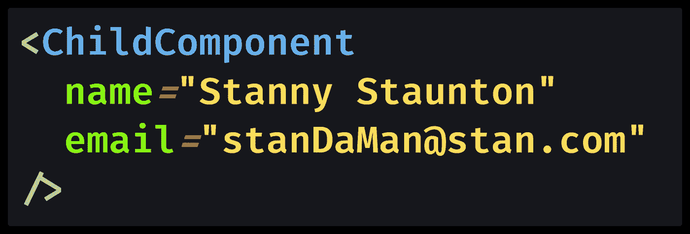
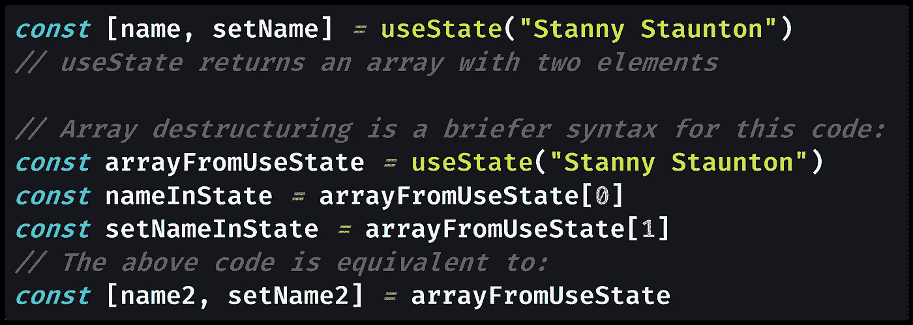
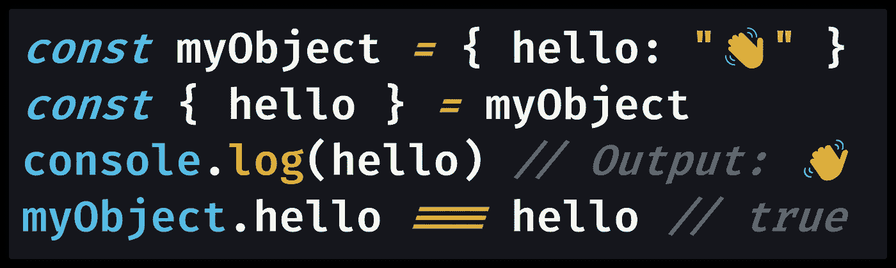
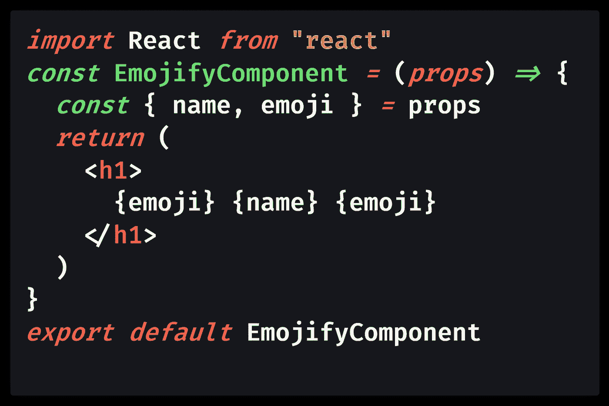
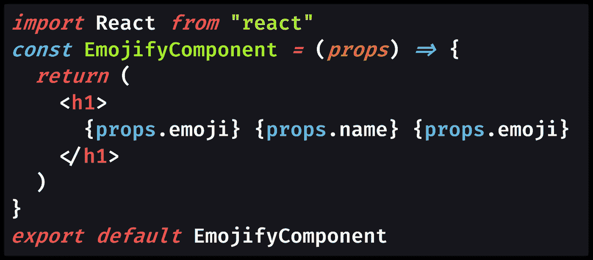
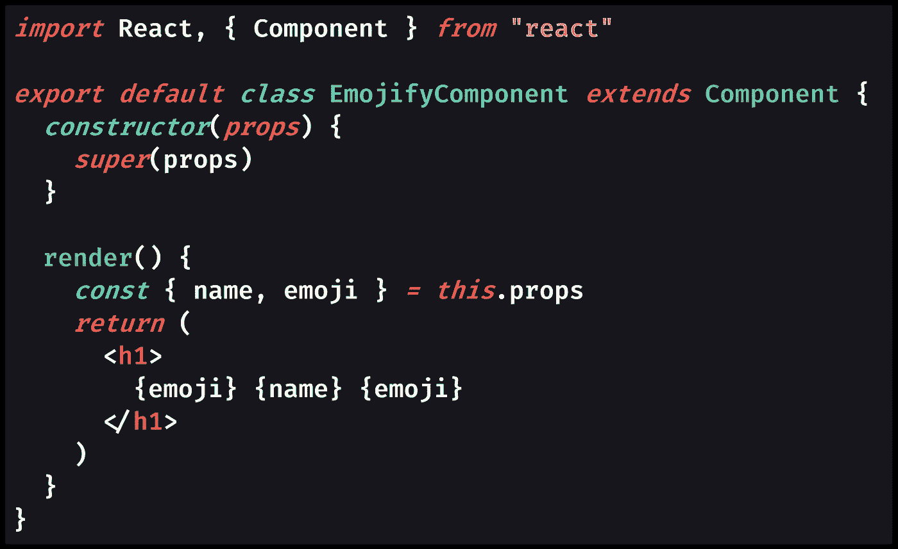
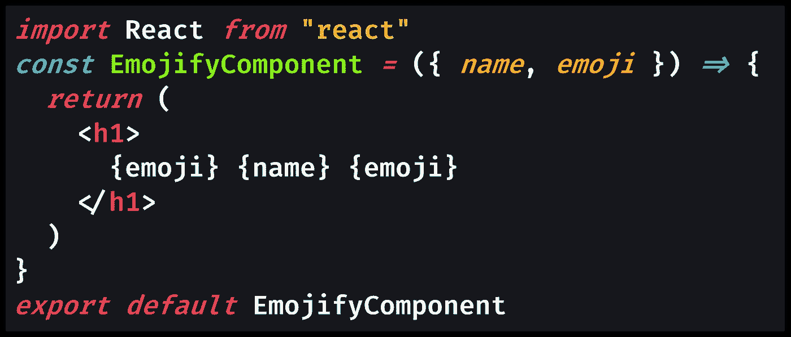

# 用 ES6 对象进行析构来获得更清晰的代码

> 原文：<https://javascript.plainenglish.io/destructure-react-props-with-es6-object-destructuring-for-cleaner-code-3984453e484d?source=collection_archive---------2----------------------->

## 当您在 React 中为一个组件编写渲染函数时，它接受一个包含属性(“props”)的`props`对象，您将使用该对象来配置该组件。道具使得组件可以重用。为了编写更干净的代码，您可以使用 ES6 对象析构将`props`对象析构为单独的变量。

Photo by [ibrahim sabuncuoğlu](https://unsplash.com/@deeprahim?utm_source=medium&utm_medium=referral) on [Unsplash](https://unsplash.com?utm_source=medium&utm_medium=referral)

# 在 React 中使用 ES6 对象析构

React `[props](https://reactjs.org/docs/components-and-props.html)`对象是由 React 中父组件传递给组件的属性(简称“props”)组成的。拥有道具是 React 组件可重用和模块化的原因。

`props`对象是 [React 的](https://developer.mozilla.org/en-US/docs/Learn/Tools_and_testing/Client-side_JavaScript_frameworks/React_getting_started) `[render](https://developer.mozilla.org/en-US/docs/Learn/Tools_and_testing/Client-side_JavaScript_frameworks/React_getting_started)` [函数](https://developer.mozilla.org/en-US/docs/Learn/Tools_and_testing/Client-side_JavaScript_frameworks/React_getting_started) ( `[render(props)](https://reactjs.org/docs/rendering-elements.html)`)的唯一参数。您从 [JSX](https://reactjs.org/docs/introducing-jsx.html) 中的父组件传递`props`:

[View raw code](https://gist.github.com/DoctorDerek/b146ee0653677e094676d1684aa11b54) as a GitHub Gist

通常，我们使用`[.](https://developer.mozilla.org/en-US/docs/Web/JavaScript/Reference/Operators/Property_accessors)`[语法](https://developer.mozilla.org/en-US/docs/Web/JavaScript/Reference/Operators/Property_accessors)从`props`中提取[属性](https://developer.mozilla.org/en-US/docs/Glossary/property/JavaScript)，因为`props`对象只是一个典型的 [JavaScript 对象](https://developer.mozilla.org/en-US/docs/Learn/JavaScript/Objects/Basics)。例如，我们可能调用 React [功能组件](https://reactjs.org/docs/components-and-props.html#function-and-class-components)中的`props.name`或 React [类组件](https://reactjs.org/docs/components-and-props.html#function-and-class-components)中的`this.props.name`。不过，有一个更好的语法: [ES6 对象析构](https://developer.mozilla.org/en-US/docs/Web/JavaScript/Reference/Operators/Destructuring_assignment)。

> “**析构赋值**语法是一个 JavaScript 表达式，它可以将数组中的值或对象中的属性解包到不同的变量中。”— [MDN 文档](https://developer.mozilla.org/en-US/docs/Web/JavaScript/Reference/Operators/Destructuring_assignment)

如果你尝试过使用`[useState](https://reactjs.org/docs/hooks-state.html)`[钩子](https://reactjs.org/docs/hooks-state.html)([React 钩子](https://reactjs.org/docs/hooks-intro.html)之一)，那么你已经看到了数组析构语法:

[View raw code](https://gist.github.com/DoctorDerek/3e34712b3e0f31508190fe506966ecc9) as a GitHub Gist

对象析构对对象的作用类似，允许您将它们的属性提取到同名的变量中:

[View raw code](https://gist.github.com/DoctorDerek/c4137b083fabc39e0280baae3a49e797) as a GitHub Gist

乍一看，析构似乎是一个毫无意义的把戏(*谁需要更多的变量？我喜欢在我的 React 代码中使用道具析构。*

# 析构有什么好处？

当在 React 中使用 props 时，您的代码可能会以一堆`this.props.someProp`和`this.props.otherProp`结束——使其难以阅读，并且在开发过程中可能更容易出现简单的输入错误。

> "通过析构赋值，等价代码变得更加简洁，可读性更好."— [尼克·菲茨杰拉德](https://medium.com/u/a34c2323ffbc?source=post_page-----3984453e484d--------------------------------)和[杰森·奥伦多夫](https://medium.com/u/d441603593d6?source=post_page-----3984453e484d--------------------------------) [在 Mozilla Hacks 博客](https://hacks.mozilla.org/2015/05/es6-in-depth-destructuring/)

当我们不用`props.name`(在[函数组件](https://reactjs.org/docs/components-and-props.html#function-and-class-components)中)或`this.props.name`(在[类组件](https://reactjs.org/docs/components-and-props.html#function-and-class-components)中)而只说`name`时，我们的代码对我们和其他任何阅读代码的开发人员来说都会变得更加清晰。

> "析构在 React 应用中大放异彩，它可以大大简化你编写道具的方式."——[林赛·克里斯威尔](https://medium.com/u/22a65413b48f?source=post_page-----3984453e484d--------------------------------) [在她的媒体博客](https://medium.com/@lcriswell/destructuring-props-in-react-b1c295005ce0)上

这可能没什么意义，但是你可以在 React 代码库中轻松地输入几百次`this.props.`。相反，通过在`props`对象上使用 ES6 对象析构，您可以使您的代码更加简单。

# 支持函数组件中的析构

让我们来看一个代码示例，在这个示例中，我们将一个名字和一个表情符号传递给一个将显示它的组件。

[View raw code](https://gist.github.com/DoctorDerek/07f94cc733865dfe500c76270af4999c) as a GitHub Gist

特别是当你重复使用一个道具的时候，当你可以参考`{emoji}`而不是`{props.emoji}`的时候，你开始节省大量的输入。

下面是相同的 React 函数组件，但没有析构:

[View raw code](https://gist.github.com/DoctorDerek/45bbd012ef3198f54affb2fb24006407) as a GitHub Gist

对于这样一个小的组件来说，这并不是很大的区别，但是对于一个有几十个道具的反应组件来说，破坏对于可读性来说是一件大事。

通过破坏来明确指定道具也是对你自己和其他开发者的一种提醒，提醒他们你在期待什么样的道具——当你从未破坏过这些道具时，这是很容易被遗忘的。

# 类组件中的道具破坏

我更喜欢在 reactor 中使用函数组件，但是 ES6 破坏在 reactor 类组件中的工作原理是一样的。

[View raw code](https://gist.github.com/DoctorDerek/b20bff911c44717fa0c9b2ed3c0fff87) as a GitHub Gist

破坏道具比筛选代码中的几十个`this.props.someProp`引用更容易阅读。

# 函数参数中的道具破坏

为了更好的可读性，我们可以在 render 函数的参数中破坏`props`对象。在函数声明中，析构的工作方式与变量赋值相同。

这意味着您可以在参数中正确地破坏道具对象:`render(props)`变为`render({name, emoji})`。如果这对你来说没什么意义，那么[林赛·克里斯威尔](https://medium.com/u/22a65413b48f?source=post_page-----3984453e484d--------------------------------) [在她的 Medium 博客上有一篇很棒的帖子](https://medium.com/@lcriswell/destructuring-props-in-react-b1c295005ce0)解释了如何在渲染函数的参数中破坏道具。

这里是以前的同一个函数组件的例子，但是我把析构函数移到了函数的参数中。

[View raw code](https://gist.github.com/DoctorDerek/acd59884d2a41726208df5ea19f0212f) as a GitHub Gist

在这个例子中，我通过使用`render`函数参数中的析构语法从`props`中提取`name`和`emoji`属性。

许多开发人员更喜欢这种用于破坏反作用道具的语法——你从来不需要真正键入单词`props`。😂

# 结论:被破坏的反应道具更好

你应该总是在反应中破坏你的道具吗？嗯，也许不是每次都这样，但是您至少应该熟悉这样做的语法。

我认为通过破坏道具对象，反应组件变得更加可读，我一直是[简单代码](https://medium.com/better-programming/why-you-should-make-your-code-as-simple-as-possible-3b35e89f137)的拥护者。

破坏反作用道具非常有效，尤其是当你同时绕过所有的道具时，正如我在《黎明编码》中讲解的[:](https://medium.com/coding-at-dawn/how-to-pass-all-props-to-a-child-component-in-react-bded9e38bb62)

 [## 如何在 React 中将所有属性传递给子组件

### 能够在 React 中共享从父组件到子组件的所有道具，让您可以轻松地将您的应用程序分解成小…

medium.com](https://medium.com/coding-at-dawn/how-to-pass-all-props-to-a-child-component-in-react-bded9e38bb62) 

如果您需要`props`对象使用`...`扩展操作符(`{...props}`)将所有道具传递给子组件，那么您不会希望在函数`render(props)`的参数中析构`props`。

相反，您可能希望使用赋值语法(使用`[=](https://developer.mozilla.org/en-US/docs/Web/JavaScript/Reference/Operators/Assignment)`[操作符](https://developer.mozilla.org/en-US/docs/Web/JavaScript/Reference/Operators/Assignment))在渲染函数的顶部析构`props`，让`props`对象保持不变，以便能够将其传递给子组件。

希望这有助于您理解在使用 React props 时 ES6 对象析构语法的有用性。

**快乐编码！💻 (☞ﾟヮﾟ)☞ 🤑**

德里克·奥斯汀博士是《职业规划:如何在 6 个月内成为一名成功的 6 位数程序员》一书的作者，该书现已在亚马逊上出售。