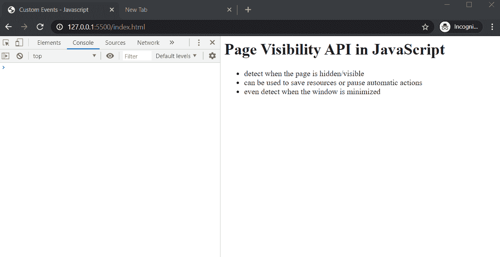
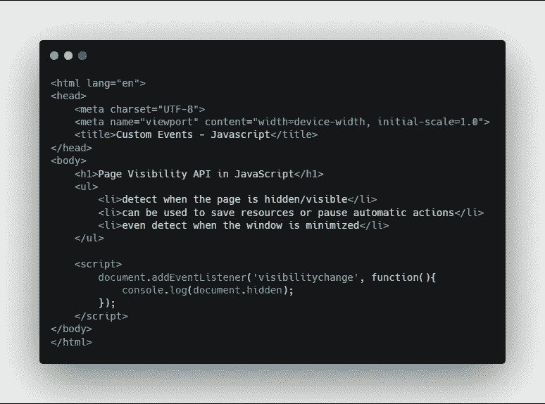
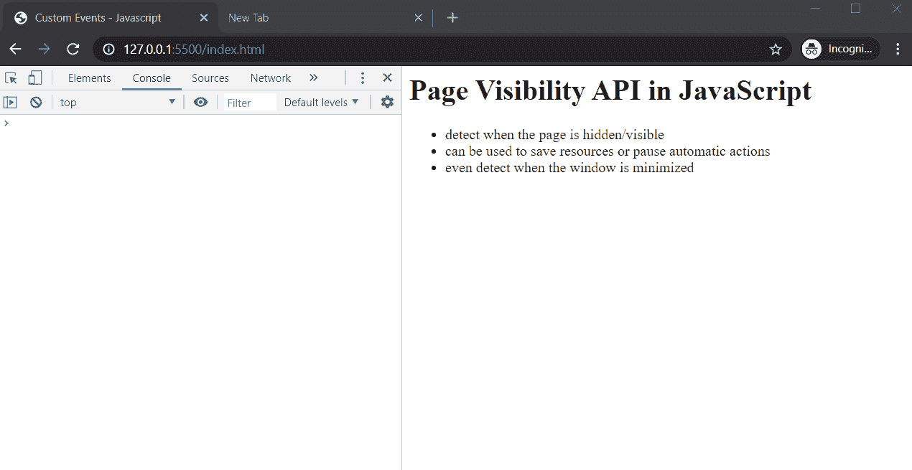

# 检测用户在 JavaScript 中切换标签的时间

> 原文：<https://javascript.plainenglish.io/detect-when-users-switch-tabs-in-javascript-c4bc6660f19e?source=collection_archive---------3----------------------->

## 利用 JavaScript 中的页面可见性 API


Photo by [Alexandru Zdrobău](https://unsplash.com/@alexandruz?utm_source=medium&utm_medium=referral) on [Unsplash](https://unsplash.com?utm_source=medium&utm_medium=referral)

我们将学习如何在 JavaScript 中使用页面可见性 API。这将允许你检测你的页面何时进入隐藏或可见状态。所以基本上你可以知道你的用户是否切换了标签或者最小化了他们的窗口。

显然，这是非常通用的，但你基本上可以把这个 API 和使用它的任何手段，你想。例如，当用户切换标签时暂停视频或音乐，甚至做一些像节省资源这样的事情。也许当页面不被使用或者不可见时停止密集的任务，并且基本上暂停任何种类的自动动作，这些动作可能在页面被隐藏时发生。

让我们开始吧。

# 开始

下面是一个示例代码。


Sample Code

在脚本标记中，我们将向文档对象添加一个事件侦听器。

```
document.addEventListener('visibilitychange', function()
   document.title = document.visibilityState;
   console.log(document.visibilityState);
});
```

我们将使用名为 **visibilitychange** 的事件。然后提供一个回调函数，每当网页上的可见性发生变化时，这个函数就会用 **visibilityState** 属性的值来改变页面的文档标题。

visibilityState 属性的值只取隐藏或可见的两个值中的一个。

# 结果



Result

正如你所看到的，当你切换到另一个标签页时，顶部的标签页标题变为**隐藏**，当切换回页面时，变为**可见**。

# 奖金

有一种不同的方法可以确定他们是否将状态设置为隐藏或禁用。这将通过隐藏的属性，本质上你将有一个真或假的值。页面隐藏时为 True，页面可见时为 false。



document.hidden

结果



这就是如何在 JavaScript 中使用可见性 API。

## **用简单英语写的 JavaScript 笔记**

我们已经推出了三种新的出版物！请关注我们的新出版物，表达对它们的爱:[](https://medium.com/ai-in-plain-english)**[**UX**](https://medium.com/ux-in-plain-english)[**Python**](https://medium.com/python-in-plain-english)**——谢谢，继续学习！****

****我们也一直有兴趣帮助推广高质量的内容。如果您有一篇文章想要提交给我们的任何出版物，请发送电子邮件至[**submissions @ plain English . io**](mailto:submissions@plainenglish.io)**，并附上您的 Medium 用户名，我们会将您添加为作者。另外，请让我们知道您想加入哪个/哪些出版物。******