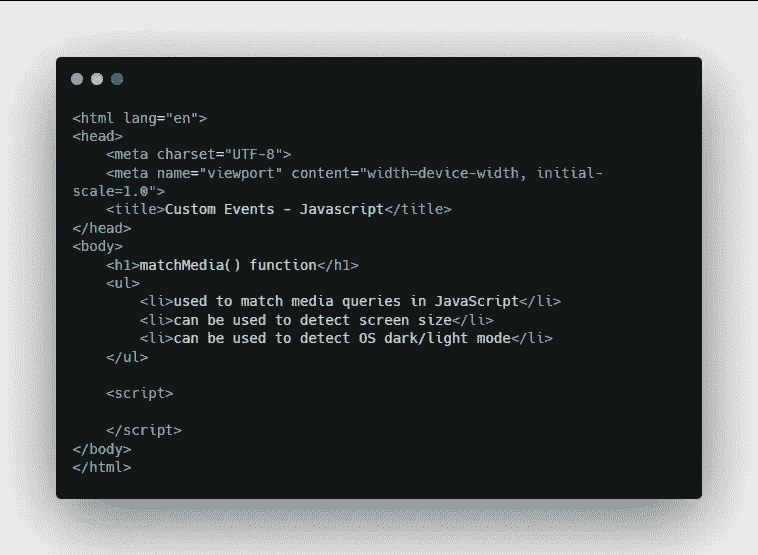
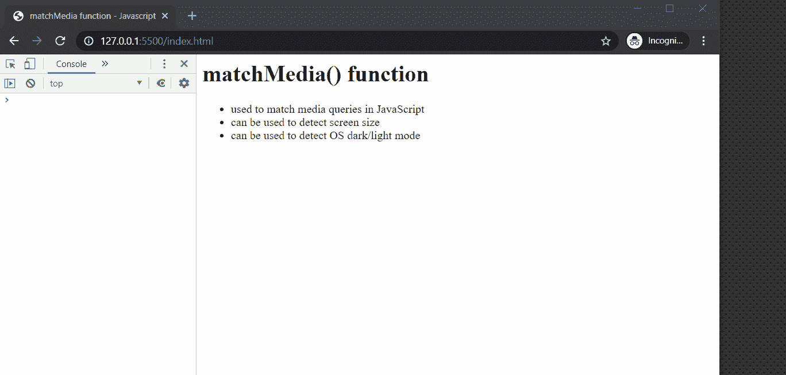
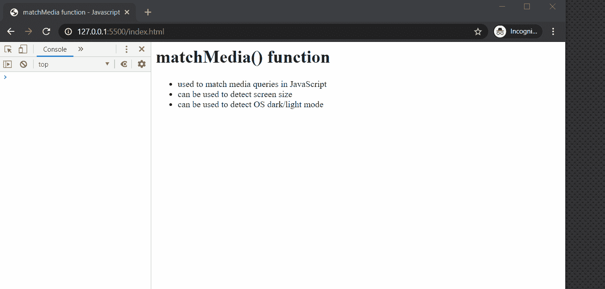
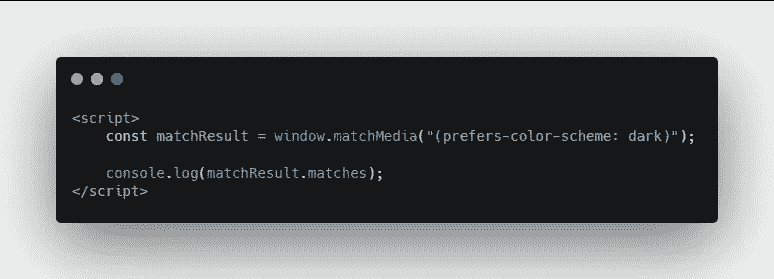
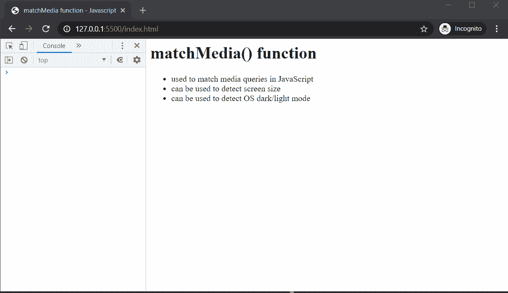

# 在 JavaScript 中检测屏幕大小和操作系统黑暗模式

> 原文：<https://javascript.plainenglish.io/detecting-screen-size-and-os-dark-mode-in-javascript-97f09dfdf1c?source=collection_archive---------13----------------------->

## 使用 matchMedia()函数完成工作


Photo by [William Iven](https://unsplash.com/@firmbee?utm_source=medium&utm_medium=referral) on [Unsplash](https://unsplash.com?utm_source=medium&utm_medium=referral)

这里有一个关于 JavaScript `matchMedia()`函数的快速帖子。这个函数允许您匹配 JavaScript 中的媒体查询并检测屏幕大小。比如你想知道用户的设备是手机还是平板。此外，该功能还可以检测操作系统的暗模式或亮模式。

让我们在文本编辑器中探索这个功能。

# 开始

下面是一个示例代码。



Sample Code

在脚本标记中，创建一个新的常量，它将保存 matchMedia()函数的返回值。

```
<script>
   const matchResult = window.matchMedia("(max-width: 767px)");
   console.log(matchResult);
</script>
```

在函数内部，我们要传递一个字符串。这里我们通过`(max-width: 767px)`。你可能以前在 CSS 中见过类似的东西。因此，如果这个媒体查询匹配，那么我们知道屏幕小于 767 像素。

如果是这样的话，我们知道这是一个更小的设备。很可能是手机。然后我们在控制台日志中显示结果。

# 结果



Result

如你所见，我们有一个名为`matches`的属性，当屏幕小于 767 像素时，它等于`true`。当我们进一步扩大屏幕尺寸并刷新页面时，它等于`false`。

# 功能是小屏幕

接下来，我们将创建一个名为 isSmallScreen 的函数，它检测某个东西是否是小屏幕尺寸。

```
function isSmallScreen() {
   return window.matchMedia("(max-width: 767px)").matches;
}
```

结果



isSmallScreen function

# 检测操作系统暗/亮模式

这里是如何检测操作系统的黑暗或光明的模式。它的工作方式和以前非常相似。



你需要做的就是用上面的`prefers-color-scheme`改变 matchMedia 里面的字符串。如果返回值为`true`，则 OS 处于黑暗模式。

结果



而 JavaScript matchMedia 函数就是这么用的！

## **用简单英语写的 JavaScript 笔记**

我们已经推出了三种新的出版物！请关注我们的新出版物:[**AI in Plain English**](https://medium.com/ai-in-plain-english)，[**UX in Plain English**](https://medium.com/ux-in-plain-english)，[**Python in Plain English**](https://medium.com/python-in-plain-english)**——谢谢，继续学习！**

**我们也一直有兴趣帮助推广高质量的内容。如果您有一篇文章想要提交给我们的任何出版物，请发送电子邮件至[**submissions @ plain English . io**](mailto:submissions@plainenglish.io)**，使用您的 Medium 用户名，我们会将您添加为作者。另外，请让我们知道您想加入哪个/哪些出版物。****