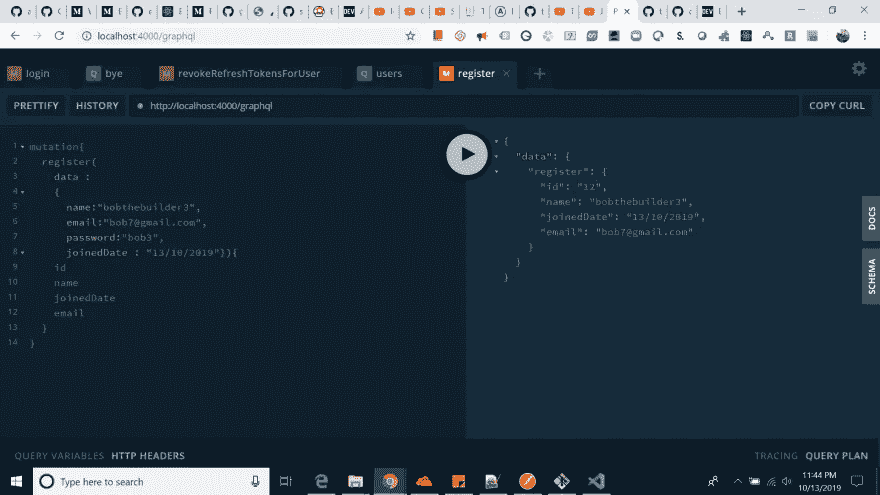
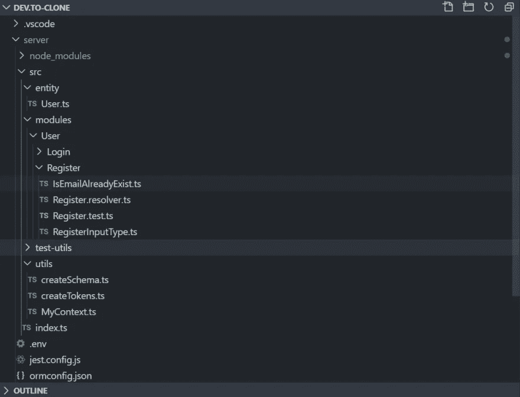
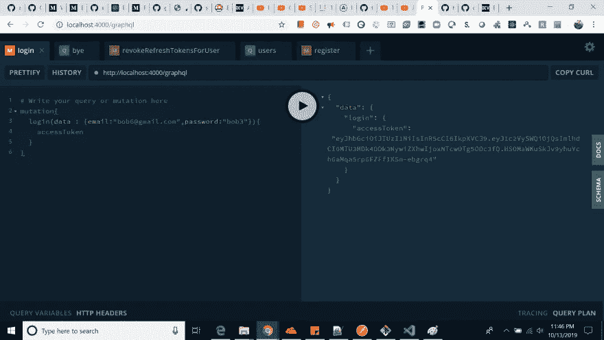
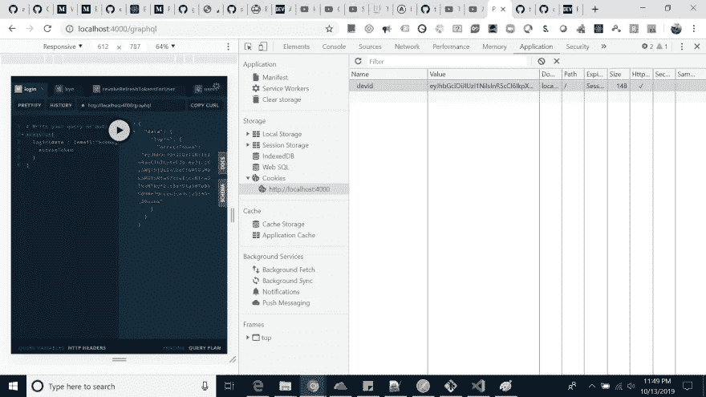
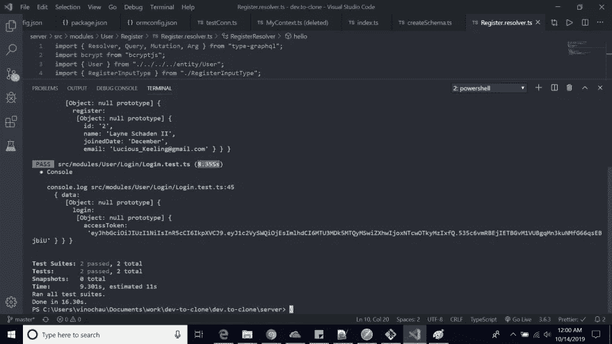

# 使用 React、Node、TypeScript、GraphQL 和 Apollo 创建要克隆的开发工具(第 1 部分)

> 原文：<https://javascript.plainenglish.io/dev-to-clone-using-reactjs-nodejs-via-typescript-apollo-using-graphql-orm-environment-part-1-cf83f65e795d?source=collection_archive---------1----------------------->

## 设置 Graphql-ORM 环境



你好社区，今天我试图用 **ReactJs** 和 **NodeJs** 将 **dev .克隆到**网站。这将是一个原型，其中用户可以**注册/登录**，创建后&其他功能。

> 我这样做只是为了学习。

# 技术堆栈:

**NodeJs，ReactJs，Graphql，TypeOrm，TypeGraphql，Typescript，JWT，阿波罗服务器快递，Jest，阿波罗客户端，阿波罗链接&更多..**

[Git Hub 开发。克隆链接](https://github.com/vinodchauhan7/dev.to-clone)

[*第一部分*](https://medium.com/@vinodc45/dev-to-clone-using-reactjs-nodejs-via-typescript-apollo-using-graphql-orm-environment-part-1-cf83f65e795d)*&*[*第二部分*](https://medium.com/@vinodc45/dev-to-clone-using-reactjs-nodejs-via-typescript-apollo-using-refreshtoken-authentication-99fa89d567e9)

首先，我刚刚开始使用 typeorm 安装 typegraphql-typescript-node。到目前为止，我已经完成了 jest 设置的注册和登录功能。对于认证，我使用“JWT”。我正在使用 **bcryptjs** 保存密码，用于哈希目的。

对我来说，一步一步地进行是很困难的，因为这个系列文章可能会很大，所以我在 git 中创建了分支。到目前为止，我已经为以下目的在 Git 中创建了 3 个分支:

*   [第一部分(设置服务器)](https://github.com/vinodchauhan7/dev.to-clone/tree/Part-1/server)
*   [第 2 部分(添加测试设置的注册逻辑)](https://github.com/vinodchauhan7/dev.to-clone/tree/Part-2/server)
*   [第 3 部分(使用刷新令牌添加登录功能)](https://github.com/vinodchauhan7/dev.to-clone/tree/Part-3/server)

> 如果任何人在运行上述任何分支机构时遇到问题，请检查“主”分支机构，它将始终处于运行状态。

# 项目结构:



Package.json

```
{
    "name": "server",
    "version": "1.0.0",
    "main": "index.js",
    "license": "MIT",
    "dependencies": {
        "apollo-server-express": "^2.9.6",
        "bcryptjs": "^2.4.3",
        "class-validator": "^0.10.1",
        "dotenv": "^8.1.0",
        "express": "^4.17.1",
        "graphql": "^14.5.8",
        "jsonwebtoken": "^8.5.1",
        "pg": "^7.12.1",
        "reflect-metadata": "^0.1.13",
        "type-graphql": "^0.17.5",
        "typeorm": "^0.2.19"
    },
    "devDependencies": {
        "@types/bcryptjs": "^2.4.2",
        "@types/express": "^4.17.1",
        "@types/graphql": "^14.5.0",
        "@types/jest": "^24.0.18",
        "@types/jsonwebtoken": "^8.3.4",
        "@types/node": "^12.7.12",
        "jest": "^24.9.0",
        "nodemon": "^1.19.3",
        "ts-jest": "^24.1.0",
        "ts-node": "^8.4.1",
        "ts-node-dev": "^1.0.0-pre.43",
        "typescript": "^3.6.4"
    },
    "scripts": {
        "start": "ts-node-dev --respawn src/index.ts",
        "db:setup": "ts-node ./src/test-utils/setup.ts",
        "test": "npm run db:setup && jest"
    }
}
```

我使用“yarn”包管理器来运行我所有的脚本。
1) yarn start(它将在 localhost:4000/graphql 上运行您的后端服务器)
2) yarn test(测试所有运行情况)

Index.ts

```
import "dotenv/config";
import "reflect-metadata";
import { ApolloServer } from "apollo-server-express";
import Express from "express";
import { createConnection } from "typeorm";
import { createSchema } from "./utils/createSchema";

const server = async () => {
  await createConnection();

  const schema = await createSchema();

  const apolloServer = new ApolloServer({
    schema,
    context: ({ req, res }) => ({ req, res })
  });

  const app = Express();

  apolloServer.applyMiddleware({ app });

  app.listen(4000, () => {
    console.log("Dev.to server started on localhost:4000/graphql");
  });
};

server();
```

我用 postgres 作为我的数据库。。db 的 ormConfiguration 将如下所示。

```
{
    "type": "postgres",
    "host": "localhost",
    "port": 5432,
    "username": "postgres",
    "password": "root",
    "database": "dev-to-clone",
    "synchronize": true,
    "logging": false,
    "entities": [
        "src/entity/*.*"
    ]
}
```

为了测试我的解析器，我使用 jest 和不同的 db。

```
import "dotenv/config";
import "reflect-metadata";
import { createConnection } from "typeorm";
import { User } from "./../entity/User";

export const testConn = (drop: boolean = false) => {
  return createConnection({
    type: "postgres",
    host: "localhost",
    port: 5432,
    username: "postgres",
    password: "root",
    database: "dev-to-clone-test",
    synchronize: drop,
    dropSchema: drop,
    logging: false,
    entities: [User]
  });
};
```

到目前为止，我的“用户”实体具有以下属性，如果我将来需要操作它，我可以更新它们。

```
import { Entity, PrimaryGeneratedColumn, Column, BaseEntity } from "typeorm";
import { ObjectType, Field, ID } from "type-graphql";

@ObjectType()
@Entity()
export class User extends BaseEntity {
  @Field(() => ID)
  @PrimaryGeneratedColumn()
  id: number;

  @Field()
  @Column()
  name: string;

  @Field()
  @Column("text", { unique: true })
  email: string;

  @Column()
  password: string;

  @Field()
  @Column({ nullable: true, default: null })
  workPlace?: string;

  @Field()
  @Column({ nullable: true, default: null })
  about?: string;

  @Field()
  @Column({ nullable: true, default: null })
  linkedIn?: string;

  @Field()
  @Column({ nullable: true, default: null })
  github?: string;

  @Field(() => [String])
  @Column("simple-array", { nullable: true, default: null })
  tags?: string[];

  @Field()
  @Column()
  joinedDate: string;

  @Field()
  @Column({ nullable: true, default: null })
  location?: string;

  @Field()
  @Column({ nullable: true, default: null })
  isActive?: boolean;
}
```

一些快照包括:

# 注册用户


Register Image

# 使用访问令牌登录:



Login with Access Token

# 登录时刷新令牌。



Refresh Token

试验结果



Test Result

那些不理解访问和刷新令牌逻辑的人，当我们使用 React with Typescript & Apollo 覆盖它的前端部分时，就可以理解了。

直到那时再见社区，将尽快回来与其他功能。