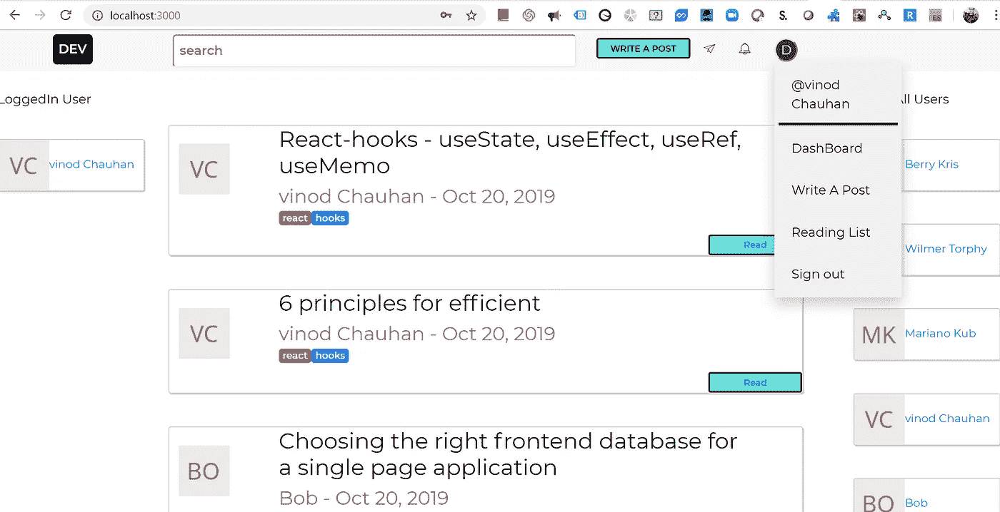
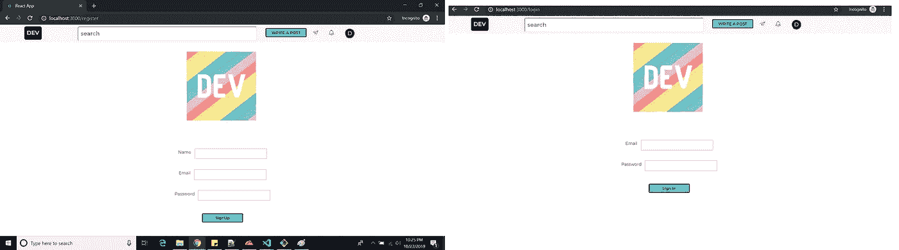
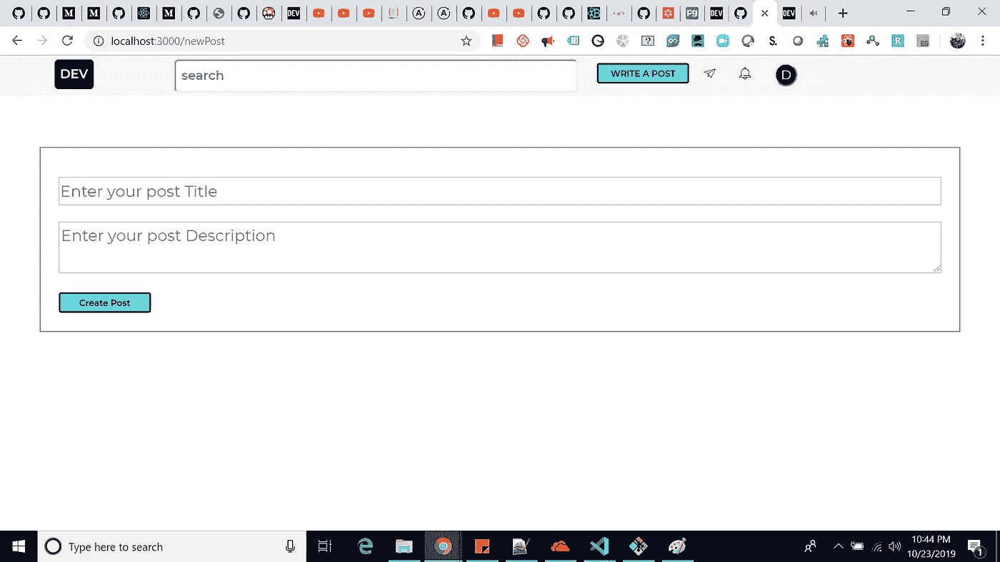
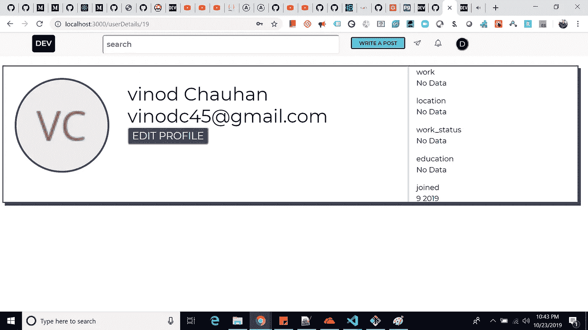
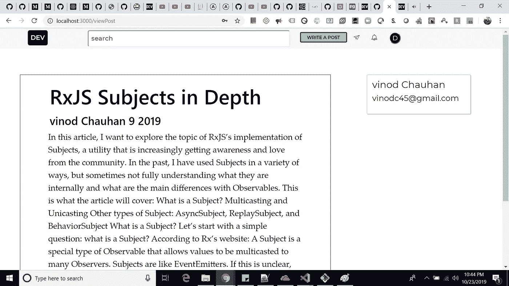
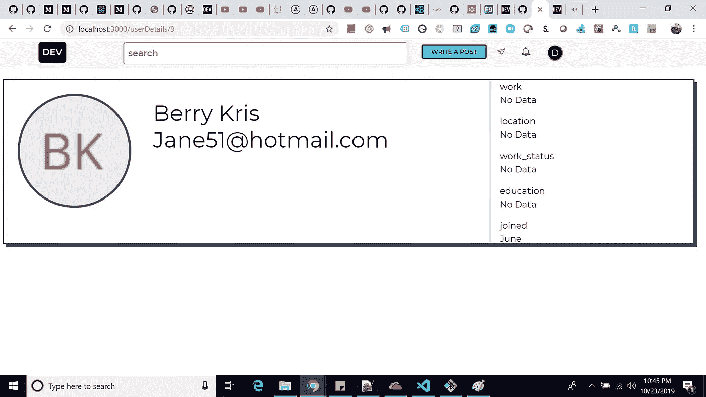

# 使用 React、Node、TypeScript、GraphQL 和 Apollo 创建要克隆的开发工具(第 3 部分)

> 原文：<https://javascript.plainenglish.io/dev-to-clone-using-reactjs-nodejs-via-typescript-apollo-using-graphql-orm-environment-part-3-5dd9fdfbb312?source=collection_archive---------3----------------------->

## 在数据库中设置关系



你好，社区，今天我写了这个系列文章的 3 个部分，其中我试图用最少的功能克隆 dev.to。这将是一个原型，其中用户可以注册/登录，创建帖子和其他功能。

> 我这样做只是为了学习。
> 如果你没有参观过[Part-1](https://medium.com/@vinodc45/dev-to-clone-using-reactjs-nodejs-via-typescript-apollo-using-graphql-orm-environment-part-1-cf83f65e795d)&[Part-2](https://medium.com/@vinodc45/dev-to-clone-using-reactjs-nodejs-via-typescript-apollo-using-refreshtoken-authentication-99fa89d567e9)，请先了解这些，以便更清楚地了解这一部。

代码回购: [GitHub 链接](https://github.com/vinodchauhan7/dev.to-clone/tree/master)

你好。朋友们，在这篇文章中，我可以用令牌刷新功能完成许多事情，例如**登录/注册**功能。也能够使用 **Apollo 状态管理**维护缓存，最后登录的用户可以发表文章，查看其他用户的文章和个人资料。



Login and register

注册

当用户登录时，刷新令牌保存在用户浏览器 cookies 中。为了用户顺利使用应用程序，我们需要保持其认证，即使用户重新加载页面或如果其令牌过期。在令牌过期的情况下，我们已经使用 Apollo-link-token-Refresh 模块处理了使用 **RefreshToken** 和**的功能。**

```
//Getting access Token and passing it in request headers
const requestLink = new ApolloLink(
  (operation, forward) =>
    new Observable(observer => {
      let handle: any;
      Promise.resolve(operation)
        .then(operation => {
          const accessToken = getAccessToken();
          if (accessToken) {
            operation.setContext({
              headers: {
                authorization: `bearer ${accessToken}`
              }
            });
          } //accessToken is defined
        }) //then operation ends here
        .then(() => {
          handle = forward(operation).subscribe({
            next: observer.next.bind(observer),
            error: observer.error.bind(observer),
            complete: observer.complete.bind(observer)
          }); //handle ends here
        })
        .catch(observer.error.bind(observer));

      return () => {
        if (handle) handle.unsubscribe();
      };
    })
);

const client = new ApolloClient({
  link: ApolloLink.from([
    new TokenRefreshLink({
      accessTokenField: "accessToken",
      isTokenValidOrUndefined: () => {
        const token = getAccessToken();

        if (!token) {
          return true;
        }

        try {
          const { exp } = jwtDecode(token);
          if (Date.now() >= exp * 1000) {
            return false;
          } else {
            return true;
          }
        } catch (err) {
          console.log(err);
          return false;
        }
      },
      fetchAccessToken: () => {
        return fetch("http://localhost:4000/refresh_token", {
          method: "POST",
          credentials: "include"
        });
      },
      handleFetch: accessToken => {
        setAccessToken(accessToken);
      },
      handleError: err => {
        console.warn("Your refresh token is invalid. Try to relogin");
        console.error(err);
      }
    }),
    onError(() => {}),
    requestLink,
    new HttpLink({
      uri: "http://localhost:4000/graphql",
      credentials: "include"
    }) //new HttpLink ends here
  ]),
  cache
});
```

# 阿波罗缓存

当用户登录时，我们正在为 **MeQuery** 更新缓存，这样就可以在整个应用程序中使用它来知道谁当前登录，而不需要命中实际的 graphql 查询。

```
const LoginComponentUser = withFormik<MyFormProps, FormValues>({
    mapPropsToValues: props => ({
      email: props.initialEmail || "",
      password: props.initialPassword || ""
    }),
    validationSchema: Yup.object().shape({
      email: Yup.string()
        .email("Email is not valid")
        .required("Email is required"),
      password: Yup.string().required("Password is required")
    }),
    async handleSubmit({ email, password }: FormValues) {
      console.log(email, password);

      const response = await login({
        variables: {
          data: {
            email,
            password
          }
        },
        update: (store, { data }) => {
          //updating cache so that it will not hit again and again
          if (!data) {
            return null;
          }
          store.writeQuery<MeQuery>({
            query: MeDocument,
            data: {
              __typename: "Query",
              me: data.login.user
            }
          });
        }
      });

      console.log(response);
      if (response && response.data) {
        setAccessToken(response.data.login.accessToken);
      }

      console.log(getAccessToken());
      window.location.replace("http://localhost:3000/");
    }
  })(LoginForm);
```

# 样式组件

我还为初学者添加了一些样式化组件的用法，展示如何在 JS 中使用 css。

```
const WritePost = styled.a`
    width: 118px;
    display: block;
    margin-top: 10px;
    padding: 3px;
    text-align: center;
    font-weight: bold;
    border-radius: 3px;
    border: 2px solid #0a0a0a;
    color: #0a0a0a;
    background: #66e2d5;
    font-size: 11px;
    text-decoration: none !important;
    font-stretch: condensed;
    &:hover {
      color: #0b0b0b;
      background: #66e2e5;
    }
  `;

  const ShowSvg = styled.div`
    margin-top: 10px;
  `;
```

# 一对多关系

我还展示了模式之间的关系，通过展示[user-post]关系来展示我们如何在应用程序中使用 **Graphql** 来实现这个 **TypeORM** 特性。

```
@Query(() => [Post])
  @UseMiddleware(isAuth)
  async getAllPostById(@Arg("userId") userId: number): Promise<Post[]> {
    const post = await Post.find({
      where: { user: { id: userId } },
      relations: ["user"]
    });
    console.log(JSON.stringify(post, null, 2));
    return post;
  }
```

# 我没有使前端类似于开发。充分，因为这将需要时间来匹配所有的东西和所有的功能。



本系列文章的目的是让初学者或中级 react 开发人员熟悉令牌刷新、apollo 和 typeorm 特性。

我会带着新的功能和文章回来，直到那时再见伙计们..