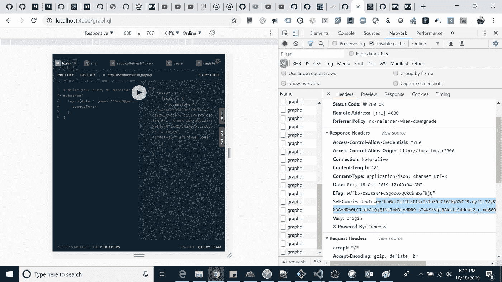
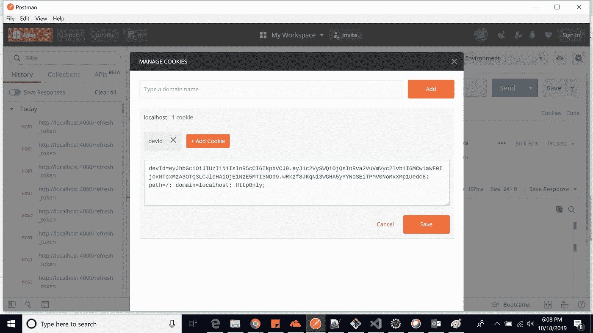
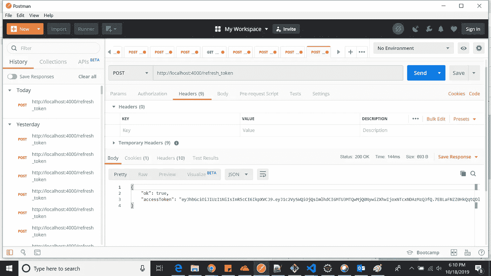
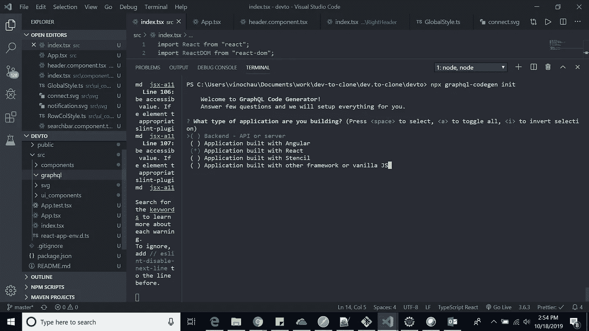
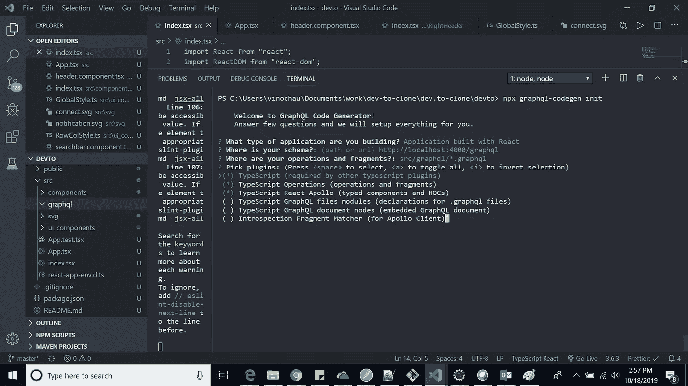
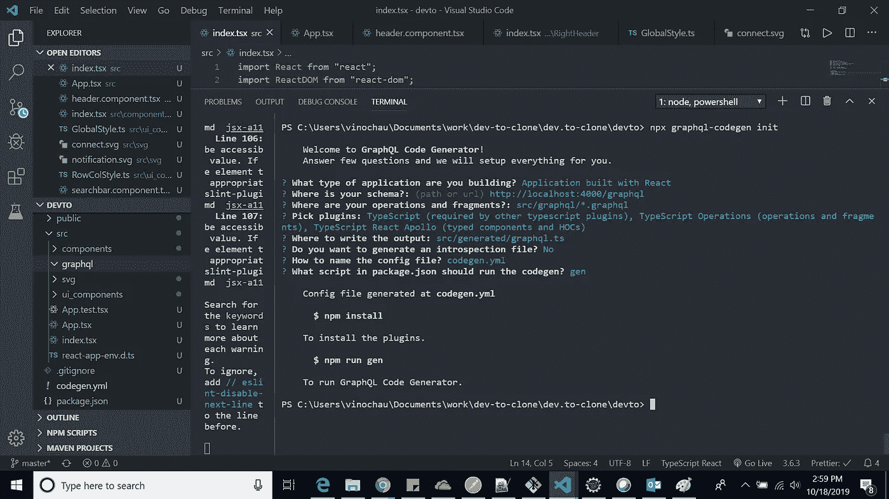

# 使用 React、Node、TypeScript、GraphQL 和 Apollo 创建要克隆的开发工具(第 2 部分)

> 原文：<https://javascript.plainenglish.io/dev-to-clone-using-reactjs-nodejs-via-typescript-apollo-using-refreshtoken-authentication-99fa89d567e9?source=collection_archive---------2----------------------->

## 添加 RefreshToken 和身份验证中间件

你好，社区，今天我正在写这个系列文章的第 2 部分，在这个系列文章中，我试图用最少的功能克隆 dev.to。这将是一个原型，其中用户可以注册/登录，创建帖子和其他功能。

> 我这样做只是为了学习。
> 
> 如果你没有参观过第一部，请先了解一下[Part-1](https://medium.com/@vinodc45/dev-to-clone-using-reactjs-nodejs-via-typescript-apollo-using-graphql-orm-environment-part-1-cf83f65e795d)&[Part-3](https://medium.com/@vinodc45/dev-to-clone-using-reactjs-nodejs-via-typescript-apollo-using-graphql-orm-environment-part-3-5dd9fdfbb312)

# 技术堆栈:

**NodeJs，ReactJs，Graphql，TypeOrm，TypeGraphql，Typescript，JWT，阿波罗服务器快递，Jest，阿波罗客户端，阿波罗链接&更多..**

[GitHub 链接](https://github.com/vinodchauhan7/dev.to-clone)

在本系列的第二部分中，我能够为后端服务器的**刷新令牌**、**认证中间件**创建逻辑。此外，我还用 **Apollo-Client、React-Bootstrap、Styled-components、Graphql-CodeGen & &对 React 前端进行了更多的设置**。

为了方便起见，我在我的 Git 存储库中创建了两个分支，以便更清楚地理解事情:
* [第 4 部分添加对 graphql API 的认证和撤销刷新令牌逻辑](https://github.com/vinodchauhan7/dev.to-clone/tree/Part-4)
* [第 5 部分前端&后端设置](https://github.com/vinodchauhan7/dev.to-clone/tree/Part-5)

# 第 4 部分(GitHub 分支)

在这个分支中，我们主要做了以下四件事:

**令牌版本**:此“令牌版本”保存在每个用户处，默认值为 0。这将有助于识别刷新令牌的身份验证，用户登录的次数和其他事情，如结束用户的所有会话。

```
//For authentication, I am changing createRefreshToken method.
export const createRefreshToken = (user: User) => {
  return sign(
    { userId: user.id, tokenVersion: user.tokenVersion },
    process.env.REFRESH_TOKEN_SECRET!,
    {
      expiresIn: "7d"
    }
  );
```

**刷新令牌**:众所周知，当我们点击“登录变更”查询时，**服务器**会将“刷新令牌”作为 cookies 发回给我们。现在想象一下，如果一个用户登录到我们的 **dev.to** clone 并刷新页面，那么我们需要创建一个机制让它登录并提供他/她被认证的所有服务。为了使这成为可能，我在我们的服务器上制作了一个“POST”API，它接受 cookies 作为刷新令牌，然后验证它。如果刷新令牌在服务器端验证成功，那么我们再次发送最新的“刷新令牌”和“访问令牌”给用户，这样用户就不必一次又一次地登录。

```
app.use(cookieParser());

  app.post("/refresh_token", async (req, res) => {
    const token = req.cookies.devId;
    if (!token) {
      console.log("token is not valid " + token);
      return res.send({ ok: false, accessToken: "" });
    }

    let payload: any = null;
    try {
      payload = await verify(token, process.env.REFRESH_TOKEN_SECRET!);
    } catch (err) {
      console.log(err);
      return res.send({ ok: false, accessToken: "" });
    }
    console.log("payload :: " + payload.userId);
    //token is valid and we can send him access token now.abnf
    const user = await User.findOne({ id: payload.userId });

    if (!user) {
      console.log("User not found");
      return res.send({ ok: false, accessToken: "" });
    }

    if (user.tokenVersion !== payload.tokenVersion) {
      return res.send({ ok: false, accessToken: "" });
    }

    //Referesh Token
    res.cookie("devId", createRefreshToken(user), {
      httpOnly: true
    });

    return res.send({ ok: true, accessToken: createAccessToken(user) });
  });
```

登录和刷新令牌:



2)使用 postman 调用 REST API，并在其中设置 refreshToken 为 cookie。



Add Cookies

3)基于刷新令牌获取新的访问令牌。



AccessToken Verified

# 认证中间件:

假设我们有一些 graphql 查询，我们希望这些查询只对经过身份验证的用户可用。为了完成这个任务，我使用了“type-graphql”的中间件。

```
@Query(() => String)
  @UseMiddleware(isAuth) //Below is implementation
  me(@Ctx() { payload }: MyContext) {
    return `${payload!.userId}`;
  }

//isAuth.ts
export const isAuth: MiddlewareFn<MyContext> = ({ context }, next) => {
  const authorization = context.req.headers["authorization"];

  if (!authorization) {
    throw new Error("Not Authenticated");
  }

  try {
    const token = authorization.split(" ")[1];
    const payload = verify(token, process.env.ACCESS_TOKEN_SECRET!);
    context.payload = payload as any;
  } catch (err) {
    console.error(err);
    throw new Error("Not Authenticated");
  }
  return next();
};
```

# 正在撤销刷新令牌:

想象一下，您的“刷新令牌”没有过期&您“忘记了密码”，然后您不希望任何人能够对受保护的 graphql 查询进行身份验证，或者简单地删除其所有登录会话，然后您可以更新特定用户的令牌版本，以便他需要用刷新令牌的令牌版本来验证自己。

```
@Mutation(() => Boolean)
  async revokeRefreshToken(@Arg("userId", () => Int) userId: number) {
    await getConnection()
      .getRepository(User)
      .increment({ id: userId }, "tokenVersion", 1);

    return true;
  }
```

# 第五部分分支

在这个分支中，我们用命令
“npx create-react-app devto-typescript”设置了 react 前端应用程序。安装后，添加以下模块:

```
yarn add apollo-boost @apollo/react-hooks graphql
yarn add -D @types/graphql
```

*更新您的 app.tsx 文件**

```
import React from "react";
import ReactDOM from "react-dom";
import ApolloClient from "apollo-boost";
import { ApolloProvider } from "@apollo/react-hooks";
import "bootstrap/dist/css/bootstrap.min.css";
import App from "./App";

const client = new ApolloClient({
  uri: "http://localhost:4000/graphql",
  credentials: "include"
});

ReactDOM.render(
  <ApolloProvider client={client}>
    <App />
  </ApolloProvider>,
  document.getElementById("root1")
);
```

# 添加 graphql/CodeGen

```
yarn add -D @graphql-codegen/cli
//then
npx graphql-codegen init
```

设置步骤:



**创建您的第一个 graphql 查询**

```
query Hello {
  hello
}
```

**在 app.tsx** 中使用 HelloQuery()

```
import React from "react";
import { BrowserRouter as Router, Switch, Route } from "react-router-dom";
import { HeaderComponent } from "./components/Header/header.component";
import { GlobalStyle } from "./ui_components/GlobalStyle";
import { ColStyle, RowStyle } from "./ui_components/RowColStyle";
import { RegisterComponent } from "./components/User/Register.component";
import { useHelloQuery } from "./generated/graphql";
const App: React.FC = () => {
  const { data, loading } = useHelloQuery();

  if (loading || !data) {
    return <div>...</div>;
  }

  return (
    <>
      <GlobalStyle></GlobalStyle>
      <RowStyle>
        <ColStyle md={12}>
          <HeaderComponent />
        </ColStyle>
      </RowStyle>
      <RowStyle>
        <ColStyle md={12}>
          <Router>
            <Switch>
              <Route exact path="/" render={() => <div>{data.hello}</div>} />
              <Route exact path="/register" component={RegisterComponent} />
            </Switch>
          </Router>
        </ColStyle>
      </RowStyle>
    </>
  );
};

export default App;
```

希望你会喜欢这篇文章，我会很快带着更多的代码回来:)。