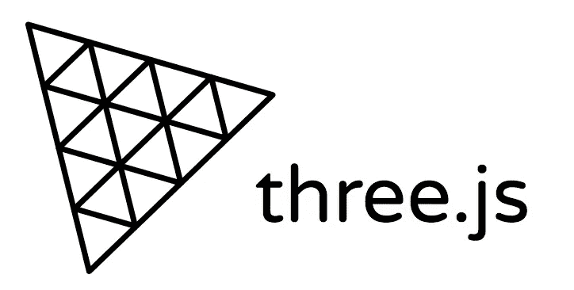
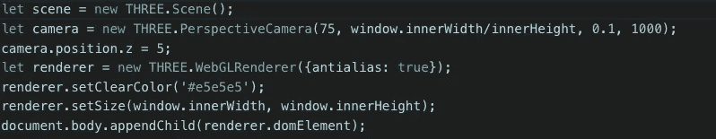
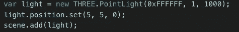
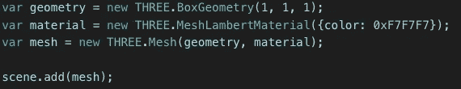
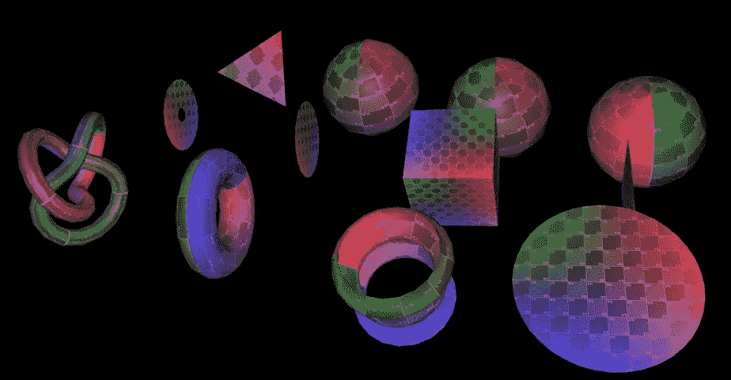
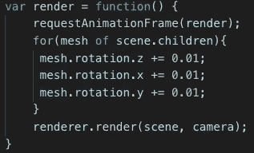

# 使用 Three.js 开发 3D Web 应用程序

> 原文：<https://javascript.plainenglish.io/developing-3d-web-apps-with-three-js-c5f7468f3114?source=collection_archive---------3----------------------->

在我进入 Three.js 的魔力之前，我认为有必要花一点时间来简单介绍一下 3D 网页设计。

顾名思义，3D web 应用程序是以三维方式呈现的网站。这是通过操作 HTML“canvas”元素来完成的。canvas 元素本身值得写一两篇完整的文章，只是为了探索它能做什么。不过现在，我们需要知道的是，它被设计用来创建和显示用户可以绘制的交互式动画图形。

虽然这已经很酷了，但人们并不满足于停留在那里，而是想出了如何操纵画布在三维空间中工作，使用一种叫做 WebGL 的东西。WebGL 由 Khronos Group 管理，该集团将其定义为“基于 OpenGL ES 的低级 3D 图形 API 的跨平台、免版税的 web 标准，通过 HTML5 Canvas 元素向 ECMAScript 公开。”

不要担心理解这到底意味着什么。我们只需要知道，我们可以使用 WebGL 来创建 3D 网站。我们可能还知道，它被广泛认为是一个非常难操作的 API，需要大量的代码来做相对简单的事情。这就是最终带给我们的 Three.js。

Three.js 是一个 javascript 库，它通过充当程序员和 WebGL 之间的翻译器来简化编写 3D 代码的过程。这主要是通过将 WebGL 抽象成一组更易于管理的函数和类来实现的。也就是说，当你用 Three.js 写代码的时候，Three.js 在幕后为你写了几十行 WebGL。

**创造三人的“你好，世界”。Js**

作为传统，Three.js 对经典的“你好，世界！”有自己的看法应用程序:渲染旋转的 3D 立方体。要开始，需要导入 Three.js 库！完成后，您需要创建三样东西来启动您的项目:

*   一个场景
*   一台照相机
*   渲染器

就像任何其他 web 应用程序一样，在创建 3D 空间时，您的浏览器需要知道显示什么以及如何显示。这样，创建一个场景就像告诉浏览器你正在为你的演示设置舞台。摄像机定义了用户的视角，并告诉浏览器我们这些观众相对于场景中心的位置。最后，渲染器实际上告诉浏览器继续显示我们已经创建并放到场景中的东西。

Creating the scene, camera, and renderer

接下来，我们还需要能够实际看到！如果你输入这段代码，你只会看到黑屏。这是因为，就像真实的舞台一样，我们的浏览器需要场景有一个或多个光源。有几种不同类型的灯可供你使用。每种光以不同的方式产生光源。您可以选择聚光灯、环境照明和点光源。你使用哪一个和你给它的强度和色调将会影响你的场景如何被显示。

A basic point light

有了上面的代码，我们现在有了一个可见的三维空间。酷！现在让我们放点东西进去。除了能够导入复杂的 3D 模型，Three.js 还能够创建几何对象并将其渲染到您的空间中。

Three.js 中的几何对象由一个“几何体”和一个材质组成。几何体只是一个几何形状，而材质是应用于该形状的曲面。您需要同时创建和渲染一个对象。

A simple box

与 Three.js 中的所有东西一样，您有各种各样的现成的基本选项，以及定制的能力。

Some of the available geometries

我们“你好，世界！”的最后一步就是把它动画化！为此，下面的代码将在场景中找到我们的立方体，并创建一个动画循环，在 x、y 和 z 方向旋转立方体。

Animation Loop

这就是你真正开始使用 Three.js 所需要的一切。以下是我用来开始使用的资源，包括 YouTube 教程、Three.js 文档(这些文档太棒了)和 google poly，这是一个由世界各地的 3D 艺术家上传的免费 3D 模型库！

*   [Three.js 速成班](https://www.youtube.com/watch?v=6oFvqLfRnsU)
*   [声纳系统 three.js 教程](https://www.youtube.com/watch?v=YKzyhcyAijo&t=1s)
*   [谷歌聚](https://poly.google.com/)
*   [发现 three.js](https://discoverthreejs.com)
*   [文档](https://threejs.org)！