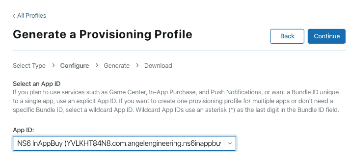

# 在 NativeScript Vue 中开发应用程序内购买的应用程序

> 原文：<https://javascript.plainenglish.io/developing-applications-with-in-app-purchases-in-nativescript-vue-fbdedcebf628?source=collection_archive---------7----------------------->


绝大多数盈利的应用程序可以免费下载和安装，但提供大量虚拟产品出售。这可以从解锁新的表情符号到订阅流媒体，被移动开发者称为应用内购买。如果你对如何在 NativeScript Vue 应用程序中使用这些感到好奇，那么这篇文章就是为你准备的。我将介绍如何使用 NativeScript Vue 添加对通过苹果应用商店和谷歌 Play 商店购买软件产品的支持，以及如何检测这些购买以解锁应用的功能。

首先，我们将使用 NativeScript CLI 创建一个新的空白 Vue 应用程序:

```
tns create ns6inappbuy
```

为了支持应用内购买(IAP)，我们将使用 [NativeScript 购买插件](https://github.com/PeterStaev/nativescript-purchase) *(这是该插件的最后一个免费版本，目前与 NativeScript 6 一起使用)*，安装有:

`tns plugin add nativescript-purchase`

在我们开始使用应用程序之前，我们必须配置要在应用程序商店和 Play 商店销售的虚拟产品。对于 Android Play 商店，在我们测试购买过程之前，我们必须创建并上传一个应用程序，该应用程序具有最小的商店存在。iOS 应用商店只需要在 App Store Connect 控制台中设置一个新应用，而不需要二进制文件或商店存在详细信息，因此我们将从 iOS 平台开始，以确保购买代码正常工作。

# 为 Apple App Store 设置 IAP

首先，你必须在[苹果开发者控制台](https://developer.apple.com/account/resources/identifiers/bundleId/add/)上注册一个新的应用标识符，使用你的`package.json`中定义的相同应用 ID。


这需要一点时间来处理，然后我们才能在 [App Store 连接控制台](https://appstoreconnect.apple.com/)上使用它。准备就绪后，您就可以选择它作为在 App Store 帐户中创建的新 iOS 应用程序的捆绑 ID。


注册应用程序后，我们现在可以通过在 App Store Connect 控制台中转到新应用程序的功能选项卡来添加 IAP 产品。您可以忽略该警告，因为我们将仅对该应用进行沙盒测试，并且您不必提交完整的应用进行批准来测试集成。


我们先添加一个订阅产品。当您点击添加图标时，您将看到一个产品选择列表。如果你没有看到第四种选择，你需要先处理一些财务和法律文件。


若要启用自动续订订阅选项，请转到 App Store Connect 中的“协议、税务和银行”部分:


您将看到付费应用协议尚未完成，点击查看并同意条款链接，验证您的地址并同意条款。完成后，您将看到一个新的链接，用于填写所需的财务表格。


点击那个链接会弹出一个新页面，里面有你需要填写和提交的各种表格。


你需要填写银行账户和税单。您可以为所有联系人部分添加相同的联系人信息。一旦一切都完成了，银行验证可能需要一天的时间来处理。一旦完成并验证了银行详细信息和所有其他部分和表格，该帐户将被标记为活动，并允许销售经常性订阅。

在这篇文章中，我将为 IAP 创建两个产品。这些将是每月定期订阅(显示随机图像)和一次性升级(非消耗)产品(显示欢迎文本)。让我们从非消耗性产品开始，我们将为其分配一个产品 ID`com.angelengineering.ns6inappbuy.product1`。在保存新产品之前，填写其余的详细信息，包括参考名称、定价、显示名称和描述。您将收到“缺少元数据”的警告，直到您将屏幕截图添加到产品的屏幕截图部分(您现在可以添加从 iOS 模拟器捕获的任何屏幕截图，因为它永远不会被发送进行审查)。


接受后，添加另一个产品作为自动续订订阅，输入名称和产品 ID`com.angelengineering.ns6inappbuy.product2`，并继续填写其余信息，包括您将提供的订阅选项组的名称(以及 1 个本地化版本)、参考名称、订阅持续时间、订阅价格、App Store 信息本地化版本以及评论信息部分下的相同 iOS 屏幕截图。


这两款产品已经在 App Store 上准备好了，让我们回到 App，开始使用它们。我们将从导入插件库并向`app/app.js`添加一些初始化代码开始:

```
import Vue from "nativescript-vue";
import Home from "./components/Home";
import * as purchase from "nativescript-purchase";

Vue.config.silent = false;
global.purchaseInitPromise = purchase.init([
    "com.angelengineering.ns6inappbuy.product1",
    "com.angelengineering.ns6inappbuy.product2"
]);

new Vue({
    template: `
        <Frame>
            <Home />
        </Frame>`,
    components: {
        Home
    }
}).$start();
```

因为插件可能比应用程序花费更多的时间来初始化，所以我们将 init 调用包装为存储在全局对象中的承诺，这样我们就可以在我们的主应用程序页面`app/components/Home.vue`上访问它。我们还必须提供与您在 App Store Connect 中设置的产品 id 相匹配的产品 id。让我们把`app/components/Home.vue`编辑成:

```
<template>
    <Page>
        <ActionBar title="In-App Purchase" class="action-bar">
            <ActionItem ios.position="right" text="Restore" @tap="onRestoreTap" />
        </ActionBar>
        <StackLayout>
            <StackLayout v-for="item in Items" :key="item.localizedTitle">
                <GridLayout rows="auto, auto" columns="*, auto" padding="5" @tap="onProductTap(item)">
                    <Label row="0" col="0" :text="item.localizedTitle" textWrap="true" class="item-title" color="black" fontSize="18" />
                    <Label row="1" col="0" :text="item.localizedDescription" textWrap="true" color="rgb(75, 75, 75)" />
                    <Label row="0" rowSpan="2" col="1" :text="item.isPurchased?'Bought':item.priceFormatted" color="black" fontSize="24" />
                </GridLayout>
            </StackLayout>
            <Label v-show="isLoading" text="Loading..." />
            <ActivityIndicator :busy="isLoading" />
            <Label v-show="showGreeting" text="HELLO USER!!" fontSize="40" color="blue" />
            <Image v-show="showPicture" src="https://picsum.photos/300/200" />
        </StackLayout>
    </Page>
</template>

<script>
import * as purchase from "nativescript-purchase";
import * as applicationSettings from "application-settings";
import { Transaction, TransactionState } from "nativescript-purchase/transaction";
import { Product } from "nativescript-purchase/product";
import { ItemEventData } from "ui/list-view";
export default {
    data() {
        return {
            Items: [],
            isLoading: true,
            showGreeting: false,
            showPicture: false,
        }
    },
    created() {
        let that = this
        global.purchaseInitPromise.then(() => {
            purchase.getProducts().then((products) => {
                    products.forEach((product) => {
                        if (applicationSettings.getBoolean(product.productIdentifier)) {
                            console.log("product " + product.productIdentifier + " already purchased")
                            product.isPurchased = true
                            if (product.productIdentifier == 'com.angelengineering.ns6inappbuy.product1') that.showGreeting = true
                            if (product.productIdentifier == 'com.angelengineering.ns6inappbuy.product2') that.showPicture = true
                        }
                    });
                    that.Items = products
                    that.isLoading = false
                })
                .catch((e) => {
                    console.log(e)

                    that.isLoading = true
                });
        })
        purchase.on(purchase.transactionUpdatedEvent, (transaction) => {
            if (transaction.transactionState === TransactionState.Purchased) {
                alert(`Congratulations you purchased ${transaction.productIdentifier}!`);
                console.log(transaction.transactionDate);
                console.log(transaction.transactionIdentifier);
                applicationSettings.setBoolean(transaction.productIdentifier, true);
                that.Items.forEach(item => { if (item.productIdentifier == transaction.productIdentifier) item.isPurchased = true })
                if (transaction.productIdentifier == 'com.angelengineering.ns6inappbuy.product1') that.showGreeting = true
                if (transaction.productIdentifier == 'com.angelengineering.ns6inappbuy.product2') that.showPicture = true
                if (transaction.productIdentifier.indexOf(".consume") >= 0) {//Android only
                    purchase.consumePurchase(transaction.transactionReceipt)
                        .then((responseCode) => console.log(responseCode)) // If responseCode === 0 the purchase has been successfully consumed
                        .catch((e) => console.log(e));
                }
            } else if (transaction.transactionState === TransactionState.Restored) {
                console.log(`Restored purchase of ${transaction.productIdentifier}.`);
                console.log(transaction.transactionDate);
                applicationSettings.setBoolean(transaction.productIdentifier, true);
                that.Items.forEach(item => { if (item.productIdentifier == transaction.productIdentifier) item.isPurchased = true })
                if (transaction.productIdentifier == 'com.angelengineering.ns6inappbuy.product1') that.showGreeting = true
                if (transaction.productIdentifier == 'com.angelengineering.ns6inappbuy.product2') that.showPicture = true
            } else if (transaction.transactionState === TransactionState.Failed) {
                alert(`Purchase of ${transaction.productIdentifier} failed!`);
            }
        });
        //uncomment to restore automatically on app load
        // purchase.restorePurchases();
    },
    methods: {
        onProductTap(data) {
            if (data.isPurchased) {
                console.log("This has already been purchased, ignoring")
                return false
            }
            if (purchase.canMakePayments) {
                console.log("Purchase allowed, purchasing product")
                // NOTE: 'product' must be the same instance as the one returned from getProducts()
                purchase.buyProduct(data);
            } else {
                alert("Sorry, your account is not eligible to make payments!");
            }
        },
        onRestoreTap() {
            console.log("Restoring purchases")
            purchase.restorePurchases();
        },
    },
};
</script>

<style scoped lang="scss">
@import '~@nativescript/theme/scss/variables/blue';
</style>
```

从`created()`函数开始，我们调用`purchase.getProducts()`从 App/Play 商店中检索产品条目，并将它们分配给本地`Items`数组。加载后，它们会呈现在 XML 部分的顶部。我们还检查每个产品 ID 是否在 [ApplicationSettings](https://docs.nativescript.org/ns-framework-modules/application-settings) 中有一个条目，当我们在下一段代码中检测到产品购买时，就会设置这个条目。下一节将分配一个事件处理程序，每当购买插件检测到来自 App/Play 商店的交易时就会触发该事件处理程序。我们检查各种可能的事件类型，当检测到购买时，我们在 ApplicationSettings 中设置该 ID，并设置适当的标志来显示购买功能。对于 Android，需要额外消耗购买令牌，以确保它在 Play Store 中正确注册为销售。

如果应用程序已经安装在新设备上，并且缺少这些应用程序设置，用户可以调用`purchase.restorePurchases()`函数，该函数将发送一个恢复事件，处理方式类似于购买。如果你总是想检查应用程序的初始化，或者使用屏幕顶部操作栏中的按钮，在`created()`的末尾有一个调用，可以取消注释。

运行该应用程序，如果一切正常，您现在应该会看到屏幕上列出的来自 App Store 的产品。


# 在 iOS 上购买

为了在 iOS 上实际测试购买，您必须使用真实的设备和沙盒测试帐户来进行测试购买。如果你试着在 iOS 模拟器上运行这个，当你试图购买时，你会得到一个错误。在我们可以在真实设备上安装此应用程序之前，我们首先需要设置一个预置描述文件。回到[苹果开发者账户控制台](https://developer.apple.com/account/resources/profiles/list)，点击加号添加新的个人资料。


选择“iOS 应用程序开发”选项，然后继续下一页，选择此应用程序的应用程序 ID 并下载配置文件。



您可以打开此文件，将其添加到您的 OSX 钥匙串，并使其可用于 Xcode，或者下载该文件并在以后将其添加到 Xcode。现在我们可以使用`tns build ios`准备 NativeScript 应用包，并使用 Xcode 打开项目文件`/platforms/ios/ns6inappbuy.xcworkspace`。转到应用程序设置并取消选中“自动管理签名”，然后选择您刚刚导入的预置描述文件。接下来，点击“+Capability”控件，将应用内购买功能添加到应用中。现在，您应该能够构建应用程序并将其部署到您的 iOS 设备上进行测试。


在我们实际进行测试购买之前，我们还需要创建一个与您的 App Store 开发者帐户相关联的沙盒测试者帐户。回到你的[应用商店连接控制台](https://appstoreconnect.apple.com/access/testers)，进入用户和访问部分，然后选择沙盒测试者查看你当前的测试用户账户。点击加号图标添加一个新帐户，并在名称中填写任何内容，但请确保您使用的是一个以前没有作为测试用户使用过的唯一电子邮件帐户(最好是在您控制的域中，以便您可以确认)。还要确保密码至少有 8 个字符，并且至少包含一个大写字母。


在 iOS 设备上，转到 App Store，点击您的个人资料图片，然后在设备上退出 App Store。然后启动应用程序，点击产品开始购买过程。当询问时，选择使用现有帐户登录，并输入您创建的测试用户的电子邮件和密码。如果一切正常，购买应该工作，并注册到应用程序商店沙盒。


在购买了非消耗性产品(显示欢迎信息)和订阅(显示随机图片)之后，您现在应该可以在屏幕上看到解锁的额外功能。


# Android 上的购买

对于 Android，如果没有完全安装和配置谷歌 Play 商店和播放服务，这将无法在模拟器中工作，因此我们将在真实设备上开发和测试这一功能。此外，为了测试产品的购买过程，您需要将应用程序发布到 Play Store，并从那里进行安装。

首先，我们将使用 [Google Play 控制台](https://play.google.com/apps/publish/)添加一个测试账户。登录，然后转到设置→开发者帐户→帐户详细信息，并向下滚动到许可证测试部分。将电子邮件地址添加到您控制的不同于您的开发者帐户的 Google 帐户。添加的任何帐户都将被视为该应用程序和您在 Play Store 中激活的任何其他 Android 应用程序的沙盒测试程序。您还应该验证您的商家帐户是活跃的，否则购买将会失败。


现在，我们将返回到 Play Store 控制台上的主应用程序页面，并使用与 iOS 应用程序商店类似的信息创建一个新应用程序。在添加任何 IAP 产品之前，我们需要上传 Android 二进制文件。你还需要添加足够的截图和其他所需的数据来提交一个真正的应用程序，但我们只会将它发布到内部测试轨道，因此它不会在 Play Store 上显示。在您将产品签名二进制文件上传到 app store 并填写所有必需信息后，我们将添加我们的产品。

转到 Play Store 控制台上的应用内产品部分，添加一个被管理产品，其 ID、名称、价格和描述与我们在 iOS 应用中为`com.angelengineering.ns6inappbuy.product1`使用的相同。


保存之后，转到 Subscriptions 部分，添加一个新的订阅产品，其信息与 iOS 版本中的`com.angelengineering.ns6inappbuy.product2`相同。之后，您应该可以在 Play Store 上获得这两款应用程序的产品。


一切就绪后，您现在应该能够转到 App Releases 下的 Release Management 部分，并开始向封闭的 Alpha track 推广。在您开始这个提交过程之后，返回到发布管理部分并管理您刚刚推出的测试发布。点击管理测试人员链接，创建授权测试人员的新电子邮件列表，并将他们分配到此应用程序。


检查仪表板部分，查看应用程序何时完成处理并进入 Play Store。你现在应该在管理封闭的 Alpha track 部分看到一个选择加入的 Url，看起来有点像`https://play.google.com/apps/testing/com.angelengineering.ns6inappbuy`。在测试用户登录 Play Store 的真实 Android 设备上，打开此链接注册为测试人员并安装应用程序。请注意，这个链接在应用程序发布到 Alpha production track 几个小时后才会生效，所以如果您在访问这个链接时遇到错误，请稍后再尝试。


一旦你从这个选择加入链接安装了应用程序，在你的设备上运行它，你现在应该可以看到来自 Play Store 的产品，并且能够使用测试帐户购买任何产品。

# 搞定了。

这个帖子到此为止。如果你想下载最终的源文件，你可以在 [Github](https://github.com/drangelod/ns6inappbuy) 上找到。

*原载于 2020 年 1 月 29 日*[](https://blog.angelengineering.com/in-app-purchases/)**。**