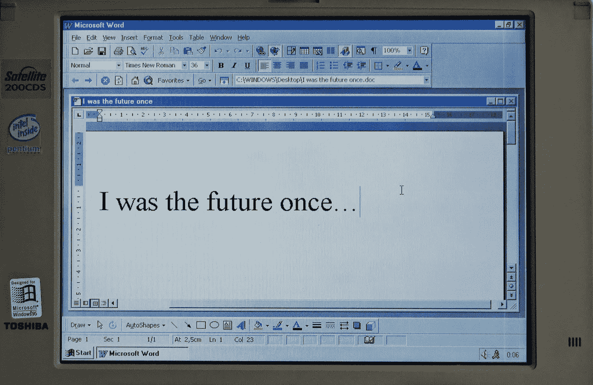

# 使用 Angular 10+和 Nrwl Nx 开发 Office 加载项

> 原文：<https://javascript.plainenglish.io/developing-office-plugins-using-angular-and-nx-5aaf4461e967?source=collection_archive---------2----------------------->

Office 插件(桌面和 OWA)可以使用标准的网络技术开发，但是微软的模板已经“过时”了。



Picture courtesy of [Pedro Santos](https://unsplash.com/@pedro_ag_santos)

使用 Web 平台开发 Microsoft office 插件非常酷。不幸的是，至少在这个时候，微软提供的用于生成基于 Angular 的项目的模板非常“老派”，与现代 Angular/Web/TypeScript 开发不一致。

在本文中，我将向您展示我们可以做得更好，使用标准的 Angular 项目并集成所需的内容，使其作为 Office 插件工作。

我们开始吧！

# TLDR；

*   暂时忘掉官方的约曼发电机(yo no-thanks-office)
*   克隆以下存储库:[https://github . com/dsebastien/office-plugins-NX-workspace-template](https://github.com/dsebastien/office-plugins-nx-workspace-template)
*   使用`npm install`安装依赖项
*   使用`npm start`启动 Word 插件
*   按照 README.md 的指导方针从侧面加载插件
*   享受

# 官方方法及其问题

使用 Angular 开发 Office 插件的官方方法是使用微软提供的 Yeoman 生成器，正如这里的[所解释的](https://docs.microsoft.com/en-us/office/dev/add-ins/quickstarts/sso-quickstart)。

当你遵循指南时，你最终会得到一个类似于[这个](https://github.com/OfficeDev/Office-Addin-TaskPane-Angular)的项目。

生成的项目包括一个非常基本的(尽管已经过时)Webpack 构建，它:

*   将 TS 传输到 JS
*   复制一些资产
*   允许使用自定义自签名证书运行带有 TLS 的开发服务器
*   允许处理 HTML 模板

就其本身而言，这并不坏，但不如 Angular CLI 所能提供的那样强大。

除了 Webpack 构建之外，该项目还包括许多 npm 脚本:

*   用于创建生产版本的`build`脚本(可部署)
*   创建开发构建的`build:dev`脚本(也是可部署的)
*   一个在当地开发的`start`剧本

`start`脚本的优势在于它可以构建/服务 Office 插件，还可以启动 Word/Excel/etc 并根据项目中的 manifest.xml 描述符直接加载插件。

因此，这一部分实际上非常好，因为它使入门和在 Office 应用程序(桌面或 web)中查看应用程序的运行变得轻而易举。

现在来看看不太光彩的部分…

生成的项目不包含 angular.json 文件；可能是因为他们构建/附带加载项目的方式。不幸的是，这意味着您几乎可以忘记 Angular CLI。这是不幸的，因为这使得过去使用 Angular 的开发人员更加困难。

另外，Angular 的版本已经相当过时了(5.x)，相当糟糕。

我确实找到了解决 Angular 版本问题的方法，并发布了带有解决方案的[首个 Github repo，但由于 TypeScript 和 Angular 的问题，我对它一点也不满意。](https://github.com/dsebastien/word-plugin-angular-template)

例如，安装 Angular material 不像平常那么容易，因为项目中没有 angular.json 文件；所以我不得不编了一个并修改文件。此外，我需要修改 Webpack 的构建，以便能够加载 Angular material 样式表(meh)。

此外，Angular/TypeScript 代码受到 Webpack 构建不成熟这一事实的影响。

例如，由于 Webpack 用于打包/构建所有内容的方式，资产需要直接导入到组件中:

```
import { Component } from "@angular/core";
import "../../../assets/icon-16.png";
...
const template = require("./app.component.html");
@Component({  selector: "app-home",  template})
export default class AppComponent {
```

如您所见，组件的模板也是如此。还是那句话，不坏，但是相当讨厌。

此外，整个项目只有一个 CSS 文件，这很糟糕；不可能进行样式封装。

这一切都归结于没有使用标准的 Angular CLI 构建这一事实。

我认为有可能解决这些问题，但我不想在这条路上走得更远。

幸运的是，我找到了一个更干净的替代品。

# 我的方法

在 Github 上发布我的代码后不久，我再次阅读了拉加文·拉詹的文章[。他走的方向与我相反，他使用 NG CLI 创建了一个标准的 Angular 应用程序，并添加了必要的 office 库/引导代码。](https://medium.com/@ragavanrajan/building-office-add-in-using-angular-8-209624ba61ed)

这种方法比官方的约曼发电机要好得多。

他的方法的主要区别是在 Office 中侧加载插件的方式，这有点烦人，但这是一个*一次性*操作。

基本上，它是这样的:

*   在本地主机上构建/提供应用程序(http://localhost:4200)
*   创建一个包含 manifest.xml 文件(也就是外接程序的描述符)的 Windows 共享(所以是的，只在 Windows 上工作，meh)
*   通过大量的点击菜单将共享文件夹的 UNC 添加到受信任的位置
*   加载外接程序
*   享受你剩下的一天

我已经在这里为 Word 详细描述了这个过程，但是对于其他办公产品也是一样。

那我做了什么？

*   我已经创建了一个 Nrwl NX 工作区(为什么不呢)来托管项目；这很好，因为你可以根据自己的需要用 1-n 个 office 插件实现 monorepo
*   我用 Nx CLI 给它添加了一个 Angular 10 应用程序
*   我已经添加了[必要的办公图书馆](https://github.com/dsebastien/office-plugins-nx-workspace-template/blob/main/package.json)
*   我已经添加了[必要的引导代码](https://github.com/dsebastien/office-plugins-nx-workspace-template/blob/main/apps/word/src/main.ts)
*   我摆弄了一下 [angular.json](https://github.com/dsebastien/office-plugins-nx-workspace-template/blob/main/angular.json) 将 office.js 脚本复制到 assets 文件夹。我这样做是因为我想创建的应用程序不使用 CDN 版本。然后，index.html 装载它。如果你想要 CDN 版本，那么只需修改 index.html 文件
*   我已经[配置了 TypeScript](https://github.com/dsebastien/office-plugins-nx-workspace-template/blob/main/tsconfig.base.json) 来使用严格模式，以及角度严格模板
*   我添加了一个示例 manifest.xml 文件
*   我添加了几个实用程序脚本来一次性编译整个 monorepo
*   我测试过它，也用有棱角的材料测试过，只是为了好玩；一切都好！

# 利益

好处是显而易见的:一个标准/普通的 Angular 开发工作流程，更清晰的代码，更好的自动重载开发体验，支持在 Angular 应用程序中使用模板、CSS、模块等的普通方式。

唯一的缺点是增加了侧面加载插件的难度，尽管 Yeoman generator 的方式并没有好到哪里去，因为它经常崩溃；无法启动 Web 服务器。

因此，有了这个，也可以利用 Angular 和 NX CLI，这对任何愿意用 Angular 开发 Office 插件的人来说都是一个很大的改进。

这样，任何习惯使用 Angular 的人也可以轻松地创建 Angular 10+的 Office 加载项，而不会退回到石器时代；-)

# 结论

在本文中，我解释了使用 Angular 开发 Office 插件的官方方法的问题。

我已经介绍了我的替代(FOSS)解决方案及其好处。

如果想开始用 Angular(或者 React btw)开发 office 插件；那么试试这个，你以后会感谢我的..；-)

今天到此为止！