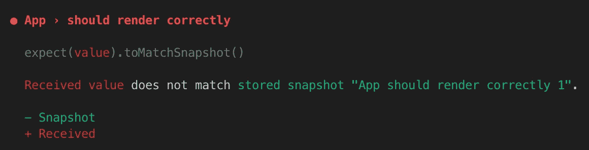

# 伪装的魔鬼:Jest 快照测试

> 原文：<https://javascript.plainenglish.io/devil-in-disguise-jest-snapshot-testing-7bce4573c8aa?source=collection_archive---------4----------------------->

## 为什么应该谨慎使用快照测试


Photo by [Hoil Ryu](https://unsplash.com/@ckhi?utm_source=medium&utm_medium=referral) on [Unsplash](https://unsplash.com?utm_source=medium&utm_medium=referral)

快照测试是一把双刃剑。如果你按照 [Jest](https://jestjs.io/docs/en/snapshot-testing) 推荐的指南使用它，它会是一个很棒的工具。同时，大多数开发人员倾向于不惜一切代价避免它。我也是。在这篇文章中，我会举几个例子来说明为什么`.toMatchSnapshot()`弊大于利。

# 测试变得更难阅读

测试不仅意味着在持续集成(CI)管道中运行，而且也是由人类阅读的。好的测试是你代码的活文档。从下面的测试中你能理解什么？

```
import renderer from 'react-test-renderer';
import LoginForm from './LoginForm';it('should render login form', () => {
  const component = render.create(<LoginForm />); expect(component.toJSON()).toMatchSnapshot();
});
```

基于测试描述，您假设它将呈现`LoginForm`组件而不会崩溃，但是您不知道子组件是什么。更令人沮丧的是，当`LoginForm`基于这样一个布尔属性呈现登录或注册时:

```
it('should render login form', () => {
  const component = render.create(<LoginForm isNew={false}/>); expect(component.toJSON()).toMatchSnapshot();
});it('should render signUp form', () => {
  const component = render.create(<LoginForm isNew={true}/>); expect(component.toJSON()).toMatchSnapshot();
});
```


[https://media.giphy.com/media/XD4qHZpkyUFfq/giphy.gif](https://media.giphy.com/media/XD4qHZpkyUFfq/giphy.gif)

仅仅通过阅读测试，你无法区分登录表单和注册表单之间的区别。现在你必须切换到代码来看看**如何渲染**。如果测试不是您自己编写的，您还想切换到快照文件来查看**它会呈现什么。你只需点击几下，敲几下键盘，滚动几下滚动条，就能到达你想看的地方。如果您可以简单地阅读测试中的所有内容，不是更好吗？**

# 无需调试

听起来不错？(确实讽刺……)。更改代码后，运行测试，一些快照测试失败。



Failed snapshot test output

你认为失败是因为你想要的改变。您只需通过运行`jest --updateSnapshot`更新快照，或者如果您使用`--watch`运行测试，则按下`u`。现在所有测试都通过了。您是修复失败快照测试的专家！

当这成为一种习惯时，你可能就懒得仔细看看 console 的区别了。如果您的预期变更也引入了非预期的输出，该怎么办？

> 我不知道为什么测试失败了。更新快照。我不知道为什么测试通过了。

# 测试很容易被打破

在您更改某些内容后，一些测试应该会中断。这很有道理。然而，它会把你的注意力从真正重要的事情上转移开。

**一般来说，你应该为结果写测试，而不是实现**。您可能会认为快照测试只关心正在呈现的内容，但它实际上包括了如下所示的实现:

```
exports[`App should render correctly`] = `<div
  className="App"
>
  <form
   className="form"
  >
    ...
  </form>
</div>
`;
```

被认为是实现，因为它只是链接到实际 CSS 的命名。当您想要重命名这种实现时，您不希望您的任何测试中断，但是它确实中断了。

# 没有粒度

快照测试对整体来说是很好的，但是它不能告诉你到底哪里出错了。这可能是你的打字错误，你的逻辑，或子组件。


Photo by [Dmitry Ratushny](https://unsplash.com/@ratushny?utm_source=medium&utm_medium=referral) on [Unsplash](https://unsplash.com?utm_source=medium&utm_medium=referral)

你可能会争辩说你可以用更小的测试来获得更好的粒度。如果是这样的话，为什么一开始就需要快照测试呢？多个小测试比一个大快照测试好得多。

# 如果不是快照测试，那么是什么呢？

不久前引入了快照测试，因此人们能够在没有它的情况下编写好的代码和测试，你也一样。相信我。

还有其他很棒的测试库，如[酶](https://github.com/airbnb/enzyme)或[反应测试库](https://github.com/testing-library/react-testing-library)。目标是关注对用户重要的事情。

如果您正在测试一个登录表单，您希望确保该表单呈现一个电子邮件字段、一个密码字段和一个登录按钮。您不必编写针对颜色、字体大小或间距的测试，因为您可以在运行时看到它们。

# 快照测试一点好处都没有吗？

毕竟，如果您知道快照测试的作用并以正确的理念使用它，它可能是一个好的魔鬼。快照测试是专门为 UI 测试而创建的。如果您关注组件中呈现的每一个细节，快照测试可能是您的守护天使。


[https://www.whats-on-netflix.com/wp-content/uploads/2019/03/Lucifer-Season-4-Netflix.jpg](https://www.whats-on-netflix.com/wp-content/uploads/2019/03/Lucifer-Season-4-Netflix.jpg)

> 当你想确保你的用户界面不会发生意外变化时，快照测试是一个非常有用的工具。——【https://jestjs.io/docs/en/snapshot-testing 

你可以进一步阅读[这篇文章](https://benmccormick.org/2016/09/19/testing-with-jest-snapshots-first-impressions/)来决定 snapshot 是否适合你的项目。

# 最后的话

我并不完全反对快照测试，因为它确实达到了预期目的。当人们滥用它或者为了测试覆盖率而编写它时，它就变得适得其反。如果团队中的每个人都有同样的感觉，那么就彻底停止使用快照测试。相反，编写更有意义的测试。快乐测试😃！