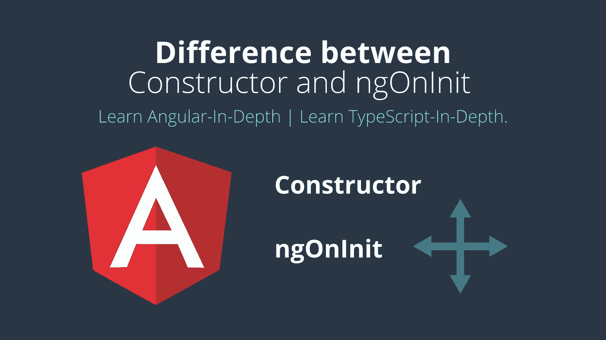

# 构造函数和 ngOnInit 在角度上的差异。

> 原文：<https://javascript.plainenglish.io/difference-between-constructor-and-ngoninit-in-angular-537ecfa6ce1e?source=collection_archive---------1----------------------->

 [## Ionic4 隐藏滚动标题。

### 如何在 Ionic 框架中隐藏内容滚动的标题？

medium.com](https://medium.com/codechintan/ionic-hide-header-on-scroll-b8828a7a7f86) 

学习**深度角度** |学习**深度打字**。
[इसलेखकोहिंदीमेंपढ़नेकेलिएयहांक्लिककरें](https://medium.com/@AnkitMaheshwariIn/angular-constructor-%E0%A4%94%E0%A4%B0-ngoninit-%E0%A4%95%E0%A5%87-%E0%A4%AC%E0%A5%80%E0%A4%9A-%E0%A4%85%E0%A4%82%E0%A4%A4%E0%A4%B0-%E0%A4%B9%E0%A4%BF%E0%A4%82%E0%A4%A6%E0%A5%80-%E0%A4%AE%E0%A5%87%E0%A4%82-%E0%A4%9C%E0%A4%BE%E0%A4%A8%E0%A5%87%E0%A4%82-hindi-6beeb85d4a78)।

# 构造器

*   **构造函数**是类的默认方法，在类被实例化时执行。
*   构造函数确保类及其子类中字段(类成员)的正确初始化。
*   角度依赖注入器(DI)分析构造器参数。
*   当我们调用`new MyClass()`时，它创建了该类的一个新实例。
*   在调用`new MyClass()`时，我们必须将参数类型的精确匹配传递给类的构造函数，例如:
    `new MyClass(arg1:number, arg2:string, argN:any)`
*   这些`arg1:number, arg2:string`、`argN:any`，必须与类`MyClass`的构造函数中定义的类型相同。

# 恩戈尼特

*   **ngOnInit** 是 Angular 调用的一个生命周期钩子，表示 Angular 已经创建了组件。
*   为了使用`OnInit`，我们必须将它导入`component`类中，如下所示:
    `import {Component, OnInit} from '@angular/core';`
*   实际上，在每个`component`中实现`OnInit`并不是强制性的。但被认为是良好的做法。
*   一个类是这样实现`OnInit`的:
    `export class AppComponent implements OnInit { }`

# 使用 ngOnInit

**Angular** 每当检测到组件(或指令)的输入属性值发生变化时，就会调用其`[**ngOnChanges**()](https://medium.com/@AnkitMaheshwariIn/angular-project-with-lifecycle-hooks-understand-ngoninit-in-depth-b9919ad09e6)`方法。

在 [**带生命周期挂钩**](https://medium.com/@AnkitMaheshwariIn/angular-project-with-lifecycle-hooks-understand-ngoninit-in-depth-b9919ad09e6) **的 Angular 项目中了解更多关于`[**ngOnChanges**()](https://medium.com/@AnkitMaheshwariIn/angular-project-with-lifecycle-hooks-understand-ngoninit-in-depth-b9919ad09e6)`的信息。**

# `ngOnInit()`和`constructor()`的区别

*   我们使用`constructor()`进行所有的初始化/声明。
*   最好避免在构造函数中编写实际的工作。
*   `constructor()`应该只用于初始化类成员，但不应该做实际的“工作”。
*   所以我们应该使用`constructor()`来设置依赖注入、类字段初始化等等。
*   `ngOnInit()`是编写“实际工作代码”的好地方，我们需要在类被实例化后立即执行这些代码。
*   像**从数据库加载数据**——在你的 HTML 模板视图中显示给用户。**这样的代码应该用**写 T7。

# 结论

*   **构造函数**初始化类成员。
*   ngOnInit() 是一个放置代码的地方，一旦类被实例化，我们首先需要执行这些代码。

# 接下来，我写了一篇全新的文章

为了让你深入了解[从‘constructor’初始化和‘ngOnInit](https://medium.com/@AnkitMaheshwariIn/angular-project-with-lifecycle-hooks-understand-ngoninit-in-depth-b9919ad09e6)’初始化的区别！这包括在“生命周期挂钩”中。

请跟随[链接](https://medium.com/@AnkitMaheshwariIn/angular-project-with-lifecycle-hooks-understand-ngoninit-in-depth-b9919ad09e6)了解生命周期挂钩:
[带生命周期挂钩的角度项目](https://medium.com/@AnkitMaheshwariIn/angular-project-with-lifecycle-hooks-understand-ngoninit-in-depth-b9919ad09e6)。

> 搞定了。🤩区别是如此简单。
> 
> 再见👋👋
> 
> 欢迎在评论框中发表评论…如果我错过了什么，或者什么是不正确的，或者什么对你不起作用:)
> 继续关注更多文章。
> 
> 更多文章敬请关注:
> [https://medium.com/@AnkitMaheshwariIn](https://medium.com/@AnkitMaheshwariIn)

如果你不介意给它一些掌声👏 👏既然有帮助，我会非常感谢:)帮助别人找到这篇文章，所以它可以帮助他们！

永远鼓掌…

*原载于 2019 年 12 月 26 日*[*【https://www.codewithchintan.com*](https://www.codewithchintan.com/difference-between-constructor-and-ngoninit/)*。*