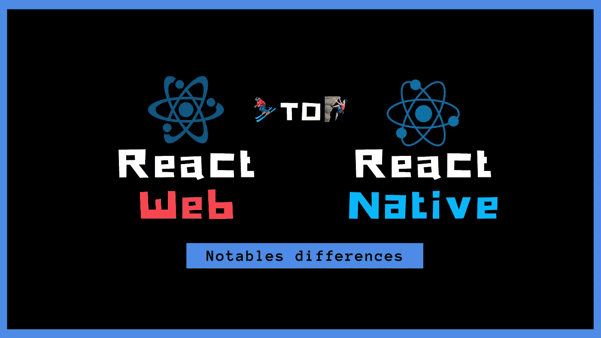

# 新人应该知道的 React 和 React Native 的区别

> 原文：<https://javascript.plainenglish.io/differences-between-react-and-react-native-that-newcomers-should-knows-about-4d2ccc3d1d94?source=collection_archive---------4----------------------->

## 当你从网络转向手机时，需要记住一些事情，这里有一些想法和提示。

经常可以看到开始使用 React Native 的人都有 web 背景，通常是 React web one，但不是唯一的。

🚀React 生态系统的承诺是:“**学一次，写处处”**。

虽然这几乎是真的，但新手可能看不到 web 和移动编程开发流程之间的区别。至少在项目的某个关键时刻之前，这可能是毁灭性的，很难恢复…

我想在这里分享一些技巧，以便以一种更简单的方式帮助迁移到移动堆栈，这个列表并不完整，可能会在本文期间更新。

*那些小技巧大多取自我的 JS Tech Lead*[*Kaliop*](https://medium.com/u/bc4d66204c48?source=post_page-----4d2ccc3d1d94--------------------------------)*的经验。*

我希望下面的内容可以帮助你避免一些错误，并且你会喜欢它。读得好！

# 🎫React Web 应用程序中的应用程序入口点可能有多个，而 React Native 上只有一个入口点

## 使用 react web 的➡️

首先要注意的是，在 web 中使用 React 时，您的应用程序可以从多个入口点启动，至少在使用某种框架如 [**NextJS**](https://nextjs.org/) 时是如此。

那些入口点取决于所请求的 URL，它触发一些特定的组件呈现。

这意味着你应该把你的引导代码看作是一个阻塞的高阶组件(HOC ),而不是我们将在下面看到的 react-navigation 提供的方法。

这样，无论应用程序从哪里启动，应用程序加载组件都将优先执行，并在将控制权交还给用户之前执行强制操作。

我已经在另一篇文章中描述了这种方法，您可以看看:

 [## 如何处理和设计 React 应用程序的启动

### 当构建一个应用程序时，一旦用户到达闪屏，你可能想在…

medium.com](https://medium.com/javascript-in-plain-english/how-to-handle-and-design-the-startup-of-a-react-application-da779f3727e5) 

## 使用 react native (RN)的➡️

相反，React native 作为单一入口点 *(react native web 不是这个断言的一部分)*，一般是`index.js`。

这允许不同的模式，如这里描述的[通过屏幕重定向。](https://reactnavigation.org/docs/en/auth-flow.html)

虽然这看起来是一个很好的方法，但我强烈建议考虑端点可以是多个的，并且出于与最终 react-native-web 未来版本兼容的原因，避免 react-navigation 的 doc 中的重定向策略。

您也可以通过这个自举特设来处理 Deeplink。深度链接是一种以特定意图和参数触发应用打开动作的方式。

# 📵离线体验和缓存策略应该是移动应用中的一等公民，而在 web 中则不然。

由于网络连接不是一个常数，你可能生活在网络不稳定的地方。

也就是说，该应用程序将能够在没有网络连接的情况下启动，并且可以在加载但无法获取内容显示所需数据的状态下结束。

用户可能认为他可以访问某些内容，然而他没有，最好的情况是他会看到陈旧的内容。

**这就是为什么你真的应该考虑离线作为你的应用程序和结构的核心。**

如今，即使网络越来越好，如果不考虑这一点，做一个 app 也毫无意义。

**⚡️The 网络不得不被认为是你的 app** 的改进。

乍一看，这可能有点棘手，尤其是当来自 web 背景时，但是有很多工具可以使这项任务变得更容易，例如使用 Firebase 的 [**【云 Firestore】**](https://firebase.google.com/docs/firestore)**或使用 GraphQL 的[**Apollo-client**](https://www.apollographql.com/docs/react/)**。****

**我还写了一篇关于这一切的文章，你可能有兴趣看看。**

** [## 基于离线弹性反应的应用程序的一般注意事项

### 你应该总是首先把你的应用程序设计成离线的，并且把网络看作是一个增强和…

medium.com](https://medium.com/javascript-in-plain-english/general-considerations-for-offline-resilient-react-based-apps-8dcb7181e495) 

**💡注意:** *我们刚刚讨论的内容也适用于渐进式 web 应用程序，这是一种使用 web 浏览器功能和 API 的移动应用程序。*

# 非同构的 Web 库不能在 React native 上工作

你真的应该小心你将要使用的库，它们中的一些构建得很糟糕，当它们试图访问 NodeJS 和 React Native 上不可用的`window`全局对象时，可能会使你的应用在导入它们时崩溃。

您也不能使用大多数基于 NodeJS API 的库，比如在文件系统上读写的库:`fs`。

还要注意的是， **React 门户在 React 原生** API 中不可用，相反你可以看一下这个:

 [## cloud flare/react-网关

### 将 React DOM 渲染到一个新的上下文(又名“门户”)中。这可以用来实现各种 UI 组件，如模态…

github.com](https://github.com/cloudflare/react-gateway) 

# React native 依赖于所有的移动问题，而 react web 只是 web…

构建移动应用时，你需要记住许多问题和规则:

*   **苹果应用商店**和 **Google Play** 会对你的应用进行审核。这可能会将您的交付时间从几个小时延迟到几天。
*   **你可以同时拥有多个版本的应用**，因为用户可能不想更新或者忘记了。
*   **热修复补丁的惰性大大增强**，特别是由于第一规则，但也因为一般的构建和交付过程。
*   移动包需要更复杂的 CI / CD 集成，还需要交付代码签名。
*   **推送通知是互动工具的核心，也是最佳的保留策略。由于它们在 2019 年在网络上不太受欢迎，它们在移动应用程序上是强制性的。**
*   崩溃报告是强制性的，否则你就完全瞎了。

考虑到这一点，你应该做出相应的调整。

**💁🏻‍♂️Here 是一些想法，以适应这些概念你的工作流程。**

1.  你可以设置一个**渐进式应用功能展示**，以确保在向每个人发布新的更新之前一切正常。首先激活 1%用户群的更新，然后逐步扩大。
2.  你还需要在多种设备上测试你的应用，并断言你使用的模拟器或手机是顶级手机。您的用户在生产中肯定不会有这样的性能，请始终测试低层设备，否则您可能会有不好的意外。
3.  **开始安全编程**🔐这意味着你不能相信来自网络的数据。API 可能会改变，你需要确保在访问它之前，你得到的每一个结果都是真实定义的。您可以通过**版本化您的后端 API** 来减少这种情况，并确保您没有删除现有的字段，而只是添加新的字段。
4.  **崩溃报告不是可选的**因为您需要知道为什么您的应用程序性能不佳，这可以在 UAT 环境中工作，但在生产中的一些边缘情况下您可能会错过。想到的工具有**[**哨兵**](https://sentry.io/) 或者 [**Bugsnag**](https://www.bugsnag.com/) 。**
5.  **为您的配置项考虑云解决方案，例如 [**Github Action**](https://github.com/features/actions) 或 [**Bitrise**](https://www.bitrise.io/) ，它们为您的构建提供了两台 MacOS 计算机。****