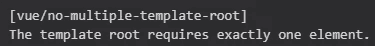
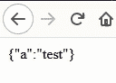
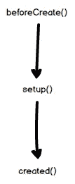

# Vue 2 和 Vue 3 的区别

> 原文：<https://javascript.plainenglish.io/differences-between-vue-2-and-vue-3-ee627e2c83a8?source=collection_archive---------0----------------------->

## Vue 3 是一个渐进式的 JavaScript 框架，是 Vue 的最新版本。它帮助开发人员创建易接近的、通用的、高性能的、可维护的、可测试的代码库。


Photo by [John Schnobrich](https://unsplash.com/@johnschno?utm_source=unsplash&utm_medium=referral&utm_content=creditCopyText) on [Unsplash](https://unsplash.com/s/photos/computer?utm_source=unsplash&utm_medium=referral&utm_content=creditCopyText)

Vue 3 正式版将于 2020 年第三季度发布。它目前处于发布候选阶段，这意味着 API、核心、结构是稳定的，并且能够成为产品发布，除非出现重大错误。因此，现在是弄清楚 Vue 3 和 Vue 2 之间的编程差异并做出必要调整的适当时机。

Vue 3 和 Vue 2 并没有绝对的改变，但是当 Vue 2 重写完成后，一些预期的升级变成了现实。预期意味着它使我们的应用程序更小、更快、更强大。

这篇文章是写给那些有 Vue 2 使用经验的人的。

# 基本要素

*   [Vue 2](https://vuejs.org/)
*   [Vue 3](https://v3.vuejs.org/)

# 创建应用程序

首先，看看创建一个应用程序的方式，你会看到语法上的不同。不仅句法变了，本质也变了。

## Vue 2

## Vue 3

## 改变的原因

*   全局配置会在单元测试中产生问题，因为测试用例会因全局配置而相互影响。所有这些影响都是污染。
*   Vue 3 提供了不同的全局配置，但是很难将配置的副本共享给多个`apps`。

示例:

*   Vue 2

*   Vue 3

# 多重根

在 Vue 2 中，您只在模板中实现一个根节点，但是 Vue 3 不再要求组件有一个根节点，这意味着它在模板中为开发人员提供了多个根节点。



这条消息从来不会出现在 Vue 3 中。

## Vue 2

## Vue 3

# 组合 API

创建组合 API 的原因是:

*   大型组件变得难以阅读和维护。
*   管理和维护组件之间的逻辑是一个大问题(mixins)。

因此，组合 API 的出现将解决上述问题。

组合 API 的特性包括:

*   最佳类型脚本支持。
*   组件太大，良好的代码组织是必需的。
*   需要可重用的代码。

*注意:如果想在 Vue 2 中使用 composition API，可以使用* [*这个插件*](https://github.com/vuejs/composition-api) *。*

## 设置

要使用 Composition API，我们应该从`setup()`方法开始。

在 Vue 3 中，您可以用以下选项替换`setup()`方法:

*   成分
*   小道具
*   数据
*   方法
*   计算属性
*   生命周期方法

*注意:Vue 3 开发可以像 Vue 2 一样正常使用以上所有，不需要 setup()方法。*

## 反应参考

`ref`是“反应式引用”,它包装原始数据以允许我们跟踪变化。别忘了我们在 Vue 2 中使用`data()`来包装对象内部的原语。

**Vue 2**

**Vue 3**

## 方法

Vue 2 有一个单独的方法部分，但是在 Vue 3 中，你可以在`setup()`方法中定义方法。这是一个使用`setup()`方法创建方法的例子。

**Vue 2**

**Vue 3**

## 计算

Vue 2 有一个单独的部分用于`computed`，但是你可以在`setup()`方法中定义一个函数。让我向您展示如何在`setup()`方法中实现`computed`。

**Vue 2**

**Vue 3**

## 看

Vue 2 提供了一种观察数据变化并对其做出反应的方式，这就是`watch`属性，但是 Vue 3 提供了一些新的东西来做这件事。

**Vue 2**

**Vue 3**

新版本为反应式观察数据的变化提供了一个新的东西叫做`watchEffect()`。当它们的依赖关系改变时，它将重新运行。

或者可以用 Vue 2 熟悉的`watch`功能。

## 小道具

你可以在没有`this`的情况下在设置中访问道具:

```
setup(props) {
  watch(() => {
    console.log(props.name);
  });
}
```

# 拆下 Vue 过滤器

Vue 3 中不推荐使用的过滤器可用于应用常见的文本格式。

Vue 2 中的过滤器示例:

这是一个局部过滤器声明的例子。

```
filters: {                           
  formatUnix(value) {                             
    if (value) {                               
      return moment(value).format("DD/MM/YYYY");
    }                           
  },                         
},
```

如何使用此过滤器(格式化日期)。

```
{{ new Date() | formatUnix }}
```

使 Vue 过滤器美化模板的目标是能够在多个组件中重复使用，但它可以由`methods`替换，因为在性能方面没有区别。Vue writer 决定移除过滤器的另一个原因是语法，`{{ new Date() | formatUnix}}`和`|`很奇怪，这让开发者很困惑。移除过滤器的最终原因是，它将鼓励开发人员创建更一致的函数来重用每个组件中已建立的显式方法。

示例:

DateFormat.js

App.vue

# 多个虚拟模型

正如我们所知的 Vue 2，`v-model`是给定组件上的双向绑定，但是我们可以在 Vue 2 中使用单个`v-model`。对于那些对双向绑定一无所知的人来说，双向绑定使得用户输入值在父组件和子组件之间同步，而`v-model`是传递`value`属性和监听`input`事件的快捷方式。

## Vue 2

这是 Vue 2 中一个简单的`v-model`。

```
<input v-model="property" />
```

我们可以用另一种方式编写上面的示例，但效果与下面的代码相同:

```
<input                          
  :value="property"                         
  @input="property = $event.target.value"                       
/>
```

## Vue 3

InviteForm.vue

App.vue

一个组件可以像这样处理多个 v-model:

`<InviteForm v-model:name=”inviteName” v-model:email=”inviteEmail” />`

在组件中，我们有两个道具，分别是字符串类型的`name`和`email`。为了更新父组件的值，我们使用发出一个事件来处理如下属性:

*   更新名称`emit(“update:name”, value);`的值
*   更新电子邮件的值`emit(“update:email”, value);`

所以它比 Vue 2 更简单易用，Vue 2 至少有 2 个事件来在多值处理中将每个值从子组件同步到父组件。

# 模块化的

您应该使您的代码模块化，可以按功能进行组织，并且可以跨其他组件重用。在这一部分，我将介绍另一种方法，而不是`mixins`。

我们将`setup()`中的任何东西分离到另一个名为**复合函数**的函数中，并且我们应该将它保存在一个 JavaScript 文件中以便重用。

而这就是如何复用**合成函数。**

正如你在上面看到的，我们使用`setup()`方法来实现 2 个复合函数，然后我们可以正常使用所有的内部函数。

# 入口

传送门的另一个名字是**传送组件。** Portal 允许我们指定模板 HTML，即使它不属于应用程序，我们也可以将其带到 DOM 的其他部分。

```
<div id="app"></div>
<div id="out-side-app"></div>
```

id 为`out-side-app`的 DOM 是外部应用，我们可以通过使用**门户**与之交互。

```
<template>
  <teleport to="#out-side-app">
  This is teleport
  </teleport>
  <div>APP</div>
</template>
```

要使用 transport 组件，我们需要定义“To”属性，该属性接受一个 DOM 查询选择器。

```
<teleport to=”#out-side-app”>
```

我们使用 id 来选择 DOM，我们也可以像这样使用一个类来选择 DOM:

```
<teleport to=”.anyClass”>
```

# 焦虑

**suspension**是一个特殊的组件，它代替你的组件呈现回退内容，直到满足一个条件，比如一个加载的后端 API。下面的代码是一个使用悬念回调 API 的例子。

有一个调用 API 的合成函数。

有一个简单的演示组件。

有一个悬念成分的例子。

在`<template #default>`内部，我们将具有返回 Promise 或异步组件的`setup()`方法的组件放在这里。

在`<template #fallback>`里面，我们放了载入时显示的东西，比如微调器、图标或者类似的东西。



Suspense demo

# 生命周期挂钩

Vue 2 生命周期方法:

*   创建之前()
*   已创建()
*   安装前()
*   已安装()
*   更新前()
*   已更新()
*   销毁前()

Vue 3 生命周期中有一些新的挂钩:

*   `beforeDestroy()`变成了`beforeUnmount()`
*   `destroyed()`变成了`unmounted()`
*   `onRenderTracked`在渲染函数中第一次访问反应依赖时被调用。
*   `onRenderTriggered()`当一个新的渲染被触发时被调用，允许你检查一个组件什么时候重新渲染。

我们可以在`setup()`方法内部回调钩子。

我们可以对`setup()`方法中的其他钩子做同样的事情，比如`onBeforeUpdate()`、`onUpdated()`等等。

使用组合 API 时不需要`beforeCreate()`和`create()`方法，因为 app 会在`setup()` hook 之前调用`beforeCreate()` hook，在`setup()`之后立即调用`created()` hook。因此我们可以使用`setup()`来处理我们在`beforeCreate()`和`create()`中需要的东西。



# 性能改进

Vue 3.0 侧重于性能改进:

*   [更小尺寸的核心](https://docs.google.com/presentation/d/1yhPGyhQrJcpJI2ZFvBme3pGKaGNiLi709c37svivv0o/preview#slide=id.g42acc26207_0_169)
*   [摇树](https://www.youtube.com/watch?v=XkOMOeEAFQI&feature=youtu.be&t=612)
*   [优化的插槽生成](https://docs.google.com/presentation/d/1yhPGyhQrJcpJI2ZFvBme3pGKaGNiLi709c37svivv0o/preview?slide=id.g4689c30700_0_104)
*   [吊装和内联](https://docs.google.com/presentation/d/1yhPGyhQrJcpJI2ZFvBme3pGKaGNiLi709c37svivv0o/preview#slide=id.g4689c30700_0_114)


Photo by [Glenn Carstens-Peters](https://unsplash.com/@glenncarstenspeters?utm_source=unsplash&utm_medium=referral&utm_content=creditCopyText) on [Unsplash](https://unsplash.com/s/photos/computer?utm_source=unsplash&utm_medium=referral&utm_content=creditCopyText)

# 结论

Vue 3 是 Vue 的转折点，我是 Vue 的超级粉丝，所以我没有理由忽视它。

虽然 Vue 3 对 Vue 2 的许多改变使得熟悉 Vue 2 的开发者不得不花时间学习新的东西，但在我看来，这是有价值的。也许这篇文章仍然有一些缺点，所以我总是欢迎大家的反馈。感谢阅读。