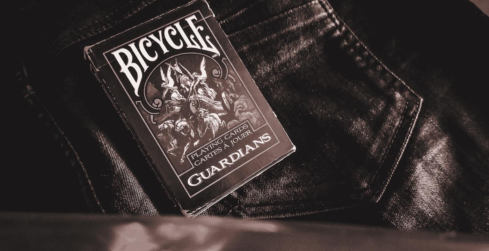

# Vue 组件中的属性和数据不同

> 原文：<https://javascript.plainenglish.io/different-between-props-and-data-in-vue-components-d571cfa078e4?source=collection_archive---------2----------------------->



Photo by [Ady TeenagerInRO](https://unsplash.com/@teenagerinro?utm_source=medium&utm_medium=referral) on [Unsplash](https://unsplash.com?utm_source=medium&utm_medium=referral)

Vue.js 是一个易于使用的 web 应用框架，我们可以用它来开发交互式前端应用。

在本文中，我们将了解 Vue 组件中道具和数据的区别。

# 道具和数据有什么区别？

道具和数据是有区别的。数据存储在每个组件的私有内存中，我们可以在那里存储我们需要的变量。道具从父组件传递到子组件。

然而，它们都是从组件中的`this`引用的。

Props 是我们将数据从父组件传递到子组件的方式。

数据通过 props 沿着组件树向下流动。我们可以将数据从父节点传递给子节点，如下所示:

`components/Button.vue`:

```
<template>
  <button>{{text}}</button>
</template><script>
export default {
  name: "Button",
  props: {
    text: String
  }
};
</script>
```

`App.vue`:

```
<template>
  <div id="app">
    <Button text="Hello"/>
  </div>
</template><script>
import Button from "./components/Button.vue";export default {
  name: "App",
  components: {
    Button
  }
};
</script>
```

在上面的代码中，我们有接受`Button`中一个字符串的`text`道具。然后在`App`中，我们有了`Button`组件，它有了`text`属性，我们将`'Hello'`字符串传递给它。

我们必须添加`props`属性来指定我们实际上想要将`text`作为道具。该值也可以是验证函数。此外，值`props`可以是道具名称的数组，而不是对象。然而，如果它是一个数组，我们将不会得到任何正确数据验证。

因此，我们将看到按钮显示`Hello`作为按钮文本。

数据是每个组件的内存。它用于存储组件实例中的内部数据。

例如，如果我们想在组件中保持计数，我们可以编写以下代码:

```
<template>
  <div id="app">
    {{ count }}
    <button @click="count++">+</button>
    <button @click="count--">-</button>
  </div>
</template><script>
export default {
  name: "App",
  data() {
    return {
      count: 0
    };
  }
};
</script>
```

在上面的代码中，我们有一个`data`方法，它返回一个带有`count`属性的对象。`count`属性是数据。然后我们可以像在按钮中一样引用模板中的`count`来更新计数并显示它们。

数据留在组件中，除非我们将它们作为道具传递给子组件，或者用数据向父组件发出一个事件。

# 它们都是反应性的

道具和数据都是反应性的。这意味着每当它们改变时，计算的属性被重新评估，观察器被运行，模板被重新呈现。

因此，当在上面的例子中更新`count`时，我们将看到显示的新值。

关于数据反应性的一切也适用于道具。

# 避免命名冲突

道具和数据不能重名。这是因为它们都是`this`的财产。和对象不能有两个同名不同值的属性。

因此，如果我们在下面的组件中有`text`道具:

```
<template>
  <button>{{text}}</button>
</template><script>
export default {
  name: "Button",
  props: {
    text: String
  }
};
</script>
```

那么我们不能在由`data`方法返回的对象中有`text`属性。


Photo by [Stephen Dawson](https://unsplash.com/@srd844?utm_source=medium&utm_medium=referral) on [Unsplash](https://unsplash.com?utm_source=medium&utm_medium=referral)

# 一起使用道具和数据

我们可以把数据作为道具的值传递下去。因此，我们可以共享数据作为道具的值，然后引用作为道具传递的数据。

例如，我们可以将数据作为属性值传递给子组件，如下所示:

`components/Name.vue`:

```
<template>
  <p>{{name}}</p>
</template><script>
export default {
  name: "Name",
  props: {
    name: String
  }
};
</script>
```

`App.vue`:

```
<template>
  <div id="app">
    <input v-model="name">
    <Name :name="name"></Name>
  </div>
</template><script>
import Name from "./components/Name.vue";
export default {
  name: "App",
  components: {
    Name
  },
  data() {
    return {
      name: ""
    };
  }
};
</script>
```

在上面的代码中，我们有`:name=”name”`，它将`name`属性设置为数据`name`的值。

然后在`Button`中，我们显示`name`道具的值。因此，当我们在输入中键入一些内容时，我们会看到输入值显示在其下方。

# 结论

道具和数据服务于不同的目的，尽管它们都被`this`引用。

要定义 props，我们必须将`props`属性添加到组件中，将 props 的名称作为属性名称，将数据类型作为值。该值也可以是一个函数。除了对象，`props`属性也可以是数组。

道具和数据不能在同一个组件中重名。但是，我们可以一起使用它们。

## **简明英语团队的笔记**

你知道我们有四种出版物吗？给他们一个 follow 来表达爱意:[**JavaScript in Plain English**](https://medium.com/javascript-in-plain-english)，[**AI in Plain English**](https://medium.com/ai-in-plain-english)，[**UX in Plain English**](https://medium.com/ux-in-plain-english)，[**Python in Plain English**](https://medium.com/python-in-plain-english)**—谢谢，继续学习！**

**此外，我们总是有兴趣帮助推广好的内容。如果您有一篇文章想要提交给我们的任何出版物，请发送电子邮件至[**submissions @ plain English . io**](mailto:submissions@plainenglish.io)**，附上您的媒体用户名和您感兴趣的内容，我们将会回复您！****