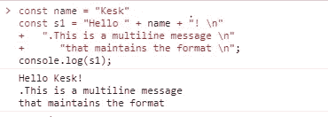
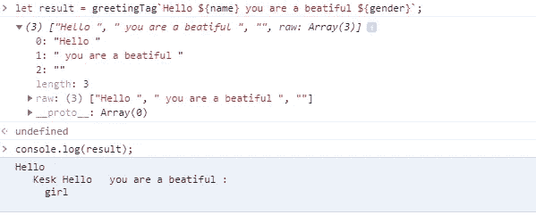
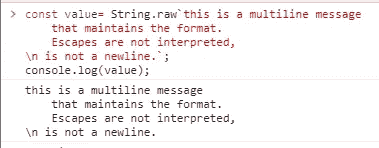
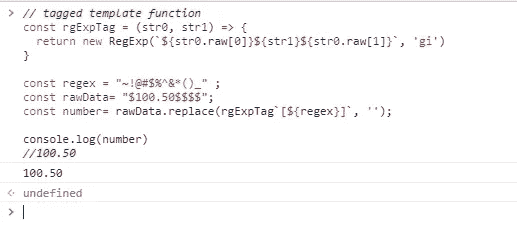

# JavaScript 中模板文字的不同用法

> 原文：<https://javascript.plainenglish.io/different-uses-of-template-literals-in-javascript-50e22a618436?source=collection_archive---------7----------------------->

## 你可以用它们做比你想象的更多的事情


Two monitors with background code

ES2015 版 ECMAScript 规范(ES6)中引入的模板文字(*或模板文字的旧名称:模板字符串*)提供了一种在 JavaScript 中制作字符串的新方法，增加了许多强大的新功能，例如使用占位符在字符串中嵌入表达式，以及更容易地生成多行字符串。

语法很简单，只需使用*反斜杠*而不是双引号或单引号:

```
const literal = `hello!`
```

它们提供了几个用引号构建的常规字符串所没有的功能，特别是:

*   它们提供了一种在字符串中包含变量和表达式的简单方法。
*   模板文字为定义多行字符串提供了很好的语法。
*   他们允许使用模板标签创建[DSL](https://martinfowler.com/books/dsl.html)。
*   格式化一个字符串更简单，因为格式保持不变。

## 索引:

*   声明字符串
*   带有插值表达式的多行
*   标记模板
*   Shell 命令
*   嵌入式 HTML
*   原始字符串
*   可定制的正则表达式

让我们看一些有用的例子。

## 声明字符串

在 JavaScript 中，您可以使用单引号(“”)编写字符串:

```
const single = 'Hello'
```

或者使用双引号(" "):

```
const double = "Hello"
```

在 JavaScript 中，单引号和双引号字符串没有明显的区别。

现在，如果您想包含一个表达式，您可以:

```
let name= "Kesk";const hello = "Hello" + name + "!";console.log(hello);
//Hello Kesk
```

但是，如果你想格式化一个文本，或者文本中有多个表达式，这就变得复杂了:

要实现这一点:

```
//Hello Kesk!
  //.This is a multiline message
    //that maintains the format
```

我们可以做到:

```
const name = "Kesk"const s1 = "Hello " + name + "! \n"
+   ".This is a multiline message \n"
+      "that maintains the format \n";console.log(s1);
```



Result in chrome dev tools.

但是如果您使用 ES6 字符串文字，就更简单了:

## 带有插值表达式的多行

正如您在本例中看到的，我们在文本中包含了一个变量。此外，它保持了我们给它的格式，结果更清晰、更明显。

我们使用反勾号来编写一个字符串文字:“带有表达式的字符串”。要插入变量和表达式，可以使用${…}语法。

```
const name = 'Kesk';console.log(`Hello ${name}!
  this is a multiline message
    that maintains the format`);//Result:
//Hello Kesk!
  //this is a multiline message
    //that maintains the format
```


Result in chrome dev tools.

## 其他使用案例:

## 标记模板

多亏了模板文字，你可以创建**标记的**模板文字，它是允许嵌入表达式的字符串文字。您可以对它们使用多行字符串和字符串插值功能。

被标记的模板以一个 ***标记函数*** 开始，该函数解析模板文字，返回一个动态字符串。“标记函数”的第一个参数是一个包含所有字符串的数组。剩下的参数是表达式。

```
let name = 'Kesk';
let gender = 'female';
function greetingTag (strings, name, gender) { //strings is an array.
 console.log(strings); //"Hello"
 let str0 = strings[0];
 //"you are a beutiful"
 let str1 = strings[1];

 let text = gender === 'female' ? 'girl' : 'man'

 //Return a string built 
 //using a template literal
  return `**${str0}
   ${name} ${str0} ${str1}:
     ${text}** 
 `;
}let result = greetingTag`Hello ${name} you are a beatiful ${gender}`;console.log(result);
```



Result of executing greetingTag in chrome dev tools.

您可以使用 ES6 模板文字做的其他事情:

## Shell 命令

使用 [sh.js](http://shjs.tuton.fr/) 和模板文字，您可以编写和执行 shell 命令。

sh.js 是运行在 [node.js](http://nodejs.org/) 上的 Unix shell 脚本的 JavaScript 库。

您需要编写一个 JavaScript 文件，并用 node.js 运行它

*   npm 安装 sh

ls.js

```
let sh = require('sh');let ls = sh`ls -a`;
```

>节点 ls.js

## 嵌入式 HTML

使用 [lit-html](https://lit-html.polymer-project.org/) 和 JavaScript 模板文字，您可以快速编写 html 模板。

```
import {html} from 'lit-html';//A lit-html template
//uses the `html`
//template tag:
html`<div>
       <a href="${url}">${name}</a>
     </div>`
...
```

## 原始字符串

template literal 的 Raw 方法允许在输入时访问原始字符串，而不处理转义序列。

```
const value= String.raw`this is a multiline message
    that maintains the format.
    Escapes are not interpreted,
\n is not a newline.`;console.log(value);//this is a multiline message
//    that maintains the format.
//    Escapes are not interpreted,
//\n is not a newline.
```



Result of executing our `String.raw` function in chrome dev tools.

## 可定制的正则表达式

您也可以使用 regexp 构造函数通过文字模板构建 RegExp:

```
const regex = new RegExp(String.raw`write pattern as in regex literal without delimiters`)
```

或者用标记模板和模板文字构建复杂的 RegExp:

```
// tagged template function
const rgExpTag = (str0, str1) => {
  return new
  RegExp(`${str0.raw[0]}${str1}${str0.raw[1]}`, 'gi')
}const regex = "~!@#$%^&*()_" ;
const rawData= "$100.50$$$$";const number =
 rawData.replace(rgExpTag`[${regex}]`, '');console.log(number)
//100.50
```



Result of executing our rgExpTag function in chrome dev tools.

## 结论

使用模板文字，处理字符串更加自然，您可以创建字符串并在字符串中插入表达式，而无需任何连接或转义。模板标签也是许多流行库使用的一个有用的特性，但是正如您所看到的，您可以将模板文字用于其他有用的事情。

非常感谢您阅读这篇文章。希望对你有用！保重！