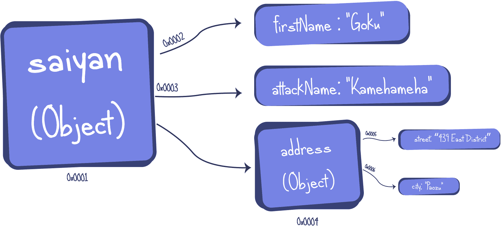
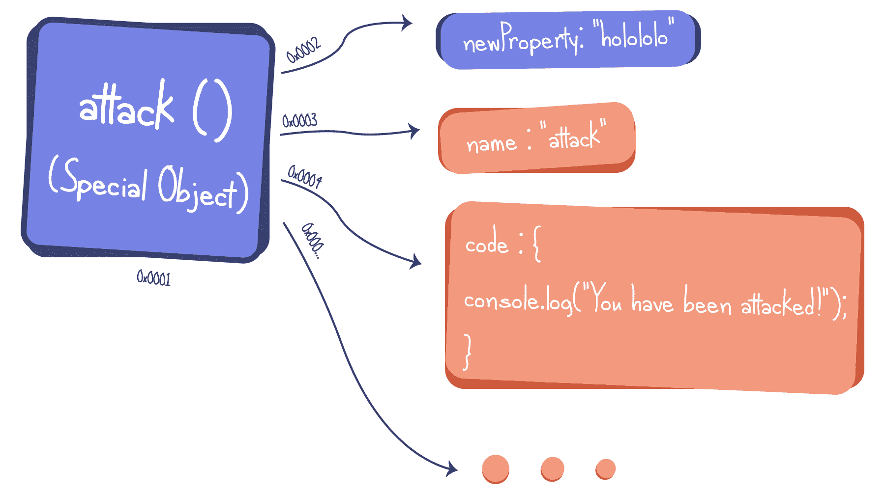
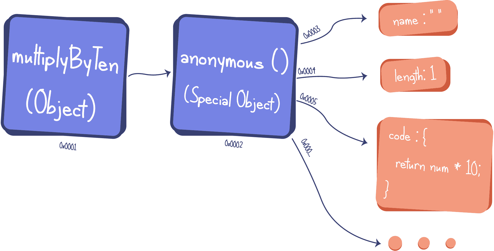
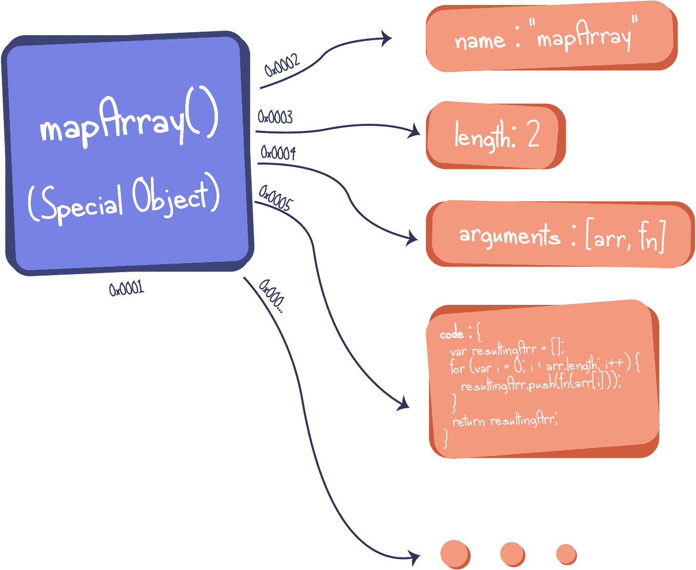

# 用 JavaScript 尝试函数式编程

> 原文：<https://javascript.plainenglish.io/dipping-your-toes-in-functional-programming-with-javascript-8188e0439df3?source=collection_archive---------9----------------------->

Dipping your toes in functional programming with JavaScript

JavaScript 中的函数是一些开发人员讨厌这种语言的原因之一。但是 JavaScript 函数简直就是被误解的小生物！一旦你了解他们，你就不会害怕他们，甚至会喜欢他们和他们所有的小怪癖。

所以在这篇文章和接下来的文章中，我们将回到基础知识，进入 JavaScript 及其函数的**不同的世界。它们是什么，它们如何工作，它们如何被调用，什么是闭包，什么是函数构造器，它们如何与原型继承一起工作？而函数式编程又是什么鬼？**

**首先，今天我们来看看 JavaScript 中到底有哪些函数。**

****简答:**在 JavaScript 中，函数就是对象。那是一种特殊的物体！**

**我们都知道对象是名称/值对的集合，它可以是一个原语(数字、字符串、布尔值……)或另一个对象，例如:**

**这是它在内存中的位置:**

****

**An Object sitting in memory**

**所以 JavaScript 中的一个对象在内存中占据一个位置，并且有一堆对内存中其他东西的引用，比如原语或其他对象。**

**在 JavaScript 中，函数做完全相同的事情，它位于内存中，有一堆对原语、对象等事物的引用…所以在 JavaScript 中做以下事情完全没问题:**

**但是是什么让一个函数不同于一个简单的对象呢？这个函数是一个**特殊对象**，它引用了同样位于内存中的**特殊对象**，并将其定义为一个函数，例如:**

*   **名称:函数的名称**
*   **代码:函数被调用时将被执行的代码(这是函数的一个属性，而不是函数本身)**
*   **参数:函数的参数**
*   **Length:函数需要多少个参数**

**除其他外…**

**这是我们在内存中的函数示例:**

****

**A function sitting in memory**

**就像一个物体一样，我们可以用函数做任何我们可以用物体做的事情:**

*   **将它们赋给一个变量**
*   **将它们作为参数传递给其他函数**
*   **从其他函数返回它们**
*   **即时创建它们**

> ****这是一级函数的定义**。**

**这意味着，在 JavaScript 中，我们可以很容易地想出一些非常强大的模式。让我们看一个例子，并浏览一下:**

****将函数分配给变量:**在这个例子中，我们首先使用函数表达式创建一个函数，然后将它分配给一个变量，这个变量可以在以后用于传递函数、调用它、向它添加属性…**

**现在我们在第 1 行创建的这个函数是我们称之为**的匿名函数**，它没有名字。当然，我们有变量 *multiplyByTen* 来访问它，但是真正的 *multiplyByTen* 不是函数本身，它是在内存中创建的一个对象，指向一个没有名字的函数，它在内存中看起来是这样的:**

****

**Anonymous function in memory**

*****Nota Bene:*** *作为表达式创建并赋给变量的函数不被提升。如果想了解更多关于吊装的知识，请查看* [*我的上一篇文章*](https://medium.com/javascript-in-plain-english/what-is-hoisting-in-javascript-7ad4f391c40e) *。***

****期望一个函数作为另一个函数的参数:**在第 5 行，我们创建了一个名为 *mapArray* 的函数，它有两个参数，第一个参数是一个数字数组，第二个参数是一个函数。砰，你得到了一个高阶函数！**

**一个什么？一个**高阶函数**，描述一个简单概念的另一个花哨词:**

> **当一个函数接受另一个函数作为参数，或者返回另一个函数作为结果，或者有时两者都做，它被称为**高阶函数**。**

**在 *mapArray* 中，我们循环遍历数组，对于数组中的每个元素，我们执行一个函数，这个函数是我们作为参数得到的，并将结果推送到一个新的数组中，然后返回这个新的数组。这是在内存中:**

****

**mapArray in memory**

****将一个函数作为参数传递给另一个函数:**在第 15 行，我们调用了带有两个参数的 *mapArray* 函数:一个由 1 到 5 的数字组成的数组和由变量 *multiplyByTen* 引用的函数，该函数只取一个数字并乘以 10。*然后创建 mapArray 的*执行上下文。代码将获取数组中的每个元素，对其应用 *multiplyByTen* 函数，并将其存储在一个新的数组中，然后执行该代码，并返回新的数组。**

**在我们的例子的最后有了 console.log，我们得到了打印到屏幕上的 *[10，20，30，40，50]* 。**

****>欢迎来到** **功能编程**！**

> **这是**函数编程**的基础:函数是**第一类公民，**我们能够像对待任何其他类型的函数一样对待函数，就像一个原语或一个对象一样。在函数中传递它们，从函数中返回它们，将它们赋给一个变量，然后动态创建它们。**

**让我们用另一个例子来结束今天的文章，一行一行地看:**

**我们从第 1 行开始，创建一个函数 *attack()* ，其中:**

*   **我们在*(第 2 行)*上创建了一个*匿名*函数**
*   **并将其退回，使 attack()成为什么？没错！一个**高阶函数。****

**然后，我们调用第 7 行中的 *attack()* 函数，并将其结果赋给变量 *throwAttack* 。**

*   **现在， *throwAttack* 变量到底指的是什么？又对了！一个功能。**

**最后，我们调用了 *throwAttack* 引用的函数，我们在屏幕上看到了下面的内容:“*小悟空抛出了一个 Kamehameha* ”**

**对于一些初学者来说，一开始可能会感到困惑，而对于熟悉 JavaScript 的人来说，这似乎是显而易见的。但是 *throwAttack* 所指的匿名函数是怎么知道*攻击者*是“*子悟空*”的呢？就编写的代码来看 *throwAttack()* 只有一个参数，它就是“ *Kamehameha* ”。那么到底发生了什么？**

**剧透:**关闭**，我们接下来会见到他们:)敬请期待！**

# ****TL；博士****

**1-在 JavaScript 中，函数是对象，特殊的对象。**

**2-函数有特殊的属性，如**名称**、**参数**、**长度**、**代码** …将它定义为函数**

**3-匿名函数没有名字，通常有一个对象引用它。**

**4-当一个**函数是第一类**时，它被视为任何其他类型，就像原语或对象一样:你可以将它们赋给变量，从函数返回它们，将它们作为参数传递给函数，并动态创建它们。**

**5- **高阶函数**是简单的将其他函数作为自变量，或者返回它们的结果，或者两者都有。**

**6-**函数式编程的基础**是将函数视为一等公民。**

**考塔尔·拉格达尼**

** [## Kaoutar Lagdani |全栈开发者

### 考塔尔·拉格达尼个人网站

lagdani.com](http://lagdani.com) 

# **来自简明英语团队的通知**

你知道我们有四种出版物吗？给他们一个 follow 来表达爱意:[**JavaScript in Plain English**](https://medium.com/javascript-in-plain-english)，[**AI in Plain English**](https://medium.com/ai-in-plain-english)，[**UX in Plain English**](https://medium.com/ux-in-plain-english)，[**Python in Plain English**](https://medium.com/python-in-plain-english)**—谢谢，继续学习！**

**我们还推出了一个 YouTube，希望你们支持我们，通过 [**订阅我们的简明英语频道**](https://www.youtube.com/channel/UCtipWUghju290NWcn8jhyAw)**

**一如既往,“简明英语”希望帮助推广好的内容。如果您有一篇文章想要提交给我们的任何出版物，请发送电子邮件至[**submissions @ plain English . io**](mailto:submissions@plainenglish.io)**并附上您的媒体用户名和您感兴趣的内容，我们将会回复您！******