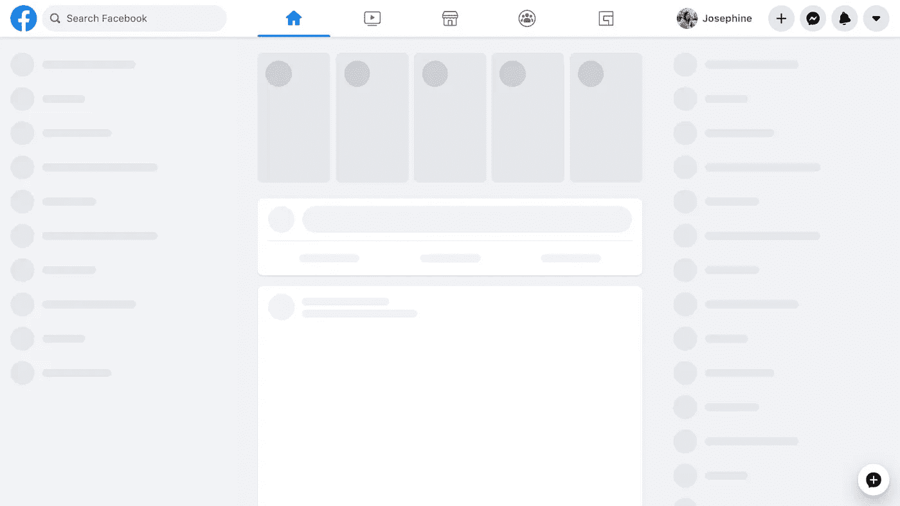
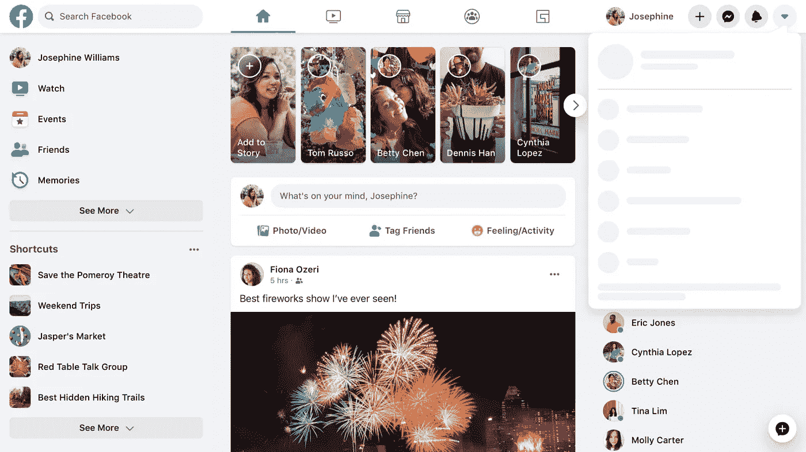
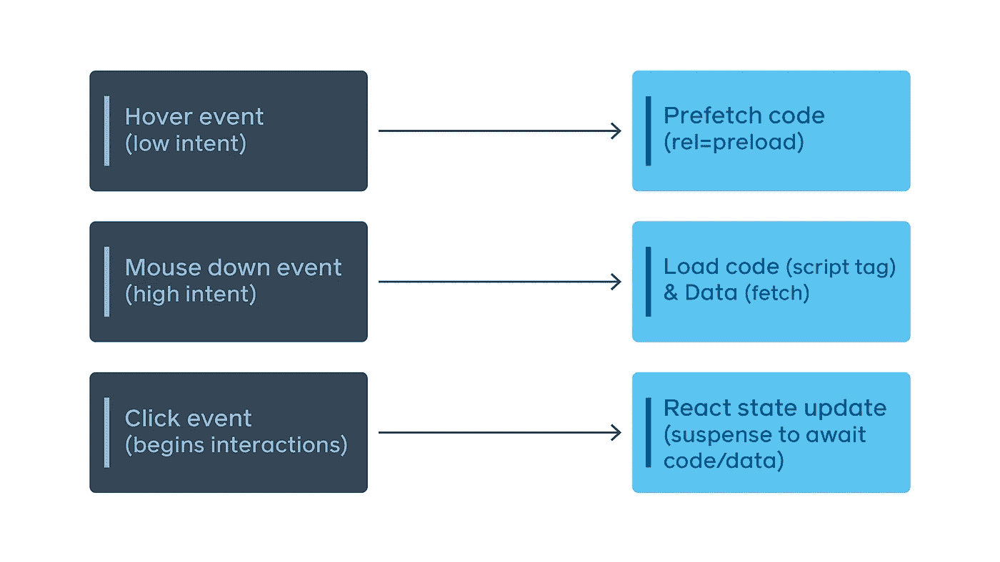
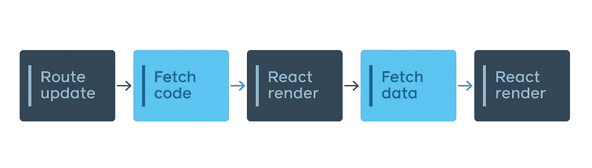
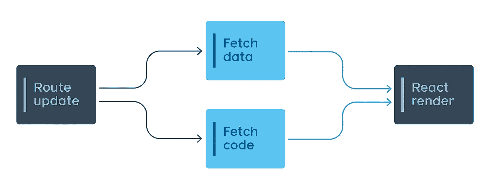

# 探索全新脸书的技术架构

> 原文：<https://javascript.plainenglish.io/discover-the-tech-stack-for-the-new-facebook-a9876724dee8?source=collection_archive---------0----------------------->

## 技术堆栈发生了巨大的变化


Photo by [Thought Catalog](https://unsplash.com/@thoughtcatalog?utm_source=unsplash&utm_medium=referral&utm_content=creditCopyText) on [Unsplash](https://unsplash.com/s/photos/facebook?utm_source=unsplash&utm_medium=referral&utm_content=creditCopyText)

五月初，脸书发布了一个新的巨大版本，名为“新脸书”，其中前端已经使用[反应](https://reactjs.org/)和[中继](https://relay.dev/)完全重写。

这个新脸书的目标是更快，并提供高度互动的体验。正如他们在文章中所说，他们主要围绕两个技术指令工作:

> **尽可能少，尽可能早。我们应该只交付我们需要的资源，并且我们应该努力让它们在我们需要它们之前到达。**
> 
> **工程经验服务于用户体验。我们开发的最终目标是让人们使用我们的网站。当我们思考我们网站上的 UX 挑战时，我们可以调整经验来指导工程师默认做正确的事情。**

# 重新思考 CSS

为了让 CSS 变得轻量级和可维护，已经做了很多工作

之前版本的脸书在加载主页时加载了超过 400 KB 的压缩 CSS，只有 10%用于初始渲染。
我们是怎么做到的？这在每个项目中都很常见:你添加的每个特性都意味着添加新的 CSS。旧的 CSS 很少被删除，因为你不能完全确定它的影响。最后你会得到一堆没人想清理的 CSS。

解决方案是在构建时生成原子 CSS。

> 原子 CSS 有一条对数增长曲线，因为它与独特风格声明的数量成比例，而不是与我们编写的风格和特性的数量成比例。

结果真的很有趣，因为它减少了主页上 80%的 CSS，而新的脸书支持黑暗模式和动态字体大小的可访问性。

# 在 JavaScript 中使用 SVG

在脸书的早期版本中，SVG 被用在``标签中，当图标出现在其余内容之后时，会导致闪烁。

在这个新版本中，SVG 使用了`<svg>`标签，这意味着它们与周围的组件捆绑在一起交付。这项技术可能会增加一些组件的加载时间，但它确保不会出现图标闪烁的情况，并改善用户体验。

# 代码分割 JavaScript

代码大小与页面加载性能直接相关。当我们谈到脸书时，我们只能说它不是一个小项目，代码大小很重要。很多。这就是为什么他们围绕几个新的 API 开展工作，以遵循以下原则:

> 越少越好，越早越好

遵循这个原则，脸书设计了一个代码分割的 JavaScript 加载层:初始渲染所需的 JavaScript 被分成三层:

## ***一级***

这里的目标是通过呈现页面外观的 UI 占位符来提供即时反馈。呈现占位符的源代码很少:



The page after Tier 1 code loads and renders.

第 1 层使用常规导入语法，如下所示:

```
import ModuleA from 'ModuleA';
```

## 第二层

第 2 层包括完全呈现内容的所有内容。在呈现之后，如果没有用户的交互，什么都不会改变:


The page after Tier 2 code loads and renders.

如果用户试图与页面进行交互，例如，他在第 2 层呈现后打开右上方的菜单，则会出现一个框架，以便像以前一样给出即时反馈:



The page after Tier 2 code loads and renders and the user click on the top right menu.

第二层使用**输入显示**。当模块被加载时，它返回一个基于承诺的包装器来访问模块。当在代码中遇到 **importForDisplay** 时，模块会自动移动到第 2 层:

`importForDisplay ModuleBDeferred from 'ModuleB';`

## 三级

第三层包括显示后渲染的所有内容，这些内容不会影响屏幕上的像素。在这种情况下，它呈现右上方菜单的内容。

第 3 层使用 **importForAfterDisplay。**当模块被加载时，它返回一个基于承诺的包装器来访问模块。当在代码中遇到一个 **importForAfterDisplay** 时，模块被自动移动到第 3 层。

由于这种分层系统，一个 JavaScript 页面的大小被分为三层，加载屏幕渲染速度更快，而不会降低用户体验。

# 使用用户界面进行 A/B 测试

为了进行 A/B 测试，通常会提出两个不同版本的 UI(根据用户的行为，尝试看看哪个版本的 UI 更好)。通常的做法是为每个人下载两个版本，有些人会看到版本 A，有些人会看到版本 b。

但这意味着下载不被使用的代码，这违背了脸书的信条。这就是为什么他们构建了一个声明式 API，当页面加载时，服务器能够检查将哪个版本发送给客户端。

```
const Composer = importCond('NewComposerExperiment', {
  true: 'NewComposer',
  false: 'OldComposer',
});
```

# 仅在需要时交付组件

每个项目都有复杂的组件，其中渲染会根据数据发生很大变化，这是很常见的。

今天，脸书上的一个帖子可以有图片、视频、位置、gif 等等…

为每个帖子加载处理所有这些不同可能性的每个组件会非常繁重，即使帖子只包含一些文本。

这就是依赖关系在运行时决定的原因，它基于从服务器返回的数据:

```
... on Post {
  ... on PhotoPost {
    @module('PhotoComponent.js')
    photo_data
  }
  ... on VideoPost {
    @module('VideoComponent.js')
    video_data
  }
}
```

如果帖子有照片，则包括组件照片。该功能的强大之处在于，它可以在每个需要的节点上使用。如果光电组件很重，可以根据数据将其作为片段加载。

# 监控 JavaScript 预算

分层和条件渲染使项目变得更轻，但是如何随着时间的推移控制代码的大小呢？这就是脸书引入 JavaScript 预算的地方。

基于技术的东西，脸书的每一页都有一个不能超过的预算。他们已经开发了一些工具来监控代码的大小，如果代码超过一定的量就触发警报，查看交互式图表、仪表板等等。

# 下载 JavaScript 时预加载数据

许多 web 应用程序首先下载并执行 JavaScript 来呈现初始页面，然后从服务器获取所需的数据。通过使用 [Relay，](https://relay.dev/)脸书知道页面需要哪些数据，并在服务器收到页面请求时直接获取这些数据。因此，它可以更快地呈现最终的页面内容。

# 推迟数据

一些查询比其他查询需要更长的计算时间。当查看脸书的个人资料时，常用信息(姓名、照片等)可以快速获取，但获取时间线上的帖子需要更长时间。

如今，可以使用 GraphQL 中的 [**延迟**](https://www.apollographql.com/docs/react/v2.4/features/defer-support/) 在一个查询中获取这两个数据，同时数据在准备就绪后立即进行流式传输，而不必等待较长的计算部分。它允许脸书快速渲染脸书个人资料的一部分，包括名称、个人资料图片等，并为其他需要更多时间渲染的内容渲染一些加载状态。

# 快速导航

在 web 应用上拥有良好的用户体验的一个非常重要的点是拥有快速的导航。没有什么比点击一个链接后等待几秒钟看到网页应用程序改变屏幕更令人沮丧的了。

脸书创建了一个路线图，并将路线与页面需要正确呈现的资源相关联。

为了能够尽可能快地呈现页面，客户端甚至在单击链接之前就获取资源:



There is a preloading when the user hover a link. Then it begin to fetch code and data when the user is clicking. Finally, there is some interaction when the user finish the click.

为了改善用户体验和避免黑屏， [React 悬念转换](https://reactjs.org/docs/react-api.html#reactsuspense)用于始终呈现页面，就像上一页或新页面的框架。

# 并行化代码

很多代码的延迟加载都是在新应用上完成的，但是如果脸书决定延迟加载一条路线的代码，就像我们之前看到的那样，将这条路线的数据获取代码放在里面，结果会是这样:



The results is with two renders

为了解决这个问题，他们创建了包装代码分割点并将输入转换成查询的文件。结果是:



Code and data are fetched in parallel. The rendering is faster

脸书在提高用户体验方面做得非常好。这里解释的一切并不特定于脸书，可以应用于任何客户端应用程序。

这篇文章是原文的摘要，你可以在这里找到:[https://engineering.fb.com/web/facebook-redesign/](https://engineering.fb.com/web/facebook-redesign/)

感谢阅读！

## **用简单英语写的 JavaScript**

喜欢这篇文章吗？如果有，通过 [**订阅我们的 YouTube 频道**](https://www.youtube.com/channel/UCtipWUghju290NWcn8jhyAw) **获取更多类似内容！**