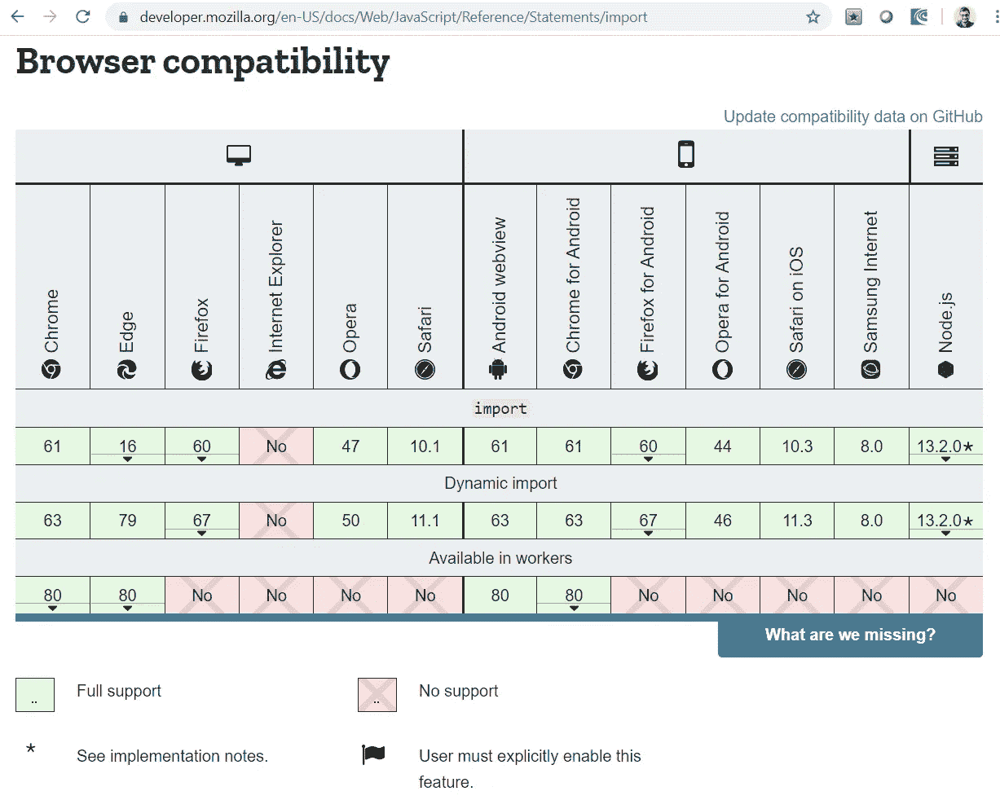
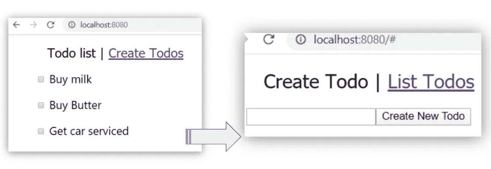
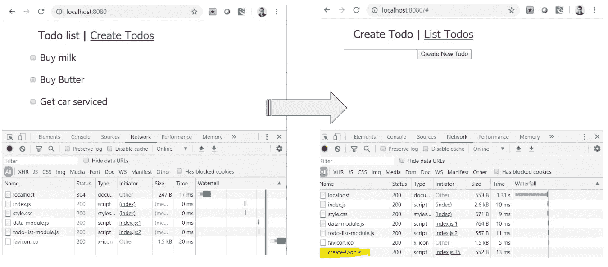

# JavaScript 中的动态导入

> 原文：<https://javascript.plainenglish.io/discuss-native-support-for-on-the-fly-import-of-modules-in-es-2020-also-called-es-11-ad4f899e0c2?source=collection_archive---------5----------------------->

## ES 2020/ES 11 新功能综述


[Image — vencki-vista](https://500px.com/vencki-vista)

过去，RequireJS 是一个流行的库，它用 JavaScript 提供模块系统。它是 AMD(异步模块定义)的一个实现。该库有助于组织代码和托管依赖项。它允许定义和导入模块(根据需要，预先或有条件地)。随着 JavaScript 的发展，ES 6(也称为 ES 2015)为该语言增加了对模块的本地支持。最初，只支持静态导入，这需要在运行前进行评估。

我们中的许多人都使用过 ES 6 导入语句，这些语句放在文件的顶部。所有的导入都需要在运行前进行评估，这意味着模块名不能是动态的。需要指定完整的模块名称字符串——没有变量插值。它帮助了一些特性，比如 JavaScript 绑定，树抖动等等。但是，不能动态导入模块。比方说，我们想只在点击一个按钮时导入一个模块，当我们启动一个模型对话框，导航到一个页面时，这些场景最初是不支持的。

有人提议支持动态导入。这是一个类似语法的功能，可以动态导入新模块。动态进口的 TC 39 提案现在处于第 4 阶段。在本文的后面，有一节详细介绍了 TC 39 提案和四个阶段。

动态导入已准备好在 ES 2020 (ES 11)黄金时间推出。已被各大浏览器改编。Mozilla Web Docs 上的浏览器兼容性图表见图 1。



Figure-1: Browser Compatibility- [link to the documentation](https://developer.mozilla.org/en-US/docs/Web/JavaScript/Reference/Statements/import)

## 在待办事项代码示例中使用 import()

让我们借助一个用例来看看这个特性。我们将使用 JavaScript 在待办事项应用程序中构建几个屏幕。第一个屏幕显示待办事项列表。第二个屏幕有一个文本字段和一个创建新待办事项的按钮。



Figure-2: To-do sample screens

我们使用三个模块。

*   第一个模块 data-module.js 提供了待办事项列表。为简单起见，示例使用硬编码的 JSON 数组。
*   第二个模块 todo-list-module.js 导出一个函数 getTodosMarkup()。该函数的输入参数是待办事项列表数据。它返回用数据创建的 DOM 字符串。考虑下面的代码片段，它导入了 index.js 中的两个模块。

```
import getData from './data-module.js';
import { getTodosMarkup } from './todo-list-module.js';let list = getData();
document.getElementById("todos").innerHTML = getTodosMarkup(list.todos);
```

*   如果用户仅使用列表屏幕，则不会导入其他模块。但是，如果用户试图导航到*创建待办事项*功能，第三个模块会被动态导入。考虑下面的代码片段和图 3。注意，只有当用户导航到创建待办事项屏幕时，create-todo.js 才会出现在 Google Chrome 网络标签中。

```
const handler = () => {
  import ('./create-todo.js').then((module) => { 
   // access any exported function in the module.
   // following createTodo() generates DOM string for Create Todo 
   // set the DOM string on an element. 
   document.getElementById("createTodo").innerHTML = module.createTodo();
});
}// click event handler added on the hyperlink, “Create Todos”.
document
.getElementById("btnCreateTodo")
.addEventListener("click", handler);
```

handler()函数执行动态导入。注意，import()以模块名作为参数。该函数返回一个承诺，解析后提供一个模块引用。在模块对象上，可以访问所有导出的函数。在上面的代码示例中，我们使用 createTodo()函数(从模块中导出)。



Figure-3: Script loads only after navigating to Create to-do screen

## 代码示例

跟随[链接](https://github.com/kvkirthy/todo-samples/tree/master/js-modules-demo)获取完整的代码示例。参见 JavaScript 模块 [data-module.js](https://github.com/kvkirthy/todo-samples/blob/master/js-modules-demo/JS/data-module.js) 、 [todo-list-module.js](https://github.com/kvkirthy/todo-samples/blob/master/js-modules-demo/JS/todo-list-module.js) 和 [create-todo.js](https://github.com/kvkirthy/todo-samples/blob/master/js-modules-demo/JS/create-todo.js) 。 [Index.js](https://github.com/kvkirthy/todo-samples/blob/master/js-modules-demo/JS/index.js) 是导入其他模块的主模块。

要在您的机器上运行代码示例，请遵循这里的说明。

> 使用 promise 时，请注意 async/await 的以下替代语法。我们可以对任何 JavaScript 承诺使用 async/await 方法，不必是模块的动态导入。这是 ES 8 (ES 2017)的一个特点。点击阅读更多关于 [ES 8 特性的信息。](https://www.dotnetcurry.com/javascript/1405/es8-es2017-javascript-new-features)

```
const asyncHandler = ***async***() => { if (isList) {
   isList = false;
   let module = ***await*** import ('./create-todo.js')
   document.getElementById("createTodo").innerHTML =  
 **module.createTodo();**};
```

import()函数还支持模块名的运行时字符串插值。考虑下面的代码片段。模块名可以根据变量名动态定义。这不适用于静态导入。

```
/* The module name is unavailable pre-runtime as it's created on the fly with using CREATE_TODO_URL */import (`./${CREATE_TODO_URL}.js`)
```

动态导入的 TC 39 提案已经存在一段时间了。根据 TC 39 GitHub 知识库中的提交，它将从 2016 年开始提供。([链接到提案](https://github.com/tc39/proposal-dynamic-import/commits/master?before=43e869ce8bb38d95f6b082dbc4c49d3f0fa1bdf2+35))。Chrome 从 63 版开始就一直支持该功能。然而，作为《ECMA 脚本 2020》的一部分，该提案正处于第 4 阶段(ES 11)。

## 笔记

> 为浏览器使用带有 type 属性的

```
<script **type="module"** src="./JS/index.js"></script>
```

> Common JS 是 Node.js 和服务器端 JavaScript 开发中模块系统的流行选择。对于 JavaScript 中的本机模块系统支持，Node.js 建议用。mjs 扩展名(而不是。js)。

## JavaScript 是如何增加新特性的？

对于许多其他语言，只需要升级一个运行时或一个编译器来支持新特性。JavaScript 是独一无二的；功能需要通过各种浏览器来实现。它们由不同组织拥有的不同团队构建和维护。每个人都必须走到一起，不断升级语言。

ECMA 脚本(简称 ES)是为标准化 JavaScript 而创建的语言规范。ES5 是 2009 年发布的流行 JavaScript 版本。ES 6 于 2015 年发布。也被称为 ES 2015。从 ES 6 开始，每年都会进行一次升级。如前所述，本文描述的动态导入特性是 ES 2020 或 ES 11 的一部分。

ECMA TC39 是一个负责发展 ECMA 文字的委员会。TC 39 使用以下阶段定义将 JavaScript 特性转移到 ECMA 脚本版本之一。每一个新的 JavaScript 提案都要经过几个阶段才能在所有浏览器上可用。

*   阶段 0——straw person 或一个新的规范(被称为 strawman，现在改名了——正确的名称:)
*   第一阶段—提案。用正式的规范语言展示对附加产品、解决方案和挑战的需求。
*   第二阶段—草稿。描述语法和语义。
*   第三阶段—候选人。允许用户进行实验并提供反馈。规范可能会根据反馈重新定义。大多数浏览器在这个阶段就开始调整功能。功能可能还没有准备好黄金时间。
*   第四阶段——完成。所有用户都可以使用该功能。

点击[链接获取 TC 39 流程文件](https://tc39.es/process-document/)

## **简明英语团队的笔记**

你知道我们有四种出版物吗？给他们一个关注来表达爱意:[**JavaScript in Plain English**](https://medium.com/javascript-in-plain-english)[**AI in Plain English**](https://medium.com/ai-in-plain-english)[**UX in Plain English**](https://medium.com/ux-in-plain-english)[**Python in Plain English**](https://medium.com/python-in-plain-english)**——谢谢，继续学习！**

**此外，我们总是有兴趣帮助推广好的内容。如果您有一篇文章想要提交给我们的任何出版物，请发送电子邮件至[**submissions @ plain English . io**](mailto:submissions@plainenglish.io)**，并附上您的媒体用户名和您感兴趣的内容，我们将会回复您！****

## ****参考****

*   ****[导入 MDN web 文档](https://developer.mozilla.org/en-US/docs/Web/JavaScript/Reference/Statements/import)****
*   ****[TC 39 工艺文件](https://tc39.es/process-document/)。****
*   ****[ES 8 上的 DotNet 库里文章](https://www.dotnetcurry.com/javascript/1405/es8-es2017-javascript-new-features)****
*   ****[TC-39 动态提案](https://github.com/tc39/proposal-dynamic-import)****

## ****你能在哪里找到我****

****推特 [@KeertiKotaru](http://twitter.com/keertikotaru) 。****

****[角材本](https://www.amazon.com/Angular-Material-Design-TypeScript-Interface/dp/1484254333/ref=sr_1_4?crid=IPQSCYP20TBM&keywords=angular+material&qid=1578619358&sprefix=angular+mater%2Caps%2C139&sr=8-4) | [角材 v1.x](https://www.amazon.com/Material-Design-Implementation-AngularJS-Component/dp/1484221893/ref=sr_1_10?crid=IPQSCYP20TBM&keywords=angular+material&qid=1578619358&sprefix=angular+mater%2Caps%2C139&sr=8-10)****

****[https://www.dotnetcurry.com/author/v-keerti-kotaru](https://www.dotnetcurry.com/author/v-keerti-kotaru)****

****[http://venckicode.blogspot.com/](http://venckicode.blogspot.com/)****