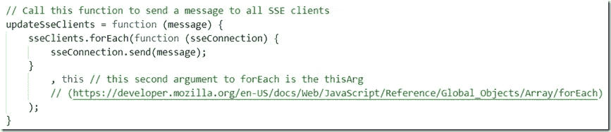

# DIY Kafka 主题观察工具——节点、快捷、服务器发送事件和 Apache Kafka

> 原文：<https://javascript.plainenglish.io/diy-kafka-topic-watcher-tool-node-express-server-sent-events-and-apache-kafka-992b0ec2c70?source=collection_archive---------13----------------------->

这篇文章至少有两种不同的解读方式:

1.  作为一个方便工具的冗长介绍，您可以轻松地运行它来检查发布到 Kafka 集群中的主题的消息
2.  作为一个详细但基本的例子，说明如何结合几种技术来创建从 Kafka 主题(在服务器上或云中)到客户端浏览器的端到端(推送)管道(包括:Node & node-rdkafka、Express 和服务器发送的事件、DHTML &客户端 JavaScript

本文介绍了一个简单的工具——节点应用程序，它提供了有用的功能，并且可以很容易地用附加功能进行扩展。本文提供的代码包含许多有用的示例，包括 Node/JavaScript 语言用法、使用 node-rdkafka 创建 Kafka 客户端以及使用 Express 中间件在服务器和客户端幻灯片上实现服务器发送事件通道。

此图显示了 Kafka 主题观察器:在浏览器窗口中，当 Kafka 主题产生新消息时会自动刷新，显示了来自 Apache Kafka 集群中所有主题的消息的动态列表。所有历史消息都可以从主题刷新到浏览器中。在开发过程中非常方便——对于研讨会、演示和娱乐也是如此。


节点应用程序可以在任何地方运行——在笔记本电脑上、在云中、在服务器上——并连接到指定的 Kafka 集群——该集群(假设网络访问规则配置正确)可以位于任何地方，例如在公共云中。

该工具的源代码可从 GitHub 获得:[https://GitHub . com/AMIS-Services/online-meetups-introduction-of-Kafka/tree/master/lab2b-topic-watcher](https://github.com/AMIS-Services/online-meetups-introduction-of-kafka/tree/master/lab2b-topic-watcher)(作为 Apache Kafka 三部分研讨会报告的一部分)

# Kafka 主题观察器应用程序概述

Kafka 主题观察器的核心是节点应用程序——app . js 是其中的主要模块。本模块:

*   启动 HTTP 服务器(端口 3010)为 web 应用程序(一些静态文件— HTML、Javascript 和图像)提供服务
*   处理来自 web 应用程序的 REST 请求
*   将 SSE(服务器发送的事件)推送到 web 应用程序(使用 *sse.js* 中的 SSE 支持)
*   导入并初始化连接到目标 Kafka 集群的*消费*模块(在 *config.js* 中指定)
*   使用 *consume* 模块设置一个消息处理程序，用于处理 Kafka 集群中所有主题的消息:函数 *handleMessage* 。该函数准备将事件推送到浏览器，并使用函数 *updateSseClients* 和 *sse.js* 模块向所有连接的 Kafka 主题观察器客户端发送 sse 事件。


web 应用由文件*index.html*和两个支持(客户端)JavaScript 文件: *message-handler.js* 和 *topics-management.js* 组成。前者订阅 SSE 端点并处理 SSE 事件，这些事件是从节点应用程序为从 Kafka 主题之一消费的每个消息推送的。这些消息被收集在一个 *messages* 数组中，并被写入到*topicmessagetable*HTML 表格元素的顶部。

Kafka 集群上的当前主题列表是从 XHR 中的节点应用程序请求的(也称为 AJAX 请求)，来自 *topic-management.js* 。异步响应中返回的主题列表根据该请求的响应内容写入 HTML 页面。

GUI 包含一个按钮*清除消息*。按下时，调用函数 *clearMessages* (在 message-handler.js 中)。它清除*消息*数组，并从*主题消息表*中删除行。

GUI 还包含一个链接*从头重读所有主题*。当点击时，函数 *config* 被触发，该函数依次向 */config* 端点发送 POST 请求，该端点随后用一个标志重新初始化消费者，该标志指定将从所有主题中读取所有消息，而不仅仅是新到达的消息；函数 *initializeConsumer* 被调用，将断开当前的流消费者并创建一个新的。

# 运行 Kafka 主题观察器

卡夫卡话题观察者差不多要出发了。您不需要对代码进行修改来获得乐趣——除了确保*文件 config.js* 具有适合您的环境的正确设置:需要定义 Kafka Broker 配置(针对您的本地集群或例如基于 CloudKarafka 云的集群)。

在运行应用程序之前，您需要引入依赖项。从包含文件 *package.json* 的目录中的命令行运行:

```
npm install
```

将所有需要的 NPM 模块下载到目录节点-模块中。

现在您可以运行 web 应用程序了:

或者

HTTP 服务器启动并监听端口 3010。

从浏览器打开 Kafka 主题观察器 web 应用程序: [http://localhost:3010](http://localhost:3010) 。


您应该会看到指定 Kafka 集群中所有非内部主题的列表。您将看到针对这些主题生成的所有新消息。您可以点击链接*从头重读所有主题*查看主题历史中的所有消息。除了来自 Kafka 主题的真实消息之外，您还将看到由节点应用程序每 25 秒发送给所有 SSE 客户端的心跳消息。

# 实施细节

该工具实现的某些方面也许值得再看一眼(或者从中截取一些代码):

*   如何通过合并另外两个对象来创建一个 JavaScript 对象
*   如何使用 node-rdkafka 连接到 Kafka 集群
*   如何检索 Kafka 集群中所有主题的列表
*   如何从 JavaScript 函数返回异步响应
*   如何设置服务器从节点发送事件的通道以及如何在浏览器中接收 SSE 消息
*   如何发送 XHR (fka AJAX)请求并使用 await fetch 处理响应

# 如何通过合并另外两个对象来创建一个 JavaScript 对象

最好看一个例子:


通过将*external config . kafkaConfig*与现场创建的对象合并，组成 kafkaconfig。两个对象中的所有属性都将包含在结果对象中。如果两个对象包含相同的属性，则该属性将具有在该操作中第二个对象中的值。

# 如何使用 node-rdkafka 连接到 Kafka 集群

首先在 package.json 中声明 node-rdkafka 上的依赖关系，这提供了从 JavaScript 通过 C/C++到 kafka 通信协议的桥梁。

连接是作为生产者或消费者的一部分创建的——基于 Kafka 配置对象——实际上是基于属性 *metadata.broker.list* 。


该属性是用 Kafka 集群中代理的端点(主机名和端口)设置的。根据 Kafka 集群的安全配置，配置对象可能需要具有处理安全限制的属性。我一直在使用的一个 Kafka 配置对象的例子:


# 如何检索 Kafka 集群中所有主题的列表

node-rdkafka 实现为消费者和生产者提供了一个选项来检索 kafka 集群的元数据，检查[这个链接](https://github.com/Blizzard/node-rdkafka#metadata)。在本例中，我使用了 Producer 对象，尽管该工具实际上并没有为集群产生任何东西。

生产者对象是基于 kafkaConfig 对象创建的。一旦连接完毕， *ready* 事件处理程序将被传递一个元数据对象，其中包含一个用于集群中所有主题的数组。以“__”开头的主题名称表示内部管理主题。这些在*减少*步骤中被过滤掉。


# 如何从 JavaScript 函数返回异步响应

函数 *getTopics* 被定义为一个*异步*函数。这个函数的调用者很可能在他们的调用中使用一个 *await* :


函数 *getTopics* 只能访问它将在*就绪*事件的(异步)事件处理程序中返回的结果。为了在函数返回后产生函数结果，我们使用了一个承诺。函数 *getTopics* 返回一个承诺——这是一个“延迟结果”。只有当处理给调用者的承诺( *getStarted()* )完成时，await 才会实现。在承诺内部，我们使用对(内置函数) *resolve* 的显式调用来使承诺产生结果。感觉就像函数 getTopics()将一个小盒子交给函数 getStarted()，并指示 getStarted()继续等待，直到结果弹出盒子。

关于回调函数、事件处理程序、promises 和 async/await 的组合，请参阅我之前的文章:[https://technology . amis . nl/2020/01/11/JavaScript-mapping-and-wrapping-classic-callback-functions-to-promises-and-async-await/](https://technology.amis.nl/2020/01/11/javascript-mapping-and-wrapping-classic-callback-functions-to-promises-and-async-await/)。

# 如何高效优雅地将数组过滤为满足条件的元素:Reduce

由 metadata.topics 返回的主题数组包含内部主题(名称以 __ 开头的主题)。为了生成没有这些元素的主题数组，最优雅的方法是在源数组上设置 *reduce* 操作符。Reduce 使用一个起始值(本例中是空数组:[])和一个接收两个输入的函数:中间结果(最初是起始值，这里是空数组)和下一个数组元素。该函数预计会产生下一个中间结果。在这种情况下，中间结果是一个数组，其中包含原始数组中满足过滤条件的所有元素。


这个片段或多或少可以理解为:

> *const cluster topics =(select * from metadata . topics as topic where substring(topic . name，1，2)！= '__')*

# 如何设置服务器从节点发送事件的通道以及如何在浏览器中接收 SSE 消息

浏览器客户端使用 EventSource(url)订阅 SSE 源。这就是建立一个允许服务器发送更新并由客户端异步处理的通道所需要做的全部工作。消息处理程序附加到事件源。每当服务器将事件推送到 SSE 订阅者时，都会调用该函数。浏览器只是接收一个 JSON 包，并需要对它做一些有用的事情。


使用 Node 和 Express 时 SSE 的服务器端也不太复杂。

Express 配置了多个“拦截器”,这些拦截器可以在 HTTP 请求被真正交给特定于路径和方法的处理程序之前对其进行处理——对于那些具有 Java (Servlet)背景的人来说，这非常类似于 Servlet 过滤器和 Servlet。sseMiddleware“拦截器”是一个简单的拦截器，它为每个响应添加了一个 SSE 连接属性——不管它是否会被使用。注意:只有在/updates 处理程序中才真正使用这个连接。

从客户端通过 EventSource(URL)发送到/updates 路径的请求是导致订阅 SSE 通道的请求。建立连接(并将其发送到浏览器客户端)并将其添加到 sseClients 集合中，以便能够在服务器端需要表达自己时向其发送消息。


主题和连接对象在下一个代码片段中定义。连接是实际的 SSE 通道——与浏览器真正的握手。Topic 是一个简单的管理对象，用于跟踪所有连接:


最后，要从服务器向所有连接的 SSE 监听器发送消息，可以调用下一个函数。它接收一条消息并将其发送给所有 SSE 客户端。



# 如何从浏览器发送 XHR (fka AJAX)请求并使用 await fetch 处理响应

我在上个世纪发送了我的第一个异步浏览器请求，那时 AJAX 这个术语还没有出现，XML HTTP Request 对象还没有引入。我几乎相信是我发明了这个概念。网页中的一个(不可见的)框架提交了一个请求，并被重新加载了响应。顶部框架可以访问响应，并使用它来更新自身或其他框架。感觉当时的框架安全要宽松得多。无论如何，从浏览器到后台服务器的交互已经有了很大的发展。ES (ECMA 脚本)最新版本中的异步语法使得 AJAX 风格的编程更加简洁。跨越浏览器和服务器之间的巨大鸿沟。

这里，函数 config()利用 postData()将一个带有 JSON 主体的 POST 请求发送到一个 URL。async postData 函数返回一个承诺，当收到对 POST 请求的响应时，该承诺将得到解决。响应从 JSON 解析为 JavaScript 对象结构，作为 *then* 函数的输入:


当我们像下一个片段一样编写服务器请求时，需要的代码甚至更少。注意，我们需要*等待*两次。*获取*操作是异步的。它异步返回的不是响应，而是响应的承诺。所以有两层:首先等待请求的异步发送，然后等待响应的承诺，等待实际响应的到来。然后处理响应的 JSON 内容(将文本解析成 JavaScript 对象)，在这种情况下，根据数据中的数组元素编写一个列表。


(参见例如[https://dev . to/shou pn/JavaScript-fetch-API-and-using-asynca wait-47mp](https://dev.to/shoupn/javascript-fetch-api-and-using-asyncawait-47mp)了解一些背景知识)

# 待办事项/后续步骤

即使卡夫卡主题观察者正在做它应该做的事情，它也很容易被改进。一些建议——读者可能会将其视为一种挑战来接受:

*   允许过滤特定主题
*   允许对各种属性进行排序
*   通过样式、字体和小部件改善 GUI 的外观和感觉
*   允许*发布*消息以及消费它们
*   允许从 GUI 设置目标 Kafka 集群(甚至同时使用多个集群)

*原载于 2020 年 4 月 28 日*[*https://technology . amis . nl*](https://technology.amis.nl/2020/04/28/diy-kafka-topic-watcher-tool-node-express-server-sent-events-and-apache-kafka/)*。*

## **用简单英语写的 JavaScript 笔记**

我们已经推出了三种新的出版物！为我们的新出版物献上一点爱心吧，请跟随他们:[**AI in Plain English**](https://medium.com/ai-in-plain-english)，[**UX in Plain English**](https://medium.com/ux-in-plain-english)，[**Python in Plain English**](https://medium.com/python-in-plain-english)**——谢谢，继续学习！**

**我们也一直有兴趣帮助推广高质量的内容。如果您有一篇文章想要提交给我们的任何出版物，请发送电子邮件至:[**submissions @ plain English . io**](mailto:submissions@plainenglish.io)**，使用您的 Medium 用户名，我们会将您添加为作者。另外，请让我们知道您想加入哪个/哪些出版物。****