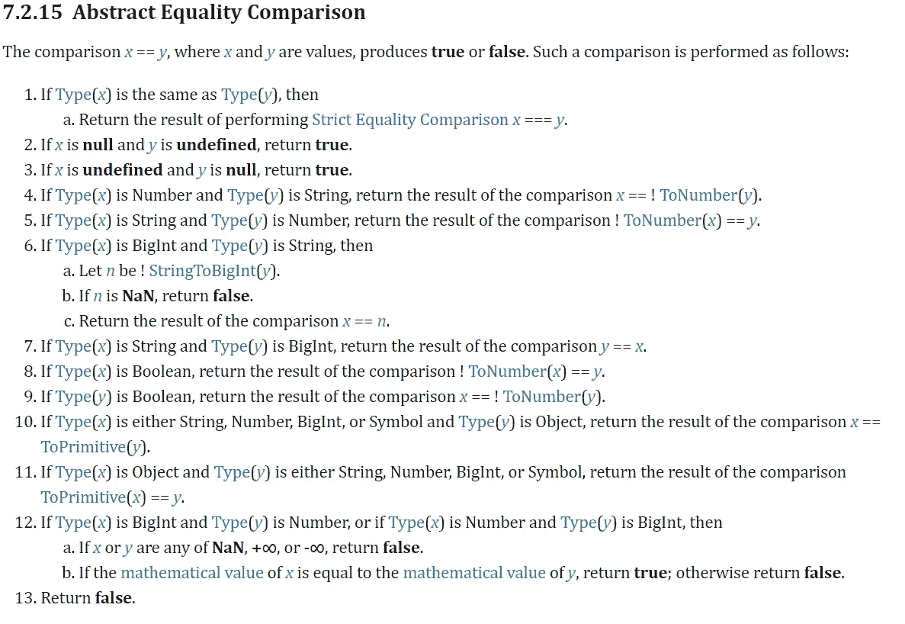
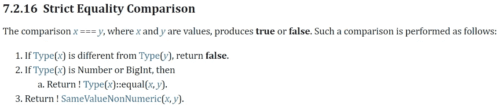

# 严格的等号会做我们想的那样吗？

> 原文：<https://javascript.plainenglish.io/do-strict-equals-do-what-we-thought-a818784a0be0?source=collection_archive---------8----------------------->

## 将你的知识提升到高级水平！

## 松散的等式也检查你的类型

Photo by [James Harrison](https://unsplash.com/@jstrippa?utm_source=unsplash&utm_medium=referral&utm_content=creditCopyText) on [Unsplash](https://unsplash.com/s/photos/programming?utm_source=unsplash&utm_medium=referral&utm_content=creditCopyText)

> JavaScript 将成为真正的函数式语言。
> 
> — *道格拉斯·克洛克福特*

我在想如何开始这个故事，所以最后，我意识到道格拉斯是在明确地讲述 JS 的故事。他的预言似乎成真了。 **JavaScript 成为一种强大的函数式语言！**

由于动态类型的强大，JS 已经成功地应对了所有新的编程技术。

# 双倍相等能解决我们的问题吗？

你有时可能会想，为什么算术运算符或条件语句没有问题，而 equals 却有问题。**人们与之斗争的最大压力是平等检查。**

在这个故事中，我想深入探讨一些与区分**宽松**和**严格等于**相关的问题。当我们比较' == '和' === '时，有一个大谎言:

> 误区:' == '和' === '的区别在于' == '检查值(宽松相等)，而' === '检查类型中的值(严格相等)。

这种想法非常普遍。但很遗憾，这是不对的。如果你想理解这个过程以及为什么这是一个错误的断言，你必须理解你的代码。你必须开始像 JavaScript 那样思考。让我们来看看规格:

Abstract Equality Comparison (source: [ECMAScript Standard](https://www.ecma-international.org/ecma-262/#sec-abstract-equality-comparison))

这部分被称为**抽象等式比较，**它负责定义 loose equals 的工作方式。这是最可靠的证据，证明宽松的平等不仅检查价值。

**结论**:第一条规则说，如果两个值具有相同的类型，那么它将执行严格的相等比较。

现在我们可以解开这个神话，这两个等式之间的区别是类型是否相同。不，那不是事实！他们都研究类型，但是使用这些知识的方式有点不同。

您必须记住，任何技术的第一个也是唯一的权威知识来源是文档。

采用正确的思维模式是一件非常重要的事情。不要把时间浪费在看不靠谱的故事和双平等的书上。他们很少参考唯一可靠的来源- **文献**。

文档不难理解。这只是一堆条件语句，因为你是开发人员，所以你可以理解。下一个例子将把事实和谣言分开:

在第一行，我们有一个由变量`person1`赋值的字符串`"Jamie"`。在下一行，我创建了第一个变量的副本。当我尝试宽松和严格的平等，它说，他们在两种情况下是平等的。事实证明，当类型匹配时，它们会执行三重相等。

结论:**当类型匹配时，双等号和三等号是相同的。当类型匹配时，进行三重等于运算。**

尽可能将类型配对是一件极好的事情，但这并不意味着你不会有强制。强制是不可能避免的，但是你可以减少强制的次数。

**你必须设计清晰一致的代码。**你写算法的时候要有感觉。对类型没有概念是不好的做法。即使你不知道，也不意味着它必须保持这种状态。在这种情况下，代码重新设计是最好的解决方案。

# 三倍等于做一些优越的工作吗？

你可能想知道三倍等于到底在做什么？它检查类型，就是这样。如果类型不同，值是什么时候并不重要。这是一种旁路，当类型不同时停止算法(返回*假*)。

那么，两倍等于和三倍等于有什么区别呢？答案可能会让你大吃一惊:

> 严格平等和宽松平等的真正区别在于我们是否会允许任何强制的发生。

让我们来看一下文档，把事情弄清楚:

Strict Equality Comparison (source: [ECMAScript Standard](https://www.ecma-international.org/ecma-262/#sec-strict-equality-comparison))

**如果类型相同，严格相等比较做什么？它按照文档上说的做(上图)。例如:如果我们比较 *NaN* s，它将返回 *false* 。下一个很好的例子是，如果我们比较零和负零，它将返回真值。**

我们有一些需要考虑的注意事项(就像上面的两个例子)，但那只是在类型已经匹配的情况下。

结论:**它们都检查类型，但是严格相等停止得更早。**

对于对象来说，情况有点不同。我举个例子:

我们有两个不同的对象。它们有什么不同，它们有什么相同的性质？它们不是相同的对象。

不要落入陷阱，不要被 JS 引擎所迷惑，它不是检查完整的对象(比较对象的结构)，而是比较变量指向的对象(引用)。我不确定任何一种语言除了身份比较之外还能做什么。

如果`movie1`、`movie2`是同一物体的物体参照，则返回*真*。在上面的例子中，情况并非如此，因为**变量指向不同的对象**。

在我们的示例中，结果是相同的。**当类型不同时，宽松的等式将允许强制，而当类型相同时，严格的等式将禁止强制。**

# 澄清

了解哪些机制参与了每个操作是至关重要的。问自己一个问题:我知道类型，我需要使用强制吗；有帮助吗？没有普遍的法律鼓励我们去判断是否使用强制手段。

有时，您必须考虑一些小问题，所以您可能会问自己:使用强制手段安全吗？你必须跳出思维定式。在我看来，在严格等同和宽松等同之间的选择关系到代码的可理解性和清洁性。

使用 triple equals 表示您不知道在特定情况下使用哪种类型，使用 triple equals 是对潜在错误的一种保护。

**我使用 triple equals 的唯一情况是在测试中，但作为一种临时解决方案。**当我不确定哪种类型会起作用时，我会采取一种安全的方法，并使用三重等式来保护自己免受潜在的逻辑错误的影响。在我做了一些代码重构——解决了根问题之后，我回到测试，回到 double equals。

了解您正在使用的类型通常是一种很好的做法，因为这样可以更好地理解代码，减少不可预测的情况。

**结论:**了解您在特定情况下使用的类型可获得更好的代码库。