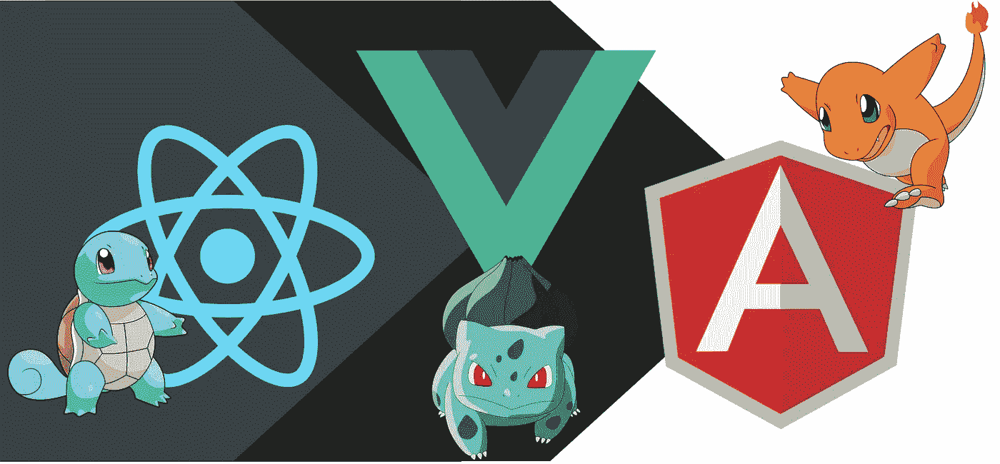

# 在学习一个 JS 框架之前做这件事

> 原文：<https://javascript.plainenglish.io/do-this-before-learning-a-js-framework-50e87855c10c?source=collection_archive---------3----------------------->

## 现在还不要急于建立一个框架

**对于那些对东西过分挑剔的人，这里有一个免责声明:**我知道`definitionOf('framework') !== definitionOf('library')`但是为了方便使用，在本文中我将互换使用“框架”和“库”这两个词。

互联网上充斥着关于 JavaScript 框架的 sub-Reddits、Twitter 对话、媒体文章和 YouTube 视频。所有大公司都使用某种框架或 JS 库来为他们的 web 应用程序构建视图。而且因为 React Native 和 NativeScript，有时候甚至他们的移动应用视图都是用 JS 抽象层构建的！目前有 3 个主要的 JavaScript 库/框架；反应，Vue 和 Angular。这在试图以前端或全栈开发人员的身份进入软件行业的开发人员中建立了强大的 FOMO。他们想赶上潮流，尽快掌握其中的一个。如果你也有同感，我能理解。学习 React、Vue 或 Angular 将确保你能为自己找到一份全职工作，或者为自己的初创公司打造一个现代化的网络应用。然而，在尝试 React、Vue 或 Angular 之前，有几件事你应该确保你知道如何在 Vanilla JS 中做。

# 基础

这是已知的，但我认为我还是应该指出，在进入任何这些框架之前，你应该首先从你的清单上划掉 HTML、CSS 和 JS 的基础知识。现在，让我们在深入研究一个框架之前，先来看看稍微高级一些的主题，这些主题仍然是必不可少的。

# 语境

在许多现代 JS 代码中，你会看到箭头函数。也就是看起来像这样的函数:`() => {};`。这和普通函数有什么区别？这个*。*如果那句话对你没有意义，那么你还有很长的路要走。“这”的概念在你从事任何实质性的 JavaScript 项目时都变得极其重要。

# 承诺

不管你和现实生活中的承诺有什么关系，不可否认的是，承诺在 JS 中是必要的。JavaScript 是单线程的，某些进程，比如等待 HTTP 响应或访问文件系统上的某些东西，比同步进程花费的时间要长得多，比如计算一个小的算术函数。没有承诺，这些**异步**进程的正确编程是不可能的。当你这么做的时候，你也可以学习类似于承诺的 ES6 功能； **async/await，**这两个在我看来也更容易使用。

# 尝试/抓住

如果你有一些其他编程语言的经验，你就会明白为什么捕捉错误是必要的，尤其是在前端，因为你将依赖于大量的承诺‘解决’或‘拒绝’，这取决于来自后端的 HTTP 响应。也就是说，如果你想进一步提升你的游戏并了解定制的 javascript 错误，你可以在这里做。

# DOM 操作

如果你最终使用 React、Vue 或 Angular 这样的框架，你将永远不需要普通 JavaScript 的这种功能。然而，理解如何使用普通/普通 javascript 进行 DOM 操作是至关重要的，因为在任何 JS 框架下，他们将使用它在网站上移动东西。了解 DOM 操作也确保了当你不需要时，你不会被束缚于使用一个成熟的框架；即创建一个小网站。

# 句法糖

大多数现代 JS 框架现在都使用最新的 ES 版本，并与它们一起使用；最新的语法糖果，如对象析构，传播运算符，三元运算符，新的数组函数，如映射，减少，过滤等。最好学习这些最新的语法，这样你学习实际框架的过程就不会因为不知道语法而变得过于复杂。也就是说，正如你所知道的，大多数浏览器不会理解最新的 EcmaScript 特性，但是我们仍然使用它们。那么我们的网站是如何运行的呢？浏览器如何理解我们现代的 JS 代码？那是你应该调查的另一件事。提示:**巴别塔**。

# 林挺

如果你从不 lint 你的代码，一旦你开始使用林挺，你会意识到一个开发者做的所有小决定。以及未打印的代码有多不一致。对于一套严格、固执己见又容易上手的规则，我推荐[漂亮一点的](https://prettier.io/)。

# 单元测试

因为我假设您是 JS 和前端世界的初学者，所以我建议您学习如何用 Jest、Mocha 或您选择的任何 JS 测试库来编写单元测试。当然，一旦你学会了一个框架，你将不得不增加你的单元测试技能，以便能够正确地测试你的 React/Vue/Angular 代码，但是理解前端单元测试将会有很大帮助！

# 以打字打的文件

这个对于 React 和 Vue 是可选的，但是对于 Angular 是必须的。然而，TypeScript 提供的新特性以及类型安全(如果使用得当)是值得学习的，即使您选择以后不为您的 web 应用程序使用任何 JS 框架。

涵盖了所有这些主题后，您应该准备好处理您选择的框架了。祝你好运！如果你碰巧选择了杰尼龟，对不起，我的意思是反应，你可以在媒体上跟随我，因为我与你分享我所知道的反应，甚至反应本土。

# 来自简明英语团队的说明

你知道我们有四种出版物吗？给他们一个 follow 来表达爱意:[**JavaScript in Plain English**](https://medium.com/javascript-in-plain-english)[**AI in Plain English**](https://medium.com/ai-in-plain-english)[**UX in Plain English**](https://medium.com/ux-in-plain-english)[**Python in Plain English**](https://medium.com/python-in-plain-english)**—谢谢，继续学习！**

**我们还推出了一个 YouTube，希望你能通过 [**订阅我们的简明英语频道**](https://www.youtube.com/channel/UCtipWUghju290NWcn8jhyAw) 来支持我们**