# 11 个棘手的 JavaScript 问题

> 原文：<https://javascript.plainenglish.io/do-you-know-javascript-1f2b44461333?source=collection_archive---------2----------------------->

## 在任何编码面试中你都应该准备好的 11 个技巧性问题(和答案)


Photo of [Pixabay](https://www.pexels.com/es-es/@pixabay?utm_content=attributionCopyText&utm_medium=referral&utm_source=pexels) in [Pexels](https://www.pexels.com/)

在本文中，您有 11 个用 Javascript 完成的问题。这些问题看起来很简单，但要仔细思考答案，因为很容易失败。

# 变量范围的重要性

产量是多少？

## 案例 1

```
for (var i = 0; i < 5; i++) {
  setTimeout(() => console.log(i), 1);
}
```

甲:0 1 2 3 4
乙:5 5 5 5 5

## 案例 2

```
for (let i = 0; i < 5; i++) {
  setTimeout(() => console.log(i), 1);
}
```

甲:0 1 2 3 4
乙:5 5 5 5 5
丙:0 1 2 3 4

## 解决办法

案例一:B.
案例二:c。

在第一种情况下，setTimeout 回调函数在循环执行完毕后被调用(一秒钟对于计算机来说是很长的时间)。“I”变量是使用“var”关键字声明的，因此它是全局的。当我们在大约一秒钟后调用 setTimeout 函数时，“I”的值为 5。

在案例 2 中,“I”变量是使用“let”关键字声明的，因此它是块范围的。在每次迭代中,“I”变量将有一个新值。

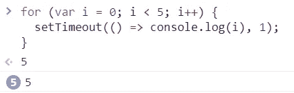

Case 1

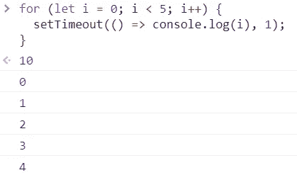

Case 1

# “新”关键字

产量是多少？

```
function User(username, password) {
  this.username= username;
  this.password= password;
}
```

## 案例 1

```
const kesk = new User('kesk', '12345');
kesk;
```

a:{用户名:“kesk”，密码:“12345”}
B:未定义

## 案例 2

```
const kesk2 = User('kesk', '12345');
kesk2;
```

a:{用户名:“kesk2”，密码:“12345”}
B:未定义

## 解决办法

案例一:A.
案例二:b。

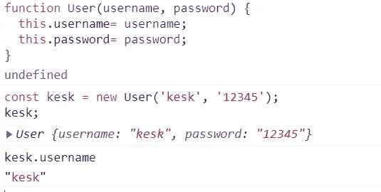

Case 1

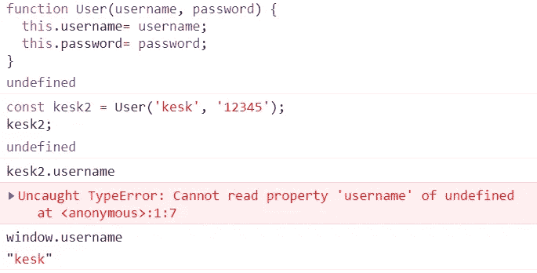

Case 2

如果我们使用' new '关键字，这是指我们创建的新的空对象。但是，如果不添加 new 关键字，这指的是窗口全局对象。

# 3.JavaScript 强制

产量是多少？

```
function sum(n1, n2) {
  return n1+ n2;
}sum(10, '20');
```

## 可能的结果:

a:NaN
B:type error
C:" 1020 "
D:20

## 解决方案:

C.

JavaScript 是一种动态类型语言，因此如果需要，值会自动转换成另一种类型。这叫做[强制](https://medium.com/free-code-camp/js-type-coercion-explained-27ba3d9a2839)。
在这种情况下，JavaScript 将数字 10 转换成一个字符串以使其有意义并返回值。在添加数字类型(10)和字符串类型(' 20 ')的过程中，数字被视为类似于 do "Hello" + "world！"的字符串(“你好世界！”)，所以结果是“1020”。

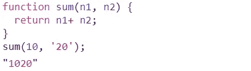

Solution.

# 4.模板文字

产量是多少？

```
function getCar(brand, model) {
  console.log(brand);
  console.log(model);
}const brand = 'Ford';
const model = 'shelby';getCar`The brand of your car is ${brand} and the model is{model}`;
```

## 解决办法

当我们使用带标记的模板文字时，第一个参数的值是一个字符串值数组，其余的参数获取传递的表达式的值。

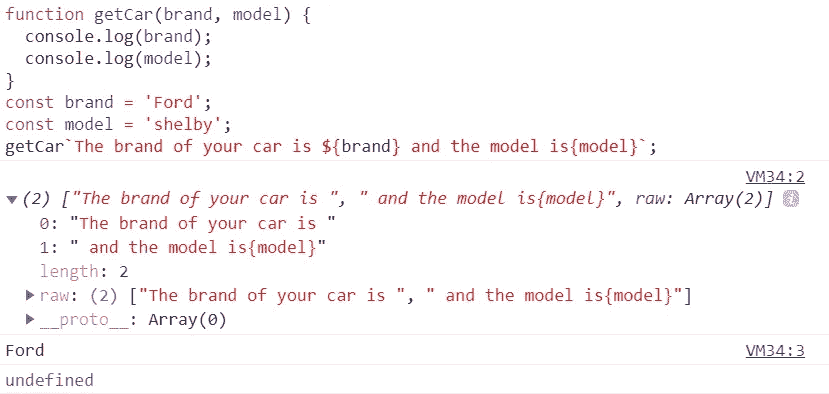

Solution.

# 5.休息参数

产量是多少？

```
function getCar(...args) {
  console.log(typeof args);
}getCar('Ford', 'Shelby');
```

## 可能的结果:

a:“数组”
B:“数”
C:“南”
D:“物”

## 解决方案:

D.

rest 参数(…args)“收集”所有剩余的参数到一个数组中。数组的类型是什么？它是一个对象，所以 typeof 参数返回“object”

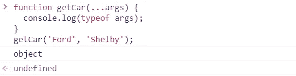

Solution.

# 6.多个“var”变量

产量是多少？

```
var v1 = 10;
var v1 = 20;console.log(v1);
```

## 可能的结果:

A: 10
B: 20
C:语法错误

## 解决方案:

B.

我们可以用' var '关键字声明多个同名变量。在这种情况下，变量将保存最新的值。

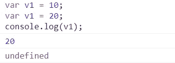

Solution.

# 7.连续语句

产量是多少？

```
for(let i =1; i< 10; i++){
 if(i === 5) continue;
 console.log(i);
}
```

## 可能的结果:

a:1 2 3 4 5 6 7 8 9 10
B:1 2 3 4 6 7 8 9
C:1 2 3 4

## 解决方案:

B.

如果特定条件返回 true，在这种情况下，如果“I”的值为 5，则“continue”语句跳过迭代。

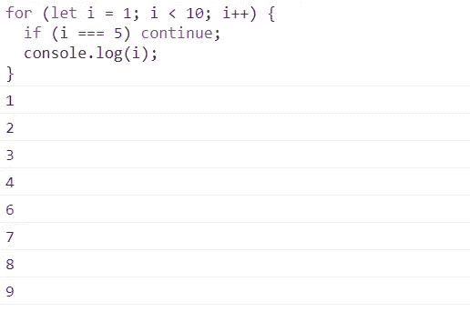

# 8.数组赋值

产量是多少？

```
const anArray = [1, 2, 3, 4, 5];
anArray[10] = 100;
console.log(anArray);
```

## 可能的结果:

A:[1，2，3，4，5，100]
B:[1，2，3，4，5，空 x 5，100]
D: SyntaxError

## 解决方案:

如果为数组中的索引设置的值超过了数组的长度，JavaScript 会创建“空槽”，其中包含未定义的值。

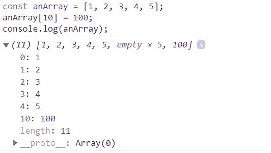

Solution

# 9.福尔西&& **真理**价值观

产量是多少？

```
console.log(!!null);
console.log(!!1);
console.log(!!0);
console.log(!!'');
console.log(!!true);
console.log(!!false);
```

## 可能的结果:

甲:假，真，假，假，真，假
乙:假，真，假，假，假，真

## 解决方案:

A.

在 JavaScript 中，“！!"运算符将值转换为其对应的布尔值。

*   null 是 falsy，！null 返回 true 和！true 返回 false。
*   ！1 是假的，！假的就是真的。
*   ！0 为真，！真就是假。
*   ”“是福尔西！""返回 true，！true 返回 false。
*   ！真的是假的！假的就是真的。
*   ！假的是真的，！真就是假。

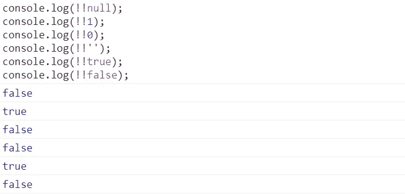

Solution

# 10.地图功能

产量是多少？

```
[1, 2, 3, 4, 5].map( n => {
  if (n < 10) return;
  return n * 2;
});
```

## 可能的结果:

a:[空，空，空，空，空]
B:[未定义，未定义，未定义，未定义]
C: []

## 解决方案:

B.

在本例中，如果 n < 10, we don’t return a value, and when we don’t return a value in a function, we return “undefined.” In this case, for each element in the array, the map function returns “undefined,” and the resulting collection is an array full of “undefined.”

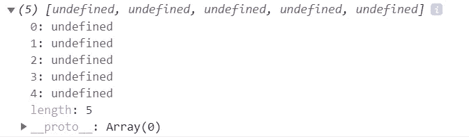

Solution.

# 11\. Export && import

What’s the output?

utilsFile.js

```
let counter = 1;
export default counter;
```

main.js

```
import myCounter from './utilsFile';myCounter += 1;console.log(myCounter);
```

## Possible results:

A:2
B:1
C: NaN
D:错误

## 解决方案:

D.

ES6 模块的导入是只读的。只有导出它们的模块才能更改它们的值。

## 修复:

utilsFile.js

```
let counter = 1;export function incrementCounter() {
    counter++;
}
```

主页. js

```
import incrementCounter './utilsFile';console.log(counter); // 1
incrementCounter();
console.log(counter); // 2
```

如果你喜欢这篇文章，考虑通过我的[个人资料](https://kesk.medium.com/membership)订阅 Medium。谢谢大家！