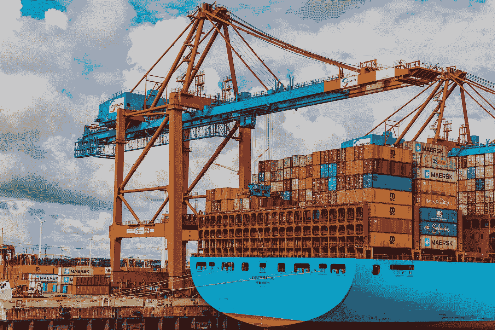

# 为 Node.js 整理您的开发环境

> 原文：<https://javascript.plainenglish.io/dockerize-your-development-environment-in-node-js-c64de51c540c?source=collection_archive---------8----------------------->

## 为什么在开发工作流中一定要使用 Docker



Photo by [Dominik Lückmann](https://unsplash.com/@exdigy?utm_source=unsplash&utm_medium=referral&utm_content=creditCopyText) on [Unsplash](https://unsplash.com/s/photos/container-port?utm_source=unsplash&utm_medium=referral&utm_content=creditCopyText)

在开发工作流中使用 Docker 对您的工作效率有积极的影响。它消除了典型的“它在我的机器上工作”类型的错误，在不同机器上的设置只需要一个正在运行的 Docker 守护程序，其他什么都不需要。在我们开始实施之前，我们将非常快速地检查一下 Docker。

# 什么是码头工人？

码头工人是一个平台，可以运行*容器*，软件包。为了运行这些容器，Docker 使用操作系统级虚拟化。您可以将容器视为虚拟机的轻量级版本。

您在 Docker 平台上运行的所有容器都是相互隔离的。例如，运行 Docker 的主机和运行在该主机上的一个容器不共享相同的文件系统，除非明确告诉它们共享。

要启动一个容器，您需要一个 Docker *图像*。此图像是您的容器的蓝图。您可以从 [Docker-Hub](https://hub.docker.com/) 获取预先定义的图像，或者通过编写所谓的 Dockerfile 来配置您自己的图像。

这只是对 Docker 的简要概述，如果您想深入了解，我建议您从[开始。](https://www.docker.com/resources/what-container)

# 您为什么要整理您的开发工作流程？

在介绍中，我已经谈到了在您的开发环境中使用 Docker 的一个好处。这是因为它摆脱了典型的“它在我的机器上工作”问题。其他一些优势包括:

*   更加标准化团队成员之间的开发工作流程
*   如果您也使用 Docker 进行部署，则可以减少只针对生产的错误(生产和开发之间的配置可能非常相似)
*   摆脱前面提到的“在我的机器上工作”类型的臭虫

# 入门指南

我们从创建一个新文件夹开始，在其中放置我们的项目，我们创建我们的 Dockerfile，如下所示:

```
$ mkdir node-docker && cd node-docker
$ touch Dockerfile
```

## 文件

我们将用于我们的快速应用程序的容器将在 Dockerfile 中配置。为此，我们需要给它一些生命:

Dockerfile

**FROM** 告诉 docker 从 Docker 中枢获取一个名为*节点*(版本:最新)的图像。

**工作目录**设置所有即将执行的命令的目录。

**COPY** 言行一致，它得到 *package.json* 和 *package-lock.json* 并将其复制到 *WORKDIR* 中。

**ENV** 在容器内设置环境变量，名称为 *PORT* ，值为 5000

**RUN** 执行我们传入的命令。在这种情况下，清除 npm 缓存，然后安装来自 *package.json* 的所有依赖项。

**入口点**在 docker 容器启动时执行您在这里插入的命令

## 简单快捷应用程序

既然我们已经准备好 docker 文件，我们需要一个简单的 express 应用程序，我们可以在容器中运行。为此，我们创建两个新文件，如下所示:

```
$ touch server.js package.json
```

*package.json* 将获得两个依赖项，第一个是 express，第二个是 nodemon:

package.json

当点击主页时，express 应用程序将只返回简单的 HTML。因此 *server.js* 应该是这样的:

server.js

## 。dockerignore

在我们开始设置 MongoDB 容器和 express 容器之前，我们想从正在运行的容器中排除一些文件。一个*的语法。dockerignore* 文件与*文件完全相同。gitignore* 文件:

.dockerignore

## docker-compose.yml

最后但同样重要的是，我们想要定义一个 *docker-compose.yml* 。这个文件将包含在两个不同的容器中同时运行 express 应用程序和 MongoDB 所需的所有信息。让我们继续创建文件。

```
$ touch docker-compose.yml
```

现在我们这样配置它:

docker-compose.yml

**版本**:首先我们定义想要使用的 docker-compose 的版本。第 3 版和第 2 版有相当多的区别，所以在选择版本时要小心！

**服务**:这是我们定义 express API (api)和 MongoDB (mongo)的部分

**构建&映像** : *构建*告诉 Docker 从 Docker 文件中构建一个映像。在我们的例子中，我们希望它使用当前目录中的 docker 文件。这就是为什么我们把？因为它定义了当前目录。 *image* 告诉 Docker 从 docker hub 中提取一个已经存在的图像。

**端口&卷**:顾名思义*端口*在这里定义端口。冒号是映射运算符。我们将容器的端口 5000 映射到主机系统的端口 5000，在本例中是本地机器，这样我们就可以访问容器外部的应用程序。MongoDB 的端口映射也是如此。*卷*做一些类似的事情，但这次是用卷。我们将本地目录映射到容器的 WORKDIR 中，在这个目录中我们编写代码。这样，如果我们改变了源代码中的任何内容，容器都会立即做出反应。

**保留**:这是一个特殊的卷，本地 *node_modules* 文件夹如果存在，不会覆盖容器内的 *node_modules* 文件夹。

如果您运行以下命令，Docker 将从我们的 Docker 文件创建一个映像，然后运行两个容器(api 和 mongo):

```
$ docker-compose up
```

如果您想停止容器，只需使用以下命令:

```
$ docker-compose down
```

# 结论

这是一个简单的 Docker 开发环境设置，可以很容易地扩展。如果你想改变数据库或者添加一个 Nginx 来呈现你的前端，只需要继续添加一个新的服务到 *docker-compose.yml* 或者改变一个现有的服务。也可以 dockerize。NET Core、Java 或 GoLang 应用程序。

如果你想了解更多关于 ExpressJS 的知识，请查看我的教程“[使用 Express](https://medium.com/javascript-in-plain-english/setting-up-a-rest-api-using-express-d92d5dc42e2a) 设置 REST API”。像往常一样，代码在我的 [GitHub](https://github.com/JakobKIT/node-docker) 上。

喜欢这篇文章吗？如果有，通过 [**订阅获取更多类似内容解码，我们的 YouTube 频道**](https://www.youtube.com/channel/UCtipWUghju290NWcn8jhyAw) **！**