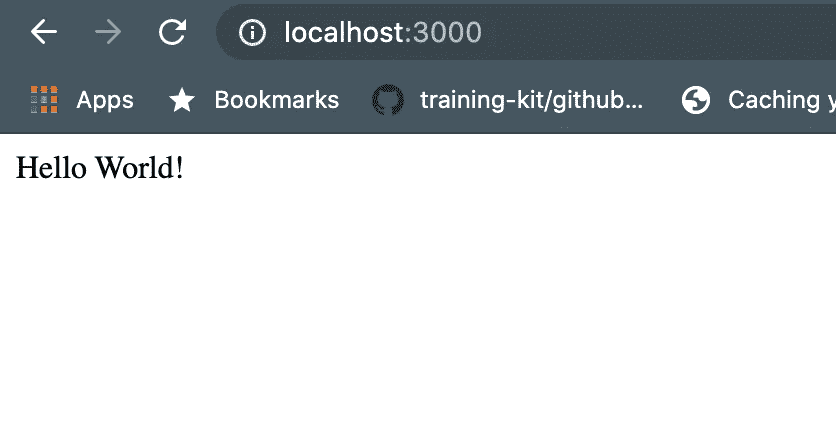
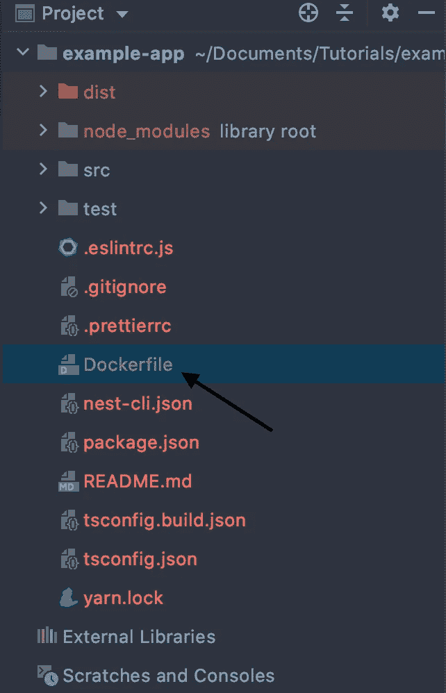
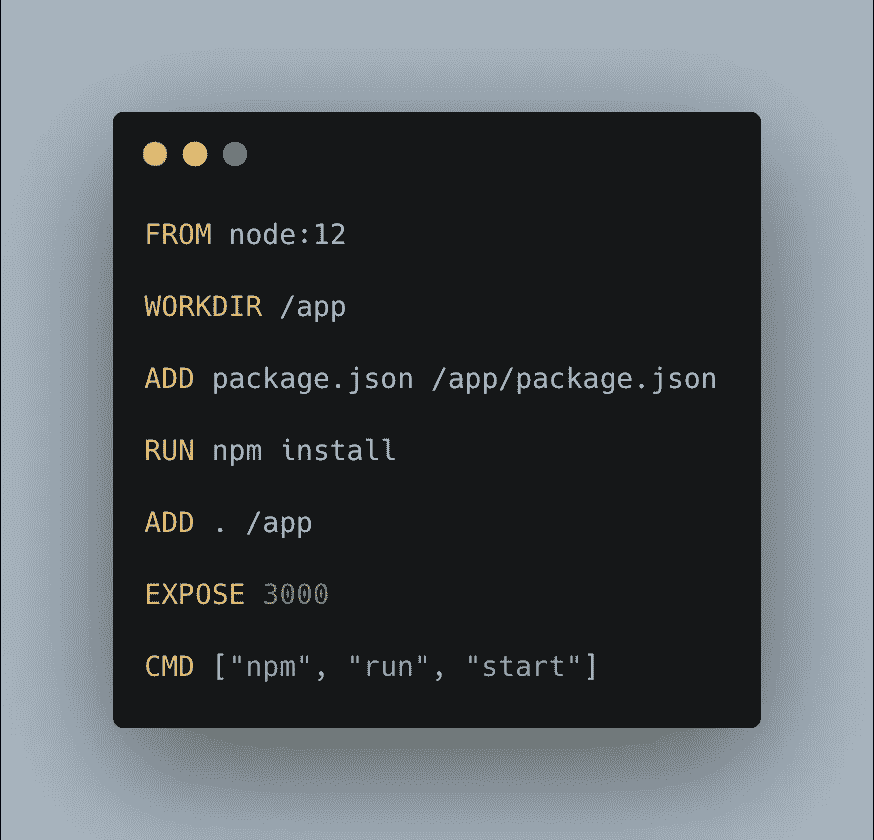
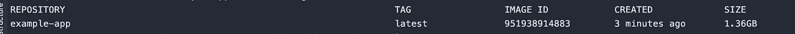

# 将基本的 Node.js/Nest.js 应用程序归档

> 原文：<https://javascript.plainenglish.io/dockerizing-a-nestjs-nodejs-app-d440762d98a4?source=collection_archive---------4----------------------->


今天我们将 Dockerize 一个 Node.js 应用程序。今天我们将使用 Nest.js。但是对于任何构建了其他框架(如 Express.js)的 Node.js 应用程序，命令和过程都是完全相同的。

# ***nest . js 是什么，我们为什么要用它？***

**Nest.js** 是一个渐进式 Node.js 框架。构造 Nodejs 项目有很多方法，尤其是当我们使用 express 或其他类似的框架时。但是当多人在同一个项目上工作时，这可能会是一个问题。在这些情况下，Nest.js 可以提供帮助。它遵循创建项目的特定模式，并有助于保持我们的应用程序的不同模块相互分离，这很棒！

## ***nest . js 入门***

首先，我们需要安装 Nest.js cli。在您的终端上运行以下命令。

```
npm i -g @nestjs/cli
```

安装完成后，我们可以像这样非常容易地搭建一个新的 Nest.js 应用程序。

```
nest new example-app
```

初始化后，我们可以进入项目目录并立即开始项目！

```
cd example-appyarn start:dev
```

您的项目将在本地主机的端口 3000 上运行。打开你的浏览器，进入 **http://localhost:3000/** ，你会得到一个‘Hello World’的响应！



The first response from NestJS app!

# ***Docker 是什么，我们为什么要使用它？***

Docker 是一种容器化应用程序的方式，这样你就不必担心不同的运行时、依赖关系或版本。如果 docker 映像在您的本地机器上运行，它将在任何机器上运行。这对于轻松部署我们的应用程序或与其他人共享非常有用。现在，我们将一步一步地对我们的应用程序进行分类。

**第一步:安装 Docker**

要安装码头工人，请点击此处[https://docs.docker.com/get-docker/](https://docs.docker.com/get-docker/)

第二步:将 Docker 添加到你的项目中

在根目录中添加一个名为 Dockerfile 的新文件



**第三步:添加 Docker 命令**

将以下代码添加到 docker 文件中。



让我们一行一行地分析代码

```
*FROM* node:12
```

在这里，我们设置我们的应用程序将运行的基础图像。这里我们选择节点:12，它是可以在 docker hub 中找到的节点的官方映像。

```
*WORKDIR /*app
```

我们将工作目录设置为 app。

```
*ADD* package.json */*app*/*package.json
```

我们将 package.json 文件移到我们的工作目录中。

```
*RUN* npm install
```

我们在根目录中运行通常的 npm 安装

```
*ADD* . */*app
```

我们将内容移动到应用程序目录中

我们将 3000 端口暴露在容器中，以便它可以与容器外部通信。这将取决于您的应用程序运行在哪个端口上。鸟巢通常是 3000

```
*CMD* ["npm", "run", "start"]
```

最后，我们运行命令来启动应用程序。任何 docker 文件中只能有一个 CMD 命令。

**第四步:建立你的 Docker 形象**

运行以下命令来构建 docker 映像。从项目的同一个根目录中运行这个程序

```
docker build . -t example-app
```

这里我们用-t 来命名我们的图像。我们可以给我们的图像起任何名字。为了保持一致，我们在这里使用项目名称。构建映像需要一段时间。

**第五步:运行 docker 映像**

我们可以通过跑步来观看图像。

```
docker images
```

它将列出我们机器中的所有图像



images in our machine

我们可以看到，我们的图像有“最新”作为标签。它是默认给定的。如果我们愿意，我们可以重新标记我们的图像。现在要运行我们的映像，我们首先需要通过 ***Ctrl+ C*** 停止项目的运行实例，然后运行下面的命令…

```
docker run --rm -it -p 3000:3000/tcp example-app:latest
```

该命令有几个部分，但最重要的部分是查看 3000:3000/tcp 这里的第一个 3000 表示我们希望映射到运行 docker 映像的本地主机的端口。第二个 3000 是我们之前设置的 docker 容器内部的公开端口。

如果我们想知道这是否可行，我们可以像以前一样打开浏览器，进入。 [http://localhost:3000/](http://localhost:3000/) 看看是否按预期工作。

**第六步:玩它**

现在，您可以更改您的代码并重新构建映像，然后再次运行以查看是否在 docker 映像中发现了更改。

你可以在这里找到这个项目的代码。

[](https://github.com/Mohammad-Faisal/example-nestjs-app) [## GitHub-Mohammad-fais al/example-nestjs-app

### 一个渐进式 Node.js 框架，用于构建高效且可伸缩的服务器端应用程序，其灵感主要来自…

github.com](https://github.com/Mohammad-Faisal/example-nestjs-app) 

**通过**[**LinkedIn**](https://www.linkedin.com/in/56faisal/)**或我的** [**个人网站**](https://www.mohammadfaisal.dev/) **与我取得联系。**