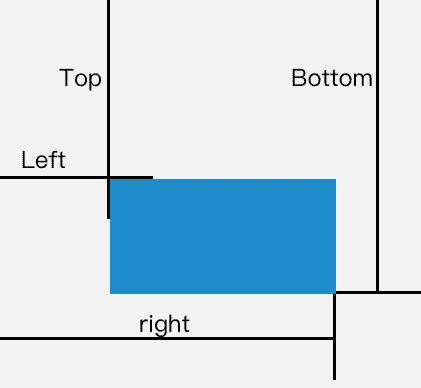

# DOM 操作初学者指南

> 原文：<https://javascript.plainenglish.io/dom-manipulation-985995eb858a?source=collection_archive---------8----------------------->

DOM 操纵可以使 web 应用程序可定制，并且网页的数据可以在不刷新页面的情况下更新。通过 DOM 操作，我们可以添加、更改和删除任何 HTML 元素或属性以及与之相关的 CSS 样式。任何事件也可以附加到元素。

让我们了解什么是 DOM 以及它是如何创建的。

# 什么是 DOM？

DOM(文档对象模型)是 HTML 或 XML 文档在逻辑树结构中的面向对象的表示，其中每个节点包含一个表示文档一部分的对象。


节点还可以附加事件，当事件被触发时，附加到节点的事件处理程序将被执行。 **DOM** 还充当 JavaScript 和 HTML 或 XML 文档之间的接口，允许创建可定制的网页。

# **DOM 是怎么创造出来的？**

浏览器以**原始字节**格式读取网页的 HTML，并将其翻译成单独的**字符**。该字符串然后被转换成 W3C 指定的不同的**标记**。尖括号< >之间字符串的记号有特殊的含义，有自己的一套规则。在令牌产生后，它们被转换成具有其属性和规则的**对象**。这些对象按照 HTML 标记中的标签(即 **DOM** )构建在一个具有父子关系的树形结构中。

流程如下:


DOM Creation

# DOM 操作方法

DOM 方法允许访问树，通过它我们可以改变 DOM 结构并根据需要操作 DOM。以下是最常见的方法和操作 DOM 的方式。

*   ***document . createelement(tagName)*-**在您的 JavaScript 代码中动态创建 HTML 元素的新节点。

```
 var paraEle = document.createElement(‘p’);
```

*   ***【document . Create text node(文本)-*** *创建一个文本节点。*

```
var node = document.createTextNode(“This is a para”);
```

*   ***Document . createdocumentfragment()-***文档片段基本上就是虚拟不可见的 HTML 元素 ***。*** 。createDocumentFragment()*用于创建文档片段，将元素追加到文档片段，然后将文档片段追加到 DOM 树。在 DOM 树中，文档片段被它的所有子元素替换。*

```
*var fragment = document.createDocumentFragment();* 
```

*   *如果我们正在编写一个进行大量 DOM 操作的页面，使用这种方法可以极大地提高页面的性能。将子元素附加到片段可以防止 UI 回流，从而提高性能，并且因为这个原因，createElement()不同于*createDocumentFragment()*。*
*   ***parent element . append child(new element)**:该方法插入子节点(在参数中传递)作为父元素的最后一个子节点。即它将子节点元素附加到父节点元素*

```
*paraEle.appendChild(node);
fragment.appendChild(paraEle);document.body.appendChild(fragment);*
```

*   ****parent element . insert before(new element，element)*** :允许在现有父节点元素中插入新的子节点元素(作为第一个参数传递)，放在父元素中它的一个子节点(作为第二个参数传递)之前。*

```
*const list = document.createElement('ul');
document.body.insertBefore(list, paraEle);*
```

*   ****Node.setAttribute(name，value)***:*动态设置 HTML 中元素的属性。**

```
**paraEle.setAttribute('class','paragraph');**
```

**然后，我们可以为类段落设置 CSS，样式将应用于元素。**

*   *****【node . text content()***:*允许设置和获取节点的文本内容(俗称元素)。***

```
***const para = document.getElementByClassName('paragraph');
console.log(para.textContent); // console the para text
para.textContent = "This is the changed paragraph" ; /*set the paragraph text*/***
```

*   ******node . innerhtml()***:设置内部 HTML 内容。***

```
**para.innerHTML = '<em>This is the changed paragraph</em>'; // text will be italics**
```

**innerHTML()和 textContent()的区别在于，innerHTML()可以设置 HTML 标记和元素中的文本，而在 text Content()中只能设置文本。**

*   *****node . class list***:允许你修改附加到元素上的类。**

```
**console.log(paraEle.classList); 
//console all the classes attachedparaEle.classList.add('myClass') 
//styles of myClass class will be appliedparaEle.classList.remove('myClass'); 
// remove the classparaEle.classList.replace('myClass1','myClass2'); 
//replaces one class with other;paraEle.classList.toggle('myClass') 
//if class present removes it, else if not present attaches the class to the element;paraEle.classList.contains('myClass')
//returns true or false whether the class is in the classList or not**
```

*   *****Node.dataset*** :允许您设置和获取 HTML 元素上的自定义数据属性的值。**

```
**//HTML file
<div id="myDiv" data-name="Item" data-item-price="10"></div>//JavaScript
const myDiv = document.getElementById('myDiv');console.log(myDiv.dataset)
//{name:"Iteml", item-price:"10"}myDiv.dataset.name = "new Item1" 
//changes the name property of myDiv.removeAttribute('data-name')
//removes the name attribute of data**
```

*   *****node . clone node***:允许在节点上进行复制或克隆。**

```
**var paraCopy = paraEle.cloneNode();
//It doesn't include the childNode by default it only copies the current node which is <p></p>var paraCopy = paraEle.cloneNode(true);
//deep copy happends i.e. childNode will also be copieddocument.body.appendChild(paraCopy);**
```

*   *****node . nextelementsibling***:给出正在调用的元素的下一个元素。**
*   *****Node . next sibling***:*给出下一个节点。它还考虑任何类型的节点，包括文本节点，但 nextElementSibling 不考虑。***
*   ******element . getboundingclientrect()***:该方法将返回一个包含元素属性的对象，如宽度、高度、上、下、左、右、下值以及 x、y 坐标。***

```
**console.log(paraEle.getBoundingClientRect());**
```

****

*****.getBoundingClientRect() object contains these values*****

*   *****element . outer HTML***:给出元素标签的外层 HTML，包括 id、类等。**
*   *****document . getelementbyid(****idname****)***:让您找到具有所提供 Id 的元素**
*   *****document . getelementbyclass name(****class name****)***:让您找到具有所提供类名的元素**
*   *****Element . query selector(****选择器* ***)*** :用于查找与 CSS 选择器匹配的第一个元素。**

```
**document.querySelector('#myDiv');
//gives element with the above selector i.e. id of myDivdocument.querySelector('.myClass');
//gives element with the above selector i.e. class of myClass**
```

*   *****element . query selector all(****选择器* ***)-*** 用于查找与 CSS 选择器匹配的元素列表。**

```
**document.querySelectorAll('.myClass');
//gives the array of element with the above selector**
```

*   *****window . parent***:document 等于 window.parent.document 引用我们的 HTML 文档**

**在浏览器呈现页面之前，先构造 DOM。因此，我们需要确保尽可能快速地将 HTML 交付给浏览器。过多的 DOM 操作会导致页面一次又一次的渲染，从而导致 UI 的回流，这是一种昂贵的代价。**

**因此，我们必须确保没有过度的 DOM 操作。此外，React 等一些库使用虚拟 DOM，因此性能不会受到影响，网页也是动态的。**