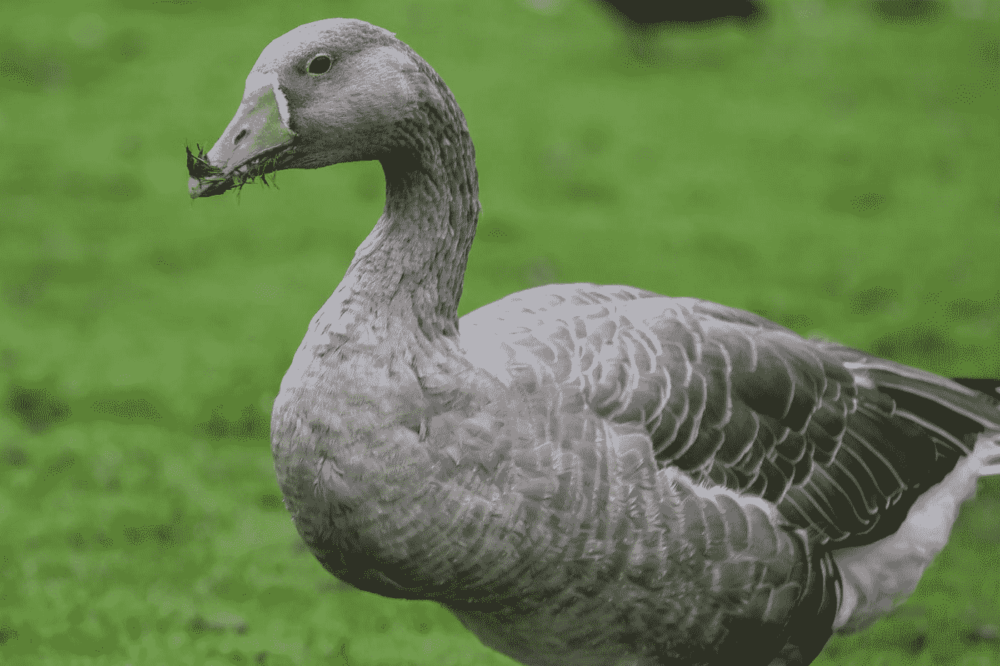

# DOM 操作—自定义事件和事件委托

> 原文：<https://javascript.plainenglish.io/dom-manipulation-custom-events-and-event-delegation-3d2f12bd245c?source=collection_archive---------3----------------------->



Photo by [Lukas Boekhout](https://unsplash.com/@lakus?utm_source=medium&utm_medium=referral) on [Unsplash](https://unsplash.com?utm_source=medium&utm_medium=referral)

JavaScript 是世界上最流行的编程语言之一。为了有效地使用它，我们必须了解它的基本知识。

在本文中，我们将研究如何发出自定义事件、模拟鼠标事件和事件委托。

# 自定义事件

我们可以在 JavaScript 代码中发出自定义事件。

这样，我们可以使用`createEvent`方法，然后使用`addEventListener`来监听事件。

例如，如果我们有一个按钮:

```
<button>
  click me
</button>
```

我们可以写:

```
const button = document.querySelector('button');
const customEvent = document.createEvent('CustomEvent');button.addEventListener('hello', (event) => {
  console.log(event.detail.foo)
}, false);customEvent.initCustomEvent('hello', true, false, {
  foo: 'bar'
});button.dispatchEvent(customEvent);
```

我们调用`createEvent`来创建一个自定义事件。我们传入`'CustomEvent'`来创建一个定制事件。

然后我们调用`initCustomEvent`用数据初始化定制事件。

接下来，我们调用`dispatchEvent`来触发事件。

然后在我们传递给`addEventListener`的事件处理程序中，我们记录了`detail`属性中的数据。

所以当我们访问`foo`属性时，我们得到了`'bar'`。

# 模拟或触发鼠标事件

我们可以通过使用`initMouseEvent`方法来触发鼠标事件。

例如，如果我们有:

```
<button>
  click me
</button>
```

我们可以写:

```
const button = document.querySelector('button');
button.addEventListener('click', (event) => {
  console.log(event);
}, false);const simulatedClick = document.createEvent('MouseEvents');simulatedClick.initMouseEvent('click', true, true, document.defaultView, 0, 0, 0, 0, 0, false, false, false, 0, null, null);button.dispatchEvent(simulatedClick);
```

我们用`'MouseEvents'`调用`createEvent`。

然后我们用它调用`initMouse`事件。这需要很多论据。

这些论点按以下顺序排列:

*   `type` —我们想要触发的鼠标事件的类型
*   `canBubble` —指示事件是否冒泡
*   `cancelable` —表示事件是否可取消
*   `view` —事件的抽象视图，应为`window`
*   `detail` —点击计数
*   `screenX` —事件的 x 坐标
*   `screenY` —事件的 y 坐标
*   `clientX` —事件客户端的 x 坐标
*   `clientY` —事件客户端的 y 坐标
*   `ctrlKey` —事件过程中是否按下 Ctrl 键
*   `altKey` —事件期间是否按下 Alt 键
*   `shiftKey` —事件期间是否按下了 Shift 键
*   `metaKey` —事件期间是否按下 meta (Windows / Command)键
*   `button` —鼠标按钮
*   `relatedTarget`-相关事件目标

这是一个不推荐使用的 API，所以应该考虑其他解决方案。


Photo by [Lutz Baumann](https://unsplash.com/@luba1304?utm_source=medium&utm_medium=referral) on [Unsplash](https://unsplash.com?utm_source=medium&utm_medium=referral)

# 活动委托

我们可以使用一个事件处理程序来监听来自不同来源的事件。

例如，如果我们有:

```
<button>
  button 1
</button>
<button>
  button 2
</button>
<button>
  button 3
</button>
```

我们可以写道:

```
document.addEventListener('click', (event) => {
  if (event.target.tagName.toLowerCase() === 'button') {
    console.log(event.target.textContent);
  }
}, false);
```

我们用`document.addEventListener`收听整页的点击事件。

然后得到事件起源的元素`event.target`。

如果我们点击了一个按钮，那么我们会记录文本内容。

# 结论

我们可以用客户端的 JavaScript 代码创建自定义事件。

我们也可以模拟鼠标事件。

此外，我们可以使用事件委托来使用一个事件侦听器来侦听来自多个源的事件。

## **简单英语 JavaScript**

你知道我们有四个出版物和一个 YouTube 频道吗？在 [**找到他们。点击**](https://plainenglish.io/) 和 [**订阅我们的 YouTube 频道**](https://www.youtube.com/channel/UCtipWUghju290NWcn8jhyAw) **！**