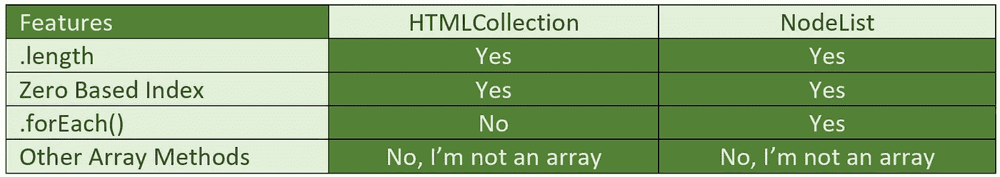

# DOM 选择器及其类似数组的对象

> 原文：<https://javascript.plainenglish.io/dom-selectors-and-their-array-like-objects-7f4899bf2192?source=collection_archive---------4----------------------->


文档对象模型(DOM)可以通过右击一个站点并检查它来访问。在 elements 选项卡下，我们可以操作我们在站点上看到的内容，*在我们当前的屏幕上只有*。例如，在我们的开发工具中的 elements 选项卡下，尝试找到包含本文标题的 div，然后更改它的标题。这是大教堂。

我们还可以通过使用 DOM 选择器来访问 DOM 并在控制台中操作页面。在本文中，我们将讨论 getElement 选择器、querySelector 以及这些选择器返回给我们的类似数组的对象。

在我们深入研究选择器本身之前，理解它们返回给我们的是**而不是**数组，而是类似数组的对象是至关重要的。使用数组，我们可以访问大量的数组方法和属性。HTMLCollections 和 NodeLists 则不是这种情况。



那么，我们使用什么选择器来获得 HTMLCollection 或 NodeList，我们想要哪个呢？这完全取决于你需要用什么特性来处理它们。

# 选择器

## getElement

在控制台中，我们可以通过输入以下格式的 document.getElement 来获得 HTMLCollection:

```
document.getElement**sByTagName**(‘div’); // returns all divs **in an HTMLCollection**
```

```
document.getElement**ByTagName**(‘p’); // Notice there is no 's' in 'Element'. This will only return the first p tag. Because it is a single element, there is no array-like object
```

```
document.getElement**ById**(‘root’); // will return the element with this ID. Because it is a single element, there is no array-like object
```

```
document.getElement**sByClassName**(‘left-buttons’); // will return the elements with this class **in an HTMLCollection**
```

## 查询选择器

在控制台中，我们可以通过输入以下格式的 document.querySelector 来获得节点列表:

```
document.querySelector(‘.left-buttons’); // This will return a class. Notice the . before left-buttons. The . is needed when using querySelector so it knows it is looking for a class. ***We would have to do the same thing with IDs, using a # in lieu of a . in front of the id name.*** Because it is a single element, there is no array-like object
```

```
document.querySelector**All**(‘h3’); // This selector **will return a NodeList** of all of the h3s in the document. 
```

**特别说明:**我们可以使用 Array.from()将类似数组的对象转换成数组，将类似数组的对象作为唯一的参数传递。多棒啊。！

```
Array.from(arrayLikeObject);
```