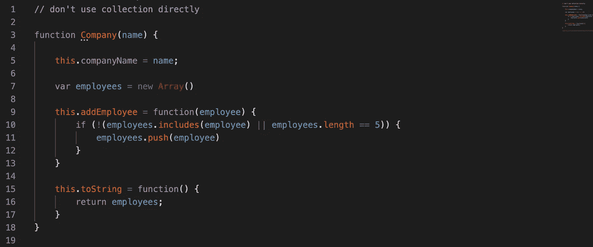

# 不要直接使用集合

> 原文：<https://javascript.plainenglish.io/dont-use-collection-directly-93a5457a8e40?source=collection_archive---------5----------------------->

## 创建一流的收藏

Don’t use collection directly

任何包含集合的类都不应该包含其他成员变量。这就是“一流收藏”的原则。如果您有一组元素并且想要操作它们，那么创建一个专用于这组元素的类，这样现在与集合相关的行为就有了一个家(例如，过滤方法，对每个元素应用一个规则)。

# 为什么

这里的主要思想是，如果你想在集合上搜索、过滤、验证或任何超出添加/删除/迭代语义的东西，代码会要求你把它放在自己的类中。如果您只需要更新一个值(在搜索之后)，那么它可能会放在 collection 类中。

*   如果我们将集合视为原语，任何特定于您的集合的行为都将被吸引到单个位置。
*   过滤器本身将成为功能对象。
*   我们可以为类中的每个元素处理诸如连接或特殊规则之类的活动。
*   任何改变都不会影响客户端，并且会提高系统的解耦性。

# 例子

让我们对一个典型的团队域进行建模，我们可以像下面的例子所示的那样来处理它:

## 不要直接使用集合

## 将集合包装在有意义的对象中，我们如下设计模型

有了上面的方法，我们就有了集合中所有行为的家。这样，我们可以更好地分离物体。

感谢阅读！不要忘记👏跟着走。

# 参考

[1]*Thoughtworks Inc(2008)。*ThoughtWorks 选集:软件技术和创新论文集。**