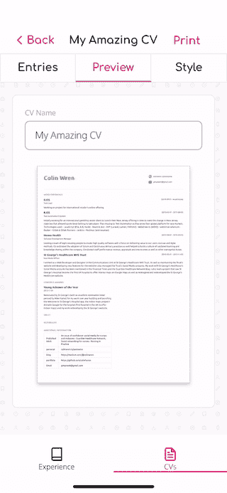

# 使用 React Native with Expo 下载和保存二进制文件

> 原文：<https://javascript.plainenglish.io/downloading-and-saving-binary-files-using-react-native-with-expo-451b46cb0cc7?source=collection_archive---------0----------------------->

Printing dialog in my app JiffyCV

我正在构建的应用程序(JiffyCV) 的一个关键部分是为你已经创建的文档生成一个 PDF，但是当实现 PDF 的保存时，没有太多的文档，所以我打算写一些，希望这可以帮助其他人将这个功能添加到他们的应用程序中。

为了在我的应用程序中下载并保存 PDF，我必须执行以下流程:

*   使用 axios 向服务器发出请求
*   使用 Buffer 将响应数据转换为 base64 字符串
*   获取文件的保存路径
*   将文件写入路径，以便共享
*   启动设备的共享功能来共享文件
*   然后，用户可以选择将文件保存到文件系统或在其他地方共享

# 使用的库

实现上述流程需要许多库，大多数是普遍需要的，但`axios`更多的是个人偏好。

这些库是:

*   **axios** —用于向服务器发出请求
*   **jest-mock-axios** —用于在测试期间模拟服务器响应
*   **缓冲区** —用于将来自服务器的响应转换为 base64 字符串
*   **expo-file-system** —用于在共享文件之前将文件保存到应用程序的文档存储中
*   **expo-sharing** —允许用户将文件共享/保存到设备

# 从服务器获取文件

我的应用程序使用一个无服务器的功能，通过 puppeteer 创建一个 PDF，然后返回 PDF 对象。

来自无服务器函数的响应是 base64 编码的，但是我使用的是`axios`的`arraybuffer` responseType，这意味着我需要使用`buffer`将它们转换成 base64 字符串，我可以用它在本地创建文件。

这是我发现的唯一有效的`axios`方法，但是如果你有更好的方法，请留下你的解决方案的评论。

Making the request to the server and returning a base64 string of the response’s data

# 将文件保存到应用程序的文档存储

一旦我们有了想要保存的 PDF 的 base64 字符串，我们需要创建保存文件的路径，并将其保存到应用程序的文档目录中。

您可以通过使用来自`expo-file-system`的`documentDirectory`属性首先获取应用程序的文档目录来获取保存文件的路径。然后你需要添加文件名来保存文件。

文档目录将有`/`后缀，所以没有必要将它包含在您的文件名中，您将需要确保您的文件名是 URI 编码的，如果不是，您可能会将半个文件名显示给用户。

获取保存文件的路径后，您可以从`expo-file-system`调用`writeAsStringAsync`传递文件名，文件的 base64 表示，当您使用 base64 时，您需要传递一个选项对象，其`encoding`属性设置为`EncodingType.Base64`。

## 允许用户共享/保存文件

这个部分相对简单，因为您只需要将应用程序文档库中保存文件的路径传递给`expo-sharing`的`shareAsync`功能。这将弹出对话框，允许用户将文件保存到他们的设备上，或者通过他们手机上安装的应用程序共享文件。

Saving the file to the app’s document directory and then using that fileUri to allow them to share it

# 测试流量

为了测试对带有`axios`的服务器的调用，您可以使用`jest-mock-axios`库，该库允许断言某个端点被调用，也允许断言响应值。

`jest-mock-axios`拦截服务器响应的方式并不是最优雅的解决方案，因为它需要您在调用 axios 代码后定义拦截的响应，但是一旦您掌握了流程的窍门，它就可以很好地工作。

使用`jest-mock-axios`时，记住每次测试后都要调用`mockAxios.reset()`非常重要，就好像你不响应一样，存根不会像预期的那样工作。

Testing the calls to the server made via axios

一旦对服务器的调用及其响应被模拟，那么您就需要模拟`expo-file-system`和`expo-sharing`模块，以便控制`documentDirectory`、`writeAsStringAsync`和`shareAsync`调用的行为。

如下图所示，您可以使用标准的`jest.mock`方法。只要模块模型返回一个带有你正在调用的函数的属性的对象，那么它就会工作。如果你想控制每个函数的行为方式或者断言该函数被调用，那么使用一个命名的模拟并使用`mockImplementation`可以改变行为。

By mocking out the expo-file-system and expo-sharing modules we can make sure they are called after the PDF file is generated.

# 摘要

使用`expo-file-system`和`expo-sharing`的组合允许容易地实现测试解决方案，并且用户能够决定他们想要对文件做什么，这是一个非常好的用户体验，因为他们可能不总是希望保存它，而是通过另一个应用程序发送它。

## 简单英语的 JavaScript

你知道我们有三份出版物和一个 YouTube 频道吗？在[T3【plain English . io找到一切的链接！](https://plainenglish.io/)