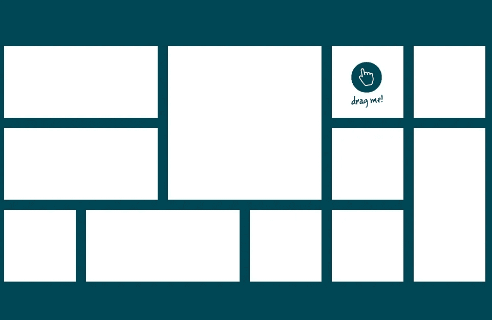
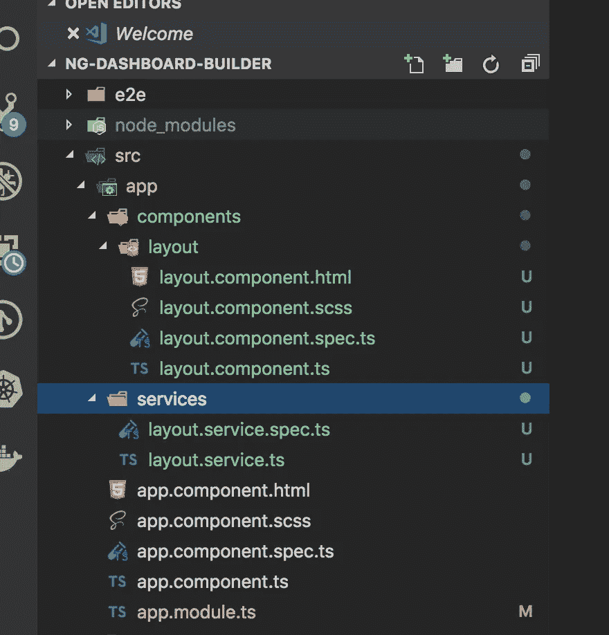
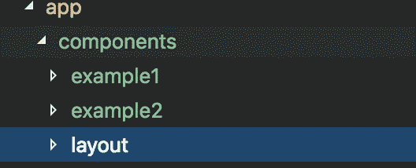
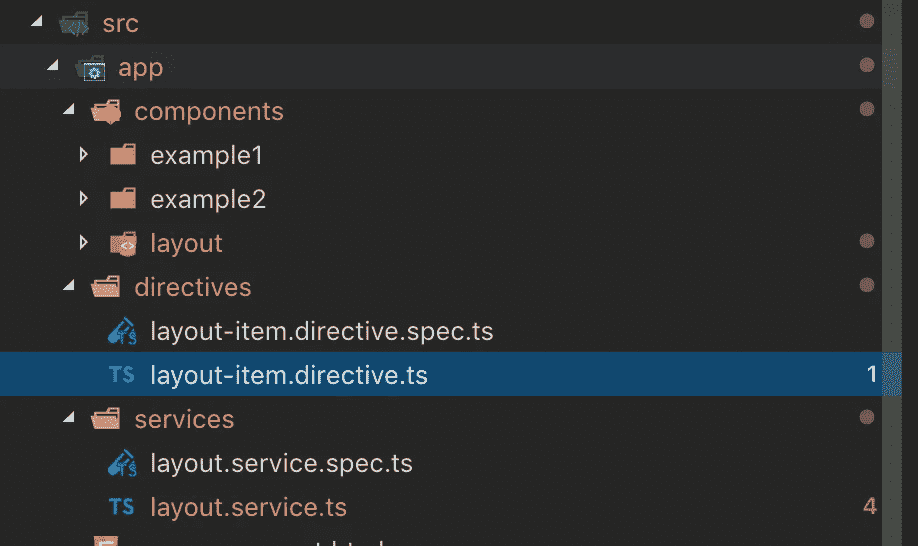
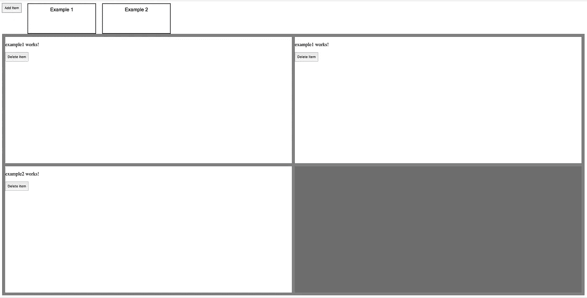

# 使用 Angular 和 Gridster 拖放仪表板生成器

> 原文：<https://javascript.plainenglish.io/drag-and-drop-dashboard-builder-with-angular-and-gridster-a07592e54ce2?source=collection_archive---------0----------------------->

如果你想在 Angular 中使用*拖拽*来构建仪表盘，那就别再找了。在这篇文章中，我们将介绍如何使用 Angular 从头开始创建一个*拖放仪表板生成器*项目！

如果您以前从未使用过 Angular，请不要担心，事实上这是一个很好的起点，因为我们将用可靠的工作示例涵盖大多数基础知识，这将比另一个 *ToDo* 或 *Hello world* 有趣得多！



# 最终目标是什么？

我想创建一个*拖放仪表板生成器*，使*用户*能够配置仪表板布局，然后将组件拖放到上面。

*这种功能对于任何与数据分析相关的事情来说都是非常酷的，可以作为一种非常酷的方式，使您的用户(例如分析师)能够创建完全定制的仪表板。*

# 我们将使用什么工具？

1.  **有角度(v7)**
2.  格里斯特

# 有角的

Angular 是一个 JavaScript 框架(*由 Google 团队*开发)，它非常固执地描述了应该“如何”构建 JavaScript 代码。通过遵循 Angular 的模式和惯例，你可以节省很多时间和精力；允许框架处理困难的部分，如数据绑定和组件组合。在这篇文章中，我们将介绍 Angular 的基础知识，但是如果你想了解更多，Angular 上有很多资源。注意区分 AngularJS ( *老版本与本帖*无关)和 Angular ( *最新版本是 7 有 8 在地平线上*)。

# 格里斯特

Gridster 是一个拖放式多列网格，使用户能够从跨越多列的元素构建直观的可拖动布局。它还支持在网格中动态添加和删除元素。我最近在工作中经常使用它，感觉棒极了。

具体来说，我们将使用 [angular-gridster2](https://github.com/tiberiuzuld/angular-gridster2) ，它是该库的纯角度实现:

[](https://github.com/tiberiuzuld/angular-gridster2) [## tiberiuzuld/angular-gridster2

### 角磨机 2。在 GitHub 上创建一个帐户，为 tiberiuzuld/angular-gridster2 的开发做出贡献。

github.com](https://github.com/tiberiuzuld/angular-gridster2) 

现在事不宜迟，让我们卷起袖子大干一场吧！

# 1.创建新的角度项目

如果您以前从未使用过 Angular，那么在我们开始之前，您需要在您的计算机上全局安装它:

`npm install -g @angular/cli`

第一步是创建和配置 Angular 工作空间，让我们使用 Angular 的神奇 CLI 创建一个工作空间:

`ng new ng-dashboard-builder`

我们不需要这个项目的路由，所以可以不包含它，并选择`SCSS`作为样式表格式:

```
Would you like to add Angular routing? **No**
Which stylesheet format would you like to use? **SCSS** [ [http://sass-lang.com](http://sass-lang.com) ]
```

现在，让我们转到项目目录并安装我们的依赖项:

`cd ng-dashboard-builder
npm i angular-gridster2 angular2-uuid --save`

在这个阶段，你可以启动 Angular 的开发服务器，通过运行`ng serve`预览你的项目，并在`http://localhost:4200`打开你的浏览器。

# 2.创建布局服务和组件

接下来，让我们为布局**服务**和布局**组件**创建占位符。

*在我们创建它们之前，让我区分一下这两者:*

一个**服务**通常是一些共享的业务逻辑、数据模型或功能，它们可以通过依赖注入在一个 Angular 应用程序中的不同组件之间共享(*我们将在后面讨论依赖注入——这真的很酷！*)。

对于我们的 dashboard builder，我们可能需要一个服务来保存与我们的布局相关的数据(*数据* *模型*)和另一个服务来对附加到我们的拖放事件的数据进行转换。

组件以其最简单的形式用于在我们的应用程序中显示数据，所以在我们的例子中呈现布局。组件构成了任何角度应用的主要构件。

通过区分这两者，我们有了关注点的分离，数据和逻辑(*作为无状态对象的服务*)从它们的上下文用例中分离出来。这有助于将我们的应用程序划分成逻辑块，促进良好的实践，如可重用性和可伸缩性。

我喜欢将组件和服务分离到不同的文件夹中，所以让我们在新工作区的`src/app/`根目录下创建两个文件夹:

`cd src/app/
mkdir components services`

我们将很快更详细地了解这些，但是让我们使用 CLI 创建一个**布局服务**和**布局组件**:

`cd components/
ng generate component layout`

`cd ../services/
ng generate service layout`

一旦你完成了上面的步骤，你的项目应该如下所示:



Angular project with layout component and layout service

在我们继续之前，我们应该让我们的应用程序默认呈现我们的**布局组件**。通常，这可以通过应用程序路由来实现，但由于我们在本文中没有涉及这一点，我们可以简单地将引用硬编码到我们的`app.component.html`文件中，将其内容替换为以下内容:

```
<app-layout></app-layout>
```

***注意:****Angular 编译器巧妙地识别出这个自定义元素名，并将其映射到我们的布局组件。自定义元素名称定义为****layout . component . ts****文件中的* ***选择器*** *。*


# 3.带有 Gridster 的布局组件

现在有趣的是——让我们引入 Gridster，使我们能够开始构建一些布局。

我们已经在 **angular-gridster2、**上安装了我们的依赖项，但是我们需要让它在我们的 angular 项目中可用，为此我们必须将它导入到我们的 app 模块的`app.module.ts` 文件中。

继续打开`src/app/app.module.ts`:

从文件顶部的 **angular-gridster2** 导入 **GridsterModule** ，并将其添加到模块的导入定义中，如下所示:

```
import { BrowserModule } from '@angular/platform-browser';
import { NgModule } from '@angular/core';
**import { GridsterModule } from 'angular-gridster2';**import { AppComponent } from './app.component';import { LayoutComponent } from './components/layout/layout.component';@NgModule({
  declarations: [
    AppComponent,
    LayoutComponent
  ],
  **imports**: [
    BrowserModule,
 **GridsterModule**
  ],
  providers: [],
  bootstrap: [AppComponent]
})export class AppModule { }
```

当我们要求 Angular CLI 创建我们的布局组件时，它生成了如下所示的 4 个文件:

```
src/app/components/layout/layout.component.html# Template used for rendering HTMLsrc/app/components/layout/layout.component.scss# Styling i.e. how the component lookssrc/app/components/layout/layout.component.spec.ts# Unit test specsrc/app/components/layout/layout.component.ts# TypeScript file with logic, methods available to the component
```

Gridster 需要一些默认选项来运行，所以让我们把它们添加到`src/app/components/layout/layout.component.ts`中。

将此导入行添加到文件的开头，然后在类定义中添加选项和布局值，如下所示:

```
import { Component, OnInit } from '@angular/core';
**import { GridsterConfig, GridsterItem } from 'angular-gridster2';**@Component({
  selector: 'app-layout',
  templateUrl: './layout.component.html',
  styleUrls: ['./layout.component.scss']
})export class LayoutComponent implements OnInit { **options: GridsterConfig = {
    draggable: {
      enabled: true
    },
    pushItems: true,
    resizable: {
      enabled: true
    }
  };** **layout: GridsterItem[] = [];** constructor() { } ngOnInit() {
  }}
```

> 如果您以前没有见过 JavaScript 中的`<name>: <type>`符号，欢迎来到 TypeScript。TypeScript 与 Angular 捆绑在一起，为 JavaScript 带来了静态类型。

这里我们只是将一些 **GridsterConfig** 设置为**选项**，将一个 **GridsterItem** ( *暂时为空*)数组设置为**布局**。

**GridsterConfig** 和 **GridsterItem** 是指我们在本文件开头从 **angular-gridster2** 导入的类型。

***注意:*** *因为我们使用的是 TypeScript，编译器知道哪些值是预期值，所以如果我们输入一个无效值，项目将不会编译。*


现在打开`src/app/components/layout/layout.component.html`，用以下内容替换它的内容:

```
<div class="toolbar"></div><gridster [options]="options">
  <gridster-item *ngFor="let item of layout" [item]="item">
  </gridster-item>
</gridster>
```

暂时忽略**工具栏** div，我们稍后会用到它…

这里我们通过引用`<gridster>`标签在组件模板中创建了一个新的 Gridster 实例。

当我们将一个属性放在方括号中时(例如`[options]="options"`)，我们使用一个表达式来绑定这个值。

另外,`*ngFor="let item of layout"`是一个在数据集合上迭代的指令。

现在你已经学习了表达式和指令，你很快就会爱上 Angular 的强大模板引擎！

我们还需要为 Gridster 添加一些 CSS 来正确渲染，因为它需要一个高度，这样它就可以计算尺寸，所以让我们将以下内容添加到`layout.component.scss`:

```
:host { .toolbar {
    height: 100px;
    display: flex;
  } gridster {
    display: flex;
    height: calc(100vh - 115px);
    flex-direction: column;
  }}
```

在我们继续之前，快速回顾一下…

> 我们已经创建了项目，并添加了布局组件和布局服务。我们将布局组件设置为默认呈现，然后在布局组件中配置 gridster 之前，在应用程序模块中包含 angular-gridster2。

现在，组件不呈现任何东西，因为我们在`layout.component.ts`中将 GridsterItem 值的数组设置为空…

```
layout: GridsterItem[] = [];
```

接下来，我们将创建一个服务来帮助我们管理我们的布局。


# 4.布局服务

我将有目的地保持我们的服务简单，这样您就可以看到组件如何与它交互，而没有不必要的复杂性。

***不过要注意，我们会在布局组件和布局服务之间频繁切换。***

首先，向我们的服务添加两个方法，一个是添加名为`addItem()`的 **GridsterItem** ，另一个是删除名为`removeItem()`的 GridsterItem。

打开`src/app/services/layout.service.ts`并添加以下内容:

```
import { Injectable } from '@angular/core';
**import { GridsterConfig, GridsterItem } from 'angular-gridster2';
import { UUID } from 'angular2-uuid';**@Injectable({
  providedIn: 'root'
})export class LayoutService { **public options: GridsterConfig = {
    draggable: {
      enabled: true
    },
    pushItems: true,
    resizable: {
      enabled: true
    }
  };** **public layout: GridsterItem[] = [];** constructor() { } **addItem(): void {
    this.layout.push({
      cols: 5,
      id: UUID.UUID(),
      rows: 5,
      x: 0,
      y: 0
    });
  }** **deleteItem(id: string): void {
    const item = this.layout.find(d => d.id === id);
    this.layout.splice(this.layout.indexOf(item), 1);
  }**}
```

我们中更精明的人会注意到在组件和服务中定义的**布局**和**选项**变量的严重重复。

我这样做是为了说明服务是多么有用。如果属性是在服务中定义的，那么这些值可以很容易地与其他组件共享。在组件中定义它们没有这个优势。

现在是时候重新审视我们的组件，让这些新方法对我们有用，并删除重复的属性。

切换回`src/app/components/layout/layout.component.ts`并更新到以下内容:

```
import { Component, OnInit } from '@angular/core';
import { GridsterConfig, GridsterItem } from 'angular-gridster2';
**import { LayoutService } from '../../services/layout.service';**@Component({
selector: 'app-layout',
templateUrl: './layout.component.html',
styleUrls: ['./layout.component.scss']
})export class LayoutComponent implements OnInit { **get options(): GridsterConfig {
    return this.layoutService.options;
  }** **get layout(): GridsterItem[] {
    return this.layoutService.layout;
  }** **constructor(
    private layoutService: LayoutService
  ) { }** ngOnInit() {}}
```

这里的主要区别是**选项**和**布局**的值现在来自我们的布局服务(使用 getters)。我们的服务是通过依赖注入实现的。

依赖注入是有角度的，这比你理解它是如何工作的要重要得多。其实很聪明。

通过在组件顶部导入我们的服务(*作为普通的*)，我们可以在构造函数中声明一个类型为我们的服务的变量。现在，它将神奇地创建一个新的应用程序范围的服务实例，或者使用一个已经存在的实例。很酷，对吧？

我们已经在我们的布局服务中创建了一些新方法，并将我们的布局服务注入到我们的布局组件中，所以让我们利用组件模板中的方法，打开`src/app/components/layout/layout.component.html`并更新如下:

```
<div class="toolbar">
  **<button (click)="layoutService.addItem()">Add Item</button>** </div><gridster [options]="options">
  <gridster-item *ngFor="let item of layout" [item]="item">
 **<button
      (click)="layoutService.deleteItem(item)"
    >
      Delete Item
    </button>**
  </gridster-item>
</gridster>
```

我们所做的唯一改变是引入了两个新按钮；一个调用`addItem()`服务方法，另一个调用`deleteItem()`服务方法(*传递一个布局作为参数*)。

我还会推荐按钮的样式。我只打算在`layout.component.scss`中添加一个固定高度，如下所示:

```
button {
  height: 30px;
}
```

*现在你终于可以玩 Gridster 了…在浏览器中加载你的项目，点击“添加项目”按钮，添加任意多的面板，然后调整大小，拖动和删除，直到你满意为止！*


# 5.拖放组件

在我将这个小项目交给您并让您尽情发挥之前，我想添加一些功能，使用户能够将组件拖放到布局上，从而创建完全定制的仪表板。

这将是本演练中最紧张的部分，但请耐心等待，我们就快完成了。

我将让您决定组件的外观。我们公司一直使用这种方法来创建分析仪表板，所以对我们来说，组件主要是数据可视化，如图表、数据表等。

出于本文的目的，让我们创建一些示例组件:

如果您还没有在组件目录中，那么`cd`您自己在那里，并使用 Angular CLI 生成一些示例组件:

`cd src/app/components/
ng generate component example1
ng generate component example2`

你现在应该在`src/app/components/`文件夹下有**两个**附加文件夹，如下所示:



example 1 and example 2 components

我们需要这些组件作为**入口组件**可用，这样我们就可以将它们放在我们的布局项目中。

***入口组件*** *是引导组件，Angular 将作为应用程序启动过程的一部分加载到 DOM 中。*

为此，我们必须向`src/app/app.module.ts`添加一个`entryComponents`定义，如下所示:

```
...entryComponents: [
  Example1Component,
  Example2Component
]
```

我们的目标是有一个非常酷的用户体验，用户可以将组件拖放到布局项目上。为此，我们需要通过创建一些 HTML 元素来创建应用程序中组件的可视化表示，这些元素可以使用 HTML5 的拖放事件来拖动。

在此之前，我们希望在我们的布局服务中保存`components`,这样当用户将一个组件放到布局项目中时，我们会将更改存储在应用程序状态中。

我们需要对我们的布局服务进行一些更改来支持这一点，打开`src/app/services/layout.service.ts`并添加以下内容:

```
**export interface IComponent {
  id: string;
  componentRef: string;
}**@Injectable({
  providedIn: 'root'
})
...
```

这是一个自定义的**接口**定义，它应该在我们的布局服务定义之上。这里我们定义了`id`和`componentRef`，前者应该匹配封闭布局项的 id，后者将是对示例组件*的字符串引用，即哪个组件应该放在匹配该 id 的布局项内。*

```
public layout: GridsterItem[] = [];**public components: IComponent[] = [];****dropId: string;**
```

*我们需要定义一些额外的参数，如上所示:*

`components`是一个组件数组(*我们定义为*之上的接口)，它将通过 id 与布局项目匹配。

`dropId`是用户当前悬停的布局项目的 id(*我们将很快看到这是如何工作的*)。

接下来，我们需要向我们的服务添加一些新方法，这些方法将附加到 Gridster 和 HTML5 提供的拖放事件处理程序:

`setDropId()`将被附加到 Gridster items `drag-over` 事件，该事件将在用户将鼠标移动到布局项目上时被触发。

`dropItem()`将由组件上的 HTML5 `dragend`事件触发，该事件将在用户完成组件拖动时触发。

`getComponentRef()`是一个方便的实用方法，它允许我们通过传递一个布局项目 id 来查询 componentRef。

我们还对我们的`deleteItem()`方法进行了修改，如果布局项目被删除，它将从我们的`components`数组中删除组件。

```
deleteItem(id: string): void {
  const item = this.layout.find(d => d.id === id);
  this.layout.splice(this.layout.indexOf(item), 1);
 **const comp = this.components.find(c => c.id === id);
  this.components.splice(this.components.indexOf(comp), 1);**
} **setDropId(dropId: string): void {
  this.dropId = dropId;
}****dropItem(dragId: string): void {** **const { components } = this;** **const comp: IComponent = components.find(c => c.id === this.dropId);

  const updateIdx: number = comp ? components.indexOf(comp) : components.length;** **const componentItem: IComponent = {
    id: this.dropId,
    componentRef: dragId
  };** **this.components = Object.assign([], components, { [updateIdx]: componentItem });****}****getComponentRef(id: string): string {
  const comp = this.components.find(c => c.id === id);
  return comp ? comp.componentRef : null;
}**
```

我们的布局服务现在已经具备了让我们能够在布局项目上拖放组件的所有必要条件。

让我们跳回到布局组件，并将这些新的布局服务方法连接到我们的布局组件。

从在`src/app/components/layout/layout.component.ts`中公开服务的新`components`属性开始。您还需要导入我们在布局服务中定义的`IComponent`接口:

```
...
import { LayoutService**, IComponent** } from '../../services/layout.service';...**get components(): IComponent[] {
  return this.layoutService.components;
}**
```

现在我们准备在组件模板中附加服务方法，打开`src/app/components/layout/layout.component.html`并进行以下更改:

```
<div class="toolbar">
  <button (click)="layoutService.addItem()">Add Item</button>
 ** <div
    class="draggable"
    draggable="true"
    (dragend)="layoutService.dropItem('example1')"**
  **>
    Example 1
  </div>
  <div
    class="draggable"
    draggable="true"
    (dragend)="layoutService.dropItem('example2')"
  >
    Example 2
  </div>**
</div>
<gridster [options]="options">
  <gridster-item
    *ngFor="let item of layout"
    [item]="item"
    **(dragover)="layoutService.setDropId(item.id)"**
  >
    <button
    (click)="layoutService.deleteItem(item)"
    >
      Delete Item
    </button>
  </gridster-item>
</gridster>
```

我们现在添加了几个新的 HTML `div`元素来表示我们的组件。

我鼓励你在这里发挥一点创造力。我只是以一种基本的方式来说明功能…这里的重点是它如何工作，而不是它看起来如何。

这里要注意的重要属性是:

`draggable="true"`，这是挂钩到 HTML5 的拖放事件。这将使这个元素在浏览器中可拖动，并将触发一些我们现在可以使用的事件。

当用户拖动完 HTML 元素后，将触发`(dragend)="layoutService.onDragEnd('example1')"`。

当用户将鼠标移动到布局项目上时，将触发`(dragover)="layoutService.setDropId(item.id)"`。

我们还需要在`layout.component.scss`中添加一些基本的样式:

```
.draggable {
  padding: 10px;
  width: 200px;
  border: solid 2px #000;
  margin-left: 20px;
  text-align: center;
  font-family: Arial, Helvetica, sans-serif;
}
```

到这个阶段，一切都应该在幕后很好地运转。我们应该能够添加布局项目，并从顶部拖动组件到它们上面，但等待…什么都没发生？

最后，我们需要创建一个定制的 Angular 指令来呈现布局项目中的组件。

为了保持整洁，让我们在`src/app/`文件夹中创建一个`directives`文件夹，并使用 CLI 生成一个名为`layout-item`的指令:

`cd src/app/
mkdir directives
cd directives/
ng generate directive layout-item`



layout-item directive

让我们在`src/app/directives/layout-item.directive.ts`中添加一些代码来呈现我们的组件:

```
import {
  Directive,
  Input,
  OnChanges,
  ViewContainerRef,
  ComponentFactoryResolver,
  ComponentRef
} from '@angular/core';import { Example1Component } from '../components/example1/example1.component';import { Example2Component } from '../components/example2/example2.component';const components = {
  example1: Example1Component,
  example2: Example2Component
};@Directive({
  selector: '[appLayoutItem]'
})export class LayoutItemDirective implements OnChanges {
  @Input() componentRef: string;
  component: ComponentRef<any>;

  constructor(
    private container: ViewContainerRef,
    private resolver: ComponentFactoryResolver
  ) { } ngOnChanges(): void {
    const component = components[this.componentRef];

    if (component) {
      const factory = this.resolver.resolveComponentFactory<any>(component);
      this.component = this.container.createComponent(factory);
    }
  }
}
```

在上面的指令中，我们为我们的`componentRef`属性存储了一个映射。然后我们将这个`componentRef`值作为`Input()`传递给指令，并使用 Angular 的组件工厂生成一个新组件。该组件是在一个容器内生成的，该容器在指令构造函数中使用 Angular 的`ViewContainerRef`引用。

将指令添加到我们的模板中，工作方式与组件相同，我们只需要在下面的文件`src/app/components/layout/layout.component.html`中的每个布局项目中添加一个引用:

```
<gridster-item
    *ngFor="let item of layout"
    [item]="item"
    (dragover)="setDropId(item.id)"
  >
 **<ng-container
      appLayoutItem
      [componentRef]="layoutService.getComponentRef(item.id)"
    >
    </ng-container>**
    <button
      (click)="layoutService.deleteItem(item)"
    >
      Delete Item
    </button>
  </gridster-item>
```



*现在，我们完成了！！！我希望你觉得这个小项目有用…一如既往，我已经把它放在我的 GitHub 上了，享受吧！！*

[](https://github.com/chriskitson/ng-dashboard-builder) [## chriskitson/ng-仪表板生成器

### 在 GitHub 上创建一个帐户，为 chriskitson/ng-dashboard-builder 的开发做出贡献。

github.com](https://github.com/chriskitson/ng-dashboard-builder) 

> 感谢您花时间阅读我的文章。