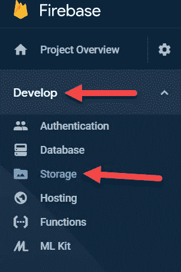

# 使用 Vue.js、Dropzone 和 Firebase 拖放图片上传

> 原文：<https://javascript.plainenglish.io/drag-and-drop-image-upload-with-vue-js-dropzone-and-firebase-dd6fb7e2e54b?source=collection_archive---------2----------------------->

在许多网络应用程序中，上传图片是一项必要但乏味的任务。这也是许多初级开发人员难以解决的问题。幸运的是，有一些很棒的软件包可以省去这个过程中的很多跑腿工作。在本文中，我们将介绍如何使用 Vue、Dropzone 和 Firebase Storage 上传图像。

# 视频教程

Video Tutorial

# 项目设置

要开始，您需要安装 [NodeJs](https://nodejs.org/) 。对于本教程，我们也将使用 [VS 代码](https://code.visualstudio.com/)作为我们的代码编辑器，但是你可以使用任何你喜欢的。

## 创建 Vue 项目

要创建我们的 Vue 项目，请打开您的终端，cd 到您想要的目录并运行以下命令:

```
npx vue create firebase-image-upload
```

然后，选择默认预设(默认(babel，eslint))。这将创建一个标准的 Vue 项目，我们将工作了。完成后，在 VS 代码中打开项目。

## 安装软件包

现在，我们将安装一些 npm 包，这将使上传我们的图像变得非常容易。在 VS 代码中打开一个新的终端(Terminal -> New Terminal)并运行以下命令:

```
npm install --save firebase vue2-dropzone uuid
```

## 创建 Firebase 项目

在我们继续之前，我们需要创建我们的 Firebase 项目，并将其包含在我们的 Vue 应用程序中。前往 [Firebase](https://firebase.google.com/) 并创建一个账户，如果你还没有的话。不要担心作为一个非常慷慨的免费层 Firebase 的成本。

创建帐户并登录后，点击屏幕右上角的“转到控制台”。然后单击“新建”项目按钮，选择所有默认设置。

在左侧菜单中，单击开发，然后单击存储。



然后你会看到一个“开始”按钮。单击它，并从弹出窗口中选择所有默认设置。Firebase 自动设置存储规则。默认规则要求用户登录才能上传文件。

因为我没有在本教程中介绍身份验证，所以我们将编辑默认规则。在主存储屏幕的顶部，您应该会看到一个规则选项卡。导航到该部分，将代码粘贴到您的规则下并发布它们:

```
rules_version = '2';
service firebase.storage {
  match /b/{bucket}/o {
    match /{allPaths=**} {
      allow read, write;
    }
  }
}
```

****重要提示:这些规则允许任何人上传到此存储桶。对于生产应用程序，您应该将其锁定。要了解更多关于如何操作的信息，请访问** [**Firebase 存储规则文档**](https://firebase.google.com/docs/storage/security/start) **。****

项目和存储设置完成后，单击左侧菜单中的项目概述，然后单击 web 图标。


Firebase Web Start

给你的应用取一个昵称，然后点击下一步。然后你会看到一些代码。在


Firebase Config

现在回到您的 Vue 项目，打开 src/main.js。在文件的顶部，在现有导入的下面，添加以下内容:

```
import firebase from 'firebase'
```

然后粘贴到 firebase 配置中。您的 main.js 文件应该如下所示:

# 图像上传

现在我们已经将 Firebase 添加到了 Vue 项目中，我们可以开始上传图像了。在 src/App.vue 文件中，我们将删除模板、脚本和样式标签中的所有样板代码。在脚本标签中，我们将在顶部导入 Dropzone 和 Firebase。

```
*import* firebase *from* 'firebase';
*import* dropzone *from* 'vue2-dropzone';
*import* "vue2-dropzone/dist/vue2Dropzone.min.css";
```

在我们的导入下面，我们将添加 dropzone 作为一个组件和一些 Dropzone 选项。Dropzone 有一个名为@vdropzone-complete 的内置函数，它会在每次上传完成时触发。我们将使用自己的方法创建一个名为 afterComplete 的方法来保存我们的图像到 firebase。

接下来，我们将把带有配置的 Dropzone 组件添加到模板中。最后，我们将向数据对象添加一个 images 属性，并用 v-for 显示 dropzone 下的图像。

最后，您的 App.vue 文件应该如下所示:

这就是了。一个简单的拖放图像上传器，带有 Vue、Firebase 和 Dropzone。如果您对本文有任何问题或顾虑，欢迎在下面留下您的评论！