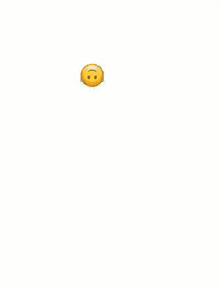
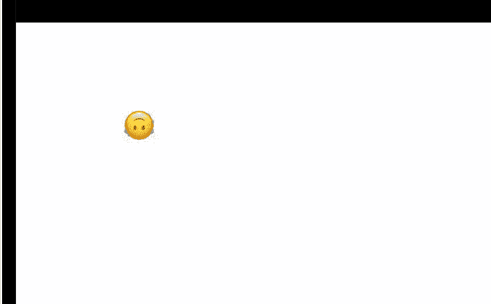

# 在 React 中创建拖放系统

> 原文：<https://javascript.plainenglish.io/drag-and-drop-in-react-79d926fd666e?source=collection_archive---------3----------------------->

下面是我在 React 中创建拖放系统的方法。这并不复杂，我很高兴能在这篇博文中与你分享我的过程。

首先让我们创建一个新的 React 应用程序。

```
npx create-react-app emoji-fun-app
```

我将它命名为“表情符号-乐趣-应用”，因为我认为拖动表情符号并创建不同的“场景”会很酷

首先，我将重构我的 App.js 文件，将其转换为一个类，并删除任何不必要的细节。不会做太多，它只会获取表情符号的 API 并保存我们的组件。

我从表情 API 下载了每一个表情符号，将数组切片，取前 10 个表情符号，然后将表情符号设置为应用程序的状态。我将表情符号传递给另一个组件，并通过它们进行映射

```
import logo from './logo.svg';
import './App.css';
import React from 'react'export default class App extends React.Component{

  state = {
    emojis: [],
    url: "[https://emoji-api.com/emojis?access_key=baf562ed274edd3bda0cdbf65ff31eba1e658f1a](https://emoji-api.com/emojis?access_key=baf562ed274edd3bda0cdbf65ff31eba1e658f1a)"
  }componentDidMount(){
    fetch(this.state.url)
    .then(response => response.json())
    .then(data => data.slice(0,10))
    .then(data => this.setState({emojis: data}))
  }render(){
    return(
      <div> 
        <h1> Hello </h1>
      </div>
    )
  }
}
```

我创建了一个表情容器，并把表情数据作为道具传入

```
<EmojiContainer emojis = {this.state.emojis} />
```

在表情容器中，我映射每个表情符号，并为每个表情符号创建一个表情卡(以显示表情符号)

```
//EmojiContainer.js
let emojis = this.props.emojis.map(emoji => <EmojiCard emoji = {emoji} />)//EmojiCard.js
<h1> {this.props.emoji.character} </h1>
```

在表情卡中，我正在选择一个特定的表情，所以我添加了一个点击事件并运行了一个快速控制台日志

```
<div onClick={(e)=> {
     console.log(e.target)
    }}> {this.props.emoji.character} </div>
```

通过这种方式，我可以选择一个表情符号，这样就可以一次拖动多个表情符号到页面上

现在我要设置 div 的样式，并将位置设置为 absolute，这样它们就不固定在任何父 DIV 上，可以自由移动。

```
<div style ={{
      position: "absolute",
      top: 100,
      left: 200,
      border: "3px solid #73AD21"}}
```

我将为定位 X+Y 坐标添加状态，并将它们的初始值设置为 100

```
state={
  selectedEmoji: "",
  elementX: 100, 
  elementY: 100
 }
  //change the style from hardcoded numbers to reflect state
  top: this.state.elementY + 'px',
  left: this.state.elementX + 'px',
```

现在我要将 onClick 更改为名为 onDragOver 的 React 事件。这里的想法是，由于浏览器让我们访问页面的鼠标位置，当我们拖动时，让我们将 elementY 和 elementX 的状态设置为页面上鼠标的位置。这是我最初的假设，经过一些修补，它实际上是可行的…

```
onDragOver={(e)=> {
     e.stopPropagation();
     e.preventDefault();
     const yAxis = e.pageY
     const xAxis = e.pageXthis.setState({elementY: yAxis})
    }}> {this.props.emoji.character}
```

这很简单…为了让你看清楚，我们从防止拖动时自动发生的一些默认行为开始，然后通过将 y 轴和 x 轴设置为页面上用户鼠标的值来定义它们。我们正在设置状态，我们定义的轴，并在拖动时自动调整页面的样式和位置。

我现在遇到了一个小问题，就是如何选择表情符号。我认为这是因为表情符号读起来像字符串而不是图像，这使得它们很难拖动

根据我的理解和我目前的方法，我不确定这个演示是否还能继续工作，因为字符串是不可拖动的。也许我可以创建一个放置表情符号的 div，使其不可见，然后拖动它而不是表情符号…

原来绳子根本不是问题！事实上，错误在于我在创建 div 时没有将 draggable 设置为 true。如果我们继续设置它

```
<div draggable="true" className = "rectangle" style ={{
      position: "absolute",
      top: this.state.elementY + 'px',
      left: this.state.elementX + 'px',
   }}onDragOver={(e)=> {
    console.log(e)
     e.stopPropagation();
     e.preventDefault();
     const yAxis = e.pageY 
     const xAxis = e.pageXthis.setState({elementY: yAxis})
    }}> {this.props.emoji.character} </div>
   </div>
```

我们现在可以上下拖动表情符号。现在，我只对 Y 轴进行操作，以确保正常工作，一旦设置好，我将从 X 轴开始



Dragging on the Y Axis

太棒了，现在 Y 轴开始工作了。我们可以从 X 轴开始，添加下面几行代码

```
//setting the x-axis to the mouse position of the mouse on the page
const xAxis = e.pageX//set state to the mouse position
this.setState({elementX: xAxis})//update the style 'left' from the staet
left: this.state.elementX + 'px',
```

现在我们已经设置了 X 轴，我们应该有完全的权限来拖动我们的表情符号在页面上！



你的表情符号终于免费了！

这里有一个小问题，我似乎无法解决，但是当设置状态时，你需要从鼠标位置减去 10。如果你对如何解决这个问题有任何想法，请在评论中告诉我！

直到下周，

安迪(男子名ˌ等于 Andrew)