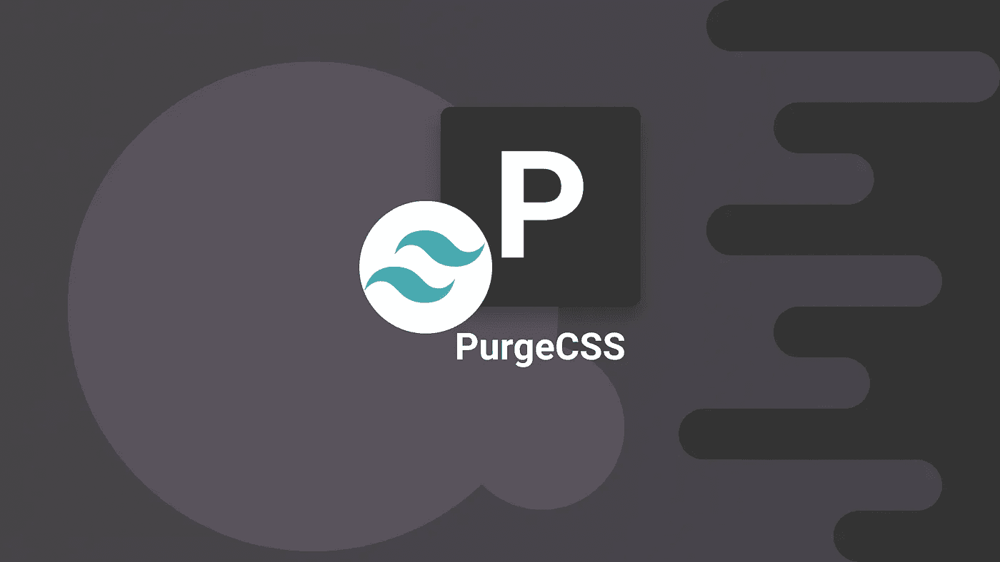

# 使用 Tailwind 和 PurgeCSS 大幅减小样式表的大小

> 原文：<https://javascript.plainenglish.io/drastically-reducing-your-stylesheet-size-with-tailwind-and-purgecss-bcda729b6dc3?source=collection_archive---------6----------------------->



在[之前的一篇文章](https://medium.com/javascript-in-plain-english/adding-tailwind-support-to-a-nrwl-nx-workspace-with-angular-and-storybook-bf890ea882e)中，我已经解释了如何用 Angular 和 Storybook 在 Nrwl NX 工作区中安装 [Tailwind](http://tailwindcss.com/) 。

这种设置很好，但是有一个主要问题:样式表包的大小。在我的项目中，它超过 2MB。我不知道你怎么想，但是 2MB 的 CSS 感觉像是*一大堆*。

在这篇文章中，我将解释什么是 PurgeCSS 以及如何利用它来大幅减小样式表的大小。

# 问题是

为什么我最后得到了 2MB 的样式表？我当然没有在我的申请中介绍那么多风格。

当我们使用像 Bootstrap 或 Tailwind 这样的 CSS 框架时，实际上有成千上万的内置样式我们没有使用。在顺风的情况下，情况更糟，因为它会根据自己的配置生成大量的样式。例如，向顺风配置添加单一颜色意味着添加大量规则，如 bg-newColor-100、bg-newColor-200、text-newColor-100、text-newColor-200 等等。

顺风的许多其他设置也是如此。我们不想改变顺风，因为它很好，因为我们希望所有这些风格都可以使用。但是，如果我们不使用它们，我们不希望它们仍然存在于样式表中。

让我们看看如何解决这个问题。

# 采购

PurgeCSS 是一个专用于查找/删除未使用的 CSS 的工具。

它以非常简单的方式工作。一旦集成到项目的构建管道中，它将扫描:

*   我们所依赖的 CSS 文件
*   *内容*文件是我们喂它的

通过扫描 CSS 文件，它将识别所有存在的选择器。然后，通过扫描内容文件(例如，我们项目代码中的 JS/TS/HTML/CSS 文件)，它将识别实际使用了哪些 CSS 选择器。

为了识别哪些 CSS 选择器被真正使用，PurgeCSS 使用了它所谓的[提取器](https://purgecss.com/extractors.html)。提取器是简单的函数，它将文件的内容作为输入，并返回 CSS 选择器的数组。

一旦完成，PurgeCSS 就可以将使用的选择器列表与可用的选择器列表进行比较，并识别出所有不需要的选择器。

PurgeCSS 可以用不同的方式[配置](https://purgecss.com/configuration.html#configuration-file)。在我们的例子中，我们将使用 Tailwind 本身公开的配置(详见下一节)。

有几个选项需要注意:

*   css:指向要分析的 CSS 的文件名和/或 [globs](https://github.com/isaacs/node-glob/blob/master/README.md#glob-primer) 的数组(即，应该被*清理的 CSS*
*   content:指向要分析的项目内容的文件名和/或 globs 的数组(即，在其中识别实际使用的内容)
*   defaultExtractor:自定义 PurgeCSS 的默认选择器提取器
*   提取器:提取器函数的数组；其中每一个都是具有一组扩展名(即，它可以处理的文件类型)和提取器函数的对象。这可以用来获得更好的清理结果(即，如果 PurgeCSS 没有找到/清理它应该找到的所有东西)

有更多的选项可以进一步清理字体、CSS 变量等等。你可以在这里查看:[https://purgecss.com/configuration.html#options](https://purgecss.com/configuration.html#options)

# 轻如鸿毛

既然我正在写这篇文章，你可能会猜到，是的，PurgeCSS 可以帮助我们移除未使用的顺风样式。

事实上，Tailwind 对 PurgeCSS 有[一流的支持；它直接集成它，并通过它的配置文件公开它的特性。](https://tailwindcss.com/docs/controlling-file-size/)

下面是我如何配置 PurgeCSS is 我的项目:

如您所见，在配置中有一个恰当的称为“purge”的部分。通过它，我们实际上是在配置 PurgeCSS。

内容选项确实是 PurgeCSS 的内容选项。通过它，我将 PurgeCSS 指向我的项目的所有内容文件。由于这是一个带有 Angular 应用程序的 Nrwl NX 工作区，我简单地将它指向“apps”和“libs”文件夹下的所有 html/scss/ts 文件。这样，PurgeCSS 应该能够找到我正在使用的所有规则。

在顺风的情况下，不需要配置“css”选项；默认情况下，Tailwind 会为我们做这件事。注意，它当然只考虑顺风 CSS 规则。您也可以将 PurgeCSS 用于其他 CSS 库，但是我不会在这里讨论这个。

另一个设置“option”可用于进一步配置 PurgeCSS。在上面的例子中，我启用了 PurgeCSS 的“rejected”和“printRejected”设置，这允许我对 PurgeCSS 所做的事情进行故障诊断。

最后，我使用 PurgeCSS 的“白名单模式”选项来排除角形 CDK 和角形材质使用的选择器前缀，目前它们仍在我的项目中使用。

注意，我们甚至不需要编写提取器函数；顺风为我们做了这一切。

有了这个配置，PurgeCSS 将在应用程序的*生产*版本生成时完成它的工作。在我的例子中，CSS 样式表从 2MB 变成了更合理的 125KB。

# Webpack 生产模式

关于这种配置，还有最后一件事需要了解。正如我所说的，PurgeCSS 将只在生产构建中执行。这样做的原因是 PurgeCSS 真的很密集/很慢。我们只是不希望它在开发期间运行。

为了确定是否应该启用 PurgeCSS，我们依赖于 Webpack 的“mode”设置。

为了配置它，我在 package.json 文件中修改了生产构建脚本:

```
"build:prod:web": "NODE_ENV=production nx run web:build --prod",
```

在要求 NX 构建“web”应用程序的生产版本之前，上面简单地将 NODE_ENV 变量设置为“production”。

最后，我利用 Webpack 配置中的环境变量来启用生产模式:

正如您在上面看到的，如果 NODE_ENV 变量设置为“production ”,那么我相应地设置了 Webpack 的模式选项。

# 结论

在本文中，我解释了为什么我们使用 Tailwind 时需要清理 CSS 样式表，以及如何利用 PurgeCSS 来完成这项工作。

由于 Tailwind 对 PurgeCSS 的内置支持，这真的很容易集成/配置。

配置 PurgeCSS 之后，我们的样式表从 2MB 变成了~125KB，这就好多了。应该可以进一步优化，但这已经足够我目前的需求了。

今天到此为止！

**PS** :如果你想学习大量关于软件开发、Web 开发、TypeScript、Angular、React、Vue、Kotlin、Java、Docker/Kubernetes 和其他很酷的主题的其他很酷的东西，那么不要犹豫去[拿一本我的书](https://www.amazon.com/Learn-TypeScript-Building-Applications-understanding-ebook/dp/B081FB89BL)并订阅[我的简讯](https://mailchi.mp/fb661753d54a/developassion-newsletter)！

## **简明英语团队的笔记**

你知道我们有四种出版物吗？给他们一个 follow 来表达爱意:[**JavaScript in Plain English**](https://medium.com/javascript-in-plain-english)[**AI in Plain English**](https://medium.com/ai-in-plain-english)[**UX in Plain English**](https://medium.com/ux-in-plain-english)[**Python in Plain English**](https://medium.com/python-in-plain-english)**—谢谢，继续学习！**

**此外，我们总是有兴趣帮助推广好的内容。如果您有一篇文章想要提交给我们的任何出版物，请发送电子邮件至[**submissions @ plain English . io**](mailto:submissions@plainenglish.io)**，附上您的媒体用户名和您感兴趣的内容，我们将会回复您！****