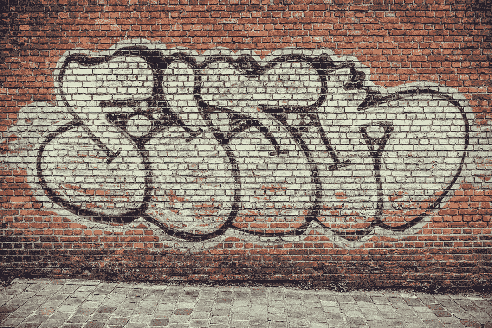
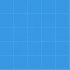
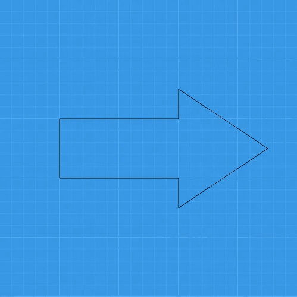
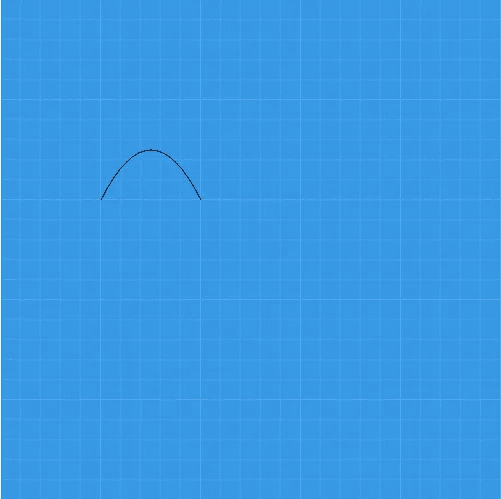
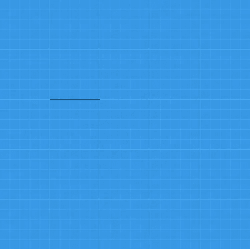
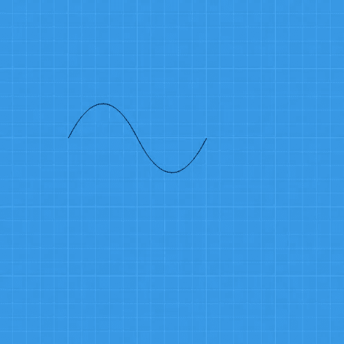
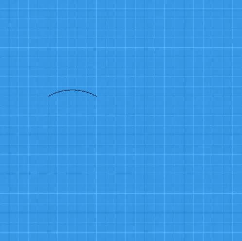

# 在拉斐尔作品中画复杂的形状

> 原文：<https://javascript.plainenglish.io/drawing-complex-shapes-in-raphaeljs-99e18a4654cc?source=collection_archive---------10----------------------->

## 使用 SVG 路径规范在 RaphaelJS 中绘制复杂形状



Photo by [Bernard Hermant](https://unsplash.com/@bernardhermant?utm_source=medium&utm_medium=referral) on [Unsplash](https://unsplash.com?utm_source=medium&utm_medium=referral)

SVG path 元素用于绘制 SVG path 规范中的复杂形状。它是绘制[内置](https://medium.com/p/vector-graphics-with-raphaeljs-3355e82b0fd3?source=email-779762a86f7b--writer.postDistributed&sk=7c6c1a88a4c2b903f4fedefb60622c45)形状最复杂的元素。

路径使用命令表示对象轮廓的几何图形。他们用一个属性来描述要画什么。

在 SVG 中，路径元素由`<path d=”” />`表示，d 将获取路径字符串。

在 RaphaelJS 中，路径字符串被提供给库来处理绘图。

# 设置

我们将使用一个 500 乘 500 像素的网格来覆盖路径的主题。下面给出了创建网格的代码:

```
<html>
 <head>
 <title>Paths Arrow Absolute</title>
 <style>
 #container {
 clear:both;
 width:500px;
 height:500px;
 background:url(grid.jpg) repeat;
 display: block;
 margin: 0 auto;
 }
 </style>
 </head>
 <body>
 <div id=”container”></div>
 <script src=”[https://cdnjs.cloudflare.com/ajax/libs/raphael/2.1.0/raphael-min.js](https://cdnjs.cloudflare.com/ajax/libs/raphael/2.1.0/raphael-min.js)"></script>
 <script>
 paper = Raphael(‘container’, 500, 500);
 // Write code here
 </script>
 </body>
</html>
```

grid.jpg 文件如下所示:



Grid Image

# 通用命令

在绝对坐标中使用时，所有路径命令都用大写字母，在相对坐标中使用时用小写字母。

## m 还是 m

这是移动命令。它将路径图移动到用户指定的点。

## z 还是 z

这将关闭路径字符串的路径，使其返回到路径开始的位置。它通过将一个点连接回其初始点来结束该点。

# 线路命令

## l 还是 l

这将从当前点到指定的终点绘制一条直线。

## h 还是 h

这将从当前点到指定的终点绘制一条水平线。

## v 还是 v

这将从当前点到指定的终点绘制一条垂直线。

# 把所有的东西放在一起

在这一部分，我们将画一个简单的箭头。执行此操作的代码如下所示:

paper . path(" M100 200 H300 V150 L450 250 L300 350 V300 H100 Z ")；

生成下图所示的箭头:



Paths Absolute Arrow

现在让我们检查创建箭头的命令。

M100 200 使图形的起点位于网格的 100，200 处。请注意，绘图的原点在网格的左上角。

H300 V150 画一条水平线到离原点 300 的点，然后在网格上画一条垂直线到 150。

L450 250 L300 350 在网格上画一条线，指向 450，250，然后指向 300，350。

V300 H100 在网格的 y 轴上垂直于点 300 画一条线，在 x 轴上画一条回到点 100 的水平线。

z 通过画一条线回到初始点 m 来完成形状。

要使用相对路径，我们可以用不同的方法，因为我们必须获取每个点的相对位置。使用相对路径的好处是我们可以通过移动一个点来移动形状。

使用相对路径绘制箭头的代码如下所示:

paper . path(" M100 200 h200 v-50 l150 100 l-150 100v-50h-200 z ")；

M100 200 与绝对路径命令一样，将从网格的点 100，200 开始绘图。

h200 将从起点画一条长度为 200 的水平线。v-50 会在负方向画一条线 50。

l150 100 从当前点到箭头尖端绘制一条直线。l-150 100 从箭头尖端到左下部分画一条线。

v-50 h-200 绘制箭头的剩余部分。z 完成箭头。

# 曲线命令

它们用于绘制曲线。SVG 中有 3 种类型的曲线，它们是:

1.  二次方曲线
2.  三次曲线
3.  弧形曲线

## 二次方曲线

二次曲线包含两个坐标。第一个是用于绘制曲线的控制点的位置，第二个是曲线的终点。

代码:

paper . path(" M100 200 Q150 100 200 200 ")；

将创建如下所示的弧:



Quadratic Curve with Control Point at 150,100

假设我们用如下所示的代码将控制点移动到 200，200:

paper . path(" M100 200 Q200 200 200 200 ")；

我们会得到一条二次曲线，看起来像这样:



Quadratic Curve with Control Point at 200,200

请注意，现在曲线是一条直线。这是因为控制点位于中间，并且与曲线的起点和终点在同一条线上。

代码:

paper . path(" M100 200 Q150 100 200 200T 300 200 ")；

将创建曲线的反转，并将其拖动到端点，给出如下所示的二次曲线:



Sine Wave

## 三次曲线

与二次曲线不同，三次曲线有两个控制点。

代码由 120、160 和 180、240 处的控制点组成，曲线在 200、200 处的新位置写为:

paper.path("M100 200 C120 160，180 240，200 200 ")；

这将创建路径:


## 弧形曲线

弧形曲线采用以下参数:

rx ry x 轴旋转 y 轴旋转大圆弧标志扫描标志 x y

代码:

paper.path("M100 200 A100 100，0，0 1，200 200 ")；

将绘制如下所示的曲线:



Drawing an Arc

# 结论

路径变得太复杂，无法手动创建，您应该使用像 Inkscape 这样的矢量图形编辑器。然而，理解上面的命令将有助于您理解程序在幕后做什么。