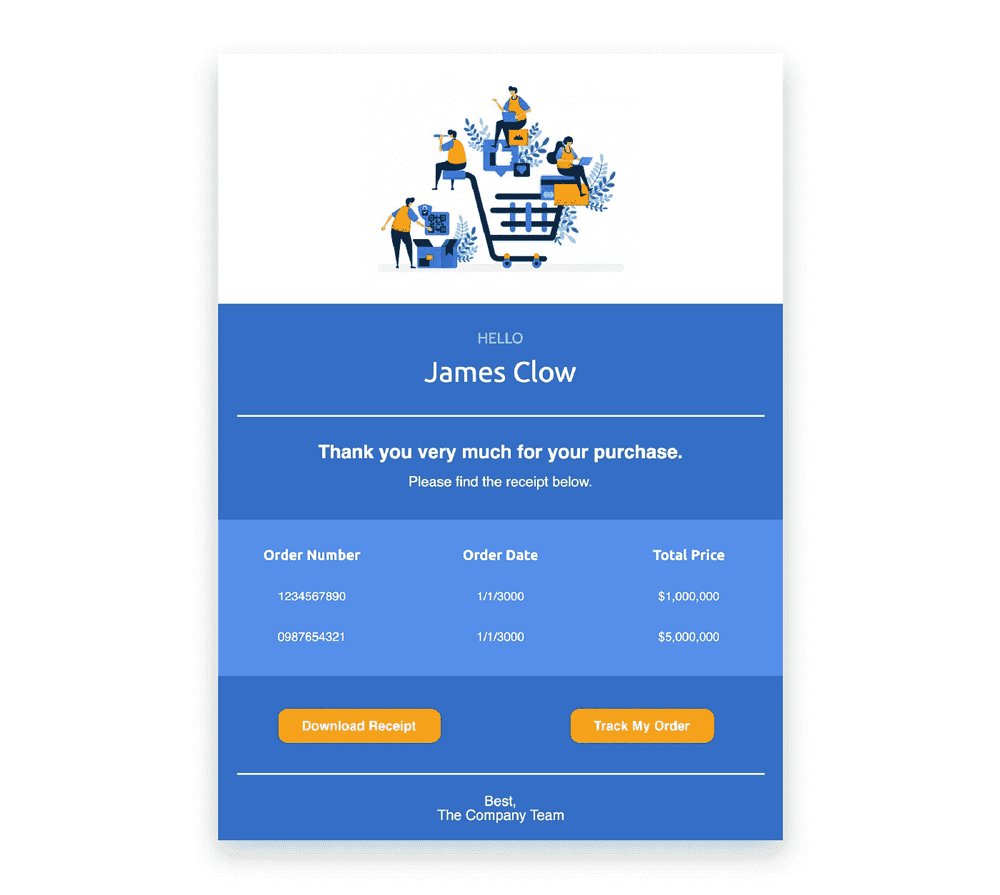

# 使用 Vue.js 和 MJML 的动态电子邮件

> 原文：<https://javascript.plainenglish.io/dynamic-emails-with-vue-js-mjml-116ed00eee85?source=collection_archive---------0----------------------->


[https://www.freepik.com/free-photos-vectors/background](https://www.freepik.com/free-photos-vectors/background)

## 让我们再次让电子邮件变得棒极了！

## 形势

我需要创建包含动态数据的电子邮件，在所有设备和邮件客户端上看起来都很棒。



## 问题

邮件客户端仍然处于数字黑暗时代。

今天，一些最流行的邮件客户端不支持基本的网络功能；或者更糟，他们选择以不可预测的方式呈现 HTML。我在看你[前景](https://litmus.com/blog/a-guide-to-rendering-differences-in-microsoft-outlook-clients)！这种一致性的缺乏会使构建跨平台兼容的电子邮件成为一场彻头彻尾的噩梦。然而，幸运的是，我们有几个工具可以让这个过程不那么痛苦。其中一个就是 [MJML](https://mjml.io/) 。

MJML 是一种简单、轻量级的标记语言，可以在所有邮件客户端和设备上创建一致的电子邮件。然而，MJML 和其他电子邮件创建工具一样，并没有提供一种简单的方法来创建带有动态数据的模板。

## 解决方案

创建一个使用 Vue 渲染 MJML 的微服务。

Vue 是一个强大的操纵 HTML 的 javascript 库。乍一看，Vue 可能没那么有用。它不是为电子邮件设计的，更重要的是，你不能在电子邮件中运行 JavaScript。那么为什么它会有用呢？

由于 Vue 开发团队的辛勤工作，我们可以利用 Vue 的服务器端渲染功能。因此，我们可以设置一个服务器来将我们的 Vue 应用程序编译成基本的 HTML。那么如果我们用 MJML 代替 HTML 呢？

## 该过程

基本思想是使用 Vue 的服务器端渲染器用数据填充 MJML 模板。那么 MJML 可以很容易地编译成 HTML。

**MJML + Vue** > **Vue 编译器** > **MJML 编译器** > **牛逼 HTML 邮件**

## **设置**

首先使用 [MJML](https://mjml.io/documentation/) 创建一个电子邮件模板。

```
<mjml>
  <mj-body>
    <mj-section>
      <mj-column>
        <mj-text>
          MJML + Vue is:
        </mj-text>
        <mj-text>
          Awesome!
        </mj-text>
      </mj-column>
    </mj-section>
  </mj-body>
</mjml>
```

使用 Vue 的[模板语法](https://vuejs.org/v2/guide/syntax.html)添加一些逻辑。

```
<mjml>
  <mj-body>
    <mj-section **v-if="list"**>
      <mj-column>
        <mj-text>
          MJML + Vue is:
        </mj-text>
        <mj-text **v-for="(item, index) in list"**>
          **{{index}}**. **{{item}}**
        </mj-text>
      </mj-column>
    </mj-section>
  </mj-body>
</mjml>
```

创建一个节点服务器来呈现你的电子邮件。然后在节点服务器内部，创建一个新的 Vue [实例](https://vuejs.org/v2/guide/instance.html)，并使用我们刚刚创建的 MJML 模板。

```
import vue from 'vue';var app = new vue({
  template: [ Your Vue+MJML template Goes Here ]
})
```

添加一些要注入到模板中的数据。

```
import vue from 'vue';var app = new vue({
  **data: {
    list: [
      "Easy",
      "Quick",
      "Powerful",
    ]
  },**
  template: [ Your Vue+MJML template Goes Here ]
})
```

使用 Vue 的[服务器端渲染器](https://vuejs.org/v2/guide/ssr.html)渲染 Vue 应用程序。

```
import vue from 'vue';
import { createRenderer } from 'vue-server-renderer';var app = new vue({
  data: {
    list: [
      "Easy",
      "Quick",
      "Powerful",
    ]
  },
  template: [ Your Vue+MJML template Goes Here ]
})**createRenderer.renderToString(app, (err, vue_render)=>{})**
```

最后获取输出，并通过 MJML 编译器进行处理。

```
import vue from 'vue';
import { createRenderer } from 'vue-server-renderer';
import mjml from 'mjml';var app = new vue({
  data: {
    list: [
      "Easy",
      "Quick",
      "Powerful",
    ]
  },
  template: [ Your MJML Goes Here ]
})createRenderer.renderToString(app, (err, vue_render)=>{
  **var finished_email_template = MJML(vue_render).html;**
})
```

你留下的是一封动态生成的坚如磐石的电子邮件，随时可以发送出去！！！

## 看看它的实际效果

要查看使用 Node.js 的完整实现，请查看我的 Github:[https://github.com/JamesClow/Vue-MJML](https://github.com/JamesClow/Vue-MJML)

# 感谢阅读！